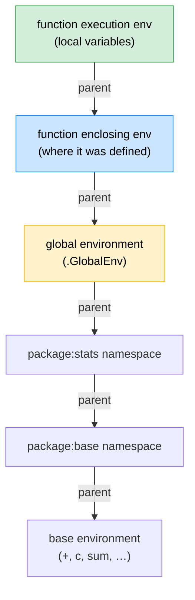

# 🔀 Control Flow and Functions in R

> [!abstract] TL;DR
> In R, functions are **first-class objects** — they can be passed to other functions, returned from functions, and stored in variables. R uses **lexical scoping**: a function looks up variables in the environment where it was *defined*, not where it is *called*. Understanding environments and closures unlocks advanced patterns like function factories, memoisation, and clean resource management with `on.exit()`.

---

## 💡 Intuition Analogy

Think of R's environment system as a **building with floors**. Each function call creates a temporary room on a new floor. When you refer to a variable name inside a function, R looks for it in that room first, then in the room where the function was *written* (not where it was *called*), then up through each parent room until it reaches the global floor and finally the base package. This is **lexical scoping** — the floors are determined at write-time, not at run-time.

---

## 🗺️ Environment / Scope Chain



*R walks up the parent chain until it finds the name or throws an error.*

---

## 🧠 Key Concepts

### 1. First-Class Functions and R 4.1 Lambda Syntax

Functions in R are objects like any other. R 4.1 introduced the `\(x)` shorthand for anonymous functions, making functional-style code much cleaner.

```r
# Traditional anonymous function
square <- function(x) x^2

# R 4.1 lambda shorthand
square <- \(x) x^2

# Passing functions as arguments
nums <- c(1, 4, 9, 16)
sapply(nums, \(x) sqrt(x))   # 1 2 3 4

# Returning a function from a function (factory)
make_adder <- function(n) {
  \(x) x + n   # n is captured from enclosing env
}
add5 <- make_adder(5)
add5(10)   # 15
```

### 2. Lexical Scoping — Definition Site, Not Call Site

When R looks up a name inside a function it searches the environment **where the function was defined**, not where it was called. This is the key difference from dynamic scoping languages.

```r
x <- 1

f <- function() {
  x <- 10   # local x, shadows global
  g()       # g looks in its OWN definition environment, not here
}

g <- function() {
  x   # sees global x = 1, NOT f's local x = 10
}

f()  # returns 1, not 10
```

This predictability makes R code easier to reason about: a function's behaviour depends only on where it was written.

### 3. Environments as Mutable Hash Maps

An **environment** is a mutable mapping of names to values, with a pointer to a parent environment. Unlike lists, environments are modified in place (reference semantics).

```r
# Create a new environment
e <- new.env(parent = emptyenv())
e$x <- 42
ls(e)          # "x"
e$x            # 42

# parent.env (note: NOT parent.frame)
parent.env(e)  # the parent environment you specified

# <<- super-assignment
counter <- function() {
  count <- 0
  list(
    increment = function() { count <<- count + 1 },
    get       = function() count
  )
}
c1 <- counter()
c1$increment(); c1$increment()
c1$get()  # 2   — count modified in enclosing env via <<-
```

### 4. Closures — Functions Paired with Their Environment

A **closure** is a function that carries its enclosing environment with it. The `make_adder` example above is a closure: `add5` has the value `n = 5` frozen into it.

```r
make_power <- function(exp) {
  function(x) x ^ exp   # exp captured from make_power's env
}

square <- make_power(2)
cube   <- make_power(3)

square(4)   # 16
cube(2)     # 8

# Inspect the enclosing environment
environment(square)$exp   # 2
environment(cube)$exp     # 3
```

Closures are the foundation of function factories, encapsulation, and memoisation.

### 5. `match.arg()` for Validated Choices

`match.arg()` provides argument validation against a set of allowed strings, with partial matching. It is the idiomatic R way to implement an "enum" parameter.

```r
my_plot <- function(type = c("line", "bar", "scatter")) {
  type <- match.arg(type)   # resolves "l" → "line"; errors on ambiguous
  cat("Plotting:", type, "\n")
}

my_plot("line")     # Plotting: line
my_plot("b")        # Plotting: bar   (partial match)
my_plot("scatter")  # Plotting: scatter
my_plot("pie")      # Error: 'arg' should be one of "line", "bar", "scatter"
```

### 6. `missing()` vs `NULL` as Default Sentinel

Use `missing()` when the caller should be able to omit an argument and you need to detect that explicitly. Use `NULL` as a default when you want the caller to be able to pass nothing explicitly.

```r
f <- function(x, y) {
  if (missing(y)) {
    cat("y was not supplied\n")
  } else {
    cat("y =", y, "\n")
  }
}

f(1)       # y was not supplied
f(1, NULL) # y = NULL — missing() is FALSE here

# NULL default pattern
g <- function(x, col = NULL) {
  if (is.null(col)) col <- "black"
  col
}
```

### 7. `...` Forwarding — `...length()`, `...elt()`, `..1`

The `...` (dots) mechanism lets functions accept and forward arbitrary additional arguments. R 4.0 introduced indexing helpers.

```r
my_wrapper <- function(x, ...) {
  # How many extra args?
  cat("Extra args:", ...length(), "\n")

  # Access by position
  if (...length() > 0) cat("First extra:", ...elt(1), "\n")
  # or: ..1, ..2, ..3 as shorthands

  # Forward to another function
  sum(x, ...)
}

my_wrapper(c(1, 2, 3), na.rm = TRUE)
# Extra args: 1
# First extra: TRUE
# 6
```

### 8. `on.exit(add = TRUE)` — R's `finally` Block

`on.exit()` registers an expression to run when the current function exits, whether by normal return, error, or `stop()`. Setting `add = TRUE` appends rather than replaces.

```r
read_data <- function(path) {
  con <- file(path, "r")
  on.exit(close(con), add = TRUE)   # always close, even on error

  # More cleanup:
  old_opts <- options(warn = 2)
  on.exit(options(old_opts), add = TRUE)

  readLines(con)
}
```

This is far more robust than `tryCatch` for cleanup because it fires unconditionally.

### 9. `tryCatch` vs `withCallingHandlers`

| Mechanism | Behaviour on Condition | Control Returns To |
|-----------|----------------------|-------------------|
| `tryCatch` | Handles and **exits** the protected expression | Handler body |
| `withCallingHandlers` | Handles but **stays** in the protected expression | After the `signalCondition` call |
| `try()` | Simplified `tryCatch` for errors only | Code after `try()` |

```r
# tryCatch — exits on error
result <- tryCatch({
  log(-1)     # produces NaN + warning
  sqrt("a")   # error
}, warning = function(w) {
  cat("Caught warning:", conditionMessage(w), "\n")
  NA_real_
}, error = function(e) {
  cat("Caught error:", conditionMessage(e), "\n")
  NA_real_
}, finally = {
  cat("This always runs\n")
})

# withCallingHandlers — stays in context, useful for logging
withCallingHandlers({
  log(-1)
  42
}, warning = function(w) {
  cat("[LOG] Warning:", conditionMessage(w), "\n")
  invokeRestart("muffleWarning")   # suppress the warning
})
# [LOG] Warning: NaNs produced
# [1] 42
```

### 10. `vapply` over `sapply` in Production

`sapply` infers its return type at runtime, making it dangerous in production — it can silently return different types depending on the input. `vapply` requires you to declare the expected return type and throws an error if the result doesn't match.

```r
x <- list(a = 1:3, b = 4:6, c = 7:9)

# sapply — type unknown at write-time
sapply(x, sum)    # numeric vector (happens to work here)
sapply(x, range)  # matrix (surprise!)

# vapply — type guaranteed
vapply(x, sum, numeric(1))   # always numeric(1) per element
# If any element returns wrong type → error immediately

# For booleans:
vapply(x, \(v) all(v > 0), logical(1))
```

---

## 🔁 Control Flow Quick Reference

```r
# if / else if / else
if (x > 0) {
  "positive"
} else if (x == 0) {
  "zero"
} else {
  "negative"
}

# for loop
for (i in seq_along(x)) {
  cat(x[[i]], "\n")
}

# while loop
i <- 1
while (i <= 10) {
  cat(i, "")
  i <- i + 1
}

# repeat with break
repeat {
  val <- sample(1:100, 1)
  if (val > 90) break
}

# next (continue)
for (i in 1:10) {
  if (i %% 2 == 0) next
  cat(i, "")
}
```

---

## ⚠️ Common Pitfalls

| Pitfall | Symptom | Fix |
|---------|---------|-----|
| `<<-` in wrong context | Modifies global env unintentionally | Use `<<-` only inside closures |
| `sapply` returning matrix | Shape changes silently with different inputs | Use `vapply` with explicit type |
| `try()` swallowing errors | Returns invisible `try-error`; code continues | Check `inherits(result, "try-error")` or use `tryCatch` |
| `T`/`F` abbreviations | `T <- 0` silently breaks logic | Always use `TRUE`/`FALSE` |
| Missing `add = TRUE` in `on.exit` | Second `on.exit` replaces first; cleanup skipped | Always pass `add = TRUE` |

---

## 🔗 Related Concepts

- [[R_Syntax_Fundamentals]] — Vectors and types that functions operate on
- [[R_Packages_CRAN]] — Packaging functions for reuse and distribution

---

## ❓ Review Questions

1. What is the difference between lexical and dynamic scoping? Which does R use?
2. What does `<<-` do, and when is it appropriate to use it?
3. Why is `vapply` preferred over `sapply` in production code?
4. A function must open a database connection and close it even if an error occurs. How do you implement this in R?
5. What is the difference between `tryCatch` and `withCallingHandlers`?

---

## 📚 Sources

- Wickham, H. (2019). *Advanced R*, 2nd ed., Chapters 6–10. https://adv-r.hadley.nz
- R Language Definition — Environments and Scope. https://cran.r-project.org/doc/manuals/r-release/R-lang.html#Environment-objects
- Wickham, H. & Bryan, J. *R Packages*, 2nd ed. https://r-pkgs.org

---

#r-programming #core-r
