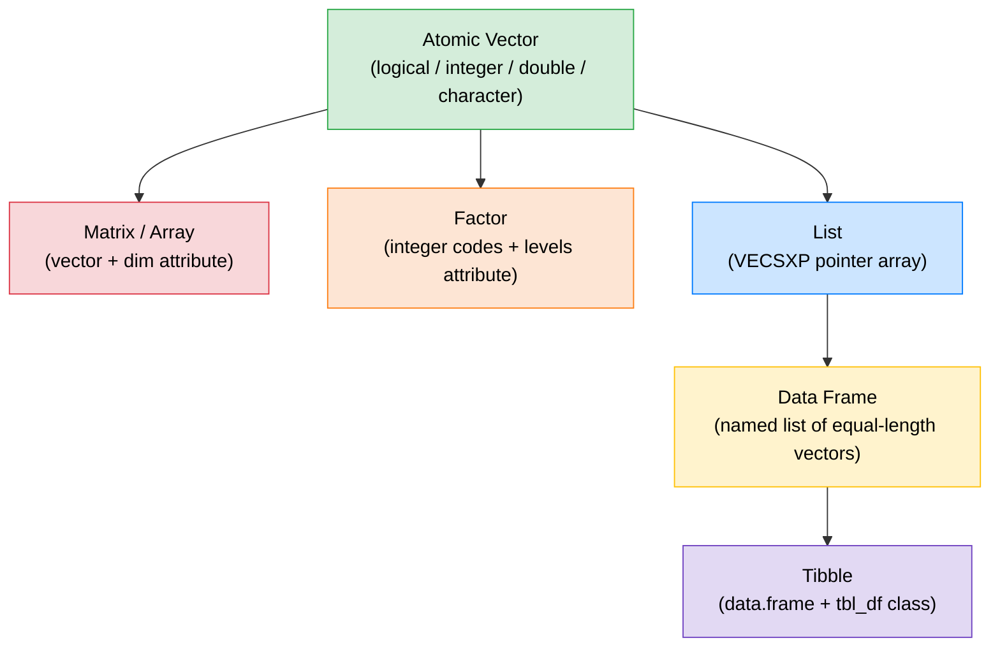

# 📦 Data Types and Structures in R

> [!abstract] TL;DR
> R has five main data structures: **atomic vectors**, **lists**, **matrices/arrays**, **data frames**, and **factors**. Each is built on vectors. Lists can hold mixed types (they are VECSXP pointer arrays). The difference between `[` (subset, keeps structure) and `[[` (extract, drops one level) is the single most common source of confusion for R beginners.

---

## 💡 Intuition Analogy

Think of data structures as different **cargo systems**:
- **Atomic vector** — a shipping container where every item must be the same type.
- **List** — a mixed freight train where each car carries its own type of cargo, or even another train.
- **Matrix** — a warehouse grid: same-type items arranged in rows and columns.
- **Data frame** — a spreadsheet: columns are separate containers (lists of vectors), all the same length.
- **Factor** — a label printer with a fixed set of stamps; it stores integer codes but shows you the label.

---

## 🗺️ Structure Hierarchy



---

## 🧠 Key Concepts

### 1. Lists — VECSXP Pointer Arrays

A **list** is R's most flexible container. Internally it is a VECSXP (vector of SEXP pointers), meaning each element is a pointer to an arbitrary R object. Elements can be different types, nested lists, or even functions.

```r
person <- list(
  name    = "Alice",
  age     = 30L,
  scores  = c(95.5, 87.0, 91.2),
  active  = TRUE
)

typeof(person)   # "list"
length(person)   # 4

# Nested list
nested <- list(a = list(b = list(c = 42)))
nested$a$b$c     # 42
nested[["a"]][["b"]][["c"]]  # 42
```

### 2. `[` vs `[[` — The Train Car Distinction

This is the **most common source of confusion** in R.

| Operator | Returns | Analogy |
|----------|---------|---------|
| `x[i]` | Same type as `x`, always a list if `x` is a list | Taking a **slice of the train** (still a train) |
| `x[[i]]` | The element itself, one level unwrapped | Taking **cargo out of a single car** |
| `x$name` | Same as `x[["name"]]` | Named shorthand for `[[` |

```r
lst <- list(a = 1, b = "hello", c = TRUE)

lst["a"]     # list of length 1 — still a list: list(a = 1)
lst[["a"]]   # the value: numeric 1
lst$a        # same as lst[["a"]]: numeric 1

# This distinction matters for iteration:
# lapply expects [[ behavior — give it list[[i]] not list[i]

# For atomic vectors:
v <- c(x = 10, y = 20, z = 30)
v["x"]    # named numeric: x = 10  (keeps name)
v[["x"]]  # unnamed numeric: 10    (drops name)
```

### 3. Matrices and Arrays — Vectors with `dim`

A **matrix** is just an atomic vector with a `dim` attribute of length 2. An **array** generalises this to any number of dimensions. R stores matrices in **column-major order** (columns are contiguous in memory), unlike C/Python which use row-major.

```r
m <- matrix(1:12, nrow = 3, ncol = 4)
# Column-major: first column is 1,2,3 then 4,5,6 ...

dim(m)     # 3 4
nrow(m)    # 3
ncol(m)    # 4

# Subsetting: [row, col]
m[2, 3]    # element in row 2, col 3
m[, 2]     # entire column 2 (vector)
m[1, ]     # entire row 1 (vector)

# Column-major matters for performance:
# Iterating column-by-column is faster than row-by-row
apply(m, 2, sum)   # column sums — cache-friendly
apply(m, 1, sum)   # row sums — less cache-friendly
```

### 4. Data Frames — Named Lists of Equal-Length Vectors

A **data frame** is a named list where every element is a vector of the same length. This is why you can access columns with `$` (list operator) and rows/cells with `[row, col]` notation.

```r
df <- data.frame(
  name   = c("Alice", "Bob", "Carol"),
  age    = c(30L, 25L, 35L),
  score  = c(92.1, 87.5, 95.0),
  stringsAsFactors = FALSE   # critical in R < 4.0
)

typeof(df)    # "list"
class(df)     # "data.frame"
nrow(df)      # 3
ncol(df)      # 3

df$name       # character vector
df[["age"]]   # integer vector
df[1, ]       # row 1 as a 1-row data frame
df[df$age > 28, ]  # filtered subset
```

### 5. Tibbles — `stringsAsFactors = FALSE` by Default

**Tibbles** (from the `tibble` package, part of the tidyverse) are enhanced data frames that fix several historical annoyances:

| Feature | `data.frame` | `tibble` |
|---------|-------------|---------|
| `stringsAsFactors` | `TRUE` before R 4.0 | Never — always character |
| Partial column matching | `df$ag` matches `df$age` | Error on partial match |
| Row names | Supported | Discouraged |
| Printing | All rows | First 10 rows, truncated |
| List-columns | Awkward | First-class support |

```r
library(tibble)
tb <- tibble(
  name  = c("Alice", "Bob"),
  score = list(c(90, 95), c(80, 85))  # list-column
)
tb$score[[1]]  # c(90, 95)
```

### 6. Factors — Integer Codes with Level Labels

A **factor** stores categorical data as integer codes (1, 2, 3, …) with a `levels` attribute that maps codes to labels. This makes factors memory-efficient for repeated strings and ensures valid category levels for modelling.

```r
status <- factor(c("low", "high", "med", "low", "high"),
                 levels = c("low", "med", "high"),  # explicit order
                 ordered = TRUE)                    # ordinal factor

typeof(status)    # "integer"   — stored as integers!
class(status)     # "ordered" "factor"
levels(status)    # "low" "med" "high"
as.integer(status) # 1 3 2 1 3   — the underlying codes

# Gotcha: when you read a factor's values use levels indexing
status[1]         # "low" (displayed as label)
levels(status)[as.integer(status[1])]  # "low" (explicit)
```

### 7. `ifelse` vs Scalar `if`

`if` is a **scalar control-flow statement** that tests a single `TRUE/FALSE`. `ifelse()` is a **vectorised function** that operates element-wise.

```r
x <- c(-2, 0, 3, -1, 5)

# Scalar if — ERROR if x has length > 1
if (x > 0) "pos" else "non-pos"  # Warning: only first element used

# Vectorised ifelse — correct
ifelse(x > 0, "pos", "non-pos")
# "non-pos" "non-pos" "pos" "non-pos" "pos"

# For multiple conditions, dplyr::case_when is cleaner:
library(dplyr)
case_when(
  x < 0  ~ "negative",
  x == 0 ~ "zero",
  x > 0  ~ "positive"
)
```

---

## 📊 Data Structure Comparison

| Structure | Dimensions | Homogeneous? | Class | `typeof()` |
|-----------|-----------|-------------|-------|-----------|
| Atomic vector | 1D | Yes | various | various |
| Matrix | 2D | Yes | `"matrix"` | element type |
| Array | nD | Yes | `"array"` | element type |
| List | 1D | No | `"list"` | `"list"` |
| Data frame | 2D | No (per column) | `"data.frame"` | `"list"` |
| Factor | 1D | Yes (integer) | `"factor"` | `"integer"` |

---

## ⚠️ Common Pitfalls

| Pitfall | Symptom | Fix |
|---------|---------|-----|
| `list["x"]` instead of `list[["x"]]` | Get a list back instead of value | Use `[[` to extract |
| `stringsAsFactors = TRUE` (R < 4.0) | Characters silently become factors | Always set `= FALSE` or use tibble |
| Dropping dimensions with `[` | `m[1, ]` returns vector, not 1-row matrix | Use `drop = FALSE`: `m[1, , drop = FALSE]` |
| Factor level mismatch | Adding new level fails silently → `NA` | Use `levels(f) <- c(levels(f), "new")` |
| Modifying data frame in loop | Very slow due to copy-on-modify | Pre-allocate or use list then `do.call(rbind, ...)` |

```r
# drop = FALSE example
m <- matrix(1:9, 3, 3)
m[1, ]                     # numeric vector — matrix structure lost
m[1, , drop = FALSE]       # 1x3 matrix — structure preserved
```

---

## 🔗 Related Concepts

- [[R_Syntax_Fundamentals]] — Atomic types and vectors that underpin all structures
- [[Control_Flow_Functions]] — Iterating over lists and data frames

---

## ❓ Review Questions

1. Explain why `typeof(data.frame(...))` returns `"list"`.
2. What does `lst["a"]` return vs `lst[["a"]]` when `lst` is a list?
3. You read a CSV in R 3.6. Your character column is a factor. How do you fix it?
4. Why is column-major order important when writing performance-critical matrix code?
5. When would you use a factor over a character vector?

---

## 📚 Sources

- Wickham, H. (2019). *Advanced R*, 2nd ed., Chapter 3–4. https://adv-r.hadley.nz
- Müller, K. & Wickham, H. *tibble* package documentation. https://tibble.tidyverse.org
- R Documentation — `?factor`, `?data.frame`, `?matrix`

---

#r-programming #core-r
