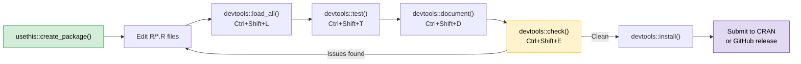

# 📦 R Packages and CRAN

> [!abstract] TL;DR
> An R package is the unit of reusable, shareable, testable R code. The modern development loop uses **devtools** and **usethis** to scaffold, load, test, and document a package without leaving R. Getting a package onto **CRAN** requires passing `R CMD check --as-cran` cleanly, testing on multiple platforms (win-builder, rhub), and meeting strict policy requirements. Understanding DESCRIPTION, Roxygen2, and testthat is enough to build production-quality packages.

---

## 💡 Intuition Analogy

Think of a package as a **published cookbook**: the `DESCRIPTION` is the cover page (title, author, what ingredients you need — Imports vs Depends); each `R/*.R` file is a chapter; the Roxygen2 comments above each function are the recipe instructions (`@param` = ingredients, `@return` = the dish, `@export` = it's in the public menu); the `tests/` folder is your kitchen quality check; and submitting to CRAN is getting the cookbook reviewed by a publishing house before it hits shelves.

---

## 🗺️ Package Development Workflow



---

## 🧠 Key Concepts

### 1. The devtools / usethis Development Loop

`devtools` and `usethis` are the two workhorses of modern R package development. `usethis` handles one-time setup tasks; `devtools` handles the iterative build/test/check loop.

```r
# One-time setup
usethis::create_package("~/mypackage")   # scaffold directory structure
usethis::use_git()                        # initialise git repo
usethis::use_github()                     # push to GitHub
usethis::use_mit_license()               # add LICENSE
usethis::use_testthat(edition = 3)       # set up testing
usethis::use_github_actions()            # add CI workflow

# Iterative development cycle
devtools::load_all()    # reload all package code (fast, no install)
devtools::test()        # run testthat suite
devtools::document()    # re-generate Rd files from Roxygen2
devtools::check()       # full R CMD check
devtools::install()     # install to your library
```

`load_all()` is the key command: it simulates installing your package without actually doing it, making the iteration cycle very fast.

### 2. DESCRIPTION — `Imports` vs `Suggests` vs `Depends`

The `DESCRIPTION` file declares metadata and dependencies. The three dependency fields have distinct meanings:

| Field | Meaning | When to Use |
|-------|---------|------------|
| `Imports` | Must be installed; functions used with `pkg::fn()` | All normal dependencies |
| `Suggests` | Optional; used in tests, vignettes, or conditionally | Dev tools, optional features |
| `Depends` | Attached to search path when your package loads | Avoid; use `Imports` instead |
| `LinkingTo` | C/C++ headers from another package | C extension packages only |

```
Package: mypackage
Version: 0.1.0
Authors@R: person("Alice", "Smith", email = "alice@example.com",
                   role = c("aut", "cre"))
Description: A minimal example package.
License: MIT + file LICENSE
Imports:
    dplyr (>= 1.1.0),
    rlang (>= 1.1.0)
Suggests:
    testthat (>= 3.0.0),
    knitr,
    rmarkdown
Encoding: UTF-8
RoxygenNote: 7.3.1
```

> [!warning] Avoid `Depends`
> Using `Depends` attaches the package to the user's search path, polluting their namespace and causing hard-to-debug conflicts. Almost always use `Imports` instead and call functions with `pkg::function()`.

### 3. Roxygen2 Tags — Document in the Source

Roxygen2 generates `.Rd` documentation files from structured comments above each function. Run `devtools::document()` to regenerate.

```r
#' Compute the geometric mean
#'
#' Calculates the geometric mean of a numeric vector, optionally
#' removing missing values before computation.
#'
#' @param x A numeric vector. Must have all positive values.
#' @param na.rm Logical. Should \code{NA} values be removed before
#'   computation? Default: \code{FALSE}.
#' @return A length-1 numeric vector, the geometric mean of \code{x}.
#'   Returns \code{NaN} if any values are negative.
#' @export
#' @importFrom base log exp
#'
#' @examples
#' geo_mean(c(1, 4, 16))   # 4
#' geo_mean(c(1, NA, 9), na.rm = TRUE)   # 3
geo_mean <- function(x, na.rm = FALSE) {
  if (na.rm) x <- x[!is.na(x)]
  exp(mean(log(x)))
}
```

Key Roxygen2 tags:

| Tag | Purpose |
|-----|---------|
| `@param` | Document a function argument |
| `@return` | Describe the return value |
| `@export` | Add to NAMESPACE (makes function public) |
| `@importFrom pkg fn` | Import a specific function (avoids `::` at runtime) |
| `@examples` | Runnable examples (checked by `R CMD check`) |
| `@seealso` | Cross-reference related functions |
| `@family` | Group related functions in documentation |
| `@rdname` | Combine multiple functions into one `.Rd` file |

### 4. testthat 3rd Edition — Testing Your Package

testthat is the standard testing framework for R packages. The 3rd edition (2021) introduced snapshot testing and a parallel test runner.

```r
# tests/testthat/test-geo-mean.R
test_that("geo_mean returns correct value for positive input", {
  expect_equal(geo_mean(c(1, 4, 16)), 4)
  expect_equal(geo_mean(c(2, 8)), sqrt(16))
})

test_that("geo_mean handles NA according to na.rm", {
  expect_equal(geo_mean(c(1, NA, 9), na.rm = TRUE), 3)
  expect_true(is.na(geo_mean(c(1, NA, 9))))
})

test_that("geo_mean returns NaN for negative input", {
  expect_true(is.nan(geo_mean(c(-1, 4))))
})

# Snapshot testing — captures output and warns on change
test_that("geo_mean print output matches snapshot", {
  expect_snapshot(print(geo_mean(c(1, 4, 16))))
})
```

Run all tests: `devtools::test()` or Ctrl+Shift+T in RStudio.

### 5. Code Quality Tools — covr, lintr, styler, spelling

A production package typically adds these tools to CI:

```r
# Code coverage with covr
library(covr)
package_coverage()      # compute coverage
report()                # open HTML report
codecov()               # send to codecov.io

# Linting with lintr
library(lintr)
lint_package()          # lint entire package
# Configure via .lintr file at package root

# Style with styler (non-destructive formatting)
library(styler)
style_pkg()             # re-format all R files to tidyverse style

# Spell check
library(spelling)
spell_check_package()
# Add words to inst/WORDLIST to silence false positives
```

Add these to your GitHub Actions workflow so they run on every PR.

### 6. CRAN Submission Checklist

CRAN (Comprehensive R Archive Network) has strict automated and manual review. Your package must pass `R CMD check` with **zero errors, zero warnings, and ideally zero notes**.

```r
# Step 1: Local check
devtools::check(args = "--as-cran")

# Step 2: Check on Windows
devtools::check_win_devel()    # submits to win-builder
devtools::check_win_release()

# Step 3: Check on multiple Linux/macOS platforms
rhub::check_for_cran()

# Step 4: Submit
devtools::release()   # interactive checklist then submits tarball
```

CRAN checklist before submission:

- [ ] `R CMD check --as-cran` clean (0 errors, 0 warnings, 0 notes if possible)
- [ ] All examples run in < 5 seconds
- [ ] `\dontrun{}` used only for examples that genuinely can't run
- [ ] No writes to user's home directory or working directory in examples/tests
- [ ] `DESCRIPTION` has valid `Title` (title case, ≤ 65 characters) and `Description` (> 1 sentence)
- [ ] `NEWS.md` updated with version changes
- [ ] win-builder check clean
- [ ] rhub multi-platform check clean
- [ ] No unexported functions in `NAMESPACE` that aren't documented

---

## ⚠️ Common Pitfalls

| Pitfall | Symptom | Fix |
|---------|---------|-----|
| `library()` in package code | `R CMD check` NOTE; bad practice | Use `::` operator instead |
| Missing `@export` | Function invisible to package users | Add `@export` and re-document |
| Forgetting `@importFrom` | `no visible binding` NOTE | Use `pkg::fn()` or `@importFrom` |
| Hard-coded file paths in examples | Fails on CRAN | Use `tempdir()` and `tempfile()` |
| `T`/`F` in package code | Fragile if user sets `T <- FALSE` | Always write `TRUE`/`FALSE` |
| `1:nrow(df)` in package | Breaks on 0-row data frame | Use `seq_len(nrow(df))` |

---

## 🔗 Related Concepts

- [[Control_Flow_Functions]] — Writing robust functions that go into packages
- [[Working_with_Files]] — File I/O patterns safe to use in package code

---

## ❓ Review Questions

1. What is the difference between `Imports` and `Depends` in `DESCRIPTION`? Why should you avoid `Depends`?
2. You write a function that uses `dplyr::mutate`. Which Roxygen2 tag ensures `dplyr` is available without attaching it?
3. What does `devtools::load_all()` do differently from `library(mypackage)`?
4. A CRAN reviewer sends back a NOTE about writing to the user's home directory. Where in your package is this likely to be happening?
5. What is snapshot testing in testthat 3rd edition, and when is it useful?

---

## 📚 Sources

- Wickham, H. & Bryan, J. (2023). *R Packages*, 2nd ed. https://r-pkgs.org
- CRAN Repository Policy — https://cran.r-project.org/web/packages/policies.html
- testthat documentation — https://testthat.r-lib.org
- Roxygen2 documentation — https://roxygen2.r-lib.org

---

#r-programming #core-r
