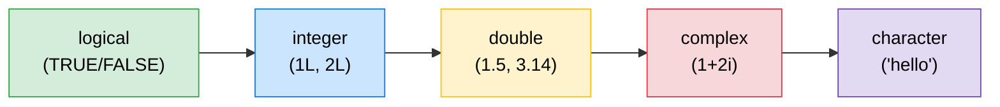

# 🔤 R Syntax Fundamentals

> [!abstract] TL;DR
> In R, **everything is a vector** — there is no scalar type. A "single number" is just a length-1 vector. R has six atomic types that form a coercion hierarchy. Understanding this hierarchy and the rules around recycling, missing values, and attributes is the single most important conceptual step in learning R.

---

## 💡 Intuition Analogy

Think of an R vector like a **train**. Every carriage in the train must carry the same type of cargo (no mixing apples and suitcases). If you try to mix cargo types, the train automatically converts everything to the most general type it can accommodate — a process called **coercion**. A "scalar" in R is simply a train with one carriage. The train metaphor also explains **recycling**: if you combine a short train with a long train, the short one loops around to fill the gap.

---

## 🗺️ Type Hierarchy Diagram



*Coercion always moves right (toward character). Forcing left loses information.*

---

## 🧠 Key Concepts

### 1. Everything Is a Vector

R has no scalar type. `42` is a double vector of length 1. `TRUE` is a logical vector of length 1. This means functions that operate on vectors automatically work on "scalars" — there is no special-casing needed.

```r
x <- 42
length(x)   # 1
is.vector(x) # TRUE

# A "scalar" and a vector behave identically
x + c(1, 2, 3)  # 43 44 45  — recycling in action
```

### 2. The Six Atomic Types

| Type | Example | `typeof()` | Notes |
|------|---------|-----------|-------|
| Logical | `TRUE`, `FALSE` | `"logical"` | Coerced to 1/0 in arithmetic |
| Integer | `1L`, `100L` | `"integer"` | 32-bit; use `L` suffix |
| Double | `3.14`, `1e5` | `"double"` | 64-bit IEEE 754 |
| Complex | `1+2i` | `"complex"` | Rarely used in data analysis |
| Character | `"hello"` | `"character"` | UTF-8 in R ≥ 4.0 |
| Raw | `as.raw(0x1f)` | `"raw"` | Byte-level; very niche |

### 3. Coercion Hierarchy

The hierarchy is: **logical < integer < double < complex < character**

```r
# Implicit coercion — R silently upgrades
c(TRUE, 1L, 2.5)         # double: 1.0 1.0 2.5
c(TRUE, 1L, 2.5, "a")    # character: "TRUE" "1" "2.5" "a"

# Explicit coercion
as.integer(TRUE)   # 1
as.double("3.14")  # 3.14
as.logical(0)      # FALSE
as.logical(99)     # TRUE  (any non-zero → TRUE)
```

### 4. Typed Missing Values

Every atomic type has its own `NA` variant. Mixing them triggers coercion just like mixing values does.

```r
NA              # logical NA (the default)
NA_integer_     # integer NA
NA_real_        # double NA
NA_complex_     # complex NA
NA_character_   # character NA

# In production code, always use the typed variant
x <- c(1.5, NA_real_, 3.0)
typeof(x)  # "double" — no coercion to character
```

### 5. Vector Recycling

When two vectors of different lengths are combined, the shorter one is **recycled** (repeated) to match the longer one. R warns when the longer length is not a multiple of the shorter.

```r
c(1, 2, 3, 4) + c(10, 20)
# 11 22 13 24  — shorter vector recycled silently

c(1, 2, 3) + c(10, 20)
# Warning: longer object length is not a multiple of shorter object length
# 11 22 13
```

Recycling is a feature, not a bug — it enables concise idioms like `x > 0` (recycling the scalar `0`).

### 6. `typeof()` vs `class()` vs `storage.mode()`

These three functions answer subtly different questions:

```r
x <- 1L
typeof(x)        # "integer"       — internal C-level type
class(x)         # "integer"       — S3 dispatch class
storage.mode(x)  # "integer"       — same as typeof for atomics

# For a matrix:
m <- matrix(1:4, 2, 2)
typeof(m)        # "integer"
class(m)         # "matrix" "array"
storage.mode(m)  # "integer"
```

Use `typeof()` when you care about the internal representation, `class()` when you care about S3 dispatch (which method gets called).

### 7. Attributes: `names`, `dim`, `class`

Attributes are metadata attached to a vector. The three most important are `names`, `dim`, and `class`. Setting `dim` turns a vector into a matrix or array; setting `class` enables S3 dispatch.

```r
x <- c(a = 1, b = 2, c = 3)
attributes(x)   # $names: "a" "b" "c"

# Setting dim makes a matrix
m <- 1:6
dim(m) <- c(2, 3)
class(m)  # "matrix" "array"

# names() shortcut
names(x)         # "a" "b" "c"
names(x)[2] <- "B"
```

### 8. Safe Sequence Generation

`1:length(x)` is a classic pitfall: if `x` has length 0 it produces `c(1, 0)`, not an empty sequence.

```r
x <- c()           # length 0

# Dangerous:
for (i in 1:length(x)) cat(i)  # prints "1 0" — WRONG

# Safe alternatives:
seq_along(x)   # always returns integer(0) when length is 0
seq_len(length(x))  # same guarantee

for (i in seq_along(x)) cat(i)  # prints nothing — correct
```

---

## ⚠️ Common Pitfalls

| Pitfall | Symptom | Fix |
|---------|---------|-----|
| `1:length(x)` on empty vector | Loops twice with `1` and `0` | Use `seq_along(x)` |
| Mixing types in `c()` | Silent coercion | Check `typeof()` after combining |
| `NA` without type suffix | Forces coercion to character | Use `NA_real_`, `NA_integer_` etc. |
| Integer overflow | `-2147483648L - 1L` returns `NA_integer_` with warning | Use `double` for large counts |
| `==` with `NA` | Returns `NA`, not `FALSE` | Use `is.na()` |

```r
# NA comparison pitfall
x <- NA
x == NA    # NA  — NOT FALSE
is.na(x)   # TRUE — correct
```

---

## 🔗 Related Concepts

- [[Data_Types_Structures]] — How vectors compose into lists, data frames, and matrices
- [[Control_Flow_Functions]] — How functions interact with vector operations

---

## ❓ Review Questions

1. What does R return for `typeof(TRUE)` and why is it not `"boolean"`?
2. What is the result of `c(1L, 2.5, "3")`? Explain each coercion step.
3. Why does `1:length(x)` break on an empty vector? What is the safe replacement?
4. You have `x <- c(1, NA, 3)`. How do you test for missing values?
5. What is the difference between `class()` and `typeof()` for a `matrix`?

---

## 📚 Sources

- Wickham, H. (2019). *Advanced R*, 2nd ed., Chapter 3: Vectors. https://adv-r.hadley.nz/vectors-chap.html
- R Language Definition — https://cran.r-project.org/doc/manuals/r-release/R-lang.html
- Burns, P. (2011). *The R Inferno*, Chapter 2: Growing Objects.

---

#r-programming #core-r
