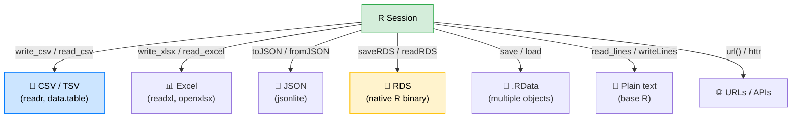

# 📁 Working with Files in R

> [!abstract] TL;DR
> R can read and write virtually any file format. For **CSV**, prefer `readr::read_csv` over `read.csv` for speed, type safety, and sane defaults. Use **readxl** for Excel, **jsonlite** for JSON, and **RDS** to save R objects exactly. Always use `file.path()` or the `here` package for portable paths — never hardcode path separators. For very large files, `data.table::fread` is the fastest option available.

---

## 💡 Intuition Analogy

Think of R's file I/O functions like **translators at an airport**: `read_csv` speaks the CSV dialect, `read_excel` speaks Excel, `read_json` speaks JSON, and `readRDS` speaks native R. Each translator knows the quirks of its dialect (encoding, date formats, missing value markers). Choosing the right translator means less manual correction after import. Saving with `saveRDS` is like packing your luggage in a vacuum bag — it compresses perfectly and unpacks exactly as you left it.

---

## 🗺️ File I/O Ecosystem



---

## 🧠 Key Concepts

### 1. Reading and Writing CSV

**Base R** provides `read.csv` / `write.csv`. **readr** provides the faster, more consistent `read_csv` / `write_csv`. **data.table** provides `fread` / `fwrite` for maximum performance.

```r
# --- Base R ---
df_base <- read.csv("data/sales.csv",
                    stringsAsFactors = FALSE,   # always set this!
                    na.strings = c("", "NA", "N/A"))

write.csv(df_base, "output/sales_clean.csv", row.names = FALSE)

# --- readr (recommended) ---
library(readr)
df_readr <- read_csv(
  "data/sales.csv",
  col_types = cols(
    date   = col_date("%Y-%m-%d"),
    amount = col_double(),
    region = col_character()
  ),
  na = c("", "NA", "N/A")
)

write_csv(df_readr, "output/sales_clean.csv")   # no row names by default

# --- data.table (fastest for large files) ---
library(data.table)
dt <- fread("data/sales.csv", nThread = 4)   # multi-threaded
fwrite(dt, "output/sales_clean.csv", nThread = 4)
```

### 2. Reading Excel Files with readxl

```r
library(readxl)

# List sheets in a workbook
excel_sheets("data/report.xlsx")   # "Sales" "Returns" "Summary"

# Read a specific sheet
sales <- read_excel(
  "data/report.xlsx",
  sheet = "Sales",
  range = "A1:F500",           # optional cell range
  col_types = c("date", "text", "numeric", "numeric", "text", "logical"),
  na = "N/A"
)

# Read all sheets into a named list
all_sheets <- lapply(
  excel_sheets("data/report.xlsx"),
  read_excel,
  path = "data/report.xlsx"
)
names(all_sheets) <- excel_sheets("data/report.xlsx")
```

For **writing** Excel, `readxl` is read-only; use `openxlsx` or `writexl`:

```r
library(writexl)
write_xlsx(list(Sales = sales, Summary = summary_df),
           "output/report.xlsx")
```

### 3. JSON with jsonlite

```r
library(jsonlite)

# Read JSON from file
config <- fromJSON("config/settings.json")

# Read JSON from URL
data <- fromJSON("https://api.example.com/data")

# Read nested JSON (auto-flattens by default)
nested <- fromJSON('{"users": [{"id": 1, "name": "Alice"}, {"id": 2, "name": "Bob"}]}',
                   flatten = TRUE)
# Returns a data frame: users.id, users.name

# Write R object to JSON
toJSON(list(model = "lm", params = list(alpha = 0.01, beta = 1.5)),
       pretty = TRUE,
       auto_unbox = TRUE)   # auto_unbox: length-1 → JSON scalar

# Write to file
write_json(config, "output/config_export.json", pretty = TRUE)
```

### 4. RDS Format — Saving R Objects Exactly

**RDS** (R Data Serialization) saves a **single R object** with full fidelity: factor levels, attributes, class, everything. This is the best format for intermediate results in a pipeline.

```r
# Save any R object
model <- lm(mpg ~ wt + hp, data = mtcars)
saveRDS(model, "models/lm_mpg.rds")

# Restore it exactly
model2 <- readRDS("models/lm_mpg.rds")
all.equal(coef(model), coef(model2))   # TRUE

# Tip: use .rds extension (lowercase) for clarity
# RDS compresses by default (compress = "gzip")
saveRDS(large_df, "data/cache.rds", compress = "xz")   # smaller but slower

# .RData saves MULTIPLE objects but requires knowing their names
save(model, sales, file = "session.RData")
load("session.RData")   # silently injects model and sales into env
```

> [!warning] Prefer RDS over .RData
> `.RData` / `save()` silently overwrites objects in the calling environment with whatever names were used at save time. `readRDS()` gives you full control over the name. Always use `saveRDS()` in scripts.

### 5. File Path Handling — `file.path()` and `here`

Never hardcode path separators. `file.path()` builds portable paths; the `here` package anchors paths to the project root regardless of working directory.

```r
# file.path() — portable separator
path <- file.path("data", "raw", "sales.csv")
# Windows: "data\raw\sales.csv"  Linux/Mac: "data/raw/sales.csv"

# Absolute paths
file.path(getwd(), "data", "sales.csv")

# here package — project-root anchored paths
library(here)
here()              # project root (where .Rproj or .here file is)
here("data", "raw", "sales.csv")   # always relative to project root

# This means scripts work regardless of where they are called from:
df <- read_csv(here("data", "raw", "sales.csv"))
```

### 6. Directory Operations

```r
# Check existence
file.exists("data/sales.csv")      # TRUE / FALSE
dir.exists("data/processed/")      # TRUE / FALSE

# Create directories
dir.create("output/plots", recursive = TRUE, showWarnings = FALSE)
# recursive = TRUE creates parent dirs; showWarnings = FALSE silences "exists" warning

# List files
list.files("data/")                               # immediate children
list.files("data/", recursive = TRUE)             # all descendants
list.files("data/", pattern = "\\.csv$")          # regex filter
list.files("data/", full.names = TRUE)            # full paths

# File operations
file.copy("data/sales.csv", "backup/sales_bak.csv")
file.rename("old_name.csv", "new_name.csv")
file.remove("temp/scratch.csv")

# Temporary files (for package code)
tmp <- tempfile(fileext = ".csv")
write_csv(df, tmp)
# tmp is cleaned up when R session ends
```

### 7. Working Directory Management

```r
getwd()               # current working directory
setwd("~/projects")   # change it (avoid in scripts; use here instead)

# In R scripts, use here() rather than setwd()
# In R Markdown, the document directory is always the working directory

# Check and set in a safe way
old_wd <- setwd(tempdir())
on.exit(setwd(old_wd), add = TRUE)   # restore on exit
```

### 8. Reading from URLs

```r
# Direct URL reading — works with most read_* functions
df <- read_csv("https://raw.githubusercontent.com/user/repo/main/data.csv")

# Download first if repeated access
download.file("https://example.com/large_file.zip",
              destfile = here("data", "raw", "file.zip"),
              method = "curl",
              mode = "wb")   # wb = write binary (important on Windows)

unzip(here("data", "raw", "file.zip"), exdir = here("data", "raw"))

# For APIs with authentication, use httr or httr2
library(httr2)
resp <- request("https://api.example.com/data") |>
  req_auth_bearer_token(Sys.getenv("API_TOKEN")) |>
  req_perform()

df <- resp |> resp_body_json(simplifyVector = TRUE) |> as_tibble()
```

---

## 📊 Performance Comparison: File Reading

| Function | Package | Speed (100 MB CSV) | Type guessing | Multithreaded |
|----------|---------|-------------------|--------------|--------------|
| `read.csv` | base R | ~25 s | Yes (often wrong) | No |
| `read_csv` | readr | ~3 s | Yes (safer) | No |
| `fread` | data.table | ~0.5 s | Yes (fast) | Yes |
| `read_parquet` | arrow | ~0.2 s | N/A (typed) | Yes |

For files > 50 MB, always use `data.table::fread` or `arrow::read_parquet`. Parquet is the best format for large tabular data if you control both write and read ends.

```r
# Parquet — fastest for large data
library(arrow)
write_parquet(large_df, "data/large.parquet")
df <- read_parquet("data/large.parquet")

# Only read columns you need
df_subset <- read_parquet("data/large.parquet",
                          col_select = c("id", "date", "amount"))
```

---

## ⚠️ Common Pitfalls

| Pitfall | Symptom | Fix |
|---------|---------|-----|
| Hardcoded paths with `\` | Breaks on Linux/Mac | Use `file.path()` or `here()` |
| `read.csv` with `stringsAsFactors = TRUE` | Factors instead of character | Set `stringsAsFactors = FALSE` or use `read_csv` |
| `setwd()` in scripts | Script breaks when run from different location | Replace with `here::here()` |
| `save()` instead of `saveRDS()` | Object names clash on `load()` | Use `saveRDS()` / `readRDS()` |
| `download.file()` without `mode = "wb"` | Corrupted binary files on Windows | Always set `mode = "wb"` for non-text |
| Not checking `file.exists()` before reading | Cryptic "cannot open connection" error | Guard with `if (!file.exists(path)) stop(...)` |

---

## 🔗 Related Concepts

- [[R_Packages_CRAN]] — File I/O in package code (tempfile, no home-dir writes)
- [[readr_tibble]] — Deep dive into the readr package and tibbles

---

## ❓ Review Questions

1. What is the difference between `saveRDS()` and `save()`? When would you prefer each?
2. You need to read a 500 MB CSV on a 4-core machine. Which function do you use and why?
3. Why should you use `here::here()` instead of `setwd()` in a reproducible script?
4. A colleague's R script uses `read.csv("C:\\Users\\alice\\data.csv")`. What two problems does this have?
5. How do you list all `.rds` files recursively in a directory?

---

## 📚 Sources

- Wickham, H. et al. *readr* documentation. https://readr.tidyverse.org
- Müller, K. *here* package. https://here.r-lib.org
- Dowle, M. & Srinivasan, A. *data.table* documentation. https://rdatatable.gitlab.io/data.table
- Ooms, J. *jsonlite*. https://cran.r-project.org/package=jsonlite
- Richardson, N. et al. *arrow* for R. https://arrow.apache.org/docs/r

---

#r-programming #core-r
