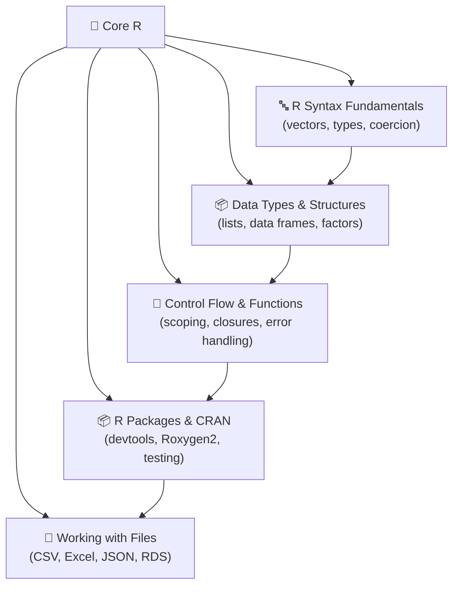

# 🔧 Core R — Map of Content

> [!abstract] What This Section Covers
> **Core R** is the foundation of everything in this vault. It covers the R language from the ground up: how values, vectors, and types work; how data is structured into lists, data frames, and factors; how control flow and functions give you abstraction power; how the package ecosystem works; and how to interact with files on disk. Mastering these five areas gives you a stable mental model that holds across base R, the tidyverse, and beyond.

---

## 🗺️ Concept Map

---

## 📚 Learning Path

Work through the notes in this order for the smoothest ramp-up:

1. [[R_Syntax_Fundamentals]] — Start here. Understand vectors, types, and coercion before anything else.
2. [[Data_Types_Structures]] — Build on vectors: learn lists, matrices, data frames, and factors.
3. [[Control_Flow_Functions]] — Add abstraction: functions, scoping, closures, and error handling.
4. [[R_Packages_CRAN]] — Learn how R code is distributed and how to build your own packages.
5. [[Working_with_Files]] — Connect R to the real world: read and write CSV, Excel, JSON, and RDS.

---

## 📋 Notes at a Glance

| Note | Difficulty | What You'll Learn |
|------|-----------|-------------------|
| [[R_Syntax_Fundamentals]] | Beginner | Vectors, atomic types, coercion hierarchy, recycling, attributes |
| [[Data_Types_Structures]] | Beginner | Lists, matrices, data frames, tibbles, factors, `[` vs `[[` |
| [[Control_Flow_Functions]] | Beginner | Scoping, closures, environments, `...`, `tryCatch`, `on.exit` |
| [[R_Packages_CRAN]] | Intermediate | devtools/usethis workflow, Roxygen2, testthat, CRAN checks |
| [[Working_with_Files]] | Beginner | CSV, Excel, JSON, RDS, `file.path()`, `here`, directory ops |

---

## ❓ Key Questions This Section Answers

- Why does R have no scalar type, and what does that mean in practice?
- When does R silently coerce a value to a different type?
- What is the difference between `[` and `[[`, and when does it matter?
- How does lexical scoping differ from dynamic scoping, and which does R use?
- What is a closure, and how do environments make them work?
- How do you build and publish an R package to CRAN?
- What is the fastest way to read a large CSV into R?

---

## 🔗 Related Sections

- [[_MOC_R_Programming_Master]] — Top-level vault index
- [[_MOC_Tidyverse]] — Data wrangling with dplyr, tidyr, ggplot2
- [[_MOC_Statistical_Computing]] — Probability, modelling, simulation in R

---

#r-programming #core-r
