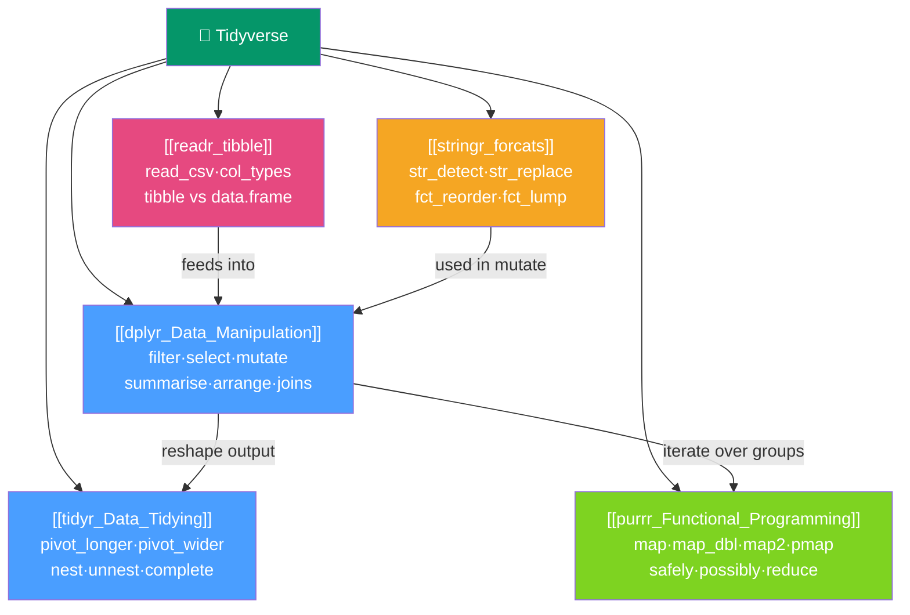

# 🌊 Tidyverse — Map of Content

> [!abstract] What This Section Covers
> The Tidyverse is a cohesive family of packages sharing one philosophy — **tidy data** (variable = column, observation = row, value = cell), data-frame-in/data-frame-out APIs, and the pipe (`|>` / `%>%`) — that turns R into a high-level data query language and functional pipeline in one. This section covers the five core Tidyverse packages: dplyr for data manipulation, tidyr for reshaping, purrr for functional programming, readr/tibble for data ingestion, and stringr/forcats for text and factor handling.

## Concept Map

## Learning Path

1. [[readr_tibble]] — Read data into R with readr and understand the tibble format that powers the Tidyverse.
2. [[dplyr_Data_Manipulation]] — Master the five verbs, group operations, joins, and tidy evaluation for data manipulation.
3. [[tidyr_Data_Tidying]] — Reshape data between wide and long formats; nest list-columns for per-group modelling.
4. [[stringr_forcats]] — Handle text with stringr's consistent API and factor levels with forcats.
5. [[purrr_Functional_Programming]] — Replace explicit loops with type-stable functional mapping across lists and data frames.

## All Notes at a Glance

| Note | Difficulty | What You'll Learn |
|------|------------|-------------------|
| [[dplyr_Data_Manipulation]] | Intermediate | The five verbs, across(), window functions, joins, case_when, tidy evaluation with {{ }} |
| [[tidyr_Data_Tidying]] | Intermediate | pivot_longer/pivot_wider, nest/unnest list-columns, separate, complete, fill |
| [[purrr_Functional_Programming]] | Intermediate | Type-stable map_* variants, map2/pmap, safely/possibly, reduce/accumulate, predicates |
| [[readr_tibble]] | Beginner | read_csv with col_types, tibble vs data.frame differences, parse failures, write functions |
| [[stringr_forcats]] | Intermediate | str_detect/replace/extract, PCRE regex, str_glue, fct_reorder, fct_lump, fct_recode |

## Key Questions This Section Answers

- What is tidy data and why does the entire Tidyverse assume it?
- How does the pipe (`|>`) change the way you write R code?
- What is the difference between `pivot_longer` and `pivot_wider`?
- When should I use `map_dbl` vs `map` vs `sapply`?
- How do I write a reusable dplyr function that accepts column names as arguments?
- What does `{{ }}` (embracing) do inside a custom function?
- Why does `fct_reorder` matter so much for ggplot2 charts?
- What is a list-column and how do I use `nest` + `map` for per-group modelling?

## Related Sections

- [[_MOC_R_Programming_Master|↑ R Programming Master MOC]]
- [[_MOC_Core_R|← Core R]] — R language fundamentals that the Tidyverse builds on
- [[_MOC_ggplot2|→ ggplot2 Visualization]] — Tidyverse-style visualization using tidy data
- [[_MOC_Statistical_Analysis|→ Statistical Analysis]] — Statistical modelling on tidy data frames
- [[_MOC_ML_in_R|→ ML in R]] — tidymodels extends Tidyverse principles to ML pipelines

#MOC #r-programming #tidyverse
