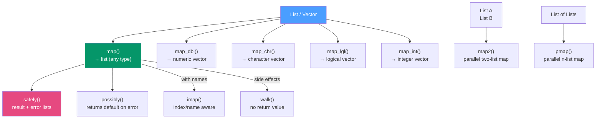

# 🗺️ purrr Functional Programming

> [!abstract] TL;DR
> purrr provides type-stable functional mapping (`map`, `map_dbl`, `map_chr`, …), parallel mapping (`map2`, `pmap`), failure-handling adverbs (`safely`, `possibly`, `quietly`), and fold operations (`reduce`, `accumulate`). It replaces fragile `sapply`/`lapply` calls with explicit return-type contracts and works seamlessly with list-columns from `tidyr::nest()`.

## Intuition — analogy FIRST

`lapply` is like a factory line where each worker gets one item, does something with it, and puts the result in a bag — but you have no idea what's in the bag until you open it. `map_dbl` is the same factory line, except a quality inspector stands at the end and refuses to pass anything that isn't a double. If any worker produces a string or NULL, the whole line halts with a clear error instead of silently returning a mixed bag.

That type contract is the entire value of purrr's `map_*` variants.

---

## How It Works



---

## Key Concepts / Details

### The map Family — Type-Stable Mapping

```r
library(purrr)

numbers <- list(1:5, 10:15, 100:110)

# map → always returns a list
map(numbers, mean)               # list of doubles (no contract on type)

# map_dbl → returns a numeric vector, errors if any element isn't coercible
map_dbl(numbers, mean)           # c(3, 12.5, 105)

# map_int → returns integer vector
map_int(numbers, length)         # c(5L, 6L, 11L)

# map_chr → returns character vector
map_chr(numbers, \(x) paste(range(x), collapse = "–"))

# map_lgl → returns logical vector
map_lgl(numbers, \(x) max(x) > 100)

# Lambda syntax: \(x) or ~.x (older formula style, avoid in new code)
map_dbl(numbers, \(x) sum(x^2) / length(x))
```

### Comparison: map vs sapply vs lapply

| Function | Return Type | Type Contract | Error Behavior |
|----------|------------|---------------|----------------|
| `lapply` | Always a list | None | Silently returns mixed types |
| `sapply` | "Simplified" — often a matrix | None | Silently returns wrong structure |
| `map` | Always a list | None | Consistent with lapply |
| `map_dbl` | Numeric vector | Strict double | Error if not coercible |
| `map_chr` | Character vector | Strict character | Error if not coercible |
| `vapply` | Specified type | FUN.VALUE template | Error on mismatch |

**Rule:** In production code, prefer `map_*` over `sapply` (surprises you), and over `vapply` (purrr is more readable).

### map2 and pmap — Parallel Inputs

```r
# map2: iterate over two lists in lockstep
names_vec  <- c("Alice", "Bob", "Carol")
scores_vec <- c(92, 87, 95)

map2_chr(names_vec, scores_vec, \(name, score) glue::glue("{name}: {score}"))
# "Alice: 92" "Bob: 87" "Carol: 95"

# pmap: iterate over a named list of equal-length vectors
params <- list(
  mean = c(0, 5, 10),
  sd   = c(1, 2, 3),
  n    = c(100, 200, 300)
)
pmap(params, rnorm)  # generates 3 samples with different parameters
```

### imap — Index-Aware Mapping

```r
data_list <- list(train = mtcars, test = head(mtcars, 5))

# imap passes both the element and its name/index
imap(data_list, \(df, nm) glue::glue("{nm}: {nrow(df)} rows"))
# list("train: 32 rows", "test: 5 rows")

imap_chr(data_list, \(df, nm) paste0(nm, "=", nrow(df)))
```

### walk — Side Effects Without Return Value

```r
# walk is map but for side effects (saving files, printing, logging)
paths   <- c("data/a.csv", "data/b.csv", "data/c.csv")
data_l  <- map(paths, readr::read_csv)

# Save each element with a matching name
walk2(data_l, paths, readr::write_csv)
```

### Failure-Handling Adverbs

Real data is messy — some elements will fail. Use adverbs to handle failures gracefully.

```r
# safely: wraps the function, returns list(result = ..., error = ...)
safe_log  <- safely(log)
results   <- map(list(10, -1, "abc"), safe_log)
# results[[2]]$error is an error object, results[[2]]$result is NULL

# Extract successful results
map(results, "result") |> compact()   # compact() drops NULLs

# possibly: returns a default value on error (cleaner for pipelines)
safe_read <- possibly(readr::read_csv, otherwise = tibble())
data_list <- map(file_paths, safe_read)  # empty tibble for failed files

# quietly: captures warnings and messages (doesn't handle errors)
quiet_lm <- quietly(lm)
res <- quiet_lm(mpg ~ cyl, data = mtcars)
res$result    # the model
res$warnings  # any warnings produced
```

### reduce and accumulate — Fold Operations

```r
# reduce: fold a list into a single value
reduce(1:5, `+`)                       # 15  (equivalent to sum)
reduce(c(16, 4, 2), `/`)              # 16/4/2 = 2

# Combine a list of data frames with a shared join
list_of_dfs |>
  reduce(left_join, by = "id")

# accumulate: like reduce but keeps all intermediate results
accumulate(1:5, `+`)                  # 1  3  6  10  15 (running sum)
accumulate(c(100, 0.9, 0.9, 0.9), `*`)  # compound decay
```

### Predicates — Filter and Test Lists

```r
numbers <- list(1, -2, 3, -4, 5)

keep(numbers, \(x) x > 0)            # list(1, 3, 5)
discard(numbers, \(x) x > 0)         # list(-2, -4)
compact(list(1, NULL, 3, NULL, 5))    # list(1, 3, 5) — removes NULLs

every(numbers, is.numeric)            # TRUE — all elements are numeric
some(numbers, \(x) x < 0)            # TRUE — at least one is negative
detect(numbers, \(x) x > 3)          # 5 — first element satisfying predicate
detect_index(numbers, \(x) x > 3)    # 5 — index of first match
```

---

## Real-World Notes

- **Nest + map is the split-apply-combine idiom** in tidyverse: `group_by() |> nest()` creates a list-column of sub-data-frames; `mutate(model = map(data, lm))` fits a model per group; `unnest(tidied)` extracts results.
- **`map` inside `dplyr::across()`** works naturally — the R 4.1 lambda `\(x)` is the same in both contexts.
- **For heavy parallelism**, replace `map` with `furrr::future_map` — the API is identical, but work distributes across CPU cores with `plan(multisession)`.

---

## Common Pitfalls

1. **Using `map` when you mean `map_dbl`** — if you expect a numeric vector and use `map`, you get a list, which breaks downstream arithmetic.
2. **Formula `~.x` vs lambda `\(x)`** — formula style (`~.x`, `~.x + .y`) is the old purrr API; prefer `\(x)` in new code (base R 4.1+, works in `across()` too).
3. **`reduce(list, left_join)` without specifying `by`** — joins by all common columns; use `reduce(list, left_join, by = "id")`.
4. **Forgetting `compact()` after `safely`** — `safely` returns `list(result=..., error=...)` for every element; extracting `"result"` gives NULLs for failures that need to be removed.
5. **`walk` is for side effects only** — it invisibly returns the input, so don't capture its "result" expecting modified data.

---

## Related Concepts

- [[_MOC_Tidyverse|↑ Section MOC]]
- [[tidyr_Data_Tidying]] — `nest()` creates the list-columns that `map()` iterates over
- [[dplyr_Data_Manipulation]] — `across()` accepts the same `\(x)` lambdas as `map`
- [[Control_Flow_Functions]] — purrr's functional style replaces explicit `for` loops

---

## Review Questions

1. What is the difference between `map` and `map_dbl`? What happens if you use `map_dbl` and one element is a string?
2. How would you fit a linear model for each country in `gapminder` data using `nest()` and `map()`?
3. What does `safely()` return and how do you extract only the successful results?
4. When would you use `reduce(list_of_dfs, left_join, by = "id")` instead of joining manually?
5. What is the difference between `walk` and `map`?

---

## Sources

- Henry L. & Wickham H., purrr documentation — https://purrr.tidyverse.org/reference/
- Wickham H., *Advanced R*, Ch. 9 — Functionals
- Wickham H. & Grolemund G., *R for Data Science* (2e), Ch. 26 — Iteration

#r-programming #tidyverse #purrr
