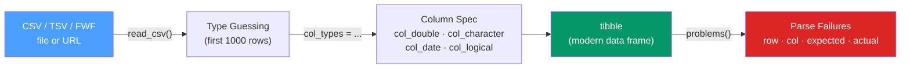

# 📥 readr and tibble

> [!abstract] TL;DR
> **readr** reads flat files (CSV, TSV, fixed-width) into tibbles faster and more safely than base R, with explicit column-type specification, transparent parse failures, and no `stringsAsFactors` surprises. **tibble** is a modern reimagining of `data.frame` with better printing, stricter subsetting, and support for list-columns — the fundamental data object of the entire Tidyverse.

## Intuition — analogy FIRST

Base R's `read.csv` is like a lenient postal worker who guesses what a package contains and sometimes relabels it wrong — strings become factors, column names get sanitized, and you find out later when a model breaks.

`readr::read_csv` is a careful customs inspector: it previews the first 1000 rows to determine the type, shows you its guesses, and tells you exactly which rows failed to parse (and why) in a `problems()` report. If you want to override a guess, you declare column types explicitly with `col_types`.

---

## How It Works



---

## Key Concepts / Details

### read_csv vs read.csv — Key Differences

| Feature | `read.csv` (base R) | `read_csv` (readr) |
|---------|--------------------|--------------------|
| `stringsAsFactors` | Historically `TRUE` (R < 4.0) | Never converts strings to factors |
| Column names with spaces | Sanitizes to `.` | Kept as-is (backtick access) |
| Speed | Slower for large files | ~10× faster (C++ parser) |
| Output type | `data.frame` | `tibble` |
| Type specification | `colClasses` (clunky) | `col_types` with concise spec string |
| Parse failures | Silent | Reported via `problems()` |
| Progress bar | None | Shows progress for large files |
| First column as row names | `row.names = 1` pattern | Not supported (tibbles have no row names) |

### Basic readr Usage

```r
library(readr)

# Simplest case: readr guesses types
df <- read_csv("data/sales.csv")

# Check what readr guessed
spec(df)

# Specify types explicitly — c=character, d=double, i=integer, l=logical, D=date
df <- read_csv(
  "data/sales.csv",
  col_types = cols(
    date        = col_date(format = "%Y-%m-%d"),
    revenue     = col_double(),
    product_id  = col_character(),   # keep as string, not integer
    is_returned = col_logical(),
    .default    = col_character()    # everything else as character
  ),
  na = c("", "NA", "N/A", "null"),   # define what counts as NA
  skip = 2                           # skip 2 header rows
)

# Check for parse failures
problems(df)   # tibble of row/col/expected/actual for each failure
```

### Other readr Functions

```r
read_tsv("data/tab_separated.tsv")            # tab-separated
read_delim("data/pipe_sep.txt", delim = "|")  # arbitrary delimiter
read_fwf("data/fixed_width.txt",              # fixed-width format
         fwf_widths(c(10, 5, 8)))

# Writing
write_csv(df, "output/results.csv")           # no row names (unlike write.csv)
write_tsv(df, "output/results.tsv")
write_rds(df, "output/results.rds")           # R-native binary, preserves types perfectly

# Read from URL directly
read_csv("https://raw.githubusercontent.com/tidyverse/ggplot2/main/data-raw/diamonds.csv")
```

### tibble vs data.frame

```r
library(tibble)

# Create a tibble
tb <- tibble(
  x    = 1:5,
  y    = x * 2,         # can reference previous columns (unlike data.frame!)
  text = letters[1:5]
)

# Tibble printing: shows dimensions and column types
print(tb)
# # A tibble: 5 × 3
#       x     y text
#   <int> <dbl> <chr>
# 1     1     2 a
# ...

# Key tibble differences from data.frame:
# 1. No partial matching of column names
tb$te      # NULL (warns) — data.frame would return tb$text
tb[["x"]]  # always works

# 2. [ always returns a tibble (data.frame returns vector for single col)
tb[, 1]        # tibble with 1 column
tb[, 1, drop = FALSE]  # same behavior from data.frame

# 3. No row names
rownames(tb)  # NULL

# 4. List columns work naturally
tibble(
  id   = 1:3,
  data = list(mtcars, iris, airquality)  # list column of data frames
)
```

### Useful tibble Constructors

```r
# tribble: row-by-row construction (great for test data and documentation)
tribble(
  ~name,    ~age, ~score,
  "Alice",  25,   92.5,
  "Bob",    30,   87.0,
  "Carol",  28,   95.5
)

# as_tibble: convert an existing data.frame or matrix
as_tibble(mtcars)
as_tibble(matrix(1:9, nrow = 3), .name_repair = "universal")

# glimpse: compact view of all columns (like str but tidyverse-formatted)
glimpse(mtcars)
# Rows: 32
# Columns: 11
# $ mpg  <dbl> 21.0, 21.0, 22.8, ...
```

### Performance Comparison for File Reading

| Package | Function | Relative Speed | Best For |
|---------|----------|----------------|----------|
| base R | `read.csv()` | 1× (baseline) | Small files, no dependencies |
| readr | `read_csv()` | ~10× | Standard Tidyverse workflows |
| data.table | `fread()` | ~50–100× | Large files (millions of rows) |
| arrow | `read_csv_arrow()` | ~100–200× | Very large files, Parquet |
| vroom | `vroom()` | ~100×+ | Multiple files, lazy evaluation |

---

## Real-World Notes

- **Always use `read_csv` (readr) over `read.csv` (base R)** in new code — the only exception is dependency-free scripts where you can't install packages.
- **`spec()` + `col_types`** is the workflow for production-grade ingestion: run once without `col_types` to see what readr guesses, then lock it in explicitly.
- **`vroom::vroom`** reads multiple files simultaneously with lazy evaluation — useful for reading a directory of logs: `vroom::vroom(fs::dir_ls("logs/", glob = "*.csv"))`.
- **`write_rds` vs `write_csv`**: use RDS for intermediate R objects (preserves factor levels, list columns, model objects); use CSV for interoperability with other tools.

---

## Common Pitfalls

1. **Not specifying `col_types`** — readr guesses from the first 1000 rows; a column that looks like doubles might have strings in row 5000 that fail silently.
2. **Assuming `read_csv` and `read.csv` produce the same result** — they don't; tibble printing is different, and column types may differ.
3. **Forgetting `na = c("", "NA")`** — readr treats only `NA` as missing by default; empty strings become `""` not `NA` unless you declare them.
4. **Using `read_csv` on a semicolon-delimited file** — European CSVs often use `;` as the delimiter and `,` as the decimal; use `read_csv2()` or `read_delim(delim = ";")`.
5. **Tibble `[` vs `[[`** — `tb["x"]` returns a one-column tibble; `tb[["x"]]` or `tb$x` returns the vector. Choose based on what downstream code expects.

---

## Related Concepts

- [[_MOC_Tidyverse|↑ Section MOC]]
- [[dplyr_Data_Manipulation]] — dplyr operates on the tibbles that readr produces
- [[Working_with_Files]] — Broader file I/O including RDS, Excel, JSON, and database connections
- [[tidyr_Data_Tidying]] — Reshaping and tidying the data frames readr loads

---

## Review Questions

1. What are three concrete differences between `readr::read_csv` and base R's `read.csv`?
2. How do you inspect the column type guesses readr made, and how do you override one?
3. What does `problems(df)` return and when would you use it?
4. What is the difference between `tb["x"]` and `tb[["x"]]` when `tb` is a tibble?
5. Why does readr not support row names, and what should you use instead?

---

## Sources

- readr documentation — https://readr.tidyverse.org/reference/
- tibble documentation — https://tibble.tidyverse.org/reference/
- Wickham H. & Grolemund G., *R for Data Science* (2e), Ch. 8 — Data Import

#r-programming #tidyverse #readr #tibble
