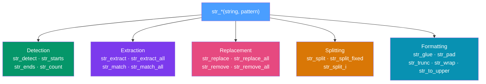

# 🔤 stringr and forcats

> [!abstract] TL;DR
> **stringr** provides a consistent, vectorised `str_*(string, pattern)` API for all string operations — detection, extraction, replacement, splitting — using PCRE regex throughout. **forcats** provides tools for managing factor levels, with `fct_reorder` being the single highest-impact function for making ggplot2 charts meaningful rather than alphabetical. Both integrate naturally with `dplyr::mutate`.

## Intuition — analogy FIRST

Base R's string functions (`grep`, `gsub`, `regmatches`, `strsplit`) are a collection of tools from different eras that each work slightly differently — some return indices, some logical, some modified strings, some list of lists. The argument order changes between functions.

stringr is like replacing that toolbox with one universal tool that always works the same way: `str_*(string, pattern, ...)`. The first argument is always the string, the second is always the pattern, and the return type is predictable. Once you know `str_detect`, the mental model for `str_extract`, `str_replace`, and `str_split` is already obvious.

---

## How It Works



---

## Key Concepts / Details

### Core stringr Functions

| Function | Returns | Use Case |
|----------|---------|----------|
| `str_detect(x, pat)` | logical vector | Filter rows matching a pattern |
| `str_starts(x, pat)` | logical vector | Check if string begins with pattern |
| `str_ends(x, pat)` | logical vector | Check if string ends with pattern |
| `str_count(x, pat)` | integer vector | Count matches per string |
| `str_extract(x, pat)` | character vector | First match per string |
| `str_extract_all(x, pat)` | list of char vecs | All matches per string |
| `str_match(x, pat)` | matrix | Capture groups from first match |
| `str_replace(x, pat, rep)` | character vector | Replace first match |
| `str_replace_all(x, pat, rep)` | character vector | Replace all matches |
| `str_remove(x, pat)` | character vector | Remove first match |
| `str_split(x, pat)` | list of char vecs | Split string at each match |
| `str_split_fixed(x, pat, n)` | character matrix | Split into exactly n pieces |
| `str_glue(template)` | glue_chr vector | String interpolation |
| `str_pad(x, width, side)` | character vector | Pad to fixed width |
| `str_trunc(x, width)` | character vector | Truncate with ellipsis |

```r
library(stringr)

emails <- c("alice@example.com", "bob@test.org", "carol@work.net", "INVALID")

# Detection
str_detect(emails, "@")                     # TRUE TRUE TRUE FALSE
str_detect(emails, "^[\\w.]+@[\\w.]+$")    # proper email regex check

# Extraction
str_extract(emails, "[\\w.]+(?=@)")         # "alice" "bob" "carol" NA (username before @)
str_extract(emails, "(?<=@)[\\w.]+")        # "example.com" "test.org" "work.net" NA

# Replacement
str_replace(emails, "@", " AT ")            # "alice AT example.com" ...
str_remove(emails, "@.*$")                  # "alice" "bob" "carol" "INVALID"

# Splitting
str_split_fixed(emails, "@", n = 2)         # matrix: col1=username, col2=domain

# Formatting with str_glue
name   <- "World"
n      <- 42
str_glue("Hello, {name}! The answer is {n}.")
str_glue("Min: {min(mtcars$mpg)}, Max: {max(mtcars$mpg)}")  # expressions work
```

### PCRE Regex Essentials in R

```r
# Character classes
str_detect("cat123", "[a-z]")        # matches lowercase letter
str_detect("CAT123", "[A-Z]{3}")     # exactly 3 uppercase
str_detect("abc123", "\\d+")         # one or more digits

# Quantifiers
str_extract("colour|color", "colou?r")  # 'u' is optional

# Anchors
str_detect(c("abc", "xabc"), "^abc")  # TRUE FALSE (start anchor)

# Capture groups
str_match("2024-07-26", "(\\d{4})-(\\d{2})-(\\d{2})")
# [,1]         [,2]   [,3] [,4]
# "2024-07-26" "2024" "07" "26"

# Named capture groups (with str_match)
str_match("2024-07-26", "(?P<year>\\d{4})-(?P<month>\\d{2})-(?P<day>\\d{2})")

# Lookahead / lookbehind
str_extract("$100.50", "(?<=\\$)[\\d.]+")  # "100.50" (after dollar sign)

# Fixed strings (faster, no regex interpretation)
str_detect(x, fixed("(literal parentheses)"))
```

### forcats — Factor Level Management

Factors in R are integers with a `levels` attribute. The order of levels controls sort order in plots, model reference categories, and table orderings. forcats makes level management explicit and safe.

```r
library(forcats)

# The most important function: fct_reorder
# Reorders factor levels by the value of another variable
# → CRITICAL for meaningful bar charts (not alphabetical!)
starwars |>
  filter(!is.na(species)) |>
  count(species) |>
  mutate(species = fct_reorder(species, n)) |>  # order by count
  ggplot(aes(x = n, y = species)) +
  geom_col()

# fct_infreq: order by frequency (often combined with fct_rev)
mtcars |>
  mutate(cyl = fct_infreq(as.factor(cyl))) |>
  ggplot(aes(x = cyl)) + geom_bar()

# fct_relevel: manually set specific levels to specific positions
sizes <- factor(c("S", "M", "L", "XL", "M", "S"))
fct_relevel(sizes, "S", "M", "L", "XL")  # explicit natural order

# fct_recode: rename levels
mtcars |>
  mutate(am = fct_recode(as.factor(am),
    "Automatic" = "0",
    "Manual"    = "1"
  ))

# fct_collapse: merge levels
survey |>
  mutate(age_group = fct_collapse(age_group,
    young  = c("18-24", "25-34"),
    middle = c("35-44", "45-54"),
    senior = c("55-64", "65+")
  ))

# fct_lump_n: keep top n levels, lump rest into "Other"
movies |>
  mutate(genre = fct_lump_n(genre, n = 5)) |>
  count(genre, sort = TRUE)

# fct_drop: remove unused levels (after filtering)
levels(droplevels(filtered_factor))     # base R
fct_drop(filtered_factor)               # forcats
```

### forcats Function Reference

| Function | What it does |
|----------|-------------|
| `fct_reorder(f, x)` | Reorder levels by median/mean of `x` |
| `fct_reorder2(f, x, y)` | Reorder levels for two-variable plots |
| `fct_infreq(f)` | Order levels by frequency (most frequent first) |
| `fct_rev(f)` | Reverse the current level order |
| `fct_relevel(f, ...)` | Manually set level positions |
| `fct_recode(f, ...)` | Rename individual levels |
| `fct_collapse(f, ...)` | Merge multiple levels into one |
| `fct_lump_n(f, n)` | Keep top n levels, collapse rest to "Other" |
| `fct_lump_prop(f, prop)` | Keep levels above frequency proportion |
| `fct_drop(f)` | Remove unused levels |
| `fct_explicit_na(f)` | Make NA an explicit factor level |

---

## Real-World Notes

- **`fct_reorder` is the single most impactful change** you can make to a ggplot2 bar chart — alphabetical ordering is almost never meaningful.
- **`str_glue` is preferred over `paste0`** for string interpolation — it's more readable and supports any R expression inside `{}`.
- **`str_detect` inside `dplyr::filter`** is the standard pattern for text-based row filtering: `filter(str_detect(text_col, "keyword"))`.
- **`str_extract_all` with `unnest_longer`** is the pattern for extracting all occurrences: each row may have multiple matches, which become multiple rows after unnesting.

---

## Common Pitfalls

1. **Using `grepl` instead of `str_detect`** — both work, but `str_detect(x, pat)` is consistent with other stringr functions and accepts fixed strings via `fixed()`.
2. **`str_replace` only replaces the first match** — use `str_replace_all` to replace all occurrences.
3. **Not calling `as.factor()` before forcats functions** — forcats operates on factors; calling `fct_reorder` on a character column silently converts it first, which can mask intent.
4. **Forgetting `fct_rev` with `fct_reorder`** — `fct_reorder` with `geom_col` often needs `fct_rev(fct_reorder(...))` to get highest values at the top of a horizontal bar chart.
5. **`fct_lump_n` keeping `n` levels PLUS "Other"** — the output has `n+1` levels; don't use it when you need exactly `n` categories.

---

## Related Concepts

- [[_MOC_Tidyverse|↑ Section MOC]]
- [[dplyr_Data_Manipulation]] — `str_detect` inside `filter()` and `str_replace` inside `mutate()` are the standard integration points
- [[ggplot2_Grammar_of_Graphics]] — `fct_reorder` is essential for meaningful ggplot2 bar and dot-plot orderings

---

## Review Questions

1. What is the consistent argument order for all `str_*` functions and why does it matter for piping?
2. How do you extract everything after the `@` in an email address using `str_extract`?
3. What does `fct_reorder(genre, revenue)` do and when would you use `fct_reorder2`?
4. How would you keep only the top 5 most frequent genres and lump the rest?
5. What is the difference between `str_replace` and `str_replace_all`?

---

## Sources

- stringr documentation — https://stringr.tidyverse.org/reference/
- forcats documentation — https://forcats.tidyverse.org/reference/
- Wickham H. & Grolemund G., *R for Data Science* (2e), Ch. 14–15 — Strings and Factors

#r-programming #tidyverse #stringr #forcats
