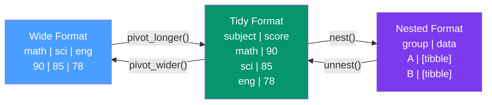

# 🔄 tidyr Data Tidying

> [!abstract] TL;DR
> tidyr enforces the **tidy data** contract — one variable per column, one observation per row, one value per cell — through two pivoting functions (`pivot_longer` / `pivot_wider`), list-column tools (`nest` / `unnest`), and gap-filling helpers (`complete`, `fill`). Tidy data is the prerequisite for dplyr, ggplot2, and tidymodels to work without friction.

## Intuition — analogy FIRST

Imagine a spreadsheet where students' test scores appear as columns: `math_score`, `science_score`, `english_score`. That's convenient to enter but terrible to analyze — you can't `group_by(subject)` when subject is baked into column names.

**Tidy data** flips this: one row per student per subject, with columns `student`, `subject`, and `score`. Now every dplyr verb, every ggplot2 aesthetic, and every statistical model works naturally.

`pivot_longer` moves column headers into a column (wide → tidy). `pivot_wider` moves a column into headers (tidy → wide). These two operations are inverses of each other and together let you reshape any data into whatever form you need.

---

## How It Works



---

## Key Concepts / Details

### The Three Tidy Data Rules

1. **Each variable forms a column** — `subject`, `score`, `student_id` are separate columns.
2. **Each observation forms a row** — one student's math score is one row.
3. **Each value forms a cell** — no comma-separated values, no merged cells.

Violations of these rules are the most common source of data-cleaning friction in R.

### pivot_longer — Wide to Tidy

```r
library(tidyr)
library(dplyr)

# Before: wide data — country GDP per year as columns
wide_gdp <- tibble(
  country = c("USA", "UK", "Germany"),
  `2020`  = c(21.4, 2.7, 3.9),
  `2021`  = c(23.3, 3.1, 4.2),
  `2022`  = c(25.5, 3.1, 4.1)
)

# After: tidy — one row per country per year
tidy_gdp <- wide_gdp |>
  pivot_longer(
    cols         = -country,         # all columns except 'country'
    names_to     = "year",
    values_to    = "gdp_trillion",
    names_transform = list(year = as.integer)
  )

# Advanced: multiple value variables encoded in column names
# e.g., "age_mean", "age_sd", "income_mean", "income_sd"
df |>
  pivot_longer(
    cols          = everything(),
    names_to      = c(".value", "stat"),
    names_pattern = "(.+)_(.+)"
  )
```

### pivot_wider — Tidy to Wide

```r
# Useful when a model needs one row per entity
tidy_gdp |>
  pivot_wider(
    names_from   = year,
    values_from  = gdp_trillion,
    names_prefix = "gdp_"
  )

# With aggregation when duplicates exist
surveys |>
  pivot_wider(
    names_from  = question,
    values_from = answer,
    values_fn   = mean,    # aggregate duplicates
    values_fill = NA       # fill missing combos
  )
```

### nest and unnest — List-Columns for Per-Group Modelling

List-columns store arbitrary R objects (models, vectors, data frames) inside a data frame cell. This unlocks a powerful pattern: nest data by group, fit a model per group, extract results — all in one pipeline.

```r
library(tidyr)
library(purrr)
library(broom)

# Nest: create one row per country, with all country data in a list-column
nested_gapminder <- gapminder |>
  group_by(country, continent) |>
  nest()

# Fit a linear model per country
modelled <- nested_gapminder |>
  mutate(
    model   = map(data, \(d) lm(lifeExp ~ year, data = d)),
    glanced = map(model, broom::glance),       # model summary stats
    tidied  = map(model, broom::tidy)          # coefficient estimates
  )

# Extract results
modelled |>
  select(country, continent, tidied) |>
  unnest(tidied) |>
  filter(term == "year")
```

### unnest_wider vs unnest_longer

```r
# unnest_wider: expand a list-column where each element is a named list
# → creates new columns from list names
df |> unnest_wider(json_col)

# unnest_longer: expand a list-column where each element is a vector
# → creates new rows, one per element
df |> unnest_longer(tags_col)
```

### separate — Split One Column into Multiple

```r
# Modern API (tidyr 1.3+): safer, explicit, with better error messages
df |>
  separate_wider_delim(
    cols    = full_name,
    delim   = " ",
    names   = c("first_name", "last_name"),
    too_few = "align_start"  # handle missing last name
  )

df |>
  separate_wider_regex(
    cols  = date_str,
    patterns = c(year = "\\d{4}", "-", month = "\\d{2}", "-", day = "\\d{2}")
  )

# Legacy: separate() — still works but less explicit
df |> separate(col, into = c("a", "b"), sep = "_")
```

### complete and fill — Handling Missingness

```r
# complete: make implicit missingness explicit
# Fills in all combinations of the specified variables with NA or a fill value
sales |>
  complete(
    date, product_id,
    fill = list(units_sold = 0)  # assume 0 sales on missing days
  )

# fill: forward- or backward-fill missing values (LOCF/NOCB)
survey_responses |>
  fill(respondent_id, .direction = "down")  # carry last known ID forward
```

---

## Real-World Notes

- **The `values_fn` argument in `pivot_wider`** is critical when your data has duplicate entries for a combination — without it, you get a list-column of all values instead of a scalar.
- **Nested tibbles are the backbone of split-apply-combine in tidymodels** — `vfold_cv` splits return a nested tibble structure that `tune_grid` maps over.
- **`complete()` before aggregation** prevents silent exclusion of zero-count groups in ggplot2 bar charts.

---

## Common Pitfalls

1. **`pivot_longer` with `cols = everything()`** — often too broad; always explicitly specify `cols` or use `-identifier_col` to avoid pivoting ID columns.
2. **Missing `names_transform`** — column names become character by default; add `names_transform = list(year = as.integer)` when the names are actually numbers.
3. **`unnest()` on a list-column with variable-length elements** — results in row explosion; check element lengths first with `map_int(list_col, length)`.
4. **Confusing `nest()` scope** — always `group_by()` before `nest()` or use `nest(.by = group_col)` (tidyr 1.3+) to control which columns define the groups.
5. **`separate()` with `remove = TRUE`** (default) — the original column is dropped; if you need it, set `remove = FALSE`.

---

## Related Concepts

- [[_MOC_Tidyverse|↑ Section MOC]]
- [[dplyr_Data_Manipulation]] — dplyr verbs operate on the tidy data frames tidyr produces
- [[purrr_Functional_Programming]] — `map` + `nest` is the standard idiom for per-group operations
- [[ggplot2_Grammar_of_Graphics]] — ggplot2 requires tidy data for aesthetic mappings

---

## Review Questions

1. Describe the three rules of tidy data. Give one example of data that violates each rule.
2. What is the difference between `pivot_longer(names_to = c("a", "b"), names_sep = "_")` and `names_pattern`?
3. How would you fit a separate linear model per country using `nest()` and `map()`?
4. When would you use `complete()` and what happens to rows not covered by the completion grid?
5. What is the difference between `unnest_wider()` and `unnest_longer()`?

---

## Sources

- Wickham H., *Tidy Data*, Journal of Statistical Software (2014) — https://www.jstatsoft.org/article/view/v059i10
- tidyr reference documentation — https://tidyr.tidyverse.org/reference/
- Wickham H. & Grolemund G., *R for Data Science* (2e), Ch. 5 — https://r4ds.hadley.nz/data-tidy.html

#r-programming #tidyverse #tidyr
