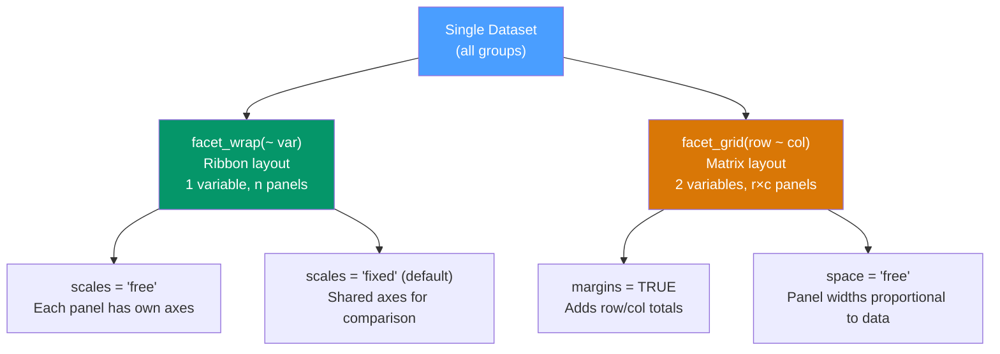

# 🔲 Faceting and Grouping in ggplot2

> [!abstract] TL;DR
> **Faceting** splits a single chart into a grid of smaller charts (small multiples), each showing a subset of the data — the most powerful technique for comparing patterns across categories. `facet_wrap` arranges panels in a ribbon by one variable; `facet_grid` creates a two-way matrix by two variables. The **group** aesthetic tells geoms like `geom_line` and `geom_polygon` which observations belong together.

## Intuition — analogy FIRST

Imagine you have sales data for 10 products over 24 months. Plotting all 10 on one chart creates a spaghetti mess. **Small multiples** (faceting) give each product its own panel, with identical axes so your eye can compare shapes and trends without decoding colors. Edward Tufte called small multiples "the most powerful and efficient tool in data visualization."

The **group aesthetic** is the answer to "which dots belong to the same line?" Without it, `geom_line` connects every point in x-order, creating a chaotic zigzag instead of separate series.

---

## How It Works



---

## Key Concepts / Details

### facet_wrap — One Variable, Ribbon Layout

`facet_wrap` wraps panels into rows and columns automatically based on `nrow` or `ncol`. Best when you have one categorical variable and want a compact grid.

```r
library(ggplot2)

# Basic facet_wrap
ggplot(mpg, aes(x = displ, y = hwy)) +
  geom_point(alpha = 0.5) +
  geom_smooth(method = "lm", se = FALSE) +
  facet_wrap(~ class, nrow = 2)

# facet_wrap options
facet_wrap(
  ~ class,
  nrow          = 2,                    # number of rows
  ncol          = 4,                    # number of columns
  scales        = "free_y",            # "fixed" | "free" | "free_x" | "free_y"
  strip.position = "bottom",           # where to put panel labels: "top" | "bottom" | "left" | "right"
  labeller      = label_both           # "class: SUV" instead of just "SUV"
)
```

### facet_grid — Two Variables, Matrix Layout

`facet_grid` creates a strict rows × columns matrix. Use it when you have exactly two grouping variables and want to compare across both simultaneously.

```r
# Row × column matrix
ggplot(mpg, aes(x = displ, y = hwy)) +
  geom_point(alpha = 0.5) +
  facet_grid(drv ~ cyl)          # rows = drv, cols = cyl

# One-sided facet_grid (equivalent to facet_wrap but with more control)
facet_grid(. ~ cyl)              # columns only
facet_grid(drv ~ .)              # rows only

# Key options
facet_grid(
  drv ~ cyl,
  scales   = "free",             # let each row/col have own scale range
  space    = "free",             # panel sizes proportional to data range
  margins  = TRUE                # adds marginal panels (row totals, col totals)
)
```

### facet_wrap vs facet_grid Comparison

| Feature | `facet_wrap` | `facet_grid` |
|---------|-------------|--------------|
| Variables | 1 | 1 or 2 |
| Layout | Ribbon (fills rows left-to-right) | Strict rows × columns matrix |
| Empty cells | None (fills all spaces) | Possible (empty when combination has no data) |
| Scales | `"fixed"`, `"free"`, `"free_x"`, `"free_y"` | Same |
| Margins | Not supported | `margins = TRUE` adds totals |
| Best for | Many categories, compact display | Two-way comparison table |

### Labellers — Customizing Panel Labels

```r
# Default: just the value
facet_wrap(~ cyl)   # panels labelled "4", "6", "8"

# label_both: "cyl: 4", "cyl: 6", "cyl: 8"
facet_wrap(~ cyl, labeller = label_both)

# label_parsed: parse mathematical expressions
facet_wrap(~ formula_col, labeller = label_parsed)

# Custom labeller with named lookup
cyl_labels <- c("4" = "Four Cylinders", "6" = "Six Cylinders", "8" = "Eight Cylinders")
facet_wrap(~ cyl, labeller = labeller(cyl = cyl_labels))

# For facet_grid with two variables
facet_grid(
  drv ~ cyl,
  labeller = labeller(drv = c("4" = "4WD", "f" = "FWD", "r" = "RWD"),
                      cyl = cyl_labels)
)
```

### The group Aesthetic

The `group` aesthetic tells geoms like `geom_line`, `geom_polygon`, and `geom_area` which observations belong together. Without it, lines connect points in x-order across all groups, producing erratic zigzag patterns.

```r
# WRONG: no group — line connects all points in x-order
ggplot(economics_long, aes(x = date, y = value)) +
  geom_line()  # connects ALL series together = chaos

# CORRECT: group by series
ggplot(economics_long, aes(x = date, y = value, group = variable)) +
  geom_line()

# Combining group + colour
ggplot(economics_long, aes(x = date, y = value,
                            group = variable, colour = variable)) +
  geom_line()

# interaction(): create combined groups from two variables
ggplot(mpg, aes(x = displ, y = hwy,
                group = interaction(cyl, drv))) +
  geom_line(alpha = 0.5)
```

### Scales = "free" — When to Use

```r
# Fixed scales (default): enables direct comparison across panels
# Use when the point of faceting IS the comparison
ggplot(gapminder, aes(x = year, y = lifeExp)) +
  geom_line(aes(group = country), alpha = 0.3) +
  facet_wrap(~ continent)            # same y-axis → easy comparison

# Free scales: reveals within-panel patterns when ranges vary wildly
# Use when each panel tells its own story
ggplot(gapminder, aes(x = year, y = gdpPercap)) +
  geom_line(aes(group = country), alpha = 0.3) +
  facet_wrap(~ continent, scales = "free_y")  # GDP ranges differ by continent
```

### Nested Faceting with facet_nested (ggh4x)

For more than two grouping variables:

```r
library(ggh4x)
ggplot(mpg, aes(x = displ, y = hwy)) +
  geom_point() +
  facet_nested(drv ~ cyl + class, scales = "free")
```

---

## Real-World Notes

- **Small multiples > single chart with color** for more than ~4 groups — human eyes struggle to distinguish 8+ colors, but can quickly scan 8 panels.
- **`scales = "free"`** is powerful but sacrifices comparability — only use it when within-panel patterns matter more than cross-panel comparison.
- **Facets over animation** for most business presentations — facets let readers compare at their own pace; animation requires perfectly-timed viewing.
- **`strip.text` in `theme()`** controls the facet label appearance — `strip.text = element_text(face = "bold")` is a common polish step.

---

## Common Pitfalls

1. **`facet_grid` with many categories** — a 10×10 grid is unreadable. `facet_wrap` with `ncol = 4` or `5` usually works better for many categories.
2. **Missing `group` in `geom_line`** — if your line plot looks like random zigzags, the group aesthetic is missing.
3. **`scales = "free"` masking differences** — if you're trying to show that some panels have higher/lower values, `scales = "fixed"` is mandatory; `free` hides the differences.
4. **Faceting on a continuous variable** — `facet_wrap` requires a discrete variable; use `cut_interval()` or `cut_number()` to bin continuous variables first.
5. **Overlapping strip labels** — long category names in `facet_grid` overlap. Use `labeller = label_wrap_gen(width = 20)` to wrap them.

---

## Related Concepts

- [[_MOC_ggplot2|↑ Section MOC]]
- [[ggplot2_Grammar_of_Graphics]] — Facets are the fifth component of the grammar
- [[Scales_and_Themes]] — `scales = "free"` interacts with scale definitions; `strip.text` is a theme element
- [[dplyr_Data_Manipulation]] — Prepare faceting variables with `mutate` and `fct_reorder`

---

## Review Questions

1. What is the difference between `facet_wrap(~ var)` and `facet_grid(. ~ var)` in terms of output?
2. When would you use `scales = "free_y"` vs `scales = "fixed"`?
3. Why does `geom_line()` sometimes produce a chaotic zigzag, and how do you fix it?
4. What does `facet_grid(row ~ col, margins = TRUE)` add to the plot?
5. How do you create a custom label like "Four Cylinders" for a facet panel that has the value `4`?

---

## Sources

- Wickham H., *ggplot2: Elegant Graphics for Data Analysis* (3e), Ch. 7 — https://ggplot2-book.org
- Tufte E., *Envisioning Information* — Small Multiples chapter
- ggh4x package for advanced faceting — https://teunbrand.github.io/ggh4x/

#r-programming #ggplot2 #visualization #facets
