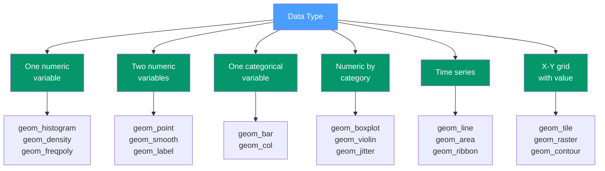

# 📊 Geometric Objects in ggplot2

> [!abstract] TL;DR
> Geoms are the geometric shapes ggplot2 draws: points, bars, lines, boxes, tiles, ribbons. Choosing the right geom means matching the shape to the data story — distributions need histograms or density plots, comparisons need bars or points, relationships need scatter or smooth. ggplot2 has 40+ geoms; mastering a core dozen covers 90% of real-world charts.

## Intuition — analogy FIRST

A geom is the answer to: "If I had to draw this data by hand on paper, what shape would I draw?" Counts become bars. Individual observations become dots. A distribution becomes a smooth curve. A trend over time becomes a line. Relationships between two numeric variables become a scatter of dots — or a smooth curve fitted through them.

Every geom in ggplot2 answers that "what shape?" question. Once you know which geom represents which data story, you know which function to use.

---

## How It Works



---

## Key Concepts / Details

### Geom Quick Reference

| Geom | Purpose | Key Aesthetics |
|------|---------|----------------|
| `geom_point` | Scatter plot, individual observations | x, y, colour, size, shape, alpha |
| `geom_line` | Lines connecting observations in order | x, y, colour, linetype, group |
| `geom_path` | Lines connecting in data order | x, y, group |
| `geom_step` | Staircase line (for CDFs, discrete steps) | x, y, direction |
| `geom_bar` | Bar chart from raw data (counts rows) | x, fill |
| `geom_col` | Bar chart from pre-computed values | x, y, fill |
| `geom_histogram` | Distribution of one numeric variable | x, fill, binwidth |
| `geom_density` | Smooth distribution estimate | x, colour, fill |
| `geom_freqpoly` | Frequency polygon (like histogram but lines) | x, colour |
| `geom_boxplot` | Five-number summary + outliers | x, y, colour, fill |
| `geom_violin` | Distribution shape per group | x, y, fill |
| `geom_jitter` | Scatter with random noise (avoid overplotting) | x, y, width, height |
| `geom_smooth` | Trend line with confidence band | x, y, method, se |
| `geom_tile` | Heatmap with discrete bins | x, y, fill |
| `geom_raster` | Heatmap (faster, equal-size cells) | x, y, fill |
| `geom_ribbon` | Filled area between ymin and ymax | x, ymin, ymax, fill |
| `geom_area` | Filled area below a line | x, y, fill |
| `geom_text` | Text labels at data positions | x, y, label |
| `geom_label` | Text with background box | x, y, label, fill |
| `geom_hline` | Horizontal reference line | yintercept |
| `geom_vline` | Vertical reference line | xintercept |
| `geom_abline` | Diagonal reference line | slope, intercept |

### Distribution Geoms

```r
library(ggplot2)

# Histogram: choose binwidth carefully (default often misleading)
ggplot(diamonds, aes(x = price)) +
  geom_histogram(binwidth = 500, fill = "#4a9eff", colour = "white")

# Density: smooth estimate; fill + alpha for overlapping distributions
ggplot(diamonds, aes(x = price, fill = cut)) +
  geom_density(alpha = 0.4) +
  scale_fill_brewer(palette = "Set2")

# Overlaid histogram + density (requires after_stat for y-axis alignment)
ggplot(mtcars, aes(x = mpg)) +
  geom_histogram(aes(y = after_stat(density)), binwidth = 2,
                 fill = "steelblue", alpha = 0.7) +
  geom_density(colour = "darkred", linewidth = 1)
```

### Comparison Geoms

```r
# Boxplot: Tukey's five-number summary
# Box = Q1 to Q3 (IQR), line = median
# Whiskers extend to Q1 - 1.5*IQR and Q3 + 1.5*IQR
# Points beyond whiskers are outliers
ggplot(mpg, aes(x = class, y = hwy)) +
  geom_boxplot(fill = "#4a9eff", alpha = 0.7) +
  coord_flip()

# Violin + boxplot layered: show distribution shape AND summary
ggplot(mpg, aes(x = class, y = hwy)) +
  geom_violin(fill = "#4a9eff", alpha = 0.4) +
  geom_boxplot(width = 0.1, fill = "white")

# geom_jitter: reveal individual points obscured by overplotting
ggplot(mpg, aes(x = class, y = hwy)) +
  geom_jitter(width = 0.2, height = 0, alpha = 0.5, colour = "steelblue")
```

### geom_point — Shape Codes 21–25

Shapes 21–25 have a **fill** interior and a separate **colour** border, enabling two-variable encoding.

```r
ggplot(mtcars, aes(x = wt, y = mpg)) +
  geom_point(
    aes(fill = factor(cyl), size = hp),
    shape  = 21,          # filled circle with border
    colour = "white",     # border colour
    alpha  = 0.85
  ) +
  scale_fill_brewer(palette = "Dark2") +
  scale_size_area(max_size = 10)   # area ∝ value (honest bubble chart)
```

### Trend and Smooth Geoms

```r
# geom_smooth with different methods
ggplot(mpg, aes(x = displ, y = hwy)) +
  geom_point(alpha = 0.4) +
  geom_smooth(method = "lm",   colour = "red",  se = TRUE)  +  # linear
  geom_smooth(method = "loess",colour = "blue", se = FALSE)     # LOESS

# Turn off standard error band
geom_smooth(method = "lm", se = FALSE)

# Use a custom formula
geom_smooth(method = "lm", formula = y ~ poly(x, 2))  # quadratic
```

### Time Series Geoms

```r
# geom_line requires ordered x and correct group aesthetic
economics |>
  ggplot(aes(x = date, y = unemploy)) +
  geom_line(colour = "#4a9eff") +
  geom_area(fill = "#4a9eff", alpha = 0.2)

# geom_ribbon: confidence bands / forecast intervals
forecast_df |>
  ggplot(aes(x = date)) +
  geom_ribbon(aes(ymin = lower, ymax = upper), fill = "steelblue", alpha = 0.3) +
  geom_line(aes(y = forecast), colour = "steelblue")
```

### Heatmap Geoms

```r
# geom_tile: for discrete x and y grids
corr_mat <- cor(mtcars) |>
  as.data.frame() |>
  tibble::rownames_to_column("var1") |>
  tidyr::pivot_longer(-var1, names_to = "var2", values_to = "corr")

ggplot(corr_mat, aes(x = var1, y = var2, fill = corr)) +
  geom_tile() +
  scale_fill_gradient2(low = "#dc2626", high = "#2563eb", mid = "white", midpoint = 0) +
  theme(axis.text.x = element_text(angle = 45, hjust = 1))
```

### Annotation Geoms

```r
# Reference lines
ggplot(mtcars, aes(x = wt, y = mpg)) +
  geom_point() +
  geom_hline(yintercept = mean(mtcars$mpg), linetype = "dashed", colour = "red") +
  geom_vline(xintercept = mean(mtcars$wt),  linetype = "dashed", colour = "blue")

# Text labels (avoid overlap with ggrepel)
library(ggrepel)
ggplot(mtcars, aes(x = wt, y = mpg, label = rownames(mtcars))) +
  geom_point() +
  geom_text_repel(size = 3, max.overlaps = 15)
```

---

## Real-World Notes

- **Always set `binwidth` for `geom_histogram`** — the default is 30 bins which is often too many for small datasets and too few for large ones.
- **Layer boxplots over violin plots** — violins show the full distribution shape; boxplots provide the familiar five-number summary. Together they're more informative than either alone.
- **`scale_size_area` for bubble charts** — human perception maps the *area* of a circle to quantity, not the radius. `scale_size_area` ensures honest mapping (default `scale_size` maps to radius).
- **`geom_raster` is faster than `geom_tile`** for continuous grids — use `tile` when cells have irregular sizes, `raster` otherwise.

---

## Common Pitfalls

1. **`geom_line` with no `group` aesthetic** when data has multiple series — every point may connect to every other point. Add `aes(group = series_id)`.
2. **Using `geom_bar` when you have pre-computed values** — `geom_bar` counts rows; use `geom_col` for pre-computed values with a `y` aesthetic.
3. **Overplotting without `alpha`** — dense scatter plots hide data. Use `alpha = 0.3` or `geom_jitter` or `geom_bin2d` for large datasets.
4. **`geom_smooth` hiding the confidence band** — by default `se = TRUE` shows a 95% confidence band; set `se = FALSE` only when the band is genuinely not meaningful.
5. **`geom_text` labels overlapping** — use `ggrepel::geom_text_repel()` or `geom_label_repel()` to automatically avoid collisions.

---

## Related Concepts

- [[_MOC_ggplot2|↑ Section MOC]]
- [[ggplot2_Grammar_of_Graphics]] — The conceptual framework that makes geom choices predictable
- [[Scales_and_Themes]] — Controlling colors, axis ranges, and visual appearance of geoms
- [[Faceting_and_Grouping]] — Displaying multiple geom panels by category

---

## Review Questions

1. What is the difference between `geom_bar` and `geom_col`? When would you use each?
2. What are the five numbers in a boxplot, and where do the whiskers extend to?
3. Why should you use `scale_size_area` instead of `scale_size` for bubble charts?
4. How do you add a linear trend line through a scatter plot, and how do you hide the confidence band?
5. What does `after_stat(density)` do in a `geom_histogram` call?

---

## Sources

- Wickham H., *ggplot2: Elegant Graphics for Data Analysis* (3e), Ch. 3-5 — https://ggplot2-book.org
- ggplot2 reference — https://ggplot2.tidyverse.org/reference/
- Healy K., *Data Visualization: A Practical Introduction* — https://socviz.co

#r-programming #ggplot2 #visualization #geoms
