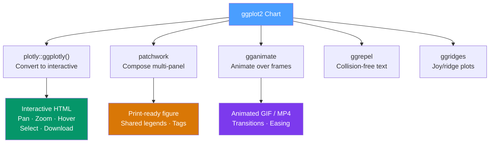

# 🖱️ Interactive Plots with plotly

> [!abstract] TL;DR
> **plotly** adds pan/zoom/hover interactivity to ggplot2 charts via `ggplotly()` or through its own `plot_ly()` API. **patchwork** composes multiple plots into one figure with `+`, `/`, and `|` operators. **gganimate** creates frame-based animations with `transition_*` functions. **ggrepel** prevents text label collisions. Together these extensions take ggplot2 from exploratory static charts to presentation and publication-ready output.

## Intuition — analogy FIRST

A static ggplot2 chart is a **photograph** — it captures one view perfectly but you can't zoom into a corner or hover to see exact values. `ggplotly()` converts that photograph into a **zoomable, pannable map** with hover tooltips, all with one function call.

patchwork is **layout software** for plots: the `+` operator places plots side-by-side like columns, `/` stacks them as rows, and `|` creates explicit side-by-side arrangements with more control than `+`. Think of it as the ggplot2 equivalent of a multi-panel figure in a journal paper.

---

## How It Works



---

## Key Concepts / Details

### plotly — Converting ggplot2 to Interactive

```r
library(ggplot2)
library(plotly)

# Build a static ggplot2 chart
p <- ggplot(mpg, aes(x = displ, y = hwy, colour = class,
                      text = paste("Model:", manufacturer, model))) +
  geom_point(alpha = 0.7) +
  labs(title = "Engine Size vs Fuel Efficiency", x = "Displacement (L)", y = "MPG") +
  theme_minimal()

# Convert to interactive plotly chart
ggplotly(p, tooltip = c("x", "y", "text"))

# Remove the plotly mode bar buttons you don't need
ggplotly(p) |>
  config(modeBarButtonsToRemove = c("pan2d", "lasso2d", "select2d"),
         displaylogo = FALSE)
```

**What ggplotly adds automatically:**
- Hover tooltips with mapped aesthetic values
- Pan and zoom (double-click to reset)
- Clickable legend entries to show/hide series
- PNG download button
- Box and lasso selection tools

### Native plotly API — plot_ly()

For charts that ggplotly can't handle well (3D surfaces, animations with sliders, etc.):

```r
library(plotly)

# Native plotly scatter
plot_ly(
  data   = mpg,
  x      = ~displ,
  y      = ~hwy,
  color  = ~class,
  type   = "scatter",
  mode   = "markers",
  text   = ~paste("Model:", model, "<br>MPG:", hwy),
  hoverinfo = "text"
) |>
  layout(
    title  = "Engine Size vs Fuel Efficiency",
    xaxis  = list(title = "Displacement (L)"),
    yaxis  = list(title = "Highway MPG")
  )

# Animated bar chart with a time slider
plot_ly(
  gapminder, x = ~gdpPercap, y = ~lifeExp,
  size = ~pop, color = ~continent,
  frame = ~year,                        # creates the animation slider
  type = "scatter", mode = "markers"
) |>
  animation_opts(1000, easing = "elastic", redraw = FALSE)
```

### patchwork — Composing Multi-Panel Figures

```r
library(patchwork)

p1 <- ggplot(mtcars, aes(x = wt,  y = mpg)) + geom_point() + theme_minimal()
p2 <- ggplot(mtcars, aes(x = hp,  y = mpg)) + geom_point() + theme_minimal()
p3 <- ggplot(mtcars, aes(x = cyl, y = mpg)) + geom_boxplot(aes(group = cyl)) + theme_minimal()
p4 <- ggplot(mtcars, aes(x = mpg))          + geom_histogram(binwidth = 3) + theme_minimal()

# Side-by-side (same as |)
p1 + p2

# Stacked
p1 / p2

# Complex layouts
(p1 | p2) / p3  # top row has two plots, bottom row has one

# Specify exact areas
p1 + p2 + p3 + p4 +
  plot_layout(ncol = 2)

# Collect legends from all plots into one
p1 + p2 + plot_layout(guides = "collect")

# Add figure-level annotations and tags
(p1 | p2) / p3 +
  plot_annotation(
    title     = "Motor Trends Car Dataset",
    subtitle  = "Relationships between fuel efficiency and car attributes",
    caption   = "Source: mtcars dataset",
    tag_levels = "A"  # adds A, B, C labels to each panel
  )
```

### gganimate — Frame-Based Animation

```r
library(gganimate)
library(gapminder)

# Static base plot
p <- ggplot(gapminder, aes(x = gdpPercap, y = lifeExp,
                             size = pop, colour = continent)) +
  geom_point(alpha = 0.7, show.legend = FALSE) +
  scale_x_log10(labels = scales::label_dollar()) +
  scale_size(range = c(2, 12)) +
  labs(title = "Year: {frame_time}", x = "GDP per Capita", y = "Life Expectancy") +
  theme_minimal()

# Add animation transition
animated <- p +
  transition_time(year) +                          # transitions over year variable
  ease_aes("linear") +                             # easing function for transitions
  shadow_wake(wake_length = 0.1, alpha = FALSE)    # trail effect

# Render
animate(animated, fps = 10, duration = 15, width = 800, height = 500)
anim_save("gapminder.gif")
```

**Key `transition_*` functions:**

| Function | Use Case |
|----------|---------|
| `transition_time(time_var)` | Continuous time variable (most common) |
| `transition_states(cat_var)` | Discrete categories/states |
| `transition_reveal(time_var)` | Reveal a line progressively |
| `transition_filter(...)` | Filter data to different subsets |

**Enter/exit functions:**

```r
# How observations appear and disappear
animated + 
  enter_fade() +    # fade in when new observation appears
  exit_shrink()     # shrink when observation disappears
```

### ggrepel — Collision-Free Text Labels

```r
library(ggrepel)

mtcars_named <- mtcars
mtcars_named$car <- rownames(mtcars)

ggplot(mtcars_named, aes(x = wt, y = mpg, label = car)) +
  geom_point(colour = "steelblue") +
  geom_text_repel(
    size         = 3,
    max.overlaps = 15,        # allow up to 15 overlaps before giving up
    box.padding  = 0.3,       # space between label and data point
    segment.color = "grey60"  # color of the leader line
  )

# geom_label_repel: text with background box
ggplot(mtcars_named, aes(x = wt, y = mpg, label = car)) +
  geom_point() +
  geom_label_repel(
    fill   = alpha("white", 0.8),
    colour = "black",
    size   = 2.5
  )
```

### ggridges — Ridge/Joy Plots

```r
library(ggridges)

ggplot(diamonds, aes(x = price, y = cut, fill = cut)) +
  geom_density_ridges(
    alpha       = 0.7,
    scale       = 1.2,         # overlap between ridges (>1 = overlap)
    bandwidth   = 200,
    show.legend = FALSE
  ) +
  scale_fill_viridis_d() +
  theme_ridges() +
  labs(title = "Diamond Price Distribution by Cut")
```

---

## Real-World Notes

- **`ggplotly` is the fastest path to interactivity** — works for 90% of use cases. Use native `plot_ly()` only for 3D plots, complex animations with sliders, or choropleth maps.
- **patchwork replaces cowplot and gridExtra** for almost all multi-plot layout needs — simpler API and better integration with ggplot2 themes.
- **gganimate is for presentations, not reports** — animations require screen rendering; for PDFs use faceting instead.
- **Shiny + plotly** is the combination for interactive data apps — plotly handles the chart interactivity; Shiny handles reactive filtering and server-side computation.

---

## Common Pitfalls

1. **`ggplotly` losing custom theme elements** — some `theme()` overrides don't transfer. Inspect with `ggplotly(p, tooltip = c("x", "y"))` and fix what's lost with `layout()`.
2. **gganimate rendering slowly** — reduce `nframes` or `fps`; use `renderer = gifski_renderer()` which is faster than the default.
3. **patchwork layout confusion with `+` vs `|`** — `p1 + p2 + p3` puts all three in a row; `(p1 + p2) / p3` puts the first two on top and the third below.
4. **`geom_text_repel` with too many labels** — above ~50 labels, reduce with `max.overlaps = Inf` and `force = 5`, or only label the most important points.
5. **`transition_time` with discrete time** — use `transition_states` for discrete categories, not `transition_time` (which expects a continuous numeric/POSIXct variable).

---

## Related Concepts

- [[_MOC_ggplot2|↑ Section MOC]]
- [[ggplot2_Grammar_of_Graphics]] — The base layer that all extensions build on
- [[Shiny_Applications]] — Embed interactive plotly charts in Shiny reactive apps
- [[Faceting_and_Grouping]] — Static alternative to animation for most comparison tasks

---

## Review Questions

1. What does `ggplotly(p, tooltip = c("x", "y", "text"))` do and how do you customize the hover text?
2. How do you arrange two plots side-by-side and one below them using patchwork?
3. What is the difference between `transition_time` and `transition_states` in gganimate?
4. What does `plot_annotation(tag_levels = "A")` add to a patchwork composition?
5. Why might you prefer `geom_label_repel` over `geom_text_repel`?

---

## Sources

- plotly for R documentation — https://plotly.com/r/
- patchwork documentation — https://patchwork.data-imaginist.com/
- gganimate documentation — https://gganimate.com/reference/
- ggrepel documentation — https://ggrepel.slowkow.com/

#r-programming #ggplot2 #visualization #plotly #interactive
