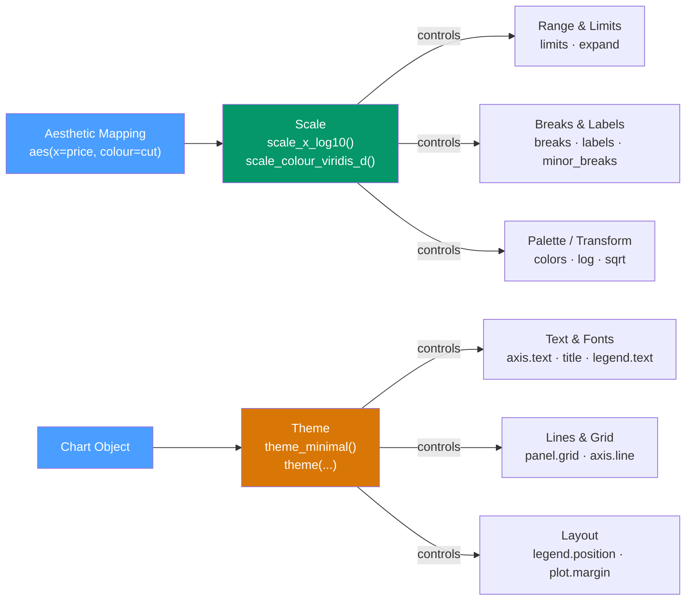

# 🎭 Scales and Themes in ggplot2

> [!abstract] TL;DR
> **Scales** control how data values map to visual properties — axis ranges, color palettes, size ranges. They follow the naming pattern `scale_<aesthetic>_<type>()`. **Themes** control non-data visual appearance — fonts, grid lines, legend position, background. Together, they take a functional chart to publication-ready output. Use viridis for colorblind-safe continuous palettes, `coord_cartesian` for safe zooming, and `ggsave(dpi=300)` for print-ready export.

## Intuition — analogy FIRST

Scales are the **legend**. If `colour = species` maps species to colors, the scale decides *which* colors and how the legend is labeled. If `x = price` maps price to x-position, the scale decides the axis range, breaks, and number formatting.

Themes are the **design system** — the fonts, colors of the background, grid line weight, and whether a legend appears. They're orthogonal to the data: you can apply any theme to any chart.

---

## How It Works



---

## Key Concepts / Details

### The scale_<aesthetic>_<type>() Pattern

Every scale function follows: `scale_` + aesthetic name + `_` + data type/transformation.

```r
scale_x_continuous()      # continuous numeric x axis
scale_x_discrete()        # discrete / factor x axis
scale_x_log10()           # log10-transformed x axis
scale_x_date()            # Date or POSIXct x axis
scale_x_reverse()         # reversed continuous axis

scale_colour_manual()     # manually specified colours
scale_colour_viridis_c()  # viridis palette for continuous colour
scale_colour_viridis_d()  # viridis palette for discrete colour
scale_colour_brewer()     # ColorBrewer palettes (discrete)
scale_colour_gradient2()  # diverging two-colour gradient
scale_fill_manual()       # same but for fill aesthetic

scale_size_area()         # area (not radius) proportional to value
scale_alpha_continuous()  # alpha proportional to value
```

### Axis Scales — Limits, Breaks, Labels

```r
library(ggplot2)
library(scales)

ggplot(diamonds, aes(x = carat, y = price)) +
  geom_point(alpha = 0.1) +
  scale_x_continuous(
    limits = c(0, 3),
    breaks = seq(0, 3, by = 0.5),
    labels = scales::label_number(suffix = " ct")
  ) +
  scale_y_continuous(
    labels = scales::label_dollar(scale = 1e-3, suffix = "K"),
    trans  = "log10"
  )

# Date scale
ggplot(economics, aes(x = date, y = unemploy)) +
  geom_line() +
  scale_x_date(date_breaks = "5 years", date_labels = "%Y")
```

### Color Palettes — Three Families

**Sequential** (one hue, varying lightness) — for ordered continuous data:

```r
# Viridis: perceptually uniform, colorblind-safe, works in grayscale
ggplot(diamonds, aes(x = carat, y = price, colour = depth)) +
  geom_point(alpha = 0.3) +
  scale_colour_viridis_c(option = "plasma")  # options: magma, inferno, plasma, viridis, cividis

# Other sequential palettes
scale_colour_gradient(low = "white", high = "darkblue")
```

**Diverging** (two hues meeting at a neutral midpoint) — for data with a meaningful center:

```r
# gradient2: custom diverging palette with explicit midpoint
ggplot(corr_data, aes(x = var1, y = var2, fill = correlation)) +
  geom_tile() +
  scale_fill_gradient2(
    low      = "#dc2626",  # red for negative
    high     = "#2563eb",  # blue for positive
    mid      = "white",
    midpoint = 0,
    limits   = c(-1, 1)
  )
```

**Qualitative** (distinct hues) — for unordered categories:

```r
# ColorBrewer qualitative palettes
scale_colour_brewer(palette = "Set2")    # up to 8 categories, colorblind-friendly
scale_colour_brewer(palette = "Dark2")   # darker, more distinct
scale_fill_manual(values = c("#4a9eff", "#ff6b6b", "#ffd93d", "#6bcb77"))
```

### coord_cartesian vs scale limits

This is a critical distinction:

```r
# WRONG approach: setting limits in the scale DROPS data before stats run
# → geom_smooth is fitted only on the subset of data within limits
ggplot(diamonds, aes(x = carat, y = price)) +
  geom_point() +
  geom_smooth() +
  scale_x_continuous(limits = c(0.5, 2.5))  # DROPS data; smooth changes!

# CORRECT approach: coord_cartesian clips the view without dropping data
ggplot(diamonds, aes(x = carat, y = price)) +
  geom_point() +
  geom_smooth() +
  coord_cartesian(xlim = c(0.5, 2.5))  # just zooms in; smooth uses all data
```

**Rule:** Use `coord_cartesian` for zooming/panning. Use scale `limits` only when you genuinely want to exclude data.

### Coordinate Systems

```r
# coord_flip: swap x and y (better for long category names)
ggplot(mpg, aes(y = class, x = hwy)) + geom_boxplot()  # modern way (just use y=class)
ggplot(mpg, aes(x = class, y = hwy)) + geom_boxplot() + coord_flip()  # legacy way

# coord_polar: for pie charts and radar charts
ggplot(mpg, aes(x = factor(1), fill = class)) +
  geom_bar() +
  coord_polar(theta = "y")  # creates a pie chart

# coord_sf: for maps (requires sf package)
library(sf)
ggplot(us_states) + geom_sf() + coord_sf(crs = 4326)
```

### Themes — Built-in Options

| Theme | Description |
|-------|-------------|
| `theme_grey()` | Default — grey background, white grid lines |
| `theme_bw()` | White background, black grid lines |
| `theme_classic()` | White background, no grid, axis lines |
| `theme_minimal()` | White background, minimal grid, no axis lines |
| `theme_void()` | Empty — for maps and network diagrams |
| `theme_dark()` | Dark background for presentations |
| `theme_light()` | Light grey axes, white background |

```r
# Set a default theme for the session
theme_set(theme_minimal(base_size = 12, base_family = "sans"))

# Override specific elements
ggplot(mtcars, aes(x = wt, y = mpg)) +
  geom_point() +
  theme_minimal() +
  theme(
    legend.position    = "bottom",
    panel.grid.minor   = element_blank(),
    plot.title         = element_text(face = "bold", size = 14),
    axis.text          = element_text(size = 10),
    strip.background   = element_rect(fill = "#f0f0f0"),
    plot.margin        = margin(10, 10, 10, 10, "pt")
  )
```

### guides() — Customizing Legends

```r
ggplot(mpg, aes(x = displ, y = hwy, colour = cty, size = cyl)) +
  geom_point() +
  guides(
    colour = guide_colourbar(barwidth = 10, barheight = 0.5,
                              title.position = "top"),  # continuous colour bar
    size   = guide_legend(override.aes = list(alpha = 1))  # discrete size legend
  )
```

### ggsave — Export for Print

```r
p <- ggplot(mtcars, aes(x = wt, y = mpg)) + geom_point()

# High-resolution raster for digital use
ggsave("output/plot.png", plot = p, width = 8, height = 5, dpi = 300)

# Vector for print / journals (scales without pixelation)
ggsave("output/plot.pdf", plot = p, width = 8, height = 5, device = cairo_pdf)
ggsave("output/plot.svg", plot = p, width = 8, height = 5)

# Custom fonts via showtext (must call showtext_auto() first)
library(showtext)
font_add_google("Roboto", "Roboto")
showtext_auto()
ggsave("output/fancy_plot.png", dpi = 300)
```

---

## Real-World Notes

- **viridis is the safe default for continuous color** — perceptually uniform, colorblind-safe, and prints correctly in grayscale. Use it unless you have a specific reason for another palette.
- **`scales` package** provides formatter functions (`label_dollar`, `label_percent`, `label_comma`, `label_number`) that work seamlessly with scale `labels` arguments.
- **`oob = scales::oob_squish`** prevents out-of-bounds values from being shown as grey in color scales — they're squished to the nearest boundary instead.
- **`theme_set()` + project-level custom theme** is the professional approach — define one `my_theme` function at the top of every script and call `theme_set(my_theme())`.

---

## Common Pitfalls

1. **`scale_colour_*` vs `scale_fill_*`** — points and lines use `colour`; bars, ribbons, and polygons use `fill`. Both are separate aesthetics and need separate scales.
2. **Using scale limits for zooming** — always use `coord_cartesian` for visual zooming; scale limits filter data before stats, breaking smoothers and summaries.
3. **`theme()` before `theme_*()` is overwritten** — apply complete themes first, then add `theme()` overrides.
4. **Not setting `base_size`** in `theme_*()` — the default font size (11pt) is often too small for presentations. Use `theme_minimal(base_size = 14)`.
5. **Forgetting `expand = c(0, 0)`** in axis scales — by default ggplot2 adds 5% padding; remove it for bar charts that should touch the x-axis.

---

## Related Concepts

- [[_MOC_ggplot2|↑ Section MOC]]
- [[ggplot2_Grammar_of_Graphics]] — Scales are the sixth component of the grammar
- [[Geometric_Objects]] — Scale choices depend on which geom and aesthetic you're using
- [[Interactive_Plots_plotly]] — Themes transfer to plotly via `ggplotly()`

---

## Review Questions

1. Explain the `scale_<aesthetic>_<type>()` naming pattern. Give three examples.
2. What is the difference between `coord_cartesian(xlim = c(0, 3))` and `scale_x_continuous(limits = c(0, 3))`?
3. What are the three color palette families and when do you use each?
4. Why is viridis preferred over a simple `scale_colour_gradient(low="blue", high="red")`?
5. How do you apply a minimal theme globally for a session and then override one specific element?

---

## Sources

- Wickham H., *ggplot2: Elegant Graphics for Data Analysis* (3e), Ch. 10–12 — https://ggplot2-book.org
- scales package documentation — https://scales.r-lib.org/reference/
- viridis package — https://sjmgarnier.github.io/viridis/

#r-programming #ggplot2 #visualization #scales #themes
