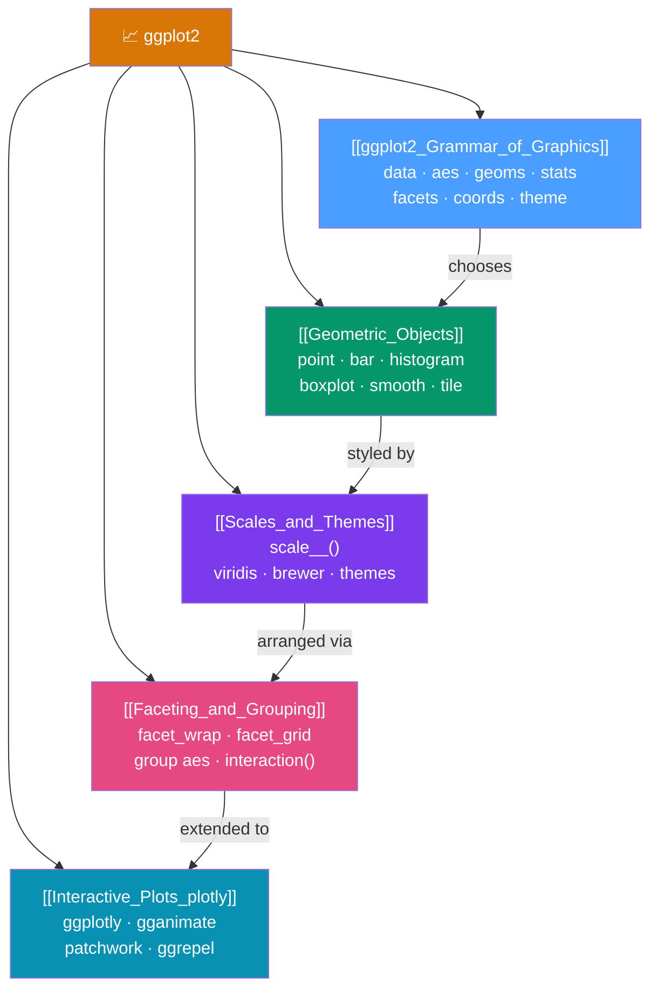

# 📈 ggplot2 Visualization — Map of Content

> [!abstract] What This Section Covers
> ggplot2 implements Wilkinson's **Grammar of Graphics**: every chart is assembled from independent, composable components stacked with `+`. This means any chart type comes from the same grammar and changes are additive edits rather than rewrites. This section covers the seven grammar components, the 40+ geom library, scales and coordinate systems, theme customization for publication-ready output, faceting for multi-panel plots, and interactive extensions (plotly, gganimate, patchwork).

## Concept Map

## Learning Path

1. [[ggplot2_Grammar_of_Graphics]] — Learn the seven components and `aes()` mapping — this is the conceptual foundation for everything else.
2. [[Geometric_Objects]] — Explore the geom library: which geom to choose for which data type and story.
3. [[Scales_and_Themes]] — Control colors, axes, labels, and overall appearance for publication-ready output.
4. [[Faceting_and_Grouping]] — Build multi-panel displays with `facet_wrap` and `facet_grid`.
5. [[Interactive_Plots_plotly]] — Add interactivity, animation, and multi-plot layouts with extensions.

## All Notes at a Glance

| Note | Difficulty | What You'll Learn |
|------|------------|-------------------|
| [[ggplot2_Grammar_of_Graphics]] | Beginner | The 7 grammar components, aes() mapping, layer ordering, position adjustments |
| [[Geometric_Objects]] | Beginner | 20+ geom types and when to use each — points, bars, histograms, boxplots, heatmaps |
| [[Scales_and_Themes]] | Intermediate | scale_<aes>_<type>() pattern, viridis/brewer palettes, coord_cartesian, built-in themes, ggsave |
| [[Faceting_and_Grouping]] | Intermediate | facet_wrap vs facet_grid, free scales, labellers, group aesthetic, nested faceting |
| [[Interactive_Plots_plotly]] | Intermediate | ggplotly conversion, gganimate transitions, patchwork layouts, ggrepel text |

## Key Questions This Section Answers

- What is the Grammar of Graphics and why does it make chart editing easier?
- What is the difference between mapping a variable in `aes()` vs setting a constant outside `aes()`?
- Which geom should I use for: distributions? Counts? Relationships? Time series?
- How do I use a colorblind-safe palette?
- When should I use `coord_cartesian(ylim = ...)` instead of `scale_y_continuous(limits = ...)`?
- What is the difference between `facet_wrap` and `facet_grid`?
- How do I convert a ggplot2 chart to an interactive plotly chart?

## Related Sections

- [[_MOC_R_Programming_Master|↑ R Programming Master MOC]]
- [[_MOC_Tidyverse|← Tidyverse]] — The tidy data that ggplot2 consumes
- [[_MOC_Statistical_Analysis|→ Statistical Analysis]] — Statistical plots (Q-Q, residual, KM curves) built with ggplot2
- [[_MOC_ML_in_R|→ ML in R]] — SHAP plots, ROC curves, feature importance via ggplot2

#MOC #r-programming #ggplot2
