# 🎨 ggplot2 Grammar of Graphics

> [!abstract] TL;DR
> ggplot2 implements Wilkinson's Grammar of Graphics: a chart is built by stacking seven independent components — data, aesthetics, geoms, stats, facets, coordinates, and theme — with `+`. This grammar means you change one component to change the chart, and the mental model transfers to every chart type in the library.

## Intuition — analogy FIRST

Writing a chart in base R is like writing a single monolithic sentence: everything is tangled together and changing one word often rewrites the whole thing.

ggplot2 is like describing a chart in plain language: "take **this data**, map **these variables** to visual channels (x, y, color), draw **this shape** for each observation, arrange them in a **grid of panels** by category, and apply **this visual style**." Each English clause is a grammar component. You add, remove, or swap one component without touching the rest.

---

## How It Works

```mermaid
graph LR
    Data["1. Data\ndata.frame / tibble"] --> Aes["2. Aesthetics\naes(x, y, colour, fill\nsize, shape, alpha)"]
    Aes --> Geom["3. Geoms\ngeom_point · geom_bar\ngeom_line · geom_boxplot"]
    Geom --> Stat["4. Stats\nstat_identity · stat_count\nstat_bin · stat_smooth"]
    Stat --> Facet["5. Facets\nfacet_wrap · facet_grid"]
    Facet --> Coord["6. Coordinates\ncoord_cartesian · coord_flip\ncoord_polar · coord_sf"]
    Coord --> Theme["7. Theme\ntheme_minimal · theme()\ntext · lines · backgrounds"]

    style Data fill:#4a9eff,color:#fff
    style Aes fill:#059669,color:#fff
    style Geom fill:#d97706,color:#fff
    style Stat fill:#7c3aed,color:#fff
    style Facet fill:#e64980,color:#fff
    style Coord fill:#0891b2,color:#fff
    style Theme fill:#6b7280,color:#fff
```



---

## Key Concepts / Details

### The Seven Grammar Components

| Component | Function | Example |
|-----------|----------|---------|
| **Data** | The data frame to visualize | `ggplot(data = mtcars)` |
| **Aesthetics** | Map variables to visual channels | `aes(x = mpg, y = hp, colour = cyl)` |
| **Geoms** | The geometric shape for each observation | `geom_point()`, `geom_bar()` |
| **Stats** | Statistical transformation applied before drawing | `stat_bin()` (for histograms), `stat_smooth()` |
| **Facets** | Split into a grid of panels | `facet_wrap(~ cyl)` |
| **Coordinates** | The coordinate system | `coord_flip()`, `coord_polar()` |
| **Theme** | Non-data visual appearance | `theme_minimal()`, `theme(legend.position = "bottom")` |

### Building a Plot Layer by Layer

```r
library(ggplot2)

# Step 1: data + aesthetics (creates an empty canvas with axes)
p <- ggplot(data = mpg, aes(x = displ, y = hwy))

# Step 2: add a geom layer (now you see points)
p <- p + geom_point()

# Step 3: add colour mapping
p <- p + aes(colour = class)

# Step 4: add a smooth trend line (another layer)
p <- p + geom_smooth(method = "lm", se = FALSE)

# Step 5: facet by drive type
p <- p + facet_wrap(~ drv)

# Step 6: apply a theme
p <- p + theme_minimal() + labs(title = "Engine Size vs Fuel Efficiency")
```

### aes() — Mapping Variables to Visual Channels

`aes()` maps **data variables** to **visual properties**. The most important rule:

- **Inside `aes()`**: maps a column to a visual property (varies with data)
- **Outside `aes()`**: sets a constant (same for all observations)

```r
# WRONG: colour = "blue" inside aes() creates a factor with one level called "blue"
ggplot(mtcars, aes(x = mpg, y = hp, colour = "blue")) + geom_point()

# CORRECT: colour constant goes outside aes()
ggplot(mtcars, aes(x = mpg, y = hp)) + geom_point(colour = "blue")

# CORRECT: map a variable to colour (each car class gets a different colour)
ggplot(mpg, aes(x = displ, y = hwy, colour = class)) + geom_point()
```

**Key aesthetic channels:**

| Aesthetic | Common geoms | Notes |
|-----------|-------------|-------|
| `x`, `y` | All | Primary position channels |
| `colour` | Point, line, text | Border/stroke color |
| `fill` | Bar, ribbon, polygon | Interior fill color |
| `size` | Point, line width | Scale with `scale_size_area` for honest bubbles |
| `shape` | Point | 25 built-in shapes; 21–25 have both colour and fill |
| `alpha` | All | Transparency 0 (invisible) to 1 (opaque) |
| `group` | Line, polygon | For connecting observations (needed for lines!) |
| `linetype` | Line | Solid/dashed/dotted |

### Global vs Layer-Local Aesthetics

Aesthetics declared in `ggplot()` apply to all layers. Aesthetics in a geom apply only to that layer.

```r
# Global: both geom_point and geom_smooth use aes(colour = class)
ggplot(mpg, aes(x = displ, y = hwy, colour = class)) +
  geom_point() +
  geom_smooth(method = "lm")

# Layer-local: only geom_point gets the colour mapping
ggplot(mpg, aes(x = displ, y = hwy)) +
  geom_point(aes(colour = class)) +
  geom_smooth(method = "lm")  # one line for all data
```

### Stats and the stat = argument

Every geom has a default stat. `geom_bar` uses `stat_count` (counts rows); `geom_histogram` uses `stat_bin` (bins a continuous variable); `geom_point` uses `stat_identity` (no transformation).

```r
# geom_bar counts observations (uses stat_count internally)
ggplot(diamonds, aes(x = cut)) + geom_bar()

# geom_col uses pre-computed values (stat_identity)
summary_df |> ggplot(aes(x = category, y = mean_value)) + geom_col()

# Access computed variables from the stat with after_stat()
ggplot(diamonds, aes(x = price)) +
  geom_histogram(aes(y = after_stat(density)), binwidth = 500) +
  geom_density(colour = "red")
```

### Position Adjustments

```r
# dodge: place grouped bars side-by-side
ggplot(mpg, aes(x = class, fill = drv)) +
  geom_bar(position = "dodge")

# stack: stack grouped bars (default for bar + fill)
ggplot(mpg, aes(x = class, fill = drv)) +
  geom_bar(position = "stack")

# fill: stack and normalize to 100% (show proportions)
ggplot(mpg, aes(x = class, fill = drv)) +
  geom_bar(position = "fill")

# jitter: add noise to avoid overplotting
ggplot(mpg, aes(x = class, y = hwy)) +
  geom_point(position = position_jitter(width = 0.2, height = 0))
```

### Swapping Data with %+%

```r
base_plot <- ggplot(mtcars, aes(x = wt, y = mpg)) + geom_point()

# Replace the data without rebuilding the plot
new_plot <- base_plot %+% head(mtcars, 10)
```

---

## Real-World Notes

- **`+` is the `+.gg` S3 method**, not arithmetic. Layer order matters for drawing: layers added later are drawn on top.
- **Every ggplot2 object is a list** — `p$data`, `p$layers`, `p$mapping` are all accessible and modifiable, enabling programmatic plot construction.
- **`last_plot()`** retrieves the last rendered plot — useful for adding another layer after rendering.
- **The `labs()` function** is the canonical way to set titles, subtitles, captions, axis labels, and legend titles: `labs(title = ..., x = ..., y = ..., colour = ..., caption = ...)`.

---

## Common Pitfalls

1. **Mapping a constant inside `aes()`** — `aes(colour = "blue")` creates a legend for a variable called "blue", not a blue color. Constants go outside.
2. **Missing `group` aesthetic for lines** — `geom_line()` needs to know which observations belong to the same line. If points connect randomly, add `aes(group = id)`.
3. **`geom_bar` vs `geom_col`** — use `geom_bar()` for raw data (it counts), use `geom_col()` when you already have computed values.
4. **Adding layers after `coord_*`** — layer draw order follows addition order, but coordinate transformations apply uniformly. Don't confuse layer order with coordinate order.
5. **`theme()` before `theme_*()` is overwritten** — always apply complete themes (`theme_minimal()`) before `theme()` overrides; otherwise the complete theme resets your overrides.

---

## Related Concepts

- [[_MOC_ggplot2|↑ Section MOC]]
- [[Geometric_Objects]] — The geom library and which geometric shape fits your data story
- [[Scales_and_Themes]] — Controlling colors, axes, and visual appearance
- [[Faceting_and_Grouping]] — Multi-panel displays for comparisons
- [[dplyr_Data_Manipulation]] — Preparing tidy data for ggplot2

---

## Review Questions

1. What are the seven components of the Grammar of Graphics? Name one example for each.
2. What is the difference between `aes(colour = "red")` and setting `colour = "red"` outside `aes()`?
3. When does the `group` aesthetic matter? Give an example where omitting it causes a bug.
4. What is the difference between `geom_bar` and `geom_col`?
5. What does `position = "fill"` do in a `geom_bar` call?

---

## Sources

- Wickham H., *ggplot2: Elegant Graphics for Data Analysis* (3e) — https://ggplot2-book.org
- Wilkinson L., *The Grammar of Graphics* (2nd ed.) — Springer, 2005
- ggplot2 reference — https://ggplot2.tidyverse.org/reference/

#r-programming #ggplot2 #visualization
