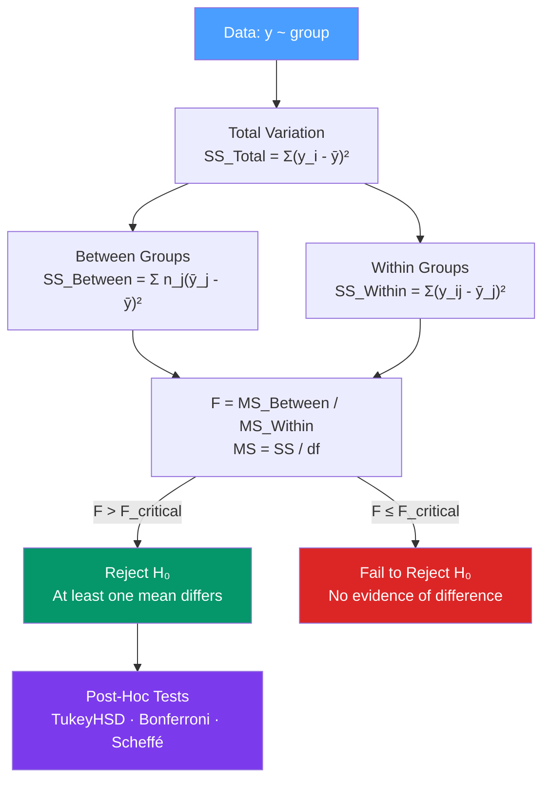

# 🔢 ANOVA in R

> [!abstract] TL;DR
> ANOVA (Analysis of Variance) tests whether the means of three or more groups differ significantly by partitioning total variance into between-group and within-group components. R's `aov()` function handles one-way and two-way designs; `TukeyHSD()` provides pairwise post-hoc comparisons; `kruskal.test()` is the non-parametric alternative. ANOVA and regression are both expressions of the same general linear model.

## Intuition — analogy FIRST

You've measured plant growth for three fertilizer types: A, B, and C. A t-test can only compare two groups at a time — running three t-tests inflates the false positive rate. ANOVA asks one unified question: "Is there any difference in mean growth across all three groups?"

It answers this by comparing two sources of variation: how much means **differ between groups** vs how much observations **vary within groups**. If between-group variance is large relative to within-group variance (high F ratio), at least one group mean differs. ANOVA says *something* differs — post-hoc tests (Tukey's HSD) then identify *which* pairs.

---

## How It Works



---

## Key Concepts / Details

### One-Way ANOVA

```r
# Create example data
plant_growth <- data.frame(
  weight = c(4.17, 5.58, 5.18, 6.11, 4.50, 4.61, 5.17, 4.53, 5.33, 5.14,  # ctrl
             4.81, 4.17, 4.41, 3.59, 5.87, 3.83, 6.03, 4.89, 4.32, 4.69,  # trt1
             6.31, 5.12, 5.54, 5.50, 5.37, 5.29, 4.92, 6.15, 5.80, 5.26), # trt2
  group  = rep(c("ctrl", "trt1", "trt2"), each = 10)
)

# Fit one-way ANOVA
fit_aov <- aov(weight ~ group, data = plant_growth)
summary(fit_aov)
# Df    Sum Sq  Mean Sq  F value  Pr(>F)
# group   2    3.766    1.883    4.846  0.0159 *
# Residuals  27   10.492   0.389

# The F-test: F = MS_between / MS_within = 1.883 / 0.389 = 4.846, p = 0.016
# At least one group mean differs

# ANOVA table with anova()
anova(lm(weight ~ group, data = plant_growth))  # same result, lm approach
```

### Post-Hoc Tests — Which Groups Differ?

A significant ANOVA F-test only tells you *something* differs. Post-hoc tests identify *which* pairs.

```r
# Tukey's Honest Significant Difference (HSD)
# Controls family-wise error rate; recommended for all pairwise comparisons
tukey_res <- TukeyHSD(fit_aov)
tukey_res
# $group
#             diff    lwr     upr     p adj
# trt1-ctrl  -0.371  -1.062   0.320   0.391   (not significant)
# trt2-ctrl   0.494  -0.197   1.185   0.213   (not significant)  
# trt2-trt1   0.865   0.174   1.556   0.012 * (trt2 > trt1)

# Visualize Tukey intervals
plot(tukey_res)

# Alternative: Bonferroni correction (more conservative)
pairwise.t.test(plant_growth$weight, plant_growth$group, p.adjust.method = "bonferroni")

# Scheffé's test: most conservative; good for non-planned comparisons
library(DescTools)
ScheffeTest(fit_aov)
```

### Two-Way ANOVA — Two Factors

```r
# Two-way ANOVA with interaction
fit_2way <- aov(mpg ~ factor(cyl) * factor(am), data = mtcars)
summary(fit_2way)
# factor(cyl)                 Df  Sum Sq  Mean Sq  F value   Pr(>F)
# factor(am)                  Df  Sum Sq  Mean Sq  F value   Pr(>F)
# factor(cyl):factor(am)      Df  Sum Sq  Mean Sq  F value   Pr(>F)  ← interaction

# Interaction plot: visualize whether effect of one factor depends on the other
interaction.plot(
  x.factor    = mtcars$cyl,
  trace.factor = mtcars$am,
  response    = mtcars$mpg,
  fun         = mean,
  type        = "b",
  col         = c("red", "blue"),
  xlab        = "Number of Cylinders",
  ylab        = "Mean MPG",
  trace.label = "Transmission"
)
# Non-parallel lines = interaction exists
```

### Repeated Measures ANOVA

When the same subjects are measured multiple times (within-subjects design), use the `Error(subject/within)` specification.

```r
# Repeated measures: each subject measured under each condition
# id = subject ID, condition = within-subject factor
repeated_data <- data.frame(
  id        = rep(1:10, times = 3),
  condition = rep(c("A", "B", "C"), each = 10),
  score     = c(rnorm(10, 70, 10), rnorm(10, 75, 10), rnorm(10, 80, 10))
)

fit_rm <- aov(score ~ condition + Error(id/condition), data = repeated_data)
summary(fit_rm)

# Modern alternative: lme4 mixed model (more flexible and recommended)
library(lme4)
fit_mixed <- lmer(score ~ condition + (1 | id), data = repeated_data)
```

### Assumption Checking

```r
# 1. Normality of residuals (Shapiro-Wilk)
shapiro.test(residuals(fit_aov))
# p > 0.05 → no strong evidence against normality

# 2. Homogeneity of variance (Levene's test — more robust than Bartlett's)
library(car)
leveneTest(weight ~ group, data = plant_growth)
# p > 0.05 → variances are approximately equal

# Alternative: Bartlett's test (more sensitive to non-normality)
bartlett.test(weight ~ group, data = plant_growth)

# QQ plot of residuals
qqnorm(residuals(fit_aov))
qqline(residuals(fit_aov))
```

### Non-Parametric Alternatives

```r
# Kruskal-Wallis test (non-parametric one-way ANOVA)
kruskal.test(weight ~ group, data = plant_growth)
# Use when normality assumption fails or with ordinal data

# Dunn's post-hoc test after Kruskal-Wallis
library(FSA)
dunnTest(weight ~ group, data = plant_growth, method = "bonferroni")

# Friedman test (non-parametric repeated measures)
friedman.test(score ~ condition | id, data = repeated_data)
```

### Effect Sizes

```r
library(effectsize)

# Eta-squared (η²): proportion of total variance explained by the factor
eta_squared(fit_aov)
# η² = SS_between / SS_total
# Small: 0.01, Medium: 0.06, Large: 0.14

# Omega-squared (ω²): less biased estimate of η² (adjust for sample size)
omega_squared(fit_aov)

# Cohen's f: standardized effect size (related to η²)
cohens_f(fit_aov)
```

### ANOVA vs Regression

ANOVA and regression are algebraically equivalent — both are special cases of the general linear model y = Xβ + ε.

| Perspective | Function | Focus |
|-------------|----------|-------|
| ANOVA | `aov()` | Partitioning variance, F-tests, SS table |
| Regression | `lm()` | Coefficients, prediction, R² |
| Same model | `lm(y ~ factor(group))` | Identical fit, different output |

```r
# These produce identical model fits:
fit_aov <- aov(weight ~ group, data = plant_growth)
fit_lm  <- lm(weight ~ group, data = plant_growth)

# anova() on the lm() gives the same F-table as summary() on aov()
anova(fit_lm)
```

---

## Real-World Notes

- **Always visualize before ANOVA** — a boxplot per group reveals unequal variances, outliers, and whether group differences look real before running the test.
- **Tukey's HSD is the default post-hoc test** — it controls the family-wise error rate for all pairwise comparisons without being too conservative.
- **For unbalanced designs** (unequal group sizes), use Type III sums of squares via `car::Anova(fit, type = 3)` instead of base `summary(aov())` which uses Type I.
- **Welch's ANOVA** (`oneway.test(var.equal = FALSE)`) is the robust alternative when Levene's test is significant (unequal variances).

---

## Common Pitfalls

1. **Running multiple t-tests instead of ANOVA** — with 3 groups, 3 t-tests inflate α from 0.05 to ~0.14. ANOVA controls this with a single omnibus F-test.
2. **Skipping post-hoc tests** — a significant F-test just says "something differs." You still need Tukey's HSD to find *which* pairs.
3. **Ignoring the interaction in two-way ANOVA** — a significant interaction means main effects can't be interpreted in isolation. Always check the interaction term first.
4. **Applying ANOVA to heavily skewed data with small samples** — normality matters more with small n; use Kruskal-Wallis.
5. **Type I vs Type III SS for unbalanced data** — base R `aov()` uses sequential (Type I) SS which gives different results depending on variable order. Use `car::Anova(type=3)` for unbalanced designs.

---

## Related Concepts

- [[_MOC_Statistical_Analysis|↑ Section MOC]]
- [[Hypothesis_Testing_R]] — ANOVA generalizes the two-sample t-test to 3+ groups
- [[Regression_Analysis_R]] — ANOVA is a special case of the general linear model
- [[Descriptive_Statistics_R]] — Always examine group distributions before ANOVA

---

## Review Questions

1. What is the F ratio in ANOVA and what does a large F value indicate?
2. Why do you need post-hoc tests after a significant ANOVA result?
3. What is the difference between one-way and two-way ANOVA?
4. What does a significant interaction term mean in a two-way ANOVA?
5. When would you use Kruskal-Wallis instead of one-way ANOVA?

---

## Sources

- Montgomery D.C., *Design and Analysis of Experiments* (9e) — Wiley
- Dalgaard P., *Introductory Statistics with R* (2e), Ch. 7 — Springer
- car package documentation (Type III SS) — https://cran.r-project.org/package=car

#r-programming #statistics #anova
