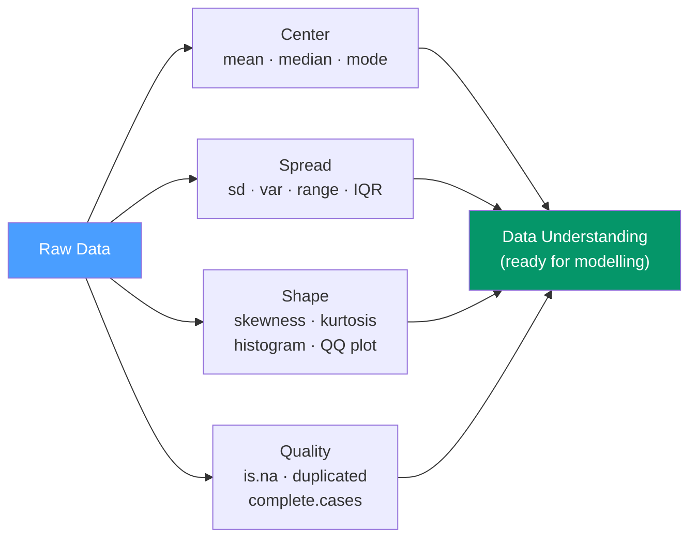

# 📊 Descriptive Statistics in R

> [!abstract] TL;DR
> Descriptive statistics summarize the shape, center, and spread of your data before any modelling. R provides a rich ecosystem from base `summary()` through `dplyr::summarise()` and `skimr::skim()`. Always explore distributions visually (histogram, boxplot, density) and check for missing data, outliers, and skewness before reaching for inference or modelling.

## Intuition — analogy FIRST

Descriptive statistics are the **physical examination** before surgery — you wouldn't operate without knowing the patient's vital signs, age, and medical history. Before fitting any model, you need to know: How spread out is the data? Are there outliers? Is it symmetric or skewed? Are there missing values? How many observations per group?

Skipping this step is the most common cause of fitting the wrong model or misinterpreting results.

---

## How It Works



---

## Key Concepts / Details

### The Essential One-Line Overview

```r
# summary(): base R — gives min/Q1/median/mean/Q3/max for numeric, counts for factors
summary(mtcars)

# glimpse(): tidyverse — column types + first few values (like str but readable)
library(dplyr)
glimpse(mtcars)

# skimr::skim(): best overall — includes histogram sparklines, NA counts, quantiles
library(skimr)
skim(mtcars)
```

### Measures of Center

```r
x <- c(2, 4, 4, 4, 5, 5, 7, 9, NA)

mean(x, na.rm = TRUE)       # 5.0  — arithmetic mean (sensitive to outliers)
median(x, na.rm = TRUE)     # 4.5  — 50th percentile (robust to outliers)
# mode: no base R function; use table() or which.max(tabulate())
which.max(tabulate(x))      # most frequent value

# Trimmed mean: exclude top and bottom 5% before computing mean
mean(x, trim = 0.05, na.rm = TRUE)

# Geometric mean (for ratios, rates of return)
exp(mean(log(x[!is.na(x) & x > 0])))
```

### Measures of Spread

```r
sd(x, na.rm = TRUE)         # standard deviation (same units as data)
var(x, na.rm = TRUE)        # variance
range(x, na.rm = TRUE)      # c(min, max)
diff(range(x, na.rm = TRUE)) # total range

quantile(x, probs = c(0.25, 0.5, 0.75), na.rm = TRUE)  # quartiles
IQR(x, na.rm = TRUE)        # interquartile range Q3 - Q1 (robust spread)

# Box-and-whisker numbers: Q1 - 1.5*IQR to Q3 + 1.5*IQR (Tukey fences)
q  <- quantile(x, c(0.25, 0.75), na.rm = TRUE)
iqr <- IQR(x, na.rm = TRUE)
lower_fence <- q[1] - 1.5 * iqr
upper_fence <- q[2] + 1.5 * iqr
```

### Shape — Skewness and Kurtosis

```r
library(e1071)   # or moments package

skewness(x, na.rm = TRUE)
# Positive skew (right tail): mean > median → outliers on the high end
# Negative skew (left tail):  mean < median → outliers on the low end
# |skewness| < 0.5: approximately symmetric; > 1: substantially skewed

kurtosis(x, na.rm = TRUE)
# Excess kurtosis (above 3) = heavy tails (leptokurtic)
# Excess kurtosis (below 3) = light tails (platykurtic)
# Normal distribution has kurtosis = 3 (excess = 0)
```

### Comprehensive Summary with dplyr

```r
library(dplyr)

mtcars |>
  summarise(
    n          = n(),
    n_missing  = sum(is.na(mpg)),
    mean_mpg   = mean(mpg, na.rm = TRUE),
    median_mpg = median(mpg, na.rm = TRUE),
    sd_mpg     = sd(mpg, na.rm = TRUE),
    q25        = quantile(mpg, 0.25, na.rm = TRUE),
    q75        = quantile(mpg, 0.75, na.rm = TRUE),
    min_mpg    = min(mpg, na.rm = TRUE),
    max_mpg    = max(mpg, na.rm = TRUE)
  )

# By group
mtcars |>
  group_by(cyl) |>
  summarise(across(c(mpg, hp, wt), list(mean=mean, sd=sd), .names="{.col}_{.fn}"),
            n = n(), .groups = "drop")
```

### Frequency Tables and Cross-Tabulations

```r
# Simple frequency table
table(mtcars$cyl)        # counts per level
prop.table(table(mtcars$cyl))  # proportions

# Two-way cross-tabulation
table(mtcars$cyl, mtcars$gear)
addmargins(table(mtcars$cyl, mtcars$gear))  # with row/col totals

# Tidyverse equivalent
mtcars |> count(cyl, gear) |> arrange(cyl, gear)

# As proportions within rows
mtcars |>
  count(cyl, gear) |>
  group_by(cyl) |>
  mutate(prop = n / sum(n))
```

### Data Quality Checks

```r
# Missing values
sum(is.na(df))                   # total NAs in data frame
colSums(is.na(df))               # NAs per column
mean(is.na(df$col))              # proportion missing in one column
df[!complete.cases(df), ]        # rows with any NA
df[complete.cases(df), ]         # rows with no NAs

# Duplicates
sum(duplicated(df))              # count duplicate rows
df[!duplicated(df), ]            # keep first occurrence only
df[!duplicated(df[, c("id")]), ] # unique by key column

# Outlier detection (beyond Tukey fences)
is_outlier <- function(x) {
  q <- quantile(x, c(0.25, 0.75), na.rm = TRUE)
  iqr <- IQR(x, na.rm = TRUE)
  x < q[1] - 1.5 * iqr | x > q[2] + 1.5 * iqr
}
df |> filter(is_outlier(income))
```

### Visualizing Distributions

```r
library(ggplot2)

# Histogram with density overlay
ggplot(mtcars, aes(x = mpg)) +
  geom_histogram(aes(y = after_stat(density)), binwidth = 2,
                 fill = "steelblue", alpha = 0.7) +
  geom_density(colour = "darkred", linewidth = 1) +
  theme_minimal()

# Box plot for all numeric columns (after pivoting)
library(tidyr)
mtcars |>
  pivot_longer(everything(), names_to = "variable", values_to = "value") |>
  ggplot(aes(x = variable, y = value)) +
  geom_boxplot() +
  facet_wrap(~ variable, scales = "free") +
  theme_minimal()

# QQ plot to check normality
ggplot(mtcars, aes(sample = mpg)) +
  geom_qq() + geom_qq_line(colour = "red") +
  labs(title = "Normal Q-Q Plot of MPG") +
  theme_minimal()
```

### Descriptive Stats Packages Comparison

| Package | Function | Strengths |
|---------|----------|-----------|
| base R | `summary()` | No dependencies, always available |
| dplyr | `summarise()` | Composable, grouped, customizable |
| skimr | `skim()` | Comprehensive, sparkline histograms, formatted output |
| psych | `describe()` | Skewness, kurtosis, se, n valid per column |
| Hmisc | `describe()` | Frequencies, quantiles, extreme values |
| DataExplorer | `create_report()` | Automated EDA HTML report |

---

## Real-World Notes

- **Always run `skim()` or `summary()` on every new dataset** before writing a single model line — missing data, impossible values (age = 999, salary = -1), and unexpected data types surface immediately.
- **Median is more robust than mean** for skewed data (income, house prices, response times). Report both: if they differ substantially, the distribution is skewed.
- **The 68-95-99.7 rule** (empirical rule) only applies to normal distributions — check normality before invoking it.
- **`DataExplorer::create_report(df)`** generates a complete HTML EDA report in one line — useful for quickly profiling a new dataset.

---

## Common Pitfalls

1. **`mean(x)` without `na.rm = TRUE`** — returns `NA` if any value is missing. Always include `na.rm = TRUE`.
2. **Confusing `sd` (standard deviation) and `se` (standard error)** — SD describes spread of the data; SE = SD/√n describes uncertainty of the mean estimate.
3. **Assuming normality without checking** — many statistical tests require approximate normality. Use QQ plots and skewness before proceeding to t-tests.
4. **Using `nrow()` when `n()` is needed inside `summarise()`** — `nrow()` counts the whole data frame, not the group; use `n()` inside dplyr verbs.
5. **Treating missing data as zero** — `sum(x)` with `na.rm = TRUE` excludes NAs; replacing NAs with zero before summing is a different (and usually wrong) imputation choice.

---

## Related Concepts

- [[_MOC_Statistical_Analysis|↑ Section MOC]]
- [[Hypothesis_Testing_R]] — Hypothesis tests follow from descriptive exploration
- [[Regression_Analysis_R]] — Descriptive stats inform predictor selection and assumption checking
- [[dplyr_Data_Manipulation]] — `summarise()` and `group_by()` for grouped descriptive stats

---

## Review Questions

1. What is the difference between `mean` and `median` and when does each give a more useful measure of center?
2. What does `skewness > 1` imply about a distribution?
3. How do you count the number of NAs in each column of a data frame?
4. What is `IQR` and how is it used to define outliers (Tukey's fences)?
5. How does `skimr::skim()` differ from base R's `summary()`?

---

## Sources

- Wickham H. & Grolemund G., *R for Data Science* (2e), Ch. 2 — Data Visualization for EDA
- skimr package — https://docs.ropensci.org/skimr/
- Dalgaard P., *Introductory Statistics with R* (2e) — Springer

#r-programming #statistics #descriptive-statistics #eda
