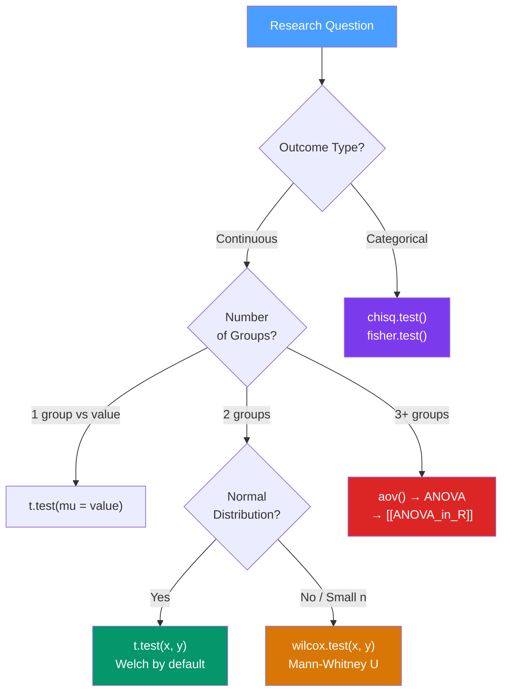

# 🔬 Hypothesis Testing in R

> [!abstract] TL;DR
> Hypothesis testing in R spans t-tests, Wilcoxon tests, chi-squared tests, and power analysis. The critical discipline is correct p-value interpretation (probability of the data given H₀, NOT probability that H₀ is true), always reporting effect sizes alongside p-values, and correcting for multiple comparisons with `p.adjust()`. Choose the test from the data structure, not from which test gives a significant result.

## Intuition — analogy FIRST

A p-value is a **surprise meter**. It asks: "If the null hypothesis were true (no real effect), how surprised should I be to see data this extreme or more extreme?" A p-value of 0.03 means: "If there were truly no effect, I'd see data this extreme in only 3% of samples."

Crucially, p < 0.05 does **not** mean: "There is a 95% chance the treatment works." It means the data is surprising under H₀. A very large sample can produce a tiny (significant) p-value for a completely trivial effect. Always check effect size.

---

## How It Works



---

## Key Concepts / Details

### p-values — What They Mean and Don't Mean

| Statement | True or False? |
|-----------|---------------|
| p < 0.05 means H₀ is false | **FALSE** |
| p < 0.05 means P(H₀ is true) < 5% | **FALSE** |
| p = 0.03 means P(H₀) = 3% | **FALSE** |
| p = 0.03 means: if H₀ were true, P(seeing data this extreme or more) = 3% | **TRUE** |
| A large sample can give p < 0.05 for a trivially small effect | **TRUE** |
| Effect size tells you whether the difference matters practically | **TRUE** |

### t.test — Comparing Means

```r
# One-sample t-test: is the mean equal to a reference value?
t.test(mtcars$mpg, mu = 20)
# H0: true mean = 20 MPG

# Two-sample t-test (Welch by default — doesn't assume equal variances)
t.test(mpg ~ am, data = mtcars)
# H0: mean mpg is equal for automatic (am=0) and manual (am=1)

# Pooled (equal variance) t-test
t.test(mpg ~ am, data = mtcars, var.equal = TRUE)

# Paired t-test (pre/post measurements on same subjects)
t.test(before, after, paired = TRUE)

# Extracting results
result <- t.test(mpg ~ am, data = mtcars)
result$statistic    # t-statistic
result$p.value      # p-value
result$conf.int     # 95% confidence interval for difference in means
result$estimate     # means of each group
```

### When Normality Fails — Wilcoxon Tests

For small samples or clearly non-normal distributions, use non-parametric alternatives:

```r
# Mann-Whitney U test (independent two-sample, non-parametric)
wilcox.test(mpg ~ am, data = mtcars)

# Wilcoxon signed-rank test (paired, non-parametric)
wilcox.test(before, after, paired = TRUE)

# Exact p-value for small samples
wilcox.test(x, y, exact = TRUE)
```

### Chi-squared and Fisher's Tests — Categorical Data

```r
# Chi-squared test of independence
chisq.test(table(mtcars$cyl, mtcars$gear))
# H0: cyl and gear are independent

# Check expected cell counts — if any < 5, use Fisher's test instead
chisq.test(table(x, y))$expected

# Fisher's exact test (for small expected counts)
fisher.test(table(x, y))

# Chi-squared goodness of fit (does observed match expected proportions?)
observed <- c(40, 35, 25)
expected <- c(0.40, 0.35, 0.25)   # expected proportions
chisq.test(x = observed, p = expected)
```

### Effect Sizes — What Significance Doesn't Tell You

```r
library(effectsize)

# Cohen's d for t-tests (standardized mean difference)
cohens_d(mpg ~ am, data = mtcars)
# d = 0.2: small, 0.5: medium, 0.8: large (Cohen's benchmarks)

# Interpretation: d = 1.48 means the means differ by 1.48 standard deviations

# Rank-biserial correlation for Wilcoxon tests
wilcox.test(mpg ~ am, data = mtcars) |>
  effectsize::rank_biserial()

# Odds ratio for Fisher's test (extracted from output)
fisher.test(table(x, y))$estimate  # odds ratio
```

### Power Analysis with pwr

Power = 1 − β = probability of detecting a true effect.

```r
library(pwr)

# Fix three of the four quantities to find the fourth:
# n (sample size), d (effect size), sig.level (α), power (1-β)

# How large a sample do I need?
pwr.t.test(d = 0.5, sig.level = 0.05, power = 0.80, type = "two.sample")
# n = 64 per group

# What power do I have with my current sample?
pwr.t.test(n = 32, d = 0.5, sig.level = 0.05, type = "two.sample")
# power = 0.615  (underpowered!)

# For chi-squared test
pwr.chisq.test(w = 0.3, df = 4, sig.level = 0.05, power = 0.80)

# For correlation
pwr.r.test(r = 0.3, sig.level = 0.05, power = 0.80)
```

### Multiple Comparisons — p.adjust

When testing multiple hypotheses, the probability of a false positive inflates. Correct using `p.adjust()`.

```r
p_values <- c(0.001, 0.02, 0.04, 0.06, 0.15, 0.25, 0.50)

# Bonferroni: family-wise error rate (conservative)
# Multiply each p by the number of tests; good when all tests are equally important
p.adjust(p_values, method = "bonferroni")

# Benjamini-Hochberg (BH): false discovery rate (less conservative)
# Good when testing many hypotheses (genomics, feature selection)
# Controls expected proportion of false positives among rejections
p.adjust(p_values, method = "BH")

# Common workflow: test many things, adjust, filter
results_df |>
  mutate(p_adj = p.adjust(p_value, method = "BH")) |>
  filter(p_adj < 0.05)
```

### Common Tests Reference

| Situation | Parametric | Non-Parametric |
|-----------|-----------|----------------|
| 1 group vs value | `t.test(mu = v)` | `wilcox.test(mu = v)` |
| 2 independent groups | `t.test(x, y)` | `wilcox.test(x, y)` |
| 2 paired groups | `t.test(paired=TRUE)` | `wilcox.test(paired=TRUE)` |
| 3+ groups | `aov()` → [[ANOVA_in_R]] | `kruskal.test()` |
| 2 categorical vars | `chisq.test()` | `fisher.test()` (small n) |
| 2 continuous vars | `cor.test()` | `cor.test(method="spearman")` |

---

## Real-World Notes

- **The Welch t-test is the default in R** — `t.test(x, y)` assumes unequal variances (Welch). This is more robust than the pooled t-test and should be your default.
- **Report: test statistic, df, p-value, 95% CI, and effect size** — a p-value alone is never enough. Include: t(58) = 3.2, p = 0.002, d = 0.82.
- **Pre-register your hypotheses** before collecting data to prevent p-hacking (running multiple tests and reporting only significant ones).
- **Equivalence testing (`TOSTER` package)** — use this when you want to prove *no* meaningful difference exists (bioequivalence, policy decisions).

---

## Common Pitfalls

1. **Interpreting p-value as P(H₀ is true)** — it's not. p is P(data | H₀), not P(H₀ | data).
2. **Running 20 tests and not adjusting p-values** — you expect 1 false positive at α=0.05 by chance alone.
3. **Using a t-test with non-normal data and n < 30** — the CLT doesn't rescue you with very small, very skewed samples. Use Wilcoxon.
4. **Confusing paired and independent tests** — pre/post on the same subjects is paired; two separate groups is independent. Using the wrong one gives wrong results.
5. **Ignoring power** — a non-significant result from an underpowered study (power < 0.80) tells you almost nothing. Run a power analysis during study design, not after.

---

## Related Concepts

- [[_MOC_Statistical_Analysis|↑ Section MOC]]
- [[Descriptive_Statistics_R]] — Explore data before choosing a test
- [[ANOVA_in_R]] — Extension to 3+ groups
- [[Regression_Analysis_R]] — Regression generalizes the t-test to the linear model

---

## Review Questions

1. What does p = 0.03 mean? Write out what you can and cannot conclude from it.
2. When would you use `wilcox.test` instead of `t.test`?
3. What is the difference between Bonferroni and Benjamini-Hochberg correction? When would you use each?
4. You run a t-test and get p = 0.001 but Cohen's d = 0.1. How do you interpret this result?
5. A study has n = 20 per group. You run `pwr.t.test` and find power = 0.40. What does this mean for interpreting a non-significant result?

---

## Sources

- Dalgaard P., *Introductory Statistics with R* (2e) — Springer
- Cohen J., *Statistical Power Analysis for the Behavioral Sciences* (2e) — LEA
- pwr package documentation — https://cran.r-project.org/package=pwr
- effectsize package — https://easystats.github.io/effectsize/

#r-programming #statistics #hypothesis-testing
