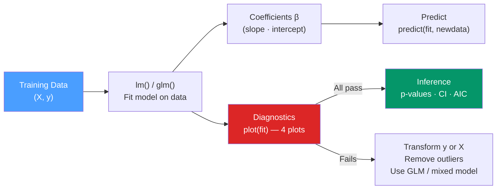

# 📈 Regression Analysis in R

> [!abstract] TL;DR
> R's `lm()` fits ordinary least squares linear regression; `glm()` extends it to binary (logistic), count (Poisson), and other outcomes via link functions; `lme4::lmer()` handles hierarchically nested data with random effects. Always run the four diagnostic plots after fitting a linear model — assumption violations can invalidate every inference you draw.

## Intuition — analogy FIRST

Linear regression is a **straight-line prediction machine**: given x values, predict y. OLS finds the line that minimizes the sum of squared vertical distances between observed y and the line (residuals). The key insight is that regression is much more than prediction — the coefficients estimate **causal effects** (under assumptions), and the four diagnostic plots are the checkpoint that those assumptions hold.

GLM extends this to: "What if y can't be negative (counts) or must stay between 0 and 1 (probabilities)?" The link function bends the prediction into the right space.

---

## How It Works



---

## Key Concepts / Details

### lm — Ordinary Least Squares Linear Regression

```r
# Fit a linear model
fit <- lm(mpg ~ wt + hp + cyl, data = mtcars)

# Model summary
summary(fit)
# Coefficients: estimate, std error, t-value, p-value
# R-squared: proportion of variance explained
# F-statistic: overall model significance
# Residual standard error: typical prediction error

# Extract components
coef(fit)                          # named vector of coefficients
confint(fit, level = 0.95)         # 95% confidence intervals
fitted(fit)                        # predicted values for training data
residuals(fit)                     # y - ŷ for training data
predict(fit, newdata = data.frame(wt=3, hp=150, cyl=6))  # new prediction
```

### The Four Diagnostic Plots

These four plots reveal the four key OLS assumptions. Run them after every `lm()` call.

```r
par(mfrow = c(2, 2))
plot(fit)
```

| Plot | What it Shows | Assumption | Good Pattern |
|------|--------------|------------|--------------|
| **Residuals vs Fitted** | Residuals vs predicted values | Linearity, homoscedasticity | Random scatter around 0, no pattern |
| **Normal Q-Q** | Residuals vs normal quantiles | Normality of residuals | Points on the diagonal line |
| **Scale-Location** | √|residuals| vs fitted | Homoscedasticity | Horizontal line, even spread |
| **Residuals vs Leverage** | Influence of each observation | Outliers, influential points | No points outside Cook's distance contours |

```r
library(ggplot2)

# ggplot2-based diagnostics (more publication-ready)
library(ggfortify)
autoplot(fit)

# Check specific assumption: Durbin-Watson for autocorrelated residuals
library(lmtest)
dwtest(fit)   # p < 0.05 → residuals are autocorrelated (violates OLS)

# Variance Inflation Factor (VIF) for multicollinearity
library(car)
vif(fit)      # VIF > 5-10 indicates problematic multicollinearity
```

### Interpreting Coefficients

```r
summary(fit)$coefficients
#              Estimate Std. Error t value Pr(>|t|)
# (Intercept)  37.105      1.785   20.79  < 2e-16 ***
# wt           -3.878      0.633   -6.13  1.5e-06 ***
# hp           -0.032      0.009   -3.52  0.00153 **

# Interpretation:
# Holding hp and cyl constant, each additional 1000 lb of weight
# is associated with a 3.88 mpg decrease in fuel efficiency.
```

### Adding Interaction Terms

```r
# Interaction: effect of x1 depends on x2
fit_interact <- lm(mpg ~ wt * hp, data = mtcars)
# Equivalent to: mpg ~ wt + hp + wt:hp

# Center predictors before interactions to reduce multicollinearity
mtcars_c <- mtcars |>
  mutate(wt_c = wt - mean(wt), hp_c = hp - mean(hp))
fit_c <- lm(mpg ~ wt_c * hp_c, data = mtcars_c)
```

### GLM — Generalized Linear Models

GLM extends linear regression to non-Gaussian outcomes by specifying a **family** (distribution) and a **link function**.

```r
# Logistic regression: binary outcome (0/1)
logit_fit <- glm(am ~ mpg + wt + hp, data = mtcars,
                  family = binomial(link = "logit"))
summary(logit_fit)

# Coefficients are on the log-odds scale; exponentiate for odds ratios
exp(coef(logit_fit))       # odds ratios
exp(confint(logit_fit))    # 95% CI for odds ratios

# Predicted probabilities
predict(logit_fit, type = "response")  # type = "response" gives probabilities

# Poisson regression: count outcome
pois_fit <- glm(count ~ x1 + x2, data = count_data,
                 family = poisson(link = "log"))
# exp(coef) gives rate ratios (multiplicative effect on the expected count)
```

### GLM Family Reference

| Family | Link | Use Case |
|--------|------|---------|
| `gaussian()` | `identity` | Continuous outcome (same as `lm`) |
| `binomial()` | `logit` | Binary (0/1) outcome |
| `binomial()` | `probit` | Binary, probit model |
| `poisson()` | `log` | Count data (Poisson distributed) |
| `quasipoisson()` | `log` | Overdispersed count data |
| `Gamma()` | `log` | Positive, right-skewed continuous |
| `negbinomial()` | `log` | Overdispersed counts (MASS package) |

### Model Selection — AIC, BIC, LRT

```r
# AIC: Akaike Information Criterion (lower is better)
AIC(fit1, fit2, fit3)   # compare multiple models

# BIC: Bayesian Information Criterion (penalizes complexity more than AIC)
BIC(fit1, fit2, fit3)

# Likelihood-ratio test for nested models
library(lmtest)
lrtest(fit_small, fit_large)
# Significant p → the additional terms improve fit

# stepwise selection (use cautiously — can lead to overfitting)
fit_full <- lm(mpg ~ ., data = mtcars)
fit_step <- step(fit_full, direction = "backward", trace = FALSE)
```

### Mixed Models with lme4

Use mixed models when observations are nested within groups (students in schools, measurements on the same patient over time).

```r
library(lme4)

# Random intercept model: each group gets its own baseline
fit_ri <- lmer(
  score ~ treatment + time + (1 | student_id),  # (1 | group) = random intercept
  data = longitudinal_data,
  REML = TRUE   # use REML for estimation; ML for model comparison
)

# Random intercept + slope: each group gets its own intercept AND time effect
fit_rs <- lmer(
  score ~ treatment + time + (1 + time | student_id),
  data = longitudinal_data
)

# Compare models with likelihood ratio test (use ML, not REML)
fit_ri_ml <- update(fit_ri, REML = FALSE)
fit_rs_ml <- update(fit_rs, REML = FALSE)
anova(fit_ri_ml, fit_rs_ml)
```

---

## Real-World Notes

- **`lm()` formula notation**: `y ~ x1 + x2` (additive), `y ~ x1 * x2` (with interaction), `y ~ x1 + I(x1^2)` (polynomial), `y ~ .` (all columns), `y ~ . - x3` (all except x3).
- **`broom::tidy(fit)`** returns a tidy tibble of coefficients — much easier to work with than `summary(fit)` for programmatic use.
- **`marginaleffects` package** is the modern way to compute and visualize marginal effects from complex models (interactions, non-linear terms, GLMs).
- **Spearman-Brown correction** for attenuation: if predictors are measured with error, OLS coefficient estimates are biased toward zero.

---

## Common Pitfalls

1. **Not checking diagnostic plots** — residuals vs fitted with a fan shape (heteroscedasticity) or curve (nonlinearity) invalidates all the p-values.
2. **Interpreting GLM coefficients directly** — logistic regression coefficients are log-odds; always `exp(coef())` for interpretable odds ratios.
3. **High VIF from multicollinearity** — VIF > 10 means coefficient estimates are unstable. Center predictors, remove one correlated predictor, or use ridge regression.
4. **Using `lm` for nested data** — repeated measures or hierarchically nested data violate independence assumptions; use `lme4::lmer`.
5. **Stepwise selection for inference** — p-values from stepwise-selected models are invalid (selection bias). Use for exploration only, not for hypothesis testing.

---

## Related Concepts

- [[_MOC_Statistical_Analysis|↑ Section MOC]]
- [[Hypothesis_Testing_R]] — t-tests are special cases of linear regression
- [[ANOVA_in_R]] — ANOVA is another special case of the general linear model
- [[tidymodels]] — tidymodels wraps lm/glm in a pipeline for cross-validation and tuning

---

## Review Questions

1. What do the four `plot(fit)` diagnostic plots check, and what pattern indicates a problem in each?
2. What is the difference between `lm` and `glm(family = gaussian())`?
3. How do you extract and interpret odds ratios from a logistic regression model?
4. What does a random intercept model `(1 | group)` mean in lme4 and when would you use it?
5. Why is AIC preferred over R² for model comparison, and why does a lower AIC indicate a better model?

---

## Sources

- James G. et al., *An Introduction to Statistical Learning with R* (2e), Ch. 3 — Linear Regression
- Venables W.N. & Ripley B.D., *Modern Applied Statistics with S* (4e) — MASS
- lme4 vignette — https://cran.r-project.org/web/packages/lme4/vignettes/lmer.pdf
- Harrell F., *Regression Modeling Strategies* (2e) — Springer

#r-programming #statistics #regression #lm #glm
