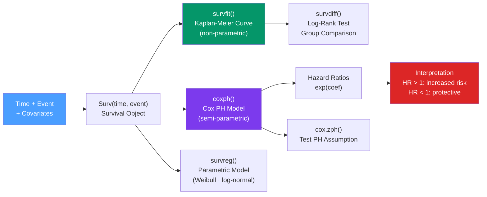

# ⏱️ Survival Analysis in R

> [!abstract] TL;DR
> Survival analysis models time-to-event outcomes (death, failure, churn) where observations may be **censored** — we know they haven't experienced the event yet, but don't know when they will. R's `survival` package provides the Kaplan-Meier non-parametric estimator, the log-rank test for group comparison, and the Cox proportional hazards semi-parametric model. `survminer` provides publication-quality KM plots.

## Intuition — analogy FIRST

Imagine a clinical trial: patients enter the study at different times and you track when they die. After the study ends, some patients are still alive — you know they survived *at least* X days but don't know their true survival time. Others dropped out (lost to follow-up). These incomplete observations are **censored**: you can't just exclude them (that biases results) or treat them as events (that's wrong too).

Survival analysis handles censoring correctly. The Kaplan-Meier curve asks: "What fraction of subjects survive past time t?" at each event time. The Cox model asks: "How does covariate X change the hazard (instantaneous risk of the event)?"

---

## How It Works



---

## Key Concepts / Details

### Key Concepts and Terminology

| Term | Definition |
|------|-----------|
| **Event** | The outcome of interest (death, failure, relapse, churn) |
| **Censored** | Subject left the study before experiencing the event; we know they survived to at least time t |
| **Right censoring** | The most common type — event hasn't occurred yet when study ends or subject drops out |
| **Survival function S(t)** | P(survive past time t) = P(T > t); starts at 1, decreases monotonically |
| **Hazard function h(t)** | Instantaneous rate of event at time t, given survival to time t |
| **Cumulative hazard H(t)** | H(t) = −log(S(t)); S(t) = exp(−H(t)) |
| **Hazard ratio (HR)** | Ratio of hazard rates between two groups; HR = 2 means twice the risk |

### The Surv Object

```r
library(survival)

# Surv() creates the response variable for survival analysis
# event = 1 (occurred) or 0 (censored)
surv_obj <- Surv(time = lung$time, event = lung$status == 2)

# Inspect the Surv object: + indicates censoring
head(surv_obj)
# [1]  306   455  1010+  210   883  1022+
# + means censored observation
```

### Kaplan-Meier Estimator

The KM estimator computes S(t) at each event time using the product-limit formula:

S(t) = ∏ (nᵢ − dᵢ) / nᵢ for all event times tᵢ ≤ t

where nᵢ = subjects at risk, dᵢ = events at time tᵢ.

```r
# Fit KM curve for all subjects
km_fit <- survfit(Surv(time, status == 2) ~ 1, data = lung)
summary(km_fit, times = c(180, 365, 730))  # survival at 6m, 1y, 2y

# Fit KM curve stratified by a covariate
km_sex <- survfit(Surv(time, status == 2) ~ sex, data = lung)
summary(km_sex)

# Median survival time (time when S(t) = 0.5)
print(km_sex)
# n  events  median  0.95LCL  0.95UCL
# sex=1  138  112    270      212      310
# sex=2   90   53    426      348      550
```

### Publication-Quality KM Plots with survminer

```r
library(survminer)

ggsurvplot(
  km_sex,
  data             = lung,
  pval             = TRUE,            # add log-rank p-value to plot
  conf.int         = TRUE,            # show 95% CI band
  risk.table       = TRUE,            # add number at risk table below plot
  risk.table.col   = "strata",        # color risk table by strata
  linetype         = "strata",
  surv.median.line = "hv",            # add horizontal+vertical lines at median
  ggtheme          = theme_minimal(),
  palette          = c("#E7B800", "#2E9FDF"),
  legend.labs      = c("Male", "Female"),
  title            = "Survival by Sex — NCCTG Lung Cancer Data",
  xlab             = "Time (days)",
  ylab             = "Survival Probability"
)
```

### Log-Rank Test — Comparing Survival Curves

```r
# Log-rank test: are survival curves from different groups statistically different?
# H0: survival functions are identical across groups
logrank_test <- survdiff(Surv(time, status == 2) ~ sex, data = lung)
logrank_test
# Call: survdiff(formula = Surv(time, status == 2) ~ sex, data = lung)
#
#        N  Observed  Expected  (O-E)^2/E
# sex=1  138      112      91.6      4.55
# sex=2   90       53      73.4      5.68
#
# Chisq= 10.3 on 1 degrees of freedom, p= 0.00131

# Weighted log-rank tests (give different weight to different time points)
survdiff(Surv(time, status) ~ group, data, rho = 1)   # Peto-Prentice (early emphasis)
survdiff(Surv(time, status) ~ group, data, rho = -1)  # late emphasis
```

### Cox Proportional Hazards Model

The Cox model estimates the effect of covariates on the hazard without specifying the baseline hazard:

h(t | x) = h₀(t) · exp(β₁x₁ + β₂x₂ + ... + βₚxₚ)

The hazard ratio for covariate x₁ = exp(β₁).

```r
# Fit Cox PH model
cox_fit <- coxph(Surv(time, status == 2) ~ sex + age + ph.ecog, data = lung)
summary(cox_fit)
# coef    exp(coef) se(coef)  z       p
# sex    -0.5151    0.5974    0.1671  -3.082  0.0021
# age     0.0169    1.0171    0.0092   1.843  0.0653
# ph.ecog 0.4754   1.6082    0.0706   6.732  <0.001

# Interpretation:
# sex: HR = 0.60 — females have 40% lower hazard than males (HR < 1 = protective)
# ph.ecog: HR = 1.61 — each unit increase in ECOG score increases hazard by 61%

# Hazard ratios with 95% CI
exp(coef(cox_fit))
exp(confint(cox_fit))

# Predict baseline survival and individual survival curves
cox_surv <- survfit(cox_fit, newdata = data.frame(sex = c(1, 2), age = 60, ph.ecog = 1))
ggsurvplot(cox_surv, data = lung, conf.int = TRUE)
```

### Testing the Proportional Hazards Assumption

The Cox model assumes the hazard ratio is **constant over time** (proportional hazards). Violating this makes the model results misleading.

```r
# Schoenfeld residuals test
ph_test <- cox.zph(cox_fit)
print(ph_test)
# Global p < 0.05 → PH assumption violated for at least one covariate

# Plot Schoenfeld residuals: should be horizontal (constant over time)
ggcoxzph(ph_test)

# Fix PH violation: stratify by the offending variable
# → Each stratum gets its own baseline hazard
cox_strat <- coxph(Surv(time, status) ~ sex + strata(treatment), data)

# Or: add a time-varying effect
cox_tv <- coxph(Surv(time, status) ~ sex + tt(sex), data,
                tt = function(x, t, ...) x * log(t))
```

### Parametric Survival Models

When the hazard function has a specific shape, parametric models are more efficient:

```r
# Weibull accelerated failure time model
weibull_fit <- survreg(
  Surv(time, status == 2) ~ sex + age,
  data = lung,
  dist = "weibull"   # also: "exponential", "lognormal", "loglogistic"
)
summary(weibull_fit)
# AFT model: coefficients describe log(time) rather than log(hazard)
```

---

## Real-World Notes

- **KM curves are the standard communication tool** — always show them with confidence intervals and a number-at-risk table; the table is as important as the curve.
- **Censoring must be non-informative** — if patients who are doing poorly are more likely to drop out (informative censoring), the KM estimator is biased. This is a serious clinical trial validity concern.
- **The Cox model is semi-parametric** — it doesn't assume a specific baseline hazard shape, which is why it's the default for clinical data. Parametric models gain power when the shape is known.
- **Time-varying covariates** (e.g., treatment changes during follow-up) require restructuring data into `(start, stop]` intervals via `survival::tmerge()`.

---

## Common Pitfalls

1. **Treating censored observations as events** — this creates serious bias toward shorter survival times and inflated event rates.
2. **Not testing the PH assumption** — always run `cox.zph()`. If violated, the hazard ratio estimate is an average over time that may be misleading.
3. **Comparing KM curves visually without a log-rank test** — curves that look different may not be statistically so, especially with small samples and wide CI bands.
4. **Ignoring tied event times** — for discrete-time events (days), use `ties = "exact"` in `coxph()` for small datasets, though Efron's method (default) is usually adequate.
5. **Extrapolating KM curves beyond observed data** — the curve may not reach 0 if the study ends before all events occur; treat the tail as uncertain.

---

## Related Concepts

- [[_MOC_Statistical_Analysis|↑ Section MOC]]
- [[Regression_Analysis_R]] — Cox PH is an extension of regression to censored time-to-event outcomes
- [[Hypothesis_Testing_R]] — Log-rank test is a non-parametric group comparison test
- [[ggplot2_Grammar_of_Graphics]] — `survminer::ggsurvplot` is built on ggplot2

---

## Review Questions

1. What is censoring in survival analysis and why can't you just exclude censored observations?
2. How does the Kaplan-Meier estimator compute S(t) at each event time?
3. What does a hazard ratio of 0.6 mean in a Cox model?
4. What is the proportional hazards assumption and how do you test it in R?
5. When would you use a parametric survival model (Weibull) instead of the Cox model?

---

## Sources

- Therneau T.M. & Grambsch P.M., *Modeling Survival Data: Extending the Cox Model* — Springer
- survival package vignette — https://cran.r-project.org/web/packages/survival/vignettes/survival.pdf
- survminer package — https://rpkgs.datanovia.com/survminer/
- Harrell F., *Regression Modeling Strategies* (2e), Ch. 17–20 — Springer

#r-programming #statistics #survival-analysis #kaplan-meier #cox-model
