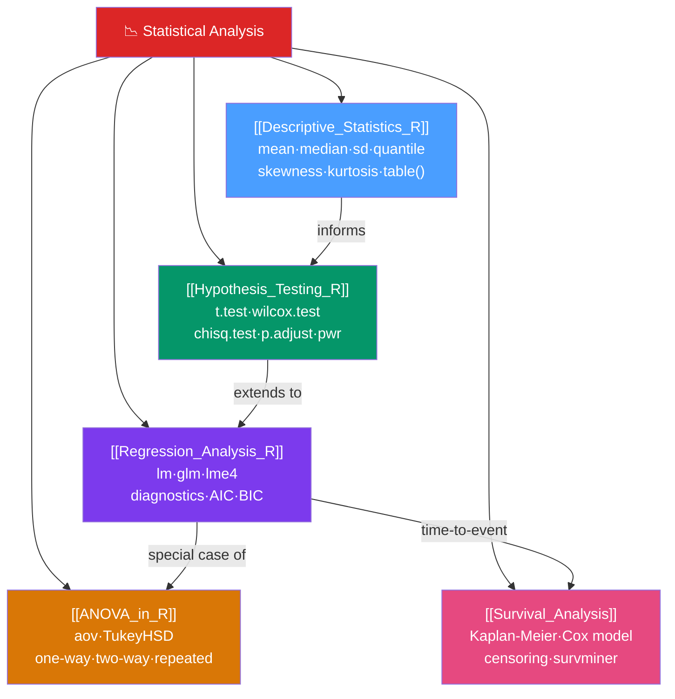

# 📉 Statistical Analysis — Map of Content

> [!abstract] What This Section Covers
> Statistical modelling is R's original reason for existence, and its base functions for testing, regression, and distributions remain unmatched by any other language. This section walks the full workflow from descriptive summaries and classical frequentist inference through regression, ANOVA, and survival analysis — always pairing theory with implementation, assumption-checking code, and honest interpretation. The key discipline: choose the correct test from the data structure, report effect sizes alongside p-values, and verify every model assumption before trusting it.

## Concept Map

## Learning Path

1. [[Descriptive_Statistics_R]] — Summarize your data before modelling: central tendency, spread, skewness, and data quality checks.
2. [[Hypothesis_Testing_R]] — Test hypotheses correctly: p-value interpretation, choosing the right test, effect sizes, and multiple comparison correction.
3. [[Regression_Analysis_R]] — Model continuous outcomes with `lm` and binary/count outcomes with `glm`; check all four assumptions.
4. [[ANOVA_in_R]] — Compare means across 3+ groups with `aov`; follow up with Tukey's HSD post-hoc tests.
5. [[Survival_Analysis]] — Analyze time-to-event data with Kaplan-Meier curves and the Cox proportional hazards model.

## All Notes at a Glance

| Note | Difficulty | What You'll Learn |
|------|------------|-------------------|
| [[Descriptive_Statistics_R]] | Beginner | summary(), mean/median/sd/quantile, skewness, frequency tables, glimpse, data quality |
| [[Hypothesis_Testing_R]] | Intermediate | p-value semantics, t.test/wilcox, chisq/fisher, effect sizes, power analysis, p.adjust |
| [[Regression_Analysis_R]] | Intermediate | lm OLS, plot(fit) diagnostics, glm link functions, lme4 mixed models, AIC/BIC |
| [[ANOVA_in_R]] | Intermediate | aov, TukeyHSD, two-way interaction, repeated measures, Kruskal-Wallis, effect sizes |
| [[Survival_Analysis]] | Advanced | Surv(), KM estimator, log-rank test, Cox model, proportional hazards assumption, ggsurvplot |

## Key Questions This Section Answers

- What is a p-value, really? What does it NOT mean?
- How do I choose the right statistical test for my data structure?
- What are the four regression diagnostic plots and what does each reveal?
- What is the difference between `lm` and `glm`? When do I use `glm(family = binomial)`?
- How do I correct for multiple comparisons and which method should I use?
- What is the difference between repeated measures ANOVA and a mixed model?
- What is censoring in survival analysis and how does the Cox model handle it?

## Related Sections

- [[_MOC_R_Programming_Master|↑ R Programming Master MOC]]
- [[_MOC_Tidyverse|← Tidyverse]] — dplyr and tidyr prepare data frames for statistical modelling
- [[_MOC_ggplot2|← ggplot2]] — Visualize distributions, residuals, and survival curves
- [[_MOC_ML_in_R|→ ML in R]] — Statistical models extend into regularized ML with tidymodels

#MOC #r-programming #statistics
