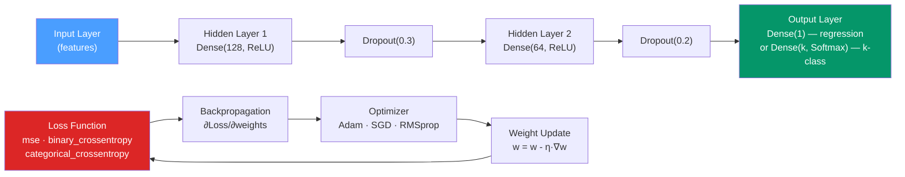

# 🧠 Deep Learning in R with keras

> [!abstract] TL;DR
> `keras3` (formerly `keras`) provides R bindings to Keras/TensorFlow via `reticulate`. The **Sequential API** stacks layers for simple feedforward networks; the **Functional API** handles multi-input, multi-output, and shared-layer architectures. `callback_early_stopping(restore_best_weights = TRUE)` is the essential regularization tool. For tabular data, always benchmark XGBoost first — neural nets win only when feature interactions are highly complex or data is very large.

## Intuition — analogy FIRST

A neural network is a **series of learnable filters**. The first layer learns simple patterns (edges in images, common word co-occurrences in text). Deeper layers combine those simple patterns into complex concepts (faces from edges, sentiment from words). In a dense (fully connected) network for tabular data, each layer learns a weighted combination of the previous layer's outputs and applies a non-linear activation — allowing the network to approximate any sufficiently smooth function.

The training process is **gradient descent**: start with random weights, compute the loss, backpropagate the gradient, and nudge weights slightly in the direction that reduces the loss. This repeats for many mini-batches.

---

## How It Works



---

## Key Concepts / Details

### Installation

```r
# Install keras3 (the modern successor to keras)
install.packages("keras3")
library(keras3)

# Install TensorFlow backend (Python environment managed by reticulate)
install_keras()               # installs TensorFlow 2.x in a dedicated virtualenv
# install_keras(gpu = TRUE)   # GPU version (requires CUDA)
```

### Sequential API — Simple Feedforward Networks

Use the Sequential API for most regression and classification tasks on tabular data.

```r
library(keras3)

# Regression: predict a continuous outcome
model <- keras_model_sequential(input_shape = c(ncol(X_train))) |>
  layer_dense(128, activation = "relu") |>
  layer_dropout(0.3) |>
  layer_dense(64, activation = "relu") |>
  layer_dropout(0.2) |>
  layer_dense(32, activation = "relu") |>
  layer_dense(1)              # single output, no activation for regression

# Binary classification: sigmoid output
model_clf <- keras_model_sequential(input_shape = c(ncol(X))) |>
  layer_dense(128, activation = "relu") |>
  layer_dropout(0.3) |>
  layer_dense(64, activation = "relu") |>
  layer_dense(1, activation = "sigmoid")   # probability output

# Multi-class classification: softmax output
model_multi <- keras_model_sequential(input_shape = c(ncol(X))) |>
  layer_dense(256, activation = "relu") |>
  layer_dropout(0.4) |>
  layer_dense(128, activation = "relu") |>
  layer_dense(k, activation = "softmax")   # k = number of classes
```

### Loss Functions and Metrics

| Task | Output Activation | Loss Function | Metric |
|------|-------------------|--------------|--------|
| Regression | None (linear) | `"mse"` | `"mae"` |
| Binary classification | `sigmoid` | `"binary_crossentropy"` | `"accuracy"`, `"auc"` |
| Multi-class (one-hot) | `softmax` | `"categorical_crossentropy"` | `"accuracy"` |
| Multi-class (integer labels) | `softmax` | `"sparse_categorical_crossentropy"` | `"accuracy"` |

### Compiling and Training

```r
# Compile: defines optimizer, loss, and metrics
model |> compile(
  optimizer = optimizer_adam(learning_rate = 0.001),
  loss      = "mse",
  metrics   = list("mae")
)

# Print architecture summary
summary(model)

# Callbacks — essential for training control
callbacks_list <- list(
  callback_early_stopping(
    monitor              = "val_loss",
    patience             = 20,          # stop after 20 epochs without improvement
    restore_best_weights = TRUE         # restore weights from the best epoch
  ),
  callback_reduce_lr_on_plateau(
    monitor   = "val_loss",
    factor    = 0.5,         # halve learning rate
    patience  = 10,
    min_lr    = 1e-6
  ),
  callback_model_checkpoint(
    filepath         = "best_model.keras",
    monitor          = "val_loss",
    save_best_only   = TRUE
  )
)

# Training
history <- model |> fit(
  x               = X_train,
  y               = y_train,
  epochs          = 500,
  batch_size      = 64,
  validation_split = 0.2,          # 20% of training data as validation
  callbacks        = callbacks_list,
  verbose          = 1
)

# Plot training history
plot(history)
```

### Functional API — Multi-Input and Shared Layers

The Functional API builds directed acyclic graphs of layers for complex architectures.

```r
# Example: model with two input branches
numeric_input <- keras_input(shape = c(10), name = "numeric")
categ_input   <- keras_input(shape = c(5),  name = "categorical")

# Numeric branch
num_branch <- numeric_input |>
  layer_dense(64, activation = "relu") |>
  layer_dense(32, activation = "relu")

# Categorical branch (often smaller)
cat_branch <- categ_input |>
  layer_dense(16, activation = "relu")

# Combine branches
merged <- layer_concatenate(list(num_branch, cat_branch))
output <- merged |>
  layer_dense(32, activation = "relu") |>
  layer_dropout(0.3) |>
  layer_dense(1)

# Create model with two inputs and one output
model_func <- keras_model(
  inputs  = list(numeric_input, categ_input),
  outputs = output
)

# Train with named inputs
model_func |> fit(
  list(numeric = X_numeric, categorical = X_categ),
  y_train,
  epochs = 100
)
```

### Activation Functions

| Activation | Use Case | Notes |
|-----------|---------|-------|
| `relu` | Hidden layers (most common) | Max(0, x); fast, avoids vanishing gradients |
| `sigmoid` | Binary output | Maps to [0, 1]; use only in output layer |
| `softmax` | Multi-class output | Normalized probabilities summing to 1 |
| `tanh` | Sometimes hidden layers | Maps to [-1, 1]; can be better than relu in RNNs |
| `linear` | Regression output | No transform; use as default for continuous output |
| `elu` | Alternative to relu | Smoother gradient; may improve convergence |

### Embedding in tidymodels

```r
library(tidymodels)

# parsnip::mlp wraps keras networks in a tidymodels-compatible interface
keras_spec <- mlp(
  hidden_units = tune(),
  dropout      = tune(),
  epochs       = 100,
  learn_rate   = tune()
) |>
  set_engine("keras") |>
  set_mode("regression")

keras_wf <- workflow() |>
  add_recipe(rec) |>
  add_model(keras_spec)

keras_res <- tune_grid(keras_wf, resamples = folds, grid = 10,
                        metrics = metric_set(rmse))
```

### When to Use Deep Learning vs XGBoost for Tabular Data

| Consideration | XGBoost | Neural Network |
|--------------|---------|----------------|
| Sample size | Any | Needs large data (>10K rows) |
| Feature engineering | Less needed | Can learn representations |
| Training time | Fast | Slow (GPU recommended) |
| Hyperparameter sensitivity | Medium | High |
| Default performance | Excellent | Needs careful tuning |
| Interpretability | Good (SHAP) | Harder (SHAP still works) |
| Categorical features | Needs encoding | Can use embeddings |
| Time/sequence structure | Not native | LSTM/Transformer |
| Best for | Tabular, competitions | Images, text, sequences, large tabular |

**Rule of thumb:** Try XGBoost first on tabular data. Switch to neural networks only when you have >50K rows and XGBoost has clearly plateaued.

---

## Real-World Notes

- **`restore_best_weights = TRUE` in early stopping** is the most impactful single line — it ensures the final model uses weights from the epoch with the best validation loss, not the last epoch (which is often overfit).
- **Normalize inputs before training** — neural networks are very sensitive to input scale. Always `step_normalize()` in your recipe or `scale(X_train)` before fitting.
- **`reticulate::use_virtualenv("r-keras")`** fixes the Python environment to the one `install_keras()` created, preventing TensorFlow import failures after conda updates.
- **`tfruns::training_run()`** logs hyperparameter experiments to a local SQLite database — poor man's MLflow for keras experiment tracking.

---

## Common Pitfalls

1. **Not normalizing input features** — keras networks will fail to converge or converge very slowly on raw, unscaled data.
2. **Setting `epochs` too high without early stopping** — the model will overfit. Always use `callback_early_stopping`.
3. **Too large a batch size** — large batches give sharp minima with poor generalization. Use 32–128 as a starting point.
4. **Architecture too deep for small data** — with n < 10K rows, a 2-3 layer network usually outperforms a 10-layer one due to overfitting.
5. **Using `loss = "binary_crossentropy"` with sigmoid when labels are integers 0/1** — this works but ensure your y vector is numeric, not integer; keras may raise dtype warnings.

---

## Related Concepts

- [[_MOC_ML_in_R|↑ Section MOC]]
- [[XGBoost_in_R]] — The primary alternative for tabular data; try it first
- [[tidymodels]] — `mlp() |> set_engine("keras")` for pipeline integration
- [[Shiny_Applications]] — Deploy trained models in interactive Shiny apps

---

## Review Questions

1. What is the difference between the Sequential API and the Functional API in keras?
2. What does `callback_early_stopping(restore_best_weights = TRUE)` do and why is it the most important callback?
3. Why do you use `softmax` for multi-class output but `sigmoid` for binary output?
4. When would you choose XGBoost over a neural network for a tabular dataset?
5. What does `validation_split = 0.2` in `model |> fit(...)` do?

---

## Sources

- Chollet F., *Deep Learning with R* (2e) — Manning Publications
- keras3 R documentation — https://keras3.posit.co/
- Goodfellow I. et al., *Deep Learning* (free online) — https://www.deeplearningbook.org

#r-programming #machine-learning #deep-learning #keras
