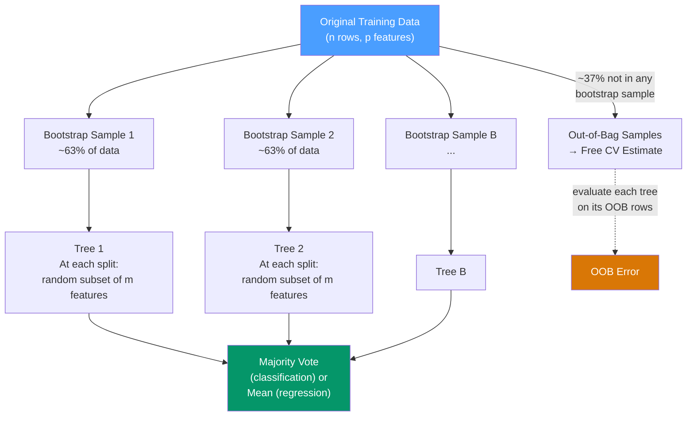

# 🌲 Random Forests in R

> [!abstract] TL;DR
> Random forests are an ensemble of decision trees grown on bootstrap samples, each split restricted to a random subset of features (`mtry`). The out-of-bag (OOB) error is a free cross-validation estimate. The `ranger` package is the modern fast implementation (~5–10× faster than `randomForest`); both are available via tidymodels with `set_engine("ranger")`. Random forests are the strongest tree-based baseline before trying XGBoost.

## Intuition — analogy FIRST

Imagine asking 500 different experts (each having seen a slightly different random sample of the historical data) to predict tomorrow's weather, then taking a majority vote. No single expert is perfect, but the **ensemble vote** averages out each expert's idiosyncratic errors.

Random forests add one more twist: at each decision point, each expert is only allowed to consider a **random subset of all available clues** (features). This prevents all experts from making the same correlated mistakes (e.g., all asking "Is it cloudy?" first), producing a more diverse and collectively more accurate ensemble.

---

## How It Works



---

## Key Concepts / Details

### Core Hyperparameters

| Parameter | What it controls | Typical value |
|-----------|----------------|---------------|
| `ntree` / `num.trees` | Number of trees | 500–1000 (more is better until plateau) |
| `mtry` | Features considered at each split | √p (classification), p/3 (regression) |
| `min.node.size` | Minimum node size before splitting | 1 (class), 5 (regression) |
| `max.depth` | Maximum tree depth | Unlimited (default, fully grown) |
| `replace` | Bootstrap with replacement | `TRUE` (default bagging) |
| `sample.fraction` | Fraction of data per tree | 1.0 (or 0.632 without replacement) |

### randomForest Package (Classic)

```r
library(randomForest)

# Basic random forest for regression
rf_basic <- randomForest(
  mpg ~ .,
  data     = mtcars,
  ntree    = 500,
  mtry     = 3,          # default for regression: floor(p/3)
  nodesize = 5,
  importance = TRUE      # compute variable importance
)

print(rf_basic)
# Type of random forest: regression
# Number of trees: 500
# No. of variables tried at each split: 3
# Mean of squared residuals: 4.87
# % Var explained: 86.29
# OOB error rate: 4.87 RMSE (this is a free CV estimate!)

# Predictions
predict(rf_basic, newdata = mtcars)

# Variable importance
importance(rf_basic)     # %IncMSE and IncNodePurity
varImpPlot(rf_basic, n.var = 10)

# Classification
rf_class <- randomForest(
  Species ~ .,
  data        = iris,
  ntree       = 500,
  mtry        = 2,       # default for classification: floor(sqrt(p))
  importance  = TRUE
)
# OOB error estimate
rf_class$err.rate[500, "OOB"]   # final OOB error rate
```

### ranger Package (Fast Modern Implementation)

ranger is 5–10× faster than randomForest, supports parallelism, and is the recommended implementation for large datasets.

```r
library(ranger)

# Regression
rf_ranger <- ranger(
  mpg ~ .,
  data           = mtcars,
  num.trees      = 500,
  mtry           = 3,
  min.node.size  = 5,
  importance     = "impurity",   # or "permutation" (more accurate but slower)
  num.threads    = 4,            # parallel
  seed           = 42
)

rf_ranger$prediction.error    # OOB RMSE² (for regression)
rf_ranger$variable.importance

# Classification
rf_cls <- ranger(
  Species ~ .,
  data          = iris,
  num.trees     = 500,
  mtry          = 2,
  importance    = "permutation",
  probability   = TRUE,         # output probabilities instead of class labels
  classification = TRUE
)
rf_cls$confusion.matrix        # OOB confusion matrix
```

### OOB Error — The Free Cross-Validation Estimate

Each tree in the forest is trained on a bootstrap sample (~63% of data). The remaining ~37% (out-of-bag) are used to evaluate that specific tree's predictions. Aggregating OOB predictions gives an estimate of generalization error **without any additional holdout set**.

```r
# Plot OOB error as a function of number of trees
plot(rf_basic)   # shows OOB error converging as ntree increases

# OOB error stabilizes — once error flattens, adding more trees wastes time
# Common heuristic: start with 500 trees; only increase if OOB is still decreasing at 500
```

### Feature Importance

Random forests provide two importance measures:

```r
# 1. Mean Decrease in Accuracy (permutation importance)
# How much does OOB accuracy drop when variable X is randomly permuted?
# More interpretable; preferred for inference

# 2. Mean Decrease in Gini / Node Purity (impurity importance)
# How much does this variable reduce impurity across all splits?
# Biased toward high-cardinality and continuous variables; faster to compute

# Using vip package for ggplot2-style importance plot
library(vip)
vip(rf_ranger, num_features = 10)   # works with ranger, randomForest, caret, tidymodels

# Partial Dependence Plots — marginal effect of one feature
library(pdp)
pdp_wt <- partial(rf_basic, pred.var = "wt", plot = TRUE, rug = TRUE)
```

### Via tidymodels

```r
library(tidymodels)

rf_spec <- rand_forest(
  trees = 500,
  mtry  = tune(),
  min_n = tune()
) |>
  set_engine("ranger", importance = "impurity") |>
  set_mode("regression")

rf_wf <- workflow() |>
  add_formula(mpg ~ .) |>
  add_model(rf_spec)

# Tune mtry and min_n via CV
folds <- vfold_cv(mtcars, v = 5)
rf_res <- tune_grid(rf_wf, resamples = folds,
                    grid = 10, metrics = metric_set(rmse))

best_rf <- select_best(rf_res, "rmse")
final_rf <- finalize_workflow(rf_wf, best_rf) |> fit(data = mtcars)
```

### randomForest vs ranger Comparison

| Feature | `randomForest` | `ranger` |
|---------|----------------|---------|
| Speed | Baseline | 5–10× faster |
| Parallelism | None | `num.threads` |
| Max features | All | Handles wide data better |
| Importance | `%IncMSE`, `IncNodePurity` | `"permutation"`, `"impurity"` |
| Survival | No | Yes |
| Probability forests | No | Yes (`probability = TRUE`) |
| Memory | Higher | Lower |

### Handling Missing Data

```r
# rfImpute: fill NAs using random forest proximity (for a few columns)
complete_data <- rfImpute(mpg ~ ., data = mtcars_with_nas, iter = 5)

# na.roughfix: fast rough imputation (median/mode) before fitting
mtcars_rough <- na.roughfix(mtcars_with_nas)
rf_fit <- randomForest(mpg ~ ., data = mtcars_rough)
```

---

## Real-World Notes

- **Random forests are the strongest out-of-the-box baseline** — with default hyperparameters they rarely perform terribly, unlike neural networks or SVMs.
- **OOB error is sufficient for most tuning decisions** — you don't need a separate validation set when the OOB estimate is reliable (n > 200).
- **Permutation importance > impurity importance** for interpretation — impurity importance is biased toward high-cardinality continuous features; permutation importance is unbiased.
- **`partial()` from pdp + `ggplot2`** is the standard way to visualize marginal effects from black-box models, though caution is needed when features are correlated.

---

## Common Pitfalls

1. **Not setting a seed** — random forests are stochastic; always set `set.seed()` before fitting for reproducible results.
2. **Using impurity importance for feature selection** — it's biased toward continuous variables and variables with many levels. Use permutation importance instead.
3. **Stopping at default `ntree = 500`** — always plot OOB error vs tree count; if it's still declining at 500, increase `ntree`.
4. **Expecting random forests to handle linear effects well** — they're non-parametric and don't extrapolate; for strong linear effects, a linear model often outperforms them out-of-sample.
5. **Ignoring class imbalance** — use `classwt` or `strata` arguments in `randomForest`/`ranger` for imbalanced classification; default will optimize overall accuracy, ignoring the minority class.

---

## Related Concepts

- [[_MOC_ML_in_R|↑ Section MOC]]
- [[XGBoost_in_R]] — Gradient boosting: sequential trees that beat random forests on many benchmarks
- [[caret_Package]] — `method = "ranger"` in caret
- [[tidymodels]] — `rand_forest() |> set_engine("ranger")` in tidymodels

---

## Review Questions

1. What is the "out-of-bag" error and why is it a reliable estimate of generalization error?
2. What does `mtry` control and what are the common default values for classification vs regression?
3. What is the difference between permutation importance and impurity importance?
4. When would you use `ranger` instead of `randomForest`?
5. Why do random forests outperform single decision trees for most real-world datasets?

---

## Sources

- Breiman L., Random Forests, *Machine Learning* 45 (1): 5–32 (2001)
- ranger package documentation — https://github.com/imbs-hl/ranger
- Boehmke B. & Greenwell B., *Hands-On Machine Learning with R*, Ch. 10 — https://bradleyboehmke.github.io/HOML/

#r-programming #machine-learning #random-forests
