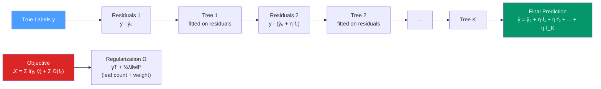

# ⚡ XGBoost in R

> [!abstract] TL;DR
> XGBoost fits trees **sequentially**, each correcting the pseudo-residuals of the previous ensemble, unlike random forests which grow trees in parallel. The regularized objective (γ leaf penalty + λ L2 weight penalty) and `early_stopping_rounds` with `xgb.cv` are the essential controls for avoiding overfitting. Feature importance via SHAP values is the principled interpretation method.

## Intuition — analogy FIRST

Random forests are like hiring 500 independent consultants who each see slightly different data and then taking a vote. XGBoost is like hiring consultants **one at a time**, where each new hire's job is specifically to fix the mistakes the previous team made. The first consultant gives rough predictions; the second focuses on where the first was wrong; the third focuses on where the first two were wrong together. Each round corrects the current ensemble's errors on a smaller and smaller scale.

This sequential correction (gradient descent in function space) is why boosting often outperforms bagging — it's a more targeted search for the model.

---

## How It Works



---

## Key Concepts / Details

### The XGBoost Objective

The regularized objective is the key distinction from standard gradient boosting:

ℒ = Σᵢ l(yᵢ, ŷᵢ) + Σₖ Ω(fₖ)

where Ω(f) = γT + ½λ‖w‖²

- **γT**: penalizes the number of leaves T (controls tree complexity)
- **½λ‖w‖²**: L2 penalty on leaf weights (shrinks predictions toward 0)
- Each tree is fitted by solving this with a second-order Taylor expansion of the loss (Newton step, not just gradient)

### Key Hyperparameters

| Parameter | Effect | Typical Range |
|-----------|--------|--------------|
| `eta` / `learning_rate` | Shrinkage: scales each tree's contribution | 0.01–0.3 |
| `max_depth` | Maximum depth of each tree | 3–10 |
| `n_rounds` / `nrounds` | Number of boosting rounds (trees) | 100–1000 |
| `subsample` | Row sampling fraction per tree | 0.5–1.0 |
| `colsample_bytree` | Column sampling fraction per tree | 0.5–1.0 |
| `gamma` | Minimum loss reduction to split a leaf | 0–5 |
| `lambda` | L2 regularization on leaf weights | 1 (default) |
| `alpha` | L1 regularization on leaf weights | 0 (default) |
| `min_child_weight` | Minimum sum of instance weight per leaf | 1–10 |

**Key insight:** Lower `eta` requires more `nrounds` to compensate, but generally gives better performance. Start with `eta = 0.1`, then use `early_stopping_rounds` to find the optimal `nrounds`.

### DMatrix — The Efficient Data Format

```r
library(xgboost)

# Prepare data
data(diamonds, package = "ggplot2")
df <- diamonds |>
  dplyr::mutate(dplyr::across(where(is.factor), as.numeric))

X_train <- as.matrix(df[1:40000, -which(names(df) == "price")])
y_train <- df[1:40000, "price"]$price
X_test  <- as.matrix(df[40001:nrow(df), -which(names(df) == "price")])
y_test  <- df[40001:nrow(df), "price"]$price

# DMatrix: XGBoost's cache-aware optimized format
# Key features: stores data in column-major format, handles NAs natively
dtrain <- xgb.DMatrix(data = X_train, label = y_train)
dtest  <- xgb.DMatrix(data = X_test,  label = y_test)

# With missing values: XGBoost handles NAs by learning which branch is best for them
dtrain_nas <- xgb.DMatrix(data = X_with_nas, label = y, missing = NA)
```

### Finding the Optimal Number of Rounds with xgb.cv

Never set `nrounds` by hand — use cross-validation to find the optimal value.

```r
# Define parameters
params <- list(
  objective        = "reg:squarederror",  # or "binary:logistic", "multi:softmax"
  eval_metric      = "rmse",
  eta              = 0.1,
  max_depth        = 6,
  subsample        = 0.8,
  colsample_bytree = 0.8,
  gamma            = 0,
  lambda           = 1
)

# Cross-validation to find optimal nrounds
cv_result <- xgb.cv(
  params    = params,
  data      = dtrain,
  nrounds   = 1000,
  nfold     = 5,
  early_stopping_rounds = 50,   # stop if no improvement for 50 rounds
  verbose   = 0,
  print_every_n = 10
)

best_nrounds <- cv_result$best_iteration   # e.g., 243
cat("Optimal rounds:", best_nrounds, "\n")
cat("CV RMSE:", min(cv_result$evaluation_log$test_rmse_mean), "\n")
```

### Training the Final Model

```r
# Train on full training data with the optimal nrounds
xgb_model <- xgboost(
  data    = dtrain,
  params  = params,
  nrounds = best_nrounds,
  verbose = 0
)

# Predictions
pred <- predict(xgb_model, newdata = dtest)
sqrt(mean((pred - y_test)^2))   # RMSE on test set
```

### Feature Importance

```r
# Three importance metrics:
# gain: contribution to reduction in loss (most informative)
# cover: relative number of observations affected by splits on this feature
# frequency: number of times feature used in splits

importance_matrix <- xgb.importance(model = xgb_model)
xgb.plot.importance(importance_matrix, top_n = 15)
```

### SHAP Values — Principled Feature Attribution

SHAP (SHapley Additive exPlanations) values satisfy mathematical axioms (efficiency, symmetry, dummy) that arbitrary importance scores don't. They decompose each prediction into feature contributions.

```r
library(shapviz)

# Compute exact tree SHAP values (fast for XGBoost)
shap_obj <- shapviz(xgb_model, X_pred = X_train)

# Global feature importance (beeswarm plot)
sv_importance(shap_obj, kind = "beeswarm")
# Each dot = one observation; color = feature value; x-position = SHAP value
# Red (high feature value) dots on the right → high feature value increases prediction

# Single prediction explanation (waterfall/force plot)
sv_waterfall(shap_obj, row_id = 1)   # explain the first observation
sv_force(shap_obj, row_id = 1)

# Dependence plot: how does feature X affect predictions?
sv_dependence(shap_obj, v = "carat")  # x=feature value, y=SHAP value
```

### Via tidymodels

```r
library(tidymodels)

xgb_spec <- boost_tree(
  trees          = 1000,
  tree_depth     = tune(),
  learn_rate     = tune(),
  loss_reduction = tune(),
  sample_size    = tune_prop(),
  mtry           = tune(),
  min_n          = tune()
) |>
  set_engine("xgboost") |>
  set_mode("regression")

xgb_wf <- workflow() |>
  add_recipe(rec) |>
  add_model(xgb_spec)

xgb_res <- tune_grid(
  xgb_wf,
  resamples = folds,
  grid      = 20,             # random search over 20 parameter combinations
  metrics   = metric_set(rmse, rsq)
)
```

---

## Real-World Notes

- **XGBoost vs LightGBM**: LightGBM uses histogram binning and leaf-wise growth (grows the leaf with the most gain, not level-by-level). LightGBM is usually faster on large datasets; XGBoost is more mature with broader support.
- **DART (Dropout Additive Regression Trees)**: `booster = "dart"` randomly drops trees during training (like dropout in neural networks). Helps prevent overfitting but makes `early_stopping_rounds` behave unpredictably.
- **Monotone constraints**: `monotone_constraints = c(1, 0, -1)` forces specific features to have monotone increasing (+1), unconstrained (0), or monotone decreasing (-1) effects — critical for regulatory compliance.

---

## Common Pitfalls

1. **Not using `early_stopping_rounds`** — without it, the model will always overfit given enough rounds. Always run `xgb.cv` first.
2. **Setting `eta` too high** — `eta = 0.3` (XGBoost default) is often too high; use 0.01–0.1 and compensate with more rounds.
3. **Using feature importance instead of SHAP** — gain importance can be misleading for correlated features; SHAP provides consistent local and global attributions.
4. **Not converting factors to numeric** — XGBoost requires numeric matrices. Use `model.matrix` or `dplyr::across(where(is.factor), as.numeric)`.
5. **Tuning on test data** — selecting `nrounds` based on test error (rather than CV or a separate validation set) introduces overfitting to the test set.

---

## Related Concepts

- [[_MOC_ML_in_R|↑ Section MOC]]
- [[Random_Forests_R]] — Parallel bagging alternative; often the comparison point for boosting
- [[tidymodels]] — `boost_tree() |> set_engine("xgboost")` for pipeline integration
- [[Deep_Learning_R_keras]] — Use when XGBoost on tabular data has plateaued

---

## Review Questions

1. What is the difference between gradient boosting (XGBoost) and bagging (random forests)?
2. What does `early_stopping_rounds = 50` do and why is it essential?
3. What is the difference between `gain`, `cover`, and `frequency` as importance metrics?
4. Why are SHAP values preferred over feature importance scores for model interpretation?
5. What does `colsample_bytree = 0.8` do and why does it help prevent overfitting?

---

## Sources

- Chen T. & Guestrin C., XGBoost: A Scalable Tree Boosting System, KDD 2016
- xgboost R documentation — https://xgboost.readthedocs.io/en/stable/R-package/xgboostPresentation.html
- Lundberg S. & Lee S., A Unified Approach to Interpreting Model Predictions (SHAP), NeurIPS 2017
- shapviz package — https://modeloriented.github.io/shapviz/

#r-programming #machine-learning #xgboost #gradient-boosting
