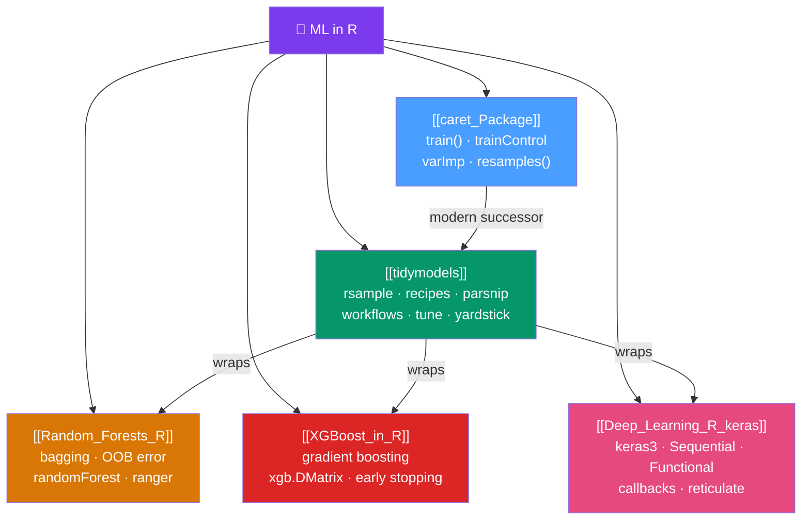

# 🤖 Machine Learning in R — Map of Content

> [!abstract] What This Section Covers
> R offers a mature, rigorous ML ecosystem especially strong for tabular data, honest cross-validation, and model interpretation. This section covers the end-to-end ML workflow through two unifying frameworks — **tidymodels** (the modern pipe-friendly grammar) and **caret** (the classic unified interface) — plus the dominant algorithms: Random Forests, XGBoost, and deep learning with keras. The cardinal rule: keep preprocessing inside resampling and reserve the test set for a single final estimate. Leakage is the cardinal sin.

## Concept Map

## Learning Path

1. [[caret_Package]] — Understand the unified training interface and cross-validation; caret's design philosophy informs tidymodels.
2. [[tidymodels]] — Learn the modern grammar: rsample → recipes → parsnip → workflows → tune → yardstick.
3. [[Random_Forests_R]] — Master the strongest baseline for tabular data: bagging, OOB error, feature importance.
4. [[XGBoost_in_R]] — Gradient boosting for competitive performance: sequential ensembles, regularization, early stopping.
5. [[Deep_Learning_R_keras]] — Deep learning when tabular methods plateau: Sequential/Functional API, callbacks, reticulate.

## All Notes at a Glance

| Note | Difficulty | What You'll Learn |
|------|------------|-------------------|
| [[caret_Package]] | Intermediate | train(), trainControl, tuneGrid, varImp, resamples() for model comparison |
| [[tidymodels]] | Intermediate | rsample splits, recipes preprocessing, parsnip engines, tune_grid, last_fit |
| [[Random_Forests_R]] | Intermediate | Bagging, mtry, OOB error, randomForest vs ranger, partial dependence |
| [[XGBoost_in_R]] | Advanced | Sequential boosting, xgb.DMatrix, early stopping, SHAP, LightGBM |
| [[Deep_Learning_R_keras]] | Advanced | keras3 Sequential/Functional API, callbacks, embedding in tidymodels |

## Key Questions This Section Answers

- How do I prevent data leakage when preprocessing inside cross-validation?
- What is the difference between caret and tidymodels?
- Why is OOB error a free cross-validation estimate for random forests?
- What does `early_stopping_rounds` do in XGBoost and why is it essential?
- How do I interpret XGBoost feature importance using SHAP values?
- When should I use deep learning vs gradient boosting for tabular data?
- How do I embed a neural network in a tidymodels pipeline?

## Related Sections

- [[_MOC_R_Programming_Master|↑ R Programming Master MOC]]
- [[_MOC_Statistical_Analysis|← Statistical Analysis]] — Classical models extend into regularized ML
- [[_MOC_Tidyverse|← Tidyverse]] — dplyr and readr prepare data for ML pipelines
- [[_MOC_Advanced_R|→ Advanced R]] — Rcpp for performance-critical preprocessing; Shiny for model deployment

#MOC #r-programming #machine-learning
