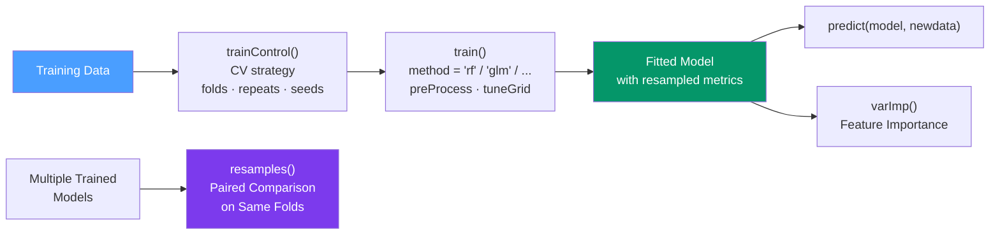

# 🎯 caret Package for Machine Learning

> [!abstract] TL;DR
> caret (**C**lassification **A**nd **RE**gression **T**raining) provides a single `train()` interface to 200+ ML algorithms — only the `method` argument changes between algorithms. `trainControl()` defines cross-validation strategy; `resamples()` enables statistically rigorous model comparison. While tidymodels is the modern successor, caret remains widely deployed and understanding it illuminates the design goals that tidymodels improves on.

## Intuition — analogy FIRST

Before caret, switching from a random forest to a SVM required learning a completely different function signature, a different data format, different output structure, and different tuning approach. caret solved this by acting as a **universal remote control** — one `train()` function, 200+ algorithms, one `predict()` call. The only change is `method = "rf"` vs `method = "svmRadial"`.

The key discipline caret enforces is **preprocessing inside resampling**: by passing `preProcess` to `train()` rather than preprocessing the data upfront, you prevent leakage — the normalizer is fitted on each training fold, not on the whole dataset.

---

## How It Works



---

## Key Concepts / Details

### trainControl — Define the Resampling Strategy

Always define `trainControl` once and reuse it across models to ensure **identical fold splits** for fair comparison.

```r
library(caret)

# 10-fold cross-validation
ctrl_cv <- trainControl(
  method           = "cv",
  number           = 10,
  verboseIter      = FALSE,
  classProbs       = TRUE,         # needed for AUC/ROC metrics
  summaryFunction  = twoClassSummary,  # ROC, Sens, Spec for binary classification
  savePredictions  = "final"       # save fold predictions for later analysis
)

# Repeated 10-fold CV (more stable estimates)
ctrl_rcv <- trainControl(
  method   = "repeatedcv",
  number   = 10,
  repeats  = 3,
  seeds    = set.seed(42)  # reproducible fold splits
)

# Other methods
trainControl(method = "boot",       number = 25)   # bootstrap
trainControl(method = "LOOCV")                     # leave-one-out
trainControl(method = "timeslice",  initialWindow = 100,  # time series CV
             horizon = 20, fixedWindow = TRUE)
```

### train() — Fitting Models

```r
# Binary classification example (Pima Indians diabetes data)
data(PimaIndiansDiabetes, package = "mlbench")
df <- PimaIndiansDiabetes

# 80/20 split (stratified by outcome)
set.seed(42)
train_idx  <- createDataPartition(df$diabetes, p = 0.8, list = FALSE)
train_data <- df[train_idx, ]
test_data  <- df[-train_idx, ]

# Logistic regression
fit_glm <- train(
  diabetes ~ .,
  data       = train_data,
  method     = "glm",
  family     = "binomial",
  trControl  = ctrl_cv,
  metric     = "ROC",
  preProcess = c("center", "scale")  # fitted inside each fold — no leakage
)

# Random forest
fit_rf <- train(
  diabetes ~ .,
  data      = train_data,
  method    = "rf",
  trControl = ctrl_cv,
  metric    = "ROC",
  tuneLength = 5   # try 5 values of mtry automatically
)

# Explicit tuning grid
fit_rf2 <- train(
  diabetes ~ .,
  data      = train_data,
  method    = "rf",
  trControl = ctrl_cv,
  tuneGrid  = expand.grid(mtry = c(2, 3, 4, 5, 6, 7, 8))
)
```

### Common caret Methods

| `method` | Algorithm | Required Package |
|---------|-----------|-----------------|
| `"glm"` | Logistic/Linear Regression | stats (base) |
| `"lm"` | Linear Regression | stats (base) |
| `"rf"` | Random Forest | randomForest |
| `"ranger"` | Fast Random Forest | ranger |
| `"xgbTree"` | XGBoost | xgboost |
| `"svmRadial"` | SVM (RBF kernel) | kernlab |
| `"glmnet"` | Regularized Regression (Lasso/Ridge) | glmnet |
| `"knn"` | K-Nearest Neighbors | class |
| `"nnet"` | Single-layer Neural Net | nnet |
| `"gbm"` | Gradient Boosting Machine | gbm |
| `"naive_bayes"` | Naïve Bayes | naivebayes |
| `"rpart"` | Decision Tree | rpart |

### Variable Importance

```r
# Model-agnostic importance (works for any method)
vip_rf <- varImp(fit_rf, scale = TRUE)
plot(vip_rf, top = 10)

# Interpretation: importance is scaled 0–100
# For random forests: mean decrease in accuracy when the variable is permuted
```

### Comparing Multiple Models

```r
# Fit multiple models with the SAME trainControl (same fold splits)
fit_glm   <- train(diabetes ~ ., data=train_data, method="glm",       trControl=ctrl_cv, metric="ROC")
fit_rf    <- train(diabetes ~ ., data=train_data, method="rf",        trControl=ctrl_cv, metric="ROC")
fit_xgb   <- train(diabetes ~ ., data=train_data, method="xgbTree",  trControl=ctrl_cv, metric="ROC")
fit_lasso <- train(diabetes ~ ., data=train_data, method="glmnet",   trControl=ctrl_cv, metric="ROC")

# Compare with paired t-tests on the same folds
resamp <- resamples(list(
  GLM   = fit_glm,
  RF    = fit_rf,
  XGB   = fit_xgb,
  LASSO = fit_lasso
))

summary(resamp)           # mean/SD/min/max of ROC, Sens, Spec per model
dotplot(resamp)           # visualize performance distribution
diff(resamp)              # pairwise differences (are differences significant?)
```

### Final Evaluation

```r
# Make predictions on the held-out test set
pred_class <- predict(fit_rf, newdata = test_data)                   # class labels
pred_prob  <- predict(fit_rf, newdata = test_data, type = "prob")   # probabilities

# Confusion matrix with all metrics
confusionMatrix(pred_class, test_data$diabetes, positive = "pos")

# ROC and AUC
library(pROC)
roc_curve <- roc(test_data$diabetes, pred_prob[, "pos"])
auc(roc_curve)    # area under the ROC curve
plot(roc_curve, print.auc = TRUE)
```

### The CV Estimate — Theory

The k-fold cross-validation error estimate is:

CV_k = (1/k) · Σⱼ₌₁ᵏ L(yᵢ, f̂⁻ʲ(xᵢ))

where f̂⁻ʲ is the model trained on all folds except fold j. caret implements this with `trainControl(method = "cv")`.

---

## caret vs tidymodels

| Feature | caret | tidymodels |
|---------|-------|-----------|
| API style | Single `train()` function | Separate, composable packages |
| Recipe/preprocessing | `preProcess` inside `train()` | `recipes` package (explicit) |
| Model spec | `method = "rf"` | `rand_forest() |> set_engine("ranger")` |
| Hyperparameter tuning | `tuneGrid`, `tuneLength` | `tune_grid()` with `tune()` placeholders |
| Workflow | Implicit | Explicit `workflow()` object |
| Extensibility | Hard to extend | Designed for extensions (Parsnip) |
| Active development | Maintenance mode | Actively developed |

**Recommendation:** Learn caret for legacy code; use tidymodels for new projects.

---

## Real-World Notes

- **`savePredictions = "final"` in trainControl** lets you access per-fold predictions for stack ensembling or custom analysis.
- **`tuneLength` vs `tuneGrid`**: use `tuneLength = 5` for quick exploration; define an explicit `expand.grid()` when you know the parameter space.
- **`method = "timeslice"` for time series** — prevents future data leaking into training folds by creating sequential sliding windows.
- **`classProbs = TRUE`** is required to use AUC-based metrics; without it, caret can only optimize accuracy.

---

## Common Pitfalls

1. **Preprocessing before `train()`** — normalizing the whole dataset, then calling `train()`, leaks test fold statistics into training. Use `preProcess` inside `train()`.
2. **Different fold splits for different models** — if you use different `trainControl` objects with different seeds, `resamples()` comparisons are invalid. Use one shared `ctrl` object.
3. **Using `tuneLength` without knowing the parameter space** — caret's default grid may miss the optimal range. Always visualize the tune plot and potentially expand the grid.
4. **Forgetting `classProbs = TRUE`** when you want AUC — results in an unhelpful error message.
5. **Treating resampled performance as the final number** — always evaluate on a held-out test set with `predict(model, newdata = test_data)`.

---

## Related Concepts

- [[_MOC_ML_in_R|↑ Section MOC]]
- [[tidymodels]] — The modern, more composable successor to caret
- [[Random_Forests_R]] — `method = "rf"` and `method = "ranger"` in caret
- [[XGBoost_in_R]] — `method = "xgbTree"` in caret

---

## Review Questions

1. Why must preprocessing be done inside `trainControl` rather than upfront on the full training data?
2. What is the purpose of using the same `trainControl` object across all models in `resamples()`?
3. What does `tuneGrid = expand.grid(mtry = c(2, 4, 6))` do?
4. What does `varImp(fit)` return and how is importance computed for random forests?
5. When would you use `method = "timeslice"` in `trainControl` and what does it prevent?

---

## Sources

- Kuhn M., Building Predictive Models in R Using the caret Package, JSS (2008)
- caret documentation — https://topepo.github.io/caret/
- Kuhn M. & Johnson K., *Applied Predictive Modeling* (2013) — Springer

#r-programming #machine-learning #caret
