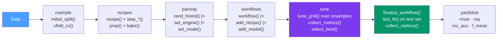

# 🔧 tidymodels Workflow

> [!abstract] TL;DR
> tidymodels is a collection of packages sharing one grammar for the complete ML lifecycle: **rsample** for splits, **recipes** for preprocessing (fitted only on training data), **parsnip** for model specification (engine-agnostic), **workflows** to bind them together, **tune** for hyperparameter search, and **yardstick** for metrics. The grammar is pipe-friendly and swappable — change `set_engine("ranger")` to `set_engine("randomForest")` without touching anything else.

## Intuition — analogy FIRST

tidymodels applies the Tidyverse philosophy to the ML lifecycle. Just as dplyr gives you composable verbs for data manipulation, tidymodels gives you composable components for ML pipelines — each does one job well and they're designed to fit together.

The most important design decision: **recipes are preprocessing blueprints, not transforms**. A recipe is *defined* on training data but only *applied* at prediction time. This means preprocessing (normalization, imputation) is automatically refitted on each training fold, preventing the most common form of data leakage.

---

## How It Works



---

## Key Concepts / Details

### Step 1: rsample — Splitting Data

```r
library(tidymodels)

set.seed(42)

# 80/20 stratified split
split <- initial_split(diamonds, prop = 0.8, strata = price)
train_data <- training(split)
test_data  <- testing(split)

# 10-fold CV for tuning
folds <- vfold_cv(train_data, v = 10, strata = price)

# Bootstraps for unstable models or small data
boots <- bootstraps(train_data, times = 25, strata = price)
```

### Step 2: recipes — Preprocessing Blueprints

A recipe defines the preprocessing steps. It is **not yet applied** — it's a blueprint that will be fitted on each training fold.

```r
rec <- recipe(price ~ ., data = train_data) |>

  # Imputation
  step_impute_median(all_numeric_predictors()) |>   # median imputation for numeric
  step_impute_mode(all_nominal_predictors()) |>      # mode for categorical

  # Encoding categorical variables
  step_dummy(all_nominal_predictors(), one_hot = FALSE) |>  # reference-coded dummies

  # Numeric transformations
  step_log(price, base = 10, skip = TRUE) |>  # log-transform outcome (skip=TRUE: not applied to test)
  step_normalize(all_numeric_predictors()) |>  # center and scale

  # Remove problematic features
  step_zv(all_predictors()) |>     # remove zero-variance predictors
  step_corr(all_numeric_predictors(), threshold = 0.9)  # remove highly correlated

# Inspect the prepared recipe (to verify steps are working)
prep(rec) |> bake(new_data = NULL) |> glimpse()
```

**Common recipe steps:**

| Step | Purpose |
|------|---------|
| `step_impute_median()` | Median imputation (numeric) |
| `step_impute_knn()` | KNN imputation |
| `step_dummy()` | Dummy encoding for categorical |
| `step_normalize()` | Center and scale |
| `step_log()` | Log transform |
| `step_poly()` | Polynomial features |
| `step_pca()` | PCA dimensionality reduction |
| `step_zv()` | Remove zero-variance |
| `step_corr()` | Remove highly correlated |
| `step_date()` | Extract date components |
| `step_tokenize()` (textrecipes) | Tokenize text columns |

### Step 3: parsnip — Engine-Agnostic Model Specification

```r
# Random forest — engine is swappable
rf_spec <- rand_forest(
  trees = 500,
  mtry  = tune(),    # tune() means "we'll search this hyperparameter"
  min_n = tune()
) |>
  set_engine("ranger", importance = "impurity") |>  # or "randomForest"
  set_mode("regression")   # or "classification"

# XGBoost
xgb_spec <- boost_tree(
  trees          = 1000,
  tree_depth     = tune(),
  learn_rate     = tune(),
  loss_reduction = tune(),
  sample_size    = tune(),
  mtry           = tune()
) |>
  set_engine("xgboost") |>
  set_mode("regression")

# Logistic regression
lr_spec <- logistic_reg(penalty = tune(), mixture = tune()) |>
  set_engine("glmnet") |>
  set_mode("classification")
```

### Step 4: workflows — Binding Recipe + Model

```r
# Bind recipe and model into a single object
rf_wf <- workflow() |>
  add_recipe(rec) |>
  add_model(rf_spec)

# Can also fit directly (no tuning)
rf_fit <- rf_wf |> fit(data = train_data)
predict(rf_fit, new_data = test_data)
```

### Step 5: tune — Hyperparameter Search

```r
# Define tuning grid
rf_grid <- grid_regular(
  mtry(range = c(2, 8)),
  min_n(range = c(5, 30)),
  levels = 5    # 5 values per parameter → 25 combinations
)

# Random grid (more efficient for many parameters)
xgb_grid <- grid_latin_hypercube(
  tree_depth(),
  learn_rate(),
  loss_reduction(),
  sample_size = sample_prop(),
  finalize(mtry(), train_data),
  size = 30
)

# Run hyperparameter search across CV folds
rf_results <- tune_grid(
  rf_wf,
  resamples = folds,
  grid      = rf_grid,
  metrics   = metric_set(rmse, rsq, mae),
  control   = control_grid(verbose = FALSE, save_pred = TRUE)
)

# Inspect results
collect_metrics(rf_results)
autoplot(rf_results)             # performance vs hyperparameter values
show_best(rf_results, "rmse", n = 5)   # top 5 configurations by RMSE
select_best(rf_results, "rmse")        # single best configuration
```

### Step 6: Finalize and Final Test Evaluation

```r
# Get best hyperparameters
best_params <- select_best(rf_results, "rmse")

# Finalize workflow with best parameters
final_wf <- finalize_workflow(rf_wf, best_params)

# last_fit: fit on full training data, evaluate once on test set
# This gives the single honest test set estimate
final_fit <- last_fit(final_wf, split)

# Final metrics (computed on the test set)
collect_metrics(final_fit)    # rmse and rsq on held-out test data

# Final predictions on test set
collect_predictions(final_fit) |>
  ggplot(aes(x = price, y = .pred)) +
  geom_point(alpha = 0.2) +
  geom_abline(slope = 1, intercept = 0, colour = "red") +
  coord_obs_pred() +
  theme_minimal()

# Extract the fitted model for deployment
final_model <- extract_workflow(final_fit)
saveRDS(final_model, "model.rds")
```

### yardstick — Performance Metrics

```r
# Regression metrics
metric_set(rmse, rsq, mae, mape)

# Classification metrics
metric_set(roc_auc, f_meas, accuracy, sensitivity, specificity)

# Multi-class
metric_set(roc_auc, accuracy, kap)

# Custom metric
my_metric <- function(data, truth, estimate, ...) {
  # implement custom metric here
}
new_metric <- new_numeric_metric(my_metric, direction = "minimize")
```

---

## Real-World Notes

- **`last_fit()` is the keystone** — always use it for the final evaluation. Never call `predict()` on the test set multiple times to tune; that makes the test set a validation set.
- **`workflow_set()`** fits multiple model + recipe combinations across the same resamples — useful for comparing preprocessing strategies alongside model algorithms.
- **`vetiver` package** packages a fitted workflow for deployment as a Plumber API or Shiny model card.
- **`stacks` package** builds ensemble models from the CV predictions saved by `tune_grid(control = control_stack_grid())`.

---

## Common Pitfalls

1. **Calling `prep()` on the full data** — you should almost never call `prep()` manually in a tidymodels workflow; `workflow()` handles it correctly per-fold.
2. **Not using `strata` in `initial_split`** — for imbalanced classification, unstratified splits may put all rare events in the test set.
3. **Using `rmse` to compare models trained on different scales** — if one recipe log-transforms the outcome and another doesn't, RMSE is on different scales and incomparable.
4. **Forgetting `tune()` placeholders** — parameters without `tune()` are fixed; you must mark which parameters to search.
5. **Evaluating multiple times on `testing(split)`** — defeats the purpose of a held-out set. Evaluate once with `last_fit()`.

---

## Related Concepts

- [[_MOC_ML_in_R|↑ Section MOC]]
- [[caret_Package]] — The predecessor; understanding caret clarifies what tidymodels improves
- [[Random_Forests_R]] — `rand_forest() |> set_engine("ranger")` in tidymodels
- [[XGBoost_in_R]] — `boost_tree() |> set_engine("xgboost")` in tidymodels
- [[dplyr_Data_Manipulation]] — tidymodels outputs are tibbles that dplyr can process

---

## Review Questions

1. What is the difference between `prep(rec)` and `bake(prep(rec), new_data)`?
2. Why does `step_normalize()` inside a `recipe()` prevent data leakage vs normalizing upfront?
3. What does `tune()` inside a model spec do?
4. Why should you call `last_fit()` only once and on which split?
5. What is the difference between `select_best()` and `finalize_workflow()`?

---

## Sources

- Kuhn M. & Silge J., *Tidy Modeling with R* — https://www.tmwr.org (free online)
- tidymodels reference — https://www.tidymodels.org/reference/
- Kuhn M., *Feature Engineering and Selection* — https://bookdown.org/max/FES/

#r-programming #machine-learning #tidymodels
