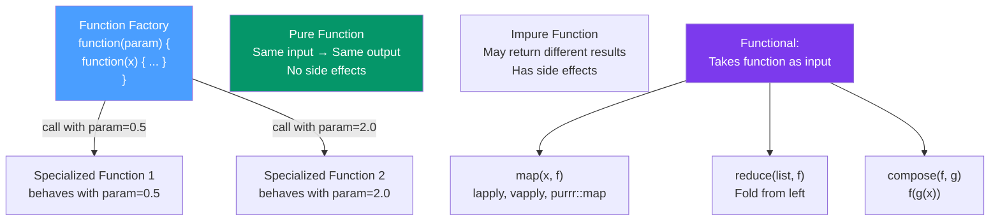

# λ Functional Programming in R

> [!abstract] TL;DR
> R is fundamentally a functional language: functions are first-class objects, closures capture their enclosing environment, and the language encourages pure functions over stateful mutation. **Function factories** (closures that return functions) are the key FP pattern for parameterizing behavior. `memoise` adds caching; `purrr::compose` and `purrr::partial` enable point-free composition and partial application. Lazy evaluation (promises) and `force()` are the essential nuances.

## Intuition — analogy FIRST

In R, a function is a value — you can store it in a variable, pass it to another function, or return it from a function. A **function factory** is a function that manufactures other functions. Imagine a machine in a factory that you feed one parameter (like temperature), and it produces a specialized worker function configured for that temperature. Call the factory with `temp = 350` and get a function that roasts at exactly 350°. Call it with `temp = 400` and get a different roasting function.

This pattern replaces inheritance hierarchies with composition: instead of inheriting behavior from a parent class, you **compose** pre-configured function objects.

---

## How It Works



---

## Key Concepts / Details

### Function Factories and Closures

A closure is a function that **captures (closes over) its enclosing environment** at the time of definition. A function factory returns a closure configured with a parameter.

```r
# Basic function factory
power_factory <- function(exponent) {
  function(x) x^exponent  # captures 'exponent' from enclosing environment
}

square <- power_factory(2)
cube   <- power_factory(3)

square(4)   # 16
cube(4)     # 64

# The captured environment persists
adder_factory <- function(n) {
  force(n)   # force() evaluates n NOW, not lazily — critical for loops!
  function(x) x + n
}
add5  <- adder_factory(5)
add10 <- adder_factory(10)
add5(3)    # 8
add10(3)   # 13
```

### The Lazy Evaluation Trap and force()

R uses **lazy evaluation** (call-by-need): function arguments are not evaluated until first used. In loops creating function factories, this causes the classic bug where all factories share the same `n` value.

```r
# BUG: all functions use n=3 (the final value of n)
funs <- vector("list", 3)
for (n in 1:3) {
  funs[[n]] <- function(x) x + n  # n is NOT captured at definition time!
}
funs[[1]](0)  # 3, not 1!

# FIX 1: Use force() to immediately evaluate the argument
factory_fixed <- function(n) {
  force(n)     # forces evaluation of n before returning the closure
  function(x) x + n
}
funs <- lapply(1:3, factory_fixed)
funs[[1]](0)  # 1 ✓

# FIX 2: Use local() to create a fresh scope
funs <- vector("list", 3)
for (n in 1:3) {
  local({
    captured_n  <- n
    funs[[n]] <<- function(x) x + captured_n
  })
}
```

### Memoization — Caching Expensive Function Calls

```r
library(memoise)

# Wrap any function to cache its results
slow_function <- function(x) {
  Sys.sleep(1)   # simulate expensive computation
  x^2
}

fast_function <- memoise(slow_function)
fast_function(4)   # takes ~1 second (computes)
fast_function(4)   # instantaneous (cache hit)

# Custom cache backend (Redis, file system, etc.)
cache <- cachem::cache_disk("./cache_dir")
fast_fn <- memoise(slow_function, cache = cache)

# Clear the cache
memoise::forget(fast_fn)   # clear all cached values

# Memoization with multiple arguments
memoised_lm <- memoise(function(formula, data) lm(formula, data))
```

### Function Composition

```r
library(purrr)

# compose: f(g(x)) — applies right to left
log_then_sqrt <- compose(sqrt, log)  # sqrt(log(x))
log_then_sqrt(exp(4))   # sqrt(4) = 2

# Equivalently with base R pipe (R 4.1+)
log_then_sqrt2 <- \(x) x |> log() |> sqrt()

# Compose a data pipeline
clean_data <- compose(
  \(df) filter(df, !is.na(price)),
  \(df) select(df, -id),
  \(df) mutate(df, price = log(price))
)
# Applied as: clean_data(raw_df)

# Reduce for composing a list of functions
fns <- list(
  \(x) x + 1,
  \(x) x * 2,
  \(x) x - 3
)
pipeline <- reduce(fns, compose)
pipeline(5)   # (5+1)*2-3 = 9
```

### Partial Application

```r
library(purrr)

# partial: fix some arguments, return a function with fewer arguments
mean_na_rm <- partial(mean, na.rm = TRUE)
mean_na_rm(c(1, 2, NA, 4))   # 7/3

# partial with placeholder `.` for positional arguments
# Note: purrr::partial doesn't use . like magrittr; instead, bind by name
log_base2 <- partial(log, base = 2)
log_base2(8)   # 3

# Equivalent using anonymous functions (more explicit, preferred in modern R)
log_base2 <- \(x) log(x, base = 2)

# practical use: specialized summary functions
p_quantile <- function(p) partial(quantile, probs = p, na.rm = TRUE)
p25 <- p_quantile(0.25)
p75 <- p_quantile(0.75)
```

### Pure vs Impure Functions

| Property | Pure Function | Impure Function |
|----------|--------------|-----------------|
| Determinism | Same input → Same output | May vary (random, time, I/O) |
| Side effects | None | May modify state (files, globals, DB) |
| Dependencies | Only arguments | May use global state |
| Testing | Trivial to unit test | Requires mocking |
| Examples | `sum`, `sqrt`, `paste` | `print`, `write.csv`, `Sys.time()` |

```r
# Pure: doesn't depend on external state
normalize <- function(x) (x - mean(x)) / sd(x)

# Impure: depends on and modifies global state
counter <- 0
impure_count <- function() {
  counter <<- counter + 1   # side effect: modifies global variable
  counter
}

# Good practice: push impurity to the boundary
# Business logic stays pure (easy to test)
# I/O stays at the edges (orchestration layer)
pipeline_result <- train_data |> normalize() |> fit_model()
save_results(pipeline_result, "output.rds")  # impurity at the edge
```

---

## Real-World Notes

- **Function factories are extensively used in ggplot2** — `scale_colour_*` functions are factories that produce scale objects parameterized by the type and palette.
- **`memoise` is the easiest performance win** for functions called repeatedly with the same inputs (API responses, database queries, expensive feature engineering).
- **`Reduce(f, list)` from base R** is the standard fold — prefer `purrr::reduce` for readability.
- **`environment(fun)` and `ls(environment(fun))`** let you inspect what a closure has captured — useful for debugging factory-produced functions.

---

## Common Pitfalls

1. **Forgetting `force()` in loops** — the lazy evaluation trap creates functions that all close over the same final value. Always `force()` parameters in function factories.
2. **Memoizing impure functions** — if a function has side effects or depends on external state that changes, memoization will return stale cached results.
3. **Deeply nested `compose()` chains** — beyond 3–4 functions, explicit pipes (`|>`) are more readable.
4. **Using `<<-` in closures to simulate mutable state** — functional state (counters, accumulators) is better served by R6 when the statefulness is complex.
5. **Confusing `partial` and `curry`** — `partial` fixes specific named arguments; full currying transforms `f(x, y)` into `f(x)(y)` (R has no built-in curry but `Reduce` and purrr can simulate it).

---

## Related Concepts

- [[_MOC_Advanced_R|↑ Section MOC]]
- [[purrr_Functional_Programming]] — purrr's map/reduce functions are the applied FP tools
- [[Metaprogramming_R]] — NSE is a form of FP applied to code as data
- [[R6_Classes_OOP]] — OOP alternative to function factories for complex stateful logic

---

## Review Questions

1. What is a closure and what environment does it capture?
2. Why does the lazy evaluation trap occur in loops and how does `force()` fix it?
3. What does memoization do and when should you not use it?
4. What is the difference between `compose(f, g)` and `\(x) f(g(x))`?
5. What makes a function "pure" and why does purity make testing easier?

---

## Sources

- Wickham H., *Advanced R* (2e), Chs. 6, 10 — Functions and Functionals — https://adv-r.hadley.nz
- Wickham H., *Advanced R* (2e), Ch. 11 — Function Factories
- memoise package — https://memoise.r-lib.org/

#r-programming #advanced-r #functional-programming #closures
