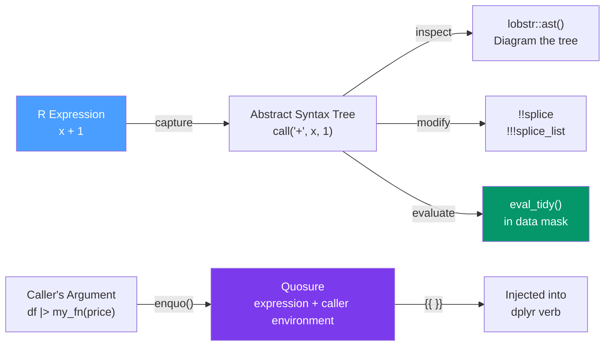

# 🔮 Metaprogramming in R

> [!abstract] TL;DR
> R is **homoiconic** — code is data (a list of language objects) that you can capture, inspect, modify, and evaluate. This is the mechanism behind every Tidyverse DSL: `dplyr::mutate(df, x + 1)` captures the expression `x + 1` and evaluates it with `x` meaning a column, not an R variable. Master `enquo`/`{{ }}` for capturing column-name arguments, `!!` for splicing, and `eval_tidy` for data-masked evaluation.

## Intuition — analogy FIRST

In most programming languages, code is instructions that execute. In R, code is also **data** — the expression `x + 1` can be captured as a list `list("+", "x", 1)` before it runs, stored, modified, and evaluated later in a different context.

Non-standard evaluation (NSE) exploits this: instead of evaluating `x + 1` immediately (where `x` must be an R variable), dplyr **captures** the expression, carries it to a data frame context, and evaluates it there (where `x` means a column). This is how you write `filter(df, x > 0)` without quoting `"x"`.

---

## How It Works



---

## Key Concepts / Details

### R is Homoiconic — Code as Data

```r
# A function call is a list: the operator and its arguments
x_plus_1 <- quote(x + 1)   # capture WITHOUT evaluating
class(x_plus_1)             # "call"
typeof(x_plus_1)            # "language"

# Inspect the AST
library(lobstr)
ast(x + 1)
#> <call>
#>   <name: `+`>
#>   <name: x>
#>   <double: 1>

# The three types of language objects
quote(x)            # symbol (variable name)
quote(x + 1)        # call (function call)
quote(1 + 2)        # another call
quote("hello")      # string (evaluates immediately)
1L                  # atomic value

# eval: evaluate a captured expression
x <- 10
eval(quote(x + 1))   # 11
```

### Base R NSE Tools

```r
# quote: capture an expression (no substitution)
expr1 <- quote(x + y)

# bquote: partial substitution with .()
a <- 5
expr2 <- bquote(x + .(a))    # x + 5 (.(a) evaluates a)

# substitute: capture AND replace symbols with actuals (inside functions)
f <- function(x) {
  substitute(x)   # captures what caller passed as 'x', BEFORE evaluation
}
f(price * 2)   # returns the expression `price * 2` as a language object
deparse(f(price * 2))  # "price * 2" (convert to string)

# eval + substitute pattern (legacy NSE)
my_filter_base <- function(df, condition) {
  rows <- eval(substitute(condition), envir = df, enclos = parent.frame())
  df[rows, ]
}
my_filter_base(mtcars, mpg > 20)
```

### rlang — Modern Tidy Evaluation

rlang provides a principled NSE system. The key objects are **quosures** — expressions bundled with their definition environment.

```r
library(rlang)

# expr: capture an expression (no environment, no substitution)
e <- expr(x + 1)

# enquo: capture a CALLER's argument as a quosure (with its environment)
my_fn <- function(df, col) {
  col_quo <- enquo(col)   # capture col as a quosure
  dplyr::mutate(df, new_col = !!col_quo)  # !! = splice/evaluate the quosure
}
my_fn(mtcars, mpg * 2)

# {{ }} embracing: shorthand for enquo + !! (most common pattern)
my_summarise <- function(df, group_col, val_col) {
  df |>
    dplyr::group_by({{ group_col }}) |>
    dplyr::summarise(mean = mean({{ val_col }}, na.rm = TRUE))
}
my_summarise(mtcars, cyl, mpg)
```

### The Tidy Evaluation Rules

| Pattern | When to Use |
|---------|------------|
| `{{ col }}` | Capture a bare column argument and inject it into dplyr/ggplot2 |
| `.data[[col_string]]` | When the column name comes as a string variable |
| `!!` | Splice a single quosure or expression |
| `!!!` | Splice a list of quosures into a function call |
| `enquo(col)` | Capture before passing to multiple verbs |
| `enquos(...)` | Capture `...` as a list of quosures |

```r
# Pattern 1: {{ }} for bare column names (most common)
my_filter <- function(df, filter_col) {
  df |> dplyr::filter({{ filter_col }} > 0)
}
my_filter(mtcars, mpg)   # filter(mpg > 0)

# Pattern 2: .data[[]] for string column names
my_filter_str <- function(df, col_name) {
  df |> dplyr::filter(.data[[col_name]] > 0)
}
my_filter_str(mtcars, "mpg")  # same result

# Pattern 3: !!! for programmatic multiple arguments
cols_to_select <- c("mpg", "cyl", "hp")
mtcars |> dplyr::select(!!!rlang::syms(cols_to_select))

# Pattern 4: enquos for ... forwarding
my_group_summary <- function(df, ...) {
  df |>
    dplyr::group_by(...) |>
    dplyr::summarise(n = n(), .groups = "drop")
}
my_group_summary(mtcars, cyl, gear)
```

### eval_tidy — Evaluation in a Data Mask

```r
library(rlang)

# eval_tidy evaluates an expression in a data context
# Data mask: column names shadow R variables
df <- data.frame(x = 1:5, y = 6:10)
x <- 999   # R variable named x

eval_tidy(expr(x + y), data = df)   # uses df$x (not the R variable x = 999)
# [1]  7  9 11 13 15

# Building a custom data-masking function from scratch
my_mutate <- function(df, new_col, expr) {
  new_val <- eval_tidy(enquo(expr), data = df)
  df[[deparse(substitute(new_col))]] <- new_val
  df
}
my_mutate(mtcars, mpg_wt_ratio, mpg / wt)
```

### Inspecting ASTs with lobstr

```r
library(lobstr)

# Visualize the abstract syntax tree
ast(1 + 2 * 3)
#> <call>
#>   <name: `+`>
#>   <double: 1>
#>   <call>
#>     <name: `*`>
#>     <double: 2>
#>     <double: 3>

ast(f(x, g(y), z = 1))  # named arguments appear as-is

# obj_size: accurate object sizes accounting for shared memory
x <- 1:1e6
y <- list(x, x)    # y contains TWO references to x, not TWO copies
obj_size(x)        # ~4 MB
obj_size(y)        # ~4 MB (not 8 MB! shared reference)
obj_size(x, y)     # ~4 MB (x is already counted in y)
```

---

## Real-World Notes

- **`{{ }}` is 99% of what you need** for writing safe dplyr helper functions. Only reach for `enquo`/`!!` when you need to pass the quosure to multiple verbs or store it.
- **dbplyr translates tidy evaluation to SQL** using the same machinery — `filter(db_tbl, x > 0)` generates `WHERE x > 0` in SQL.
- **`rlang::as_label(enquo(col))`** gives you the string representation of the column name — useful for auto-generating axis labels or column names.
- **`lobstr::ast()` is the debugging tool** when your NSE code produces unexpected results — it shows exactly what expression was captured.

---

## Common Pitfalls

1. **Using `quote()` instead of `enquo()`** — `quote()` captures in the current environment; `enquo()` captures in the caller's environment. NSE functions must use `enquo`.
2. **`{{ }}` only works with dplyr/ggplot2** — it specifically uses `eval_tidy` with a data mask. Don't try to use it with base R functions.
3. **Forgetting `!!` when using `enquo`** — `enquo(col)` captures; `!!col_quo` evaluates the captured expression. Miss the `!!` and you pass a quosure object, not its value.
4. **Confusing `expr` and `enquo`** — `expr(x)` captures the symbol `x` (not a quosure); `enquo(x)` captures whatever the caller passed as `x` with its environment.
5. **`deparse(substitute(x))` for string column names** — the modern way is `rlang::as_label(enquo(x))` which handles complex expressions better.

---

## Related Concepts

- [[_MOC_Advanced_R|↑ Section MOC]]
- [[dplyr_Data_Manipulation]] — All dplyr verbs use tidy evaluation internally
- [[Functional_Programming_R]] — NSE is FP applied to code as data
- [[R6_Classes_OOP]] — R6 methods can use NSE via `rlang::caller_env()`

---

## Review Questions

1. What is the difference between `quote(x + 1)` and `enquo(x)` inside a function?
2. What does `{{ col }}` do inside a custom dplyr function and when would you use `.data[[col]]` instead?
3. What is a quosure and what two things does it bundle together?
4. What does `eval_tidy(expr, data = df)` do differently from `eval(expr, envir = df)`?
5. How would you write a function `my_select(df, ...)` that passes multiple column names to `dplyr::select`?

---

## Sources

- Wickham H., *Advanced R* (2e), Chs. 17–21 — Metaprogramming — https://adv-r.hadley.nz
- Henry L., *Programming with dplyr* vignette — https://dplyr.tidyverse.org/articles/programming.html
- rlang documentation — https://rlang.r-lib.org/reference/

#r-programming #advanced-r #metaprogramming #nse #tidy-evaluation
