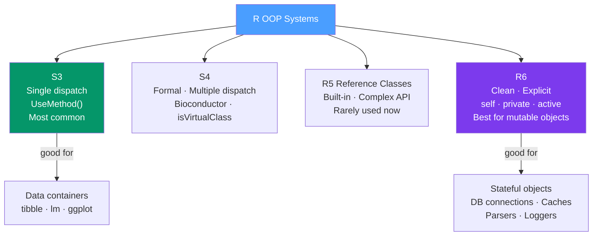

# 🏗️ R6 Classes and OOP in R

> [!abstract] TL;DR
> R has four OOP systems: **S3** (simple single-dispatch, the Tidyverse default), **S4** (formal with multiple dispatch, used in Bioconductor), **R5/Reference Classes** (built-in mutable objects), and **R6** (clean mutable objects with private fields and active bindings). Use S3 for data containers that integrate with generics (`[`, `print`, `summary`); use R6 for connections, caches, parsers, and accumulators where identity and mutation are intentional.

## Intuition — analogy FIRST

Most R objects are like **photocopies**: pass a data frame to a function and the function gets its own copy. Change it inside the function and the original is untouched. This is copy-on-modify (value semantics).

R6 objects are like **the original document**: there's one object and everyone with a reference to it sees the same state. Close a database connection in one part of your code and it's closed everywhere. This is reference semantics.

The rule: use copy-on-modify (S3) for data containers that flow through pipes; use reference semantics (R6) for objects that must maintain state — connections, counters, caches, event emitters.

---

## How It Works



---

## Key Concepts / Details

### S3 — Simple Single Dispatch

S3 is R's oldest and most common OOP system. A class is just a `class` attribute; dispatch calls `UseMethod("generic")`.

```r
# Create an S3 class
new_dog <- function(name, breed, age) {
  obj <- list(name = name, breed = breed, age = age)
  class(obj) <- "Dog"
  obj
}

# Define generics by creating methods with the pattern: generic.ClassName
print.Dog <- function(x, ...) {
  cat(sprintf("Dog: %s (%s), age %d\n", x$name, x$breed, x$age))
}
bark <- function(x, ...) UseMethod("bark")
bark.Dog <- function(x, ...) cat("Woof!\n")

# Use it
rex <- new_dog("Rex", "German Shepherd", 3)
print(rex)   # dispatches to print.Dog
bark(rex)    # dispatches to bark.Dog

# S3 inheritance
new_service_dog <- function(name, breed, age, task) {
  obj <- new_dog(name, breed, age)
  obj$task <- task
  class(obj) <- c("ServiceDog", "Dog")  # inheritance chain
  obj
}
bark.ServiceDog <- function(x, ...) cat("*quiet alert bark*\n")
# Falls back to bark.Dog if ServiceDog method not defined
```

### R6 — Modern Mutable Objects

```r
library(R6)

# Define an R6 class
Counter <- R6Class(
  classname = "Counter",

  # Private fields and methods (only accessible inside the class)
  private = list(
    count       = 0,
    step_size   = 1,
    .history    = NULL   # leading dot convention for private fields
  ),

  # Public fields and methods (accessible from outside)
  public = list(
    initialize = function(start = 0, step = 1) {
      private$count     <- start
      private$step_size <- step
      private$.history  <- numeric(0)
      invisible(self)
    },

    increment = function(by = private$step_size) {
      private$count    <- private$count + by
      private$.history <- c(private$.history, private$count)
      invisible(self)   # return self enables method chaining
    },

    decrement = function(by = private$step_size) {
      private$count    <- private$count - by
      private$.history <- c(private$.history, private$count)
      invisible(self)
    },

    reset = function() {
      private$count    <- 0
      private$.history <- numeric(0)
      invisible(self)
    },

    print = function(...) {
      cat("Counter:", private$count, "\n")
      invisible(self)
    }
  ),

  # Active bindings: computed properties, accessed like fields (no parentheses)
  active = list(
    value   = function() private$count,
    history = function() private$.history
  )
)

# Create instances
c1 <- Counter$new(start = 10, step = 2)
c1$increment()$increment()$increment()   # method chaining
c1$value        # active binding → 16
c1$history      # active binding → c(12, 14, 16)
c1$print()

# References semantics: c2 and c1 point to the SAME object
c2 <- c1
c2$increment()
c1$value   # 18! Because c2 and c1 are the same object

# Clone: create an independent copy
c3 <- c1$clone(deep = TRUE)
c3$increment()
c1$value  # still 18; c3 is independent
```

### Inheritance with R6

```r
# Parent class
Animal <- R6Class("Animal",
  public = list(
    name     = NULL,
    initialize = function(name) self$name <- name,
    speak    = function() cat("...\n"),
    describe = function() cat(sprintf("%s says: ", self$name))
  )
)

# Child class inherits with `inherit = Animal`
Dog <- R6Class("Dog",
  inherit = Animal,
  public = list(
    breed = NULL,
    initialize = function(name, breed) {
      super$initialize(name)   # call parent's initialize
      self$breed <- breed
    },
    speak = function() {
      self$describe()
      cat("Woof!\n")
    }
  )
)

rex <- Dog$new("Rex", "Labrador")
rex$speak()   # "Rex says: Woof!"
```

### OOP Systems Comparison

| Feature | S3 | S4 | R6 |
|---------|----|----|-----|
| Dispatch | Single | Multiple | Method-based |
| Formal class definition | No | Yes (`setClass`) | Yes (`R6Class`) |
| Private fields | No | No | Yes |
| Reference semantics | No | No | Yes |
| Method inheritance | Informal (`NextMethod`) | Formal (`callNextMethod`) | Formal (`super$`) |
| Active bindings | No | No | Yes |
| Memory model | Copy-on-modify | Copy-on-modify | Reference (same object) |
| Used in | base R, Tidyverse | Bioconductor | Connections, caches, parsers |
| Learning curve | Low | High | Medium |

### When to Use Which System

```r
# USE S3 when:
# - Building data containers (tibbles, model objects, plot objects)
# - Integrating with base R generics (print, format, [, summary, predict)
# - Output flows through pipes and shouldn't have side effects

# USE R6 when:
# - Object has identity (connections, database handles, accumulators)
# - Object must be mutable (counter, cache, event emitter, parser state)
# - Multiple references to the same logical object

# Examples of R6 in the wild:
# - R6 database connection pool
# - R6 cache with LRU eviction
# - R6 progress bar
# - Shiny R6 session object (internal)
# - R6 rate limiter for API calls
```

---

## Real-World Notes

- **`R6Class` with `lock_objects = FALSE`** allows adding fields after initialization — useful during development but disable in production.
- **`finalize` method** acts as a destructor — it's called when the object is garbage collected. Use it to close file handles or database connections.
- **R6 objects in Shiny reactives** behave oddly because Shiny doesn't detect mutations to R6 objects (no copy-on-modify signal). Invalidate the reactive manually with `reactiveValues` or `rv$trigger <- rv$trigger + 1`.
- **`print.default(x$value)` on an active binding** prints correctly; active bindings look like fields but run code on access.

---

## Common Pitfalls

1. **Forgetting `invisible(self)` for method chaining** — without it, methods return `NULL` instead of `self`, breaking the chain.
2. **Mutating S3 objects with `<<-`** — works but is hacky and confusing. If you need mutation, switch to R6.
3. **Using R6 where S3 would do** — R6's reference semantics introduce subtle bugs (accidental sharing). Use the simplest system that meets your needs.
4. **Not using `clone(deep = TRUE)` when needed** — `clone()` without `deep = TRUE` copies top-level fields but not nested R6 objects inside them.
5. **Accessing private fields outside the class** — `private` is enforced by R6; accessing `obj$.__enclos_env__$private$field` bypasses it but is a design smell.

---

## Related Concepts

- [[_MOC_Advanced_R|↑ Section MOC]]
- [[Functional_Programming_R]] — Function factories and closures are the S3-style alternative to R6 for encapsulation
- [[Metaprogramming_R]] — S3 dispatch is triggered by `UseMethod()`, which uses R's NSE machinery
- [[Shiny_Applications]] — Shiny uses R6-style reference semantics internally for reactive contexts

---

## Review Questions

1. What is the difference between copy-on-modify semantics (S3) and reference semantics (R6)?
2. How do you define an active binding in R6 and how is it accessed?
3. What does `invisible(self)` do and why is it needed for method chaining?
4. How does S3 dispatch work? What does `UseMethod("bark")` do?
5. When would you choose R6 over S3 for a new class you're designing?

---

## Sources

- Wickham H., *Advanced R* (2e), Chs. 12–14 — OOP (free online at https://adv-r.hadley.nz)
- R6 package documentation — https://r6.r-lib.org/reference/
- Chang W., *R6 Classes* vignette — https://cran.r-project.org/web/packages/R6/vignettes/Introduction.html

#r-programming #advanced-r #oop #r6
