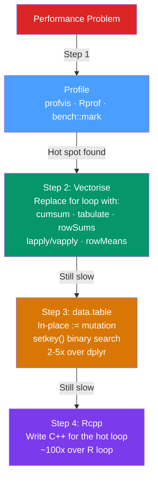

# ⚡ Rcpp and Performance Optimization

> [!abstract] TL;DR
> The R performance optimization sequence is: **measure first** (`profvis`, `bench::mark`), then **vectorise** (replace R loops with C-level operations), then **data.table** (for large-data aggregations), and only then **Rcpp** (C++ for loops that can't be vectorised). Rcpp wraps the R/C API safely — types are GC-managed, Rcpp Sugar provides vectorised C++ operators, and `sourceCpp` compiles `.cpp` files on-the-fly.

## Intuition — analogy FIRST

R's performance model is: push as much work as possible into pre-compiled C code. Every call to `sum(x)`, `paste0(x, y)`, or `tabulate(x)` dispatches to a C function that runs at hardware speed. Your R script is the conductor, not the musician.

A slow R `for` loop is like making the conductor play each note herself. **Vectorisation** gives the work to the musicians (C code). **Rcpp** lets you write a new C++ musician when no pre-existing C function fits your task.

The 10× rule: only reach for Rcpp after confirming that no combination of vectorised base R operations achieves the speed you need.

---

## How It Works



---

## Key Concepts / Details

### Step 1: Profiling — Find the Hot Spot

Never optimise without profiling. The most impactful optimisation is eliminating a bottleneck, not micro-optimising the wrong line.

```r
library(profvis)

# Interactive flame graph — shows time spent in each function
profvis({
  x <- rnorm(1e6)
  y <- numeric(length(x))
  for (i in seq_along(x)) y[i] <- x[i]^2 + 2*x[i]  # slow loop
  z <- sqrt(cumsum(y))
})
# The flame graph shows which function calls are widest (most time)

# Benchmark with bench::mark (preferred over microbenchmark)
library(bench)

x <- rnorm(1e5)
bench::mark(
  loop       = { y <- numeric(length(x)); for (i in seq_along(x)) y[i] <- x[i]^2 },
  vectorised = x^2,
  iterations = 100,
  check      = TRUE   # verify all results are identical
)
# median, mem_alloc, n_gc, n_itr automatically reported

# Memory inspection with lobstr
library(lobstr)
obj_size(x)          # accurate size (counts shared references correctly)
tracemem(x)          # print a message whenever x is copied
x[1] <- 0           # triggers copy (prints trace)
untracemem(x)
```

### Performance Hierarchy

| Approach | Operations/sec | Use Case |
|----------|---------------|---------|
| R loop | ~10⁷/s | Baseline |
| `vapply` / `sapply` | ~10⁷/s | Small overhead improvement |
| Vectorised base R | ~10⁸–10⁹/s | Replace most loops |
| data.table | 2–5× over dplyr | Large aggregations (>1M rows) |
| Rcpp | ~10⁹/s | C-level; ~100× over R loops |

### Step 2: Vectorisation — Eliminate R Loops

```r
# BAD: R loop
result <- numeric(n)
for (i in 1:n) result[i] <- x[i]^2 + 2*x[i] - 1

# GOOD: vectorised (same computation, C speed)
result <- x^2 + 2*x - 1   # arithmetic operators are vectorised

# Common vectorised replacements for loops
# Loop: running sum → cumsum(x)
# Loop: frequency count → tabulate(x) or table(x)
# Loop: row-wise sum → rowSums(mat), colSums(mat), rowMeans(mat)
# Loop: outer product → outer(x, y) or tcrossprod(x, y)
# Loop: apply over matrix rows → apply(mat, 1, fun) or rowwise in dplyr
# Loop: group-wise operation → dplyr::group_by() + summarise()

# Pre-allocate instead of growing vectors
bad_grow <- function(n) {
  result <- c()
  for (i in 1:n) result <- c(result, i^2)  # O(n²): copies entire vector each time!
  result
}
good_prealloc <- function(n) {
  result <- numeric(n)                       # O(n): allocate once
  for (i in 1:n) result[i] <- i^2
  result
}
bench::mark(bad = bad_grow(1000), good = good_prealloc(1000))
# good is ~100x faster
```

### Step 4: Rcpp — Inline C++ in R

```r
library(Rcpp)

# cppFunction: define a C++ function inline in R
cppFunction('
  double sum_squares(NumericVector x) {
    int n = x.size();
    double total = 0.0;
    for (int i = 0; i < n; i++) {
      total += x[i] * x[i];
    }
    return total;
  }
')

sum_squares(1:5)   # 55
```

### sourceCpp — Compile a .cpp File

For longer C++ code, save to a `.cpp` file and source it.

```r
# File: fast_functions.cpp
# Contents:
# #include <Rcpp.h>
# using namespace Rcpp;
#
# // [[Rcpp::export]]   ← this annotation makes the function visible to R
# NumericVector running_mean(NumericVector x) {
#   int n = x.size();
#   NumericVector result(n);
#   double total = 0.0;
#   for (int i = 0; i < n; i++) {
#     total += x[i];
#     result[i] = total / (i + 1);
#   }
#   return result;
# }
#
# // Multiple exported functions in one file:
# // [[Rcpp::export]]
# bool any_na(NumericVector x) {
#   for (int i = 0; i < x.size(); i++) {
#     if (NumericVector::is_na(x[i])) return true;
#   }
#   return false;
# }

sourceCpp("fast_functions.cpp")
running_mean(1:10)
any_na(c(1, NA, 3))
```

### Rcpp Types

```r
# R ↔ C++ type mapping (all are GC-managed, no manual PROTECT needed)
# NumericVector   ↔ numeric vector (double)
# IntegerVector   ↔ integer vector
# CharacterVector ↔ character vector
# LogicalVector   ↔ logical vector
# List            ↔ list (VECSXP)
# DataFrame       ↔ data.frame
# NumericMatrix   ↔ numeric matrix
# Function        ↔ R function (callable from C++)

# NA values
# NumericVector: NA_REAL
# IntegerVector: NA_INTEGER
# CharacterVector: NA_STRING
# LogicalVector: NA_LOGICAL

cppFunction('
  NumericVector replace_neg(NumericVector x) {
    int n = x.size();
    for (int i = 0; i < n; i++) {
      if (x[i] < 0 || NumericVector::is_na(x[i])) {
        x[i] = 0.0;    // CAUTION: Rcpp vectors share memory with R objects
      }                 // clone(x) if you don\'t want to modify in-place
    }
    return x;
  }
')
```

### Rcpp Sugar — Vectorised C++

Rcpp Sugar provides vectorised operations that work just like R's operators in C++.

```r
cppFunction('
  NumericVector rcpp_sugar_demo(NumericVector x) {
    // These look and work like R vectorised operations
    NumericVector y = Rcpp::pow(x, 2.0);       // x^2 (element-wise)
    double s = Rcpp::sum(y);                   // sum
    double m = Rcpp::mean(y);                  // mean
    NumericVector clipped = Rcpp::clamp(0.0, x, 10.0);  // clip to [0, 10]
    LogicalVector pos = x > 0;                 // logical comparison
    return y;
  }
')
```

### RcppArmadillo — Linear Algebra

```r
# Install: install.packages("RcppArmadillo")
# File: arma_demo.cpp
# #include <RcppArmadillo.h>
# // [[Rcpp::depends(RcppArmadillo)]]
# // [[Rcpp::export]]
# arma::mat matrix_mult(arma::mat A, arma::mat B) {
#   return A * B;          // matrix multiply (use % for element-wise)
# }
# // [[Rcpp::export]]
# arma::vec solve_system(arma::mat A, arma::vec b) {
#   return arma::solve(A, b);   // solve Ax = b
# }

sourceCpp("arma_demo.cpp")
```

---

## Real-World Notes

- **`profvis` is the entry point** — always look at the flame graph before writing a single line of Rcpp.
- **`bench::mark` over `system.time`** — bench gives median (not mean), memory allocation, garbage collection counts, and relative comparisons. These matter: a function that's fast but allocates 10 GB is still slow.
- **Rcpp vectors share memory with R** — modifying a `NumericVector` inside C++ modifies the R object. Use `clone(x)` to get an independent copy inside C++ when this is undesired.
- **`Rcpp::stop("message")` and `Rcpp::Rcout << "debug"`** for R-visible errors and print output from C++ code.

---

## Common Pitfalls

1. **Optimising without profiling** — the bottleneck is never where you think it is. Profile first.
2. **Writing Rcpp when vectorisation would suffice** — `x^2 + 2*x` is already C-speed; Rcpp adds compilation overhead for no gain.
3. **Not cloning input vectors** — modifying a `NumericVector` modifies the R object through the shared pointer. This can corrupt the caller's data.
4. **Forgetting `// [[Rcpp::export]]`** — the function exists in C++ but is invisible to R without the annotation.
5. **Ignoring `n_gc` in bench::mark** — a function that's fast but triggers many garbage collections will degrade under sustained load.

---

## Related Concepts

- [[_MOC_Advanced_R|↑ Section MOC]]
- [[R_Syntax_Fundamentals]] — Understanding copy-on-modify is the prerequisite for knowing when Rcpp is needed
- [[Functional_Programming_R]] — Vectorised operations are the FP approach to replacing loops

---

## Review Questions

1. What is the performance hierarchy for optimising R code? What step comes before Rcpp?
2. What does `tracemem(x)` tell you and when would you use it?
3. What is the difference between `cppFunction()` and `sourceCpp()` in Rcpp?
4. What does `// [[Rcpp::export]]` do and what happens if you omit it?
5. Why does pre-allocating a vector (`result <- numeric(n)`) before a loop dramatically outperform growing it with `c(result, val)`?

---

## Sources

- Eddelbuettel D., *Seamless R and C++ Integration with Rcpp* — Springer
- Wickham H., *Advanced R* (2e), Chs. 23–24 — Measuring and Improving Performance
- profvis documentation — https://rstudio.github.io/profvis/
- bench package — https://bench.r-lib.org/reference/

#r-programming #advanced-r #rcpp #performance
