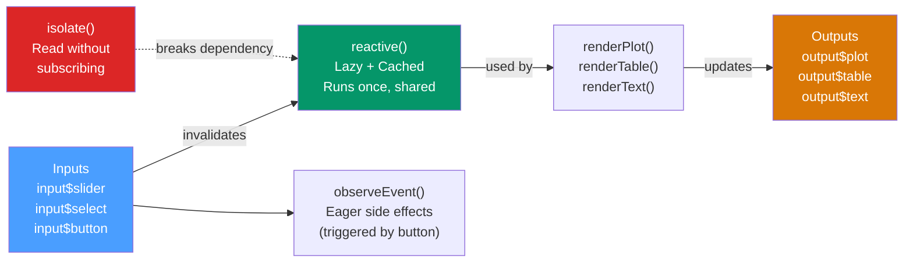

# 🌐 Shiny Applications

> [!abstract] TL;DR
> Shiny is a framework for building interactive web applications entirely in R. Its **reactive programming model** — declare dependencies, let Shiny figure out what to recompute — means you write what outputs depend on, not how to update them. `reactive()` is for cached shared computations; `observe()` for side effects; modules for reusable namespaced components. Plumber adds REST API endpoints with simple function annotations.

## Intuition — analogy FIRST

Shiny's reactive graph is like a **spreadsheet**. In Excel, cell C1 = A1 + B1 means "whenever A1 or B1 changes, recompute C1." You don't write an event handler; you declare the dependency.

In Shiny, `output$plot <- renderPlot({ hist(data()[["x"]]) })` means "whenever `data()` changes, rerender the plot." Shiny tracks which outputs depend on which inputs and recomputes the minimum necessary set when any input changes.

---

## How It Works



---

## Key Concepts / Details

### The ui / server / shinyApp Structure

```r
library(shiny)

# UI: defines the layout and input/output widgets
ui <- fluidPage(
  titlePanel("My Shiny App"),

  sidebarLayout(
    sidebarPanel(
      sliderInput("n",      "Sample Size",  min = 10, max = 500, value = 100),
      selectInput("dist",   "Distribution", choices = c("Normal", "Uniform", "Exponential")),
      actionButton("go",    "Regenerate")
    ),
    mainPanel(
      plotOutput("hist_plot"),
      verbatimTextOutput("summary_text")
    )
  )
)

# Server: defines the reactive logic
server <- function(input, output, session) {

  # reactive(): lazy + cached — runs only when its inputs change
  # Multiple outputs can use data() and it runs only once per invalidation
  data <- reactive({
    switch(input$dist,
      "Normal"      = rnorm(input$n),
      "Uniform"     = runif(input$n),
      "Exponential" = rexp(input$n)
    )
  })

  # renderPlot: re-runs whenever data() is invalidated
  output$hist_plot <- renderPlot({
    hist(data(), main = paste("Histogram:", input$dist), col = "steelblue")
  })

  output$summary_text <- renderPrint({
    summary(data())
  })
}

# Launch
shinyApp(ui = ui, server = server)
```

### Reactive Primitives Comparison

| Function | Lazy? | Cached? | Returns Value? | Use Case |
|----------|-------|---------|----------------|----------|
| `reactive()` | Yes | Yes | Yes | Shared expensive computation |
| `observe()` | No | No | No (side effects) | Logging, updating DB, `updateSelectInput` |
| `observeEvent(event, ...)` | No | No | No (side effects) | Button-triggered side effects |
| `eventReactive(event, ...)` | Yes | Yes | Yes | Button-gated computation |
| `isolate(expr)` | N/A | N/A | Yes (breaks dependency) | Read input without subscribing |

```r
# observe vs observeEvent vs eventReactive examples

# observe: runs whenever ANY reactive dependency changes
observe({
  cat("Data changed, n =", input$n, "\n")  # side effect: console log
})

# observeEvent: runs only when input$go changes (button click)
observeEvent(input$go, {
  showModal(modalDialog("Regenerated!"))  # modal notification on button click
})

# eventReactive: like reactive but only triggers on input$go
data_on_click <- eventReactive(input$go, {
  rnorm(input$n)   # only recomputes when the button is clicked
})

# isolate: read input$n without adding a dependency
observe({
  current_n <- isolate(input$n)  # doesn't trigger when input$n changes
  cat("Button clicked. n was:", current_n, "\n")
})
```

### Shiny Modules — Reusable Components

Modules solve the **namespace problem**: as apps grow, `input$plot` and `output$plot` in the global namespace create naming conflicts. Modules give each component its own namespace.

```r
# Module UI function
histogram_ui <- function(id) {
  ns <- NS(id)   # NS creates a namespacing function
  tagList(
    sliderInput(ns("n"), "Sample Size", min = 10, max = 500, value = 100),
    plotOutput(ns("plot"))
  )
}

# Module Server function
histogram_server <- function(id, data_reactive) {
  moduleServer(id, function(input, output, session) {
    output$plot <- renderPlot({
      hist(data_reactive(), n = input$n, col = "steelblue")
    })
  })
}

# Use the module in the app
ui <- fluidPage(
  histogram_ui("hist1"),   # "hist1" prefix namespaces all IDs
  histogram_ui("hist2")    # "hist2" creates a separate independent component
)

server <- function(input, output, session) {
  data <- reactive(rnorm(100))
  histogram_server("hist1", data)   # link modules to shared reactive
  histogram_server("hist2", data)
}
```

### bslib Theming and UI Frameworks

```r
library(bslib)
library(thematic)

# Bootstrap 5 UI with bslib
ui <- page_sidebar(
  title  = "My App",
  theme  = bs_theme(
    bootswatch = "minty",     # dozens of themes: darkly, flatly, sketchy, etc.
    primary    = "#4a9eff"
  ),
  sidebar = sidebar(
    sliderInput("n", "N", 10, 500, 100)
  ),
  card(
    card_header("Histogram"),
    plotOutput("plot")
  )
)

# thematic: automatically styles ggplot2/base R plots to match the Shiny theme
thematic::thematic_shiny()
```

### Testing with shinytest2

```r
library(shinytest2)

# Create a test (saves snapshots of the app state)
test_that("histogram updates with slider", {
  app <- AppDriver$new(shinyApp(ui, server))
  app$set_inputs(n = 200)
  app$expect_screenshot()   # saves PNG snapshot; future runs compare to it
  app$stop()
})
```

### Deployment

```r
# Deploy to shinyapps.io (requires rsconnect account)
library(rsconnect)
rsconnect::setAccountInfo(name = "account", token = "TOKEN", secret = "SECRET")
rsconnect::deployApp("path/to/app")

# Self-hosted: Docker + shiny-server
# Dockerfile:
# FROM rocker/shiny:latest
# COPY . /srv/shiny-server/myapp
# EXPOSE 3838
```

### Plumber — REST APIs from R Functions

```r
# File: api.R
library(plumber)

#* @apiTitle Diamond Price API

#* Predict diamond price
#* @param carat:dbl Carat weight
#* @param cut:str Diamond cut (Fair/Good/Very Good/Premium/Ideal)
#* @get /predict
function(carat = 1.0, cut = "Ideal") {
  newdata <- data.frame(carat = as.numeric(carat), cut = cut)
  pred    <- predict(model, newdata = newdata)
  list(predicted_price = round(pred, 2))
}

#* Health check
#* @get /health
function() list(status = "ok", timestamp = Sys.time())

#* @post /batch_predict
#* @param req The request body (JSON array of diamonds)
function(req) {
  data <- jsonlite::fromJSON(req$postBody)
  preds <- predict(model, newdata = data)
  list(predictions = preds)
}

# Run the API
pr <- plumb("api.R")
pr$run(port = 8000)

# Auto-generated Swagger UI at: http://localhost:8000/__swagger__/
```

**Plumber decorators reference:**

| Decorator | Purpose |
|-----------|---------|
| `#* @get /path` | GET endpoint |
| `#* @post /path` | POST endpoint |
| `#* @param name:type description` | Document a parameter |
| `#* @serializer json` | JSON response (default) |
| `#* @serializer csv` | CSV response |
| `#* @serializer png` | PNG image response |
| `#* @filter cors` | Apply a filter (middleware) |

---

## Real-World Notes

- **`reactive()` is the key building block** — any expensive operation (database query, model prediction, data loading) should be wrapped in `reactive()` so it runs once and is cached for all outputs that use it.
- **`req(input$x)` at the top of reactive expressions** prevents execution before inputs are initialized — prevents startup errors in complex apps.
- **`shinytest2` snapshot testing** is the best investment for apps that will be maintained — it catches regressions automatically.
- **Plumber + docker** is the production deployment path: wrap the R API in a Docker container, put Nginx in front for SSL termination, and scale horizontally.

---

## Common Pitfalls

1. **Putting everything in `observe()`** — `observe` re-runs eagerly on any change; `reactive()` caches the result. Expensive computations must go in `reactive()`.
2. **Not using modules for large apps** — global namespace apps become unmaintainable beyond ~200 lines. Extract components into modules early.
3. **Reading `input$` outside a reactive context** — always read inputs inside `reactive()`, `render*()`, or `observe*()`; reading them at the top level gives the initial value only.
4. **Blocking the server thread with long computations** — use `future`/`promises` (via `future.callr`) for async operations that would freeze the UI.
5. **Not using `req(input$file)` for file inputs** — without it, the reactive fires before the file is uploaded, causing an error on startup.

---

## Related Concepts

- [[_MOC_Advanced_R|↑ Section MOC]]
- [[Interactive_Plots_plotly]] — plotly charts are the standard interactive visualization in Shiny
- [[R6_Classes_OOP]] — R6 objects maintain state across reactive evaluations cleanly
- [[Rcpp_Performance]] — Rcpp functions called from Shiny render blazing-fast computations

---

## Review Questions

1. What is the difference between `reactive()` and `observe()`? When would you use each?
2. What does `isolate(input$n)` do and when would you need it?
3. Why are Shiny modules important and what problem do they solve?
4. What does `#* @get /predict` do in a Plumber file?
5. What does `eventReactive(input$go, { ... })` do differently from `reactive({ ... })`?

---

## Sources

- Wickham H., *Mastering Shiny* (free online) — https://mastering-shiny.org
- Plumber documentation — https://www.rplumber.io/
- bslib documentation — https://rstudio.github.io/bslib/
- shinytest2 documentation — https://rstudio.github.io/shinytest2/

#r-programming #advanced-r #shiny #reactive-programming #plumber
