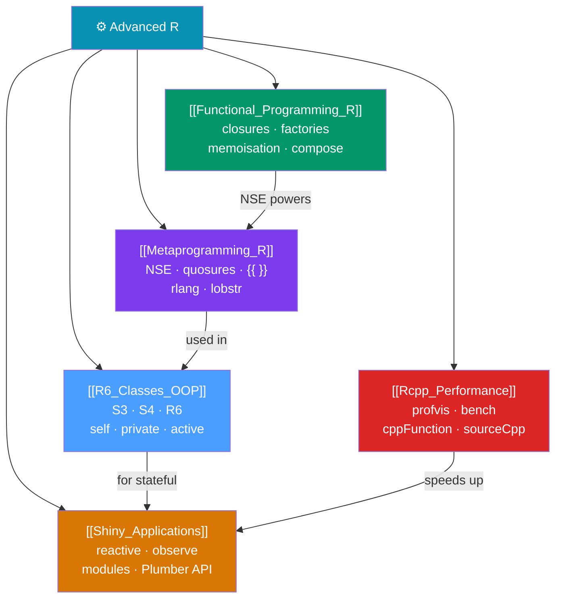

# ⚙️ Advanced R — Map of Content

> [!abstract] What This Section Covers
> Advanced R engineering means writing code others can depend on: the **metaprogramming** that extends the language (the mechanism behind every Tidyverse DSL), proper **object systems** (S3, S4, R6), **C++ via Rcpp** for CPU-critical performance, and the **web tooling** (Shiny and Plumber) that makes R models reachable from non-R systems. Non-standard evaluation (NSE) — the mechanism behind `dplyr::mutate` and `ggplot2::aes()` — is the connective thread and the first topic demystified here.

## Concept Map

## Learning Path

1. [[Functional_Programming_R]] — First-class functions, closures, and function factories are prerequisites for NSE.
2. [[Metaprogramming_R]] — NSE, quosures, and `{{ }}` — the mechanism behind every Tidyverse DSL.
3. [[R6_Classes_OOP]] — When to use S3 vs S4 vs R6 for stateful, mutable objects.
4. [[Rcpp_Performance]] — Profile first, then reach for C++ via `cppFunction`/`sourceCpp`.
5. [[Shiny_Applications]] — Reactive web apps and REST APIs that expose R to non-R systems.

## All Notes at a Glance

| Note | Difficulty | What You'll Learn |
|------|------------|-------------------|
| [[R6_Classes_OOP]] | Advanced | R's four OOP systems, R6 self/private/active, inheritance, clone, when to use each |
| [[Functional_Programming_R]] | Advanced | Function factories, closures, memoisation, compose, partial, force(), lazy evaluation |
| [[Metaprogramming_R]] | Advanced | quote/rlang tools, quosures, !!/!!!, {{ }}, eval_tidy, lobstr AST, NSE in dplyr/ggplot2 |
| [[Rcpp_Performance]] | Advanced | profvis/bench, cppFunction/sourceCpp, Rcpp types, Sugar, RcppArmadillo |
| [[Shiny_Applications]] | Intermediate | reactive/observe/eventReactive, modules, bslib, shinytest2, Plumber REST APIs |

## Key Questions This Section Answers

- How does `dplyr::filter(df, x > 0)` know that `x` refers to a column, not an R variable?
- What is a quosure and how does `{{ }}` use it?
- What is the difference between S3, S4, and R6 OOP systems?
- When should I use R6 reference semantics vs S3 copy-on-modify?
- How do I write a function that runs 100× faster using Rcpp?
- What is the difference between `reactive()` and `observe()` in Shiny?
- How do I turn an R function into a REST API endpoint?

## Related Sections

- [[_MOC_R_Programming_Master|↑ R Programming Master MOC]]
- [[_MOC_Core_R|← Core R]] — Environments, closures, and function mechanics are the prerequisites
- [[_MOC_Tidyverse|← Tidyverse]] — The Tidyverse DSLs are built on the NSE covered here
- [[_MOC_ML_in_R|← ML in R]] — Shiny deploys ML models; Rcpp accelerates preprocessing

#MOC #r-programming #advanced-r
