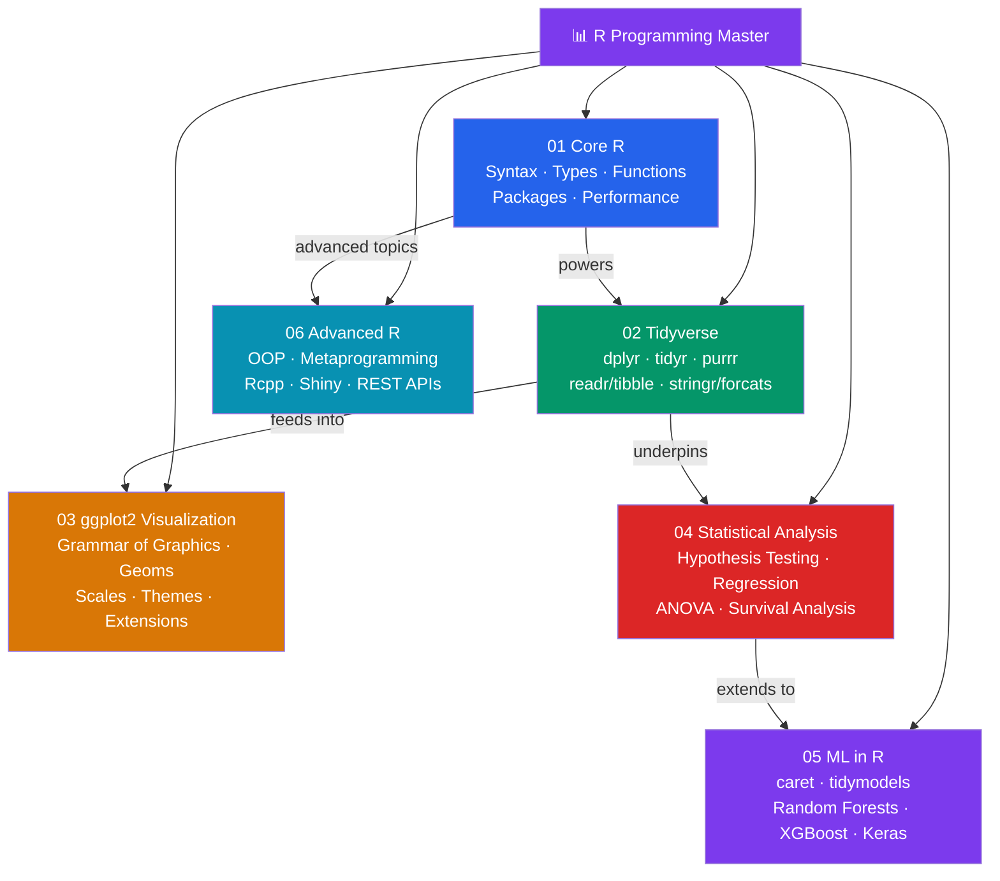

# 📊 R Programming — Master Map of Content

> [!abstract] About This Vault
> A comprehensive R programming reference: **37 notes across 6 sections**, covering the full spectrum from language fundamentals to production-grade engineering. Built for statisticians, data scientists, and R engineers who want to move from analysis scripts toward reproducible, production-quality tools. Every note pairs an intuition-first analogy with runnable R code examples, Mermaid diagrams, trade-off tables, common pitfalls, and review questions. The sections progress from Core R syntax through the Tidyverse ecosystem, ggplot2 visualization, statistical analysis, machine learning in R, and finally Advanced R engineering (metaprogramming, OOP, C++, Shiny, and REST APIs). Start at the section that matches your goal, or follow one of the four learning paths.

## Vault Architecture

## Sections at a Glance

| # | Section | Notes | Entry Point | Difficulty |
|---|---------|-------|-------------|------------|
| 01 | Core R | 5 | [[_MOC_Core_R]] | Beginner |
| 02 | Tidyverse | 5 | [[_MOC_Tidyverse]] | Beginner → Intermediate |
| 03 | ggplot2 Visualization | 5 | [[_MOC_ggplot2]] | Beginner → Intermediate |
| 04 | Statistical Analysis | 5 | [[_MOC_Statistical_Analysis]] | Intermediate → Advanced |
| 05 | ML in R | 5 | [[_MOC_ML_in_R]] | Intermediate → Advanced |
| 06 | Advanced R | 5 | [[_MOC_Advanced_R]] | Advanced |

---

## Learning Paths

### Path 1 — Data Analyst

> Best for: analysts who want to wrangle, visualize, and summarize data efficiently.

**Core R → Tidyverse → ggplot2 → Descriptive Statistics**

[[_MOC_Core_R]] → [[R_Syntax_Fundamentals]] → [[Data_Types_Structures]] → [[_MOC_Tidyverse]] → [[dplyr_Data_Manipulation]] → [[tidyr_Data_Tidying]] → [[readr_tibble]] → [[stringr_forcats]] → [[_MOC_ggplot2]] → [[ggplot2_Grammar_of_Graphics]] → [[Geometric_Objects]] → [[Scales_and_Themes]] → [[Faceting_and_Grouping]] → [[_MOC_Statistical_Analysis]] → [[Descriptive_Statistics_R]]

---

### Path 2 — Statistician

> Best for: statisticians who want rigorous inference, modelling, and Bayesian analysis.

**Core R → Tidyverse → Statistical Analysis → Survival**

[[_MOC_Core_R]] → [[Control_Flow_Functions]] → [[_MOC_Tidyverse]] → [[purrr_Functional_Programming]] → [[_MOC_Statistical_Analysis]] → [[Descriptive_Statistics_R]] → [[Hypothesis_Testing_R]] → [[Regression_Analysis_R]] → [[ANOVA_in_R]] → [[Survival_Analysis]]

---

### Path 3 — ML Practitioner

> Best for: ML engineers who need end-to-end model pipelines, tuning, and interpretation.

**Core R → Tidyverse → ML in R**

[[_MOC_Core_R]] → [[R_Packages_CRAN]] → [[_MOC_Tidyverse]] → [[dplyr_Data_Manipulation]] → [[purrr_Functional_Programming]] → [[_MOC_ML_in_R]] → [[caret_Package]] → [[tidymodels]] → [[Random_Forests_R]] → [[XGBoost_in_R]] → [[Deep_Learning_R_keras]]

---

### Path 4 — Data Scientist / Full Stack R

> Best for: data scientists who want the complete picture from raw data to deployed model.

**All sections in order**

[[_MOC_Core_R]] → [[_MOC_Tidyverse]] → [[_MOC_ggplot2]] → [[_MOC_Statistical_Analysis]] → [[_MOC_ML_in_R]] → [[_MOC_Advanced_R]] → [[Shiny_Applications]]

---

## Cross-Vault Links

This vault complements other knowledge domains in this system:

- **AI-ML vault** — [[AI-ML/_MOC_AI_ML_Master|AI-ML Master]] covers Python-centric ML frameworks (scikit-learn, PyTorch, TensorFlow). R's tidymodels and caret map to the same concepts but with R's statistical rigour and native integration.
- **Database vault** — [[Database/_MOC_Database_Master|Database Master]] covers SQL which is also heavily used in R via `DBI`, `dbplyr`, and `RSQLite` for connecting to databases from R workflows.
- **System Design vault** — Shiny Applications in [[_MOC_Advanced_R]] connects to web architecture; Plumber REST APIs connect to API design patterns covered in System Design.

---

## Section MOC Index

- [[_MOC_Core_R]] — The R language foundations: syntax and vectors, data types and structures, control flow and functions, package development with devtools/CRAN, and performance profiling.
- [[_MOC_Tidyverse]] — The Tidyverse ecosystem: dplyr verbs and joins, tidyr reshaping and nesting, purrr functional mapping, readr/tibble for data ingestion, and stringr/forcats for text and factors.
- [[_MOC_ggplot2]] — Data visualization with ggplot2: the Grammar of Graphics, geometric objects, scales and coordinates, themes and customization, and interactive extensions.
- [[_MOC_Statistical_Analysis]] — Statistical modelling: descriptive statistics, hypothesis testing, regression analysis, ANOVA, and survival analysis.
- [[_MOC_ML_in_R]] — Machine learning in R: caret framework, tidymodels workflow, Random Forests, XGBoost, and deep learning with keras.
- [[_MOC_Advanced_R]] — Advanced R engineering: R6 OOP, functional programming and metaprogramming, Rcpp for performance, Shiny web applications, and Plumber REST APIs.

#MOC #R-Programming #MasterMOC
