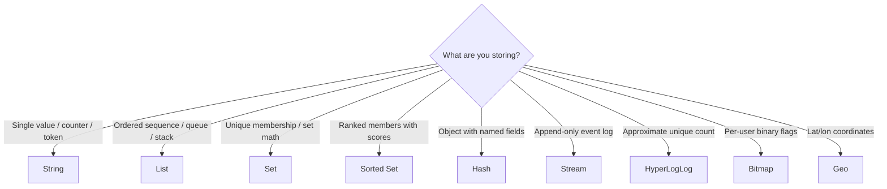

# Redis Data Structures

> [!abstract] TL;DR
> Redis provides seven core data structures — Strings, Lists, Sets, Sorted Sets, Hashes, Streams, and HyperLogLog — each with a distinct semantic model and set of O(1) or O(log N) commands. Choosing the right structure eliminates the need for application-side sorting, filtering, and counting. Time complexities are part of the API contract.

---

## Structure Selection Guide



---

## 1. Strings

The most fundamental type. Value is any binary-safe string up to 512 MB. Used for counters, cached HTML, JSON blobs, session tokens, and feature flags.

### Commands

```bash
# Basic set/get
SET user:1:name "Alice"          # O(1) — set key to value
GET user:1:name                  # O(1) → "Alice"
GETSET user:1:name "Bob"         # O(1) → old value "Alice", sets "Bob"
GETDEL user:1:name               # O(1) → get and delete atomically

# Multi-key
MSET user:1:age 30 user:2:age 25   # O(N) — N keys
MGET user:1:age user:2:age         # O(N) → ["30", "25"]

# Atomic counters
INCR page:views                  # O(1) → 1 (atomic increment by 1)
INCRBY page:views 10             # O(1) → 11
DECR inventory:item:42           # O(1) → decrement by 1
DECRBY inventory:item:42 5       # O(1) → decrement by 5
INCRBYFLOAT price:item:42 0.5    # O(1) → float increment

# Conditional set
SETNX lock:job "1"               # O(1) → 1 if set, 0 if key existed (SET if Not eXists)
SET lock:job "1" NX              # Modern equivalent of SETNX
SETEX session:abc 3600 "data"    # O(1) → set + TTL in one command (legacy)
SET session:abc "data" EX 3600   # Modern equivalent — preferred
SET session:abc "data" EX 3600 NX   # Set only if not exists + TTL

# String operations
APPEND log:today "2026-07-29 error\n"   # O(1) → new length
STRLEN user:1:name               # O(1) → byte length
GETRANGE user:1:bio 0 9          # O(N) → first 10 bytes of value
SETRANGE user:1:bio 5 "XYZ"     # O(1) amortized → overwrite at offset
```

### Use cases
- Caching: `SET product:42:json <json> EX 300`
- Counters: `INCR` for page views, API call counts, inventory
- Distributed lock: `SET lock:resource uuid NX EX 10`
- Feature flags: `SET feature:dark_mode "enabled"`
- Rate limit: `INCR ratelimit:user:42 + EXPIRE` (simple fixed window)

---

## 2. Lists

A doubly-linked list of string values. Order is insertion order. Supports O(1) push/pop at both ends. Max 2^32 - 1 elements.

### Commands

```bash
# Push (insert)
RPUSH queue:emails "job1" "job2" "job3"   # O(1) per element — push to right (tail)
LPUSH stack:tasks "task3" "task2"         # O(1) per element — push to left (head)
LINSERT queue:emails BEFORE "job2" "job1.5"  # O(N) — insert before pivot

# Pop (remove)
LPOP queue:emails              # O(1) → "job1" (remove + return from left)
RPOP queue:emails              # O(1) → "job3" (remove + return from right)
LPOP queue:emails 3            # O(N) — pop N elements (Redis 6.2+)

# Blocking pop (wait until element appears — for worker queues)
BLPOP queue:emails 5           # Block up to 5s; returns [key, value] or nil
BRPOP queue:emails 0           # Block indefinitely (0 = no timeout)
BLMOVE src dst LEFT RIGHT 5    # Atomic: pop from src, push to dst (reliable queue)

# Inspect
LRANGE queue:emails 0 -1       # O(S+N) → all elements; 0 to -1 means full list
LRANGE queue:emails 0 9        # O(S+N) → first 10 elements
LLEN queue:emails              # O(1) → length
LINDEX queue:emails 2          # O(N) → element at index 2 (0-based)

# Modify
LSET queue:emails 1 "updated"  # O(N) → set element at index
LREM queue:emails 2 "job1"     # O(N) → remove 2 occurrences of "job1"
LTRIM queue:emails 0 99        # O(N) → keep only first 100 elements (ring buffer)
```

### Patterns

| Pattern | Commands | Direction |
|---------|----------|-----------|
| Queue (FIFO) | `RPUSH` enqueue, `LPOP` dequeue | R→L |
| Stack (LIFO) | `LPUSH` push, `LPOP` pop | L→L |
| Ring buffer (recent N) | `LPUSH` + `LTRIM 0 N-1` | L-trim |
| Reliable queue | `RPUSH` + `BLMOVE src processing LEFT RIGHT` | ack-on-success |

---

## 3. Sets

An unordered collection of unique strings. No duplicates allowed. Supports set algebra (union, intersection, difference). Max 2^32 - 1 elements.

### Commands

```bash
SADD product:42:tags "electronics" "sale" "new"   # O(N) → count added
SMEMBERS product:42:tags         # O(N) → {"electronics", "sale", "new"}
SISMEMBER product:42:tags "sale" # O(1) → 1 (true) or 0
SMISMEMBER product:42:tags "sale" "old"  # O(N) → [1, 0]
SCARD product:42:tags            # O(1) → count of members
SREM product:42:tags "old"       # O(N) → remove members
SPOP product:42:tags             # O(1) → remove and return random member
SRANDMEMBER product:42:tags 2    # O(N) → 2 random members (no removal)

# Set algebra (returns result)
SINTER product:42:tags product:43:tags          # O(N*M) → intersection
SUNION product:42:tags product:43:tags          # O(N) → union
SDIFF product:42:tags product:43:tags           # O(N) → in 42 but not 43

# Set algebra (store result in destination key)
SINTERSTORE dest product:42:tags product:43:tags   # O(N*M)
SUNIONSTORE dest product:42:tags product:43:tags   # O(N)
SDIFFSTORE dest product:42:tags product:43:tags    # O(N)

# Count intersection without fetching members (Redis 7)
SINTERCARD 2 product:42:tags product:43:tags LIMIT 10   # O(N*M)
```

### Use cases
- Tag/category membership: `SADD product:{id}:tags "tag1"`
- Unique visitor tracking: `SADD visitors:{date} "user:42"` + `SCARD`
- Friend/follow graph: `SINTER user:1:follows user:2:follows` (mutual friends)
- Access control: `SISMEMBER role:admin "user:42"`
- Blacklist/whitelist: fast O(1) membership check

---

## 4. Sorted Sets (ZSets)

Like a Set but every member has an associated floating-point **score**. Members are always ordered by score (ascending). Scores can be duplicated; members cannot. Internally a skip list + hash table hybrid. Max 2^32 - 1 members.

### Commands

```bash
ZADD leaderboard 9500 "Alice" 8200 "Bob" 9800 "Carol"   # O(log N) per member
ZADD leaderboard NX 9500 "Alice"   # Only add if doesn't exist
ZADD leaderboard GT 9600 "Alice"   # Only update if new score > current
ZADD leaderboard LT 9400 "Alice"   # Only update if new score < current

# Range queries (ascending by default)
ZRANGE leaderboard 0 -1                    # O(log N + M) → all members by score asc
ZRANGE leaderboard 0 2 REV                 # O(log N + M) → top 3 desc (Redis 6.2+)
ZRANGE leaderboard 0 2 REV WITHSCORES      # → [("Carol", 9800), ("Alice", 9500), ...]
ZRANGEBYSCORE leaderboard 9000 "+inf"      # O(log N + M) → members with score ≥ 9000
ZRANGEBYSCORE leaderboard "-inf" "+inf" LIMIT 0 10   # paginate
ZRANGEBYLEX leaderboard "[A" "[C"          # O(log N + M) → lex range (equal scores)

# Rank and score
ZRANK leaderboard "Alice"          # O(log N) → 0-based rank ascending (0 = lowest score)
ZREVRANK leaderboard "Alice"       # O(log N) → rank descending (0 = highest score)
ZSCORE leaderboard "Alice"         # O(1) → score as string
ZCARD leaderboard                  # O(1) → total member count
ZCOUNT leaderboard 9000 "+inf"     # O(log N) → count members in score range

# Modify
ZINCRBY leaderboard 100 "Alice"    # O(log N) → atomic score increment → new score
ZREM leaderboard "Bob"             # O(log N) per member → remove members
ZPOPMIN leaderboard                # O(log N) → pop member with lowest score
ZPOPMAX leaderboard                # O(log N) → pop member with highest score
BZPOPMIN leaderboard 5             # blocking pop of min
ZREMRANGEBYSCORE leaderboard 0 8000    # O(log N + M) → remove by score range
ZREMRANGEBYRANK leaderboard 0 2        # O(log N + M) → remove by rank range

# Set algebra
ZUNIONSTORE dest 2 zset1 zset2 WEIGHTS 1 0.5   # weighted union
ZINTERSTORE dest 2 zset1 zset2                  # intersection (sum scores)
ZDIFFSTORE dest 2 zset1 zset2                   # difference
```

### Leaderboard Pattern

```bash
# Add/update score
ZADD leaderboard GT <new_score> <player_id>

# Top 10 (0-indexed, WITHSCORES for display)
ZRANGE leaderboard 0 9 REV WITHSCORES

# Player rank + score (one-hop)
ZREVRANK leaderboard <player_id>
ZSCORE leaderboard <player_id>

# Players around rank 5 (context window)
ZRANGE leaderboard 3 7 REV WITHSCORES   # ranks 4–8 in leaderboard context
```

### Use cases
- Leaderboards: score = game score or ELO rating
- Rate limiting (sliding window): score = timestamp, member = request UUID
- Priority queue: score = priority or scheduled run time
- Autocomplete: score = 0, member = prefix+word (lex range)
- Social feed: score = timestamp, member = post ID (trim to top-N)

---

## 5. Hashes

A map of field-value pairs stored under one Redis key. Think of it as a row in a table or a Python dict. Efficient for storing objects — one Redis key per object rather than one Redis key per field. Max 2^32 - 1 field-value pairs.

### Commands

```bash
HSET user:1 name "Alice" email "alice@example.com" age "30"  # O(N) for N fields
HGET user:1 name                          # O(1) → "Alice"
HMGET user:1 name email                   # O(N) → ["Alice", "alice@example.com"]
HGETALL user:1                            # O(N) → {name: Alice, email: ..., age: 30}
HKEYS user:1                             # O(N) → field names
HVALS user:1                             # O(N) → values
HLEN user:1                              # O(1) → field count
HEXISTS user:1 email                     # O(1) → 1 or 0
HDEL user:1 age                          # O(N) → delete fields
HINCRBY user:1 login_count 1             # O(1) → atomic field increment
HINCRBYFLOAT user:1 balance 9.99        # O(1) → atomic float increment
HSETNX user:1 role "viewer"             # O(1) → set field only if it doesn't exist
HSCAN user:1 0 MATCH "em*" COUNT 10    # O(N) → cursor-based field scan
```

### User Session Storage Pattern

```bash
# Store entire session as a hash
HSET session:abc123 user_id 42 role admin created_at 1722211200 ip "10.0.0.1"
EXPIRE session:abc123 3600

# Read single field (faster than HGETALL when you only need one)
HGET session:abc123 user_id

# Update last_seen without rewriting whole session
HSET session:abc123 last_seen 1722214800

# Atomic per-field counter
HINCRBY session:abc123 request_count 1
```

### Hash vs String for object storage

| | `HSET user:1 field value` | `SET user:1 <json_blob>` |
|--|--------------------------|--------------------------|
| Field access | O(1) per field | O(N) deserialize whole object |
| Partial update | O(1) HSET single field | Read-modify-write (3 ops) |
| Memory for small objects | Compact (listpack encoding ≤128 fields) | Compact |
| Memory for large objects | Higher (hash table per object) | Smaller (raw bytes) |
| Atomicity | Per-field atomic | Whole-object atomic (with WATCH/Lua) |

**Guideline:** Use Hash when you frequently access individual fields or need atomic partial updates. Use String+JSON for blobs you always read/write as a whole.

---

## Time Complexity Summary

| Structure | Add | Access | Delete | Range | Set ops |
|-----------|-----|--------|--------|-------|---------|
| String | O(1) | O(1) | O(1) | O(N) substr | — |
| List (ends) | O(1) | O(N) by index | O(1) ends | O(S+N) | — |
| Set | O(1) | O(1) ismember | O(1) | O(N) members | O(N*M) inter |
| Sorted Set | O(log N) | O(1) score | O(log N) | O(log N+M) | O(N log N) |
| Hash | O(1) | O(1) field | O(1) field | O(N) all | — |

---

## Common Pitfalls

- **HGETALL on large hashes** — If a hash has thousands of fields, `HGETALL` returns all at once and can be slow. Use `HSCAN` for large hashes or break into smaller hashes.
- **Sorted Set with equal scores** — When all scores are 0 (used for lex-order autocomplete), `ZRANGEBYSCORE` returns everything. Use `ZRANGEBYLEX` for lex-order queries.
- **List as unbounded queue** — Without trimming (`LTRIM`), a list can grow indefinitely. Always cap ring buffers with `LTRIM` or set a maxlen.
- **SMEMBERS on huge sets** — Like `HGETALL`, `SMEMBERS` on a set with millions of members blocks Redis. Use `SSCAN` cursor.
- **Using String for JSON when fields change independently** — Storing a user object as JSON and doing `GET`→deserialize→modify→`SET` is three round trips with a race condition. Use Hash if fields update independently.

---

## Review Questions

1. **Sorted Set internals** — `ZRANK` is O(log N) while `ZSCORE` is O(1). Explain the internal data structure (skip list + hash table) that allows these different complexities for what are superficially similar operations.
2. **Hash vs String tradeoff** — A microservice stores user profiles (20 fields each). Another service only reads the user's email during auth. Compare `HSET user:{id} field value` vs `SET user:{id}:email value` approaches for the auth service access pattern. Which is more efficient, and at what scale does the answer change?
3. **Sorted Set for rate limiting** — Implement a sliding window rate limiter using a Sorted Set. Explain why you use timestamp as the score, what `ZREMRANGEBYSCORE` does, and why this is more accurate than a `INCR+EXPIRE` fixed window counter.
4. **Set intersection use case** — You have a social graph where `user:{id}:follows` is a Set of user IDs. Write the Redis commands to find mutual followers between two users, and count how many mutual followers they share without fetching the full set.

---

## Related

- [[Redis_Keys_and_Expiry]] — key naming, TTL, eviction policies
- [[Redis_Pub_Sub_and_Streams]] — Streams as a seventh data structure
- [[Redis_Geospatial_and_Advanced]] — HyperLogLog, Bitmaps, Geo
- [[Redis_with_Python]] — Python code examples for all data structures
- [[_MOC_Database_Master]] — database engineering context

---

#Redis #DataStructures #Commands #Caching
