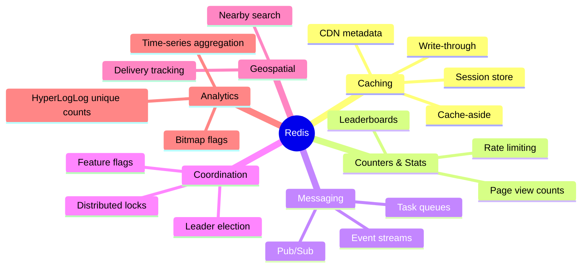

# Redis Overview

> [!abstract] TL;DR
> Redis is an in-memory data structure store — not just a cache. It supports rich data types, optional persistence, pub/sub, transactions, Lua scripting, and cluster mode. Its single-threaded event loop, O(1) data structure access, and purely in-memory operation make it sub-millisecond fast. Understanding what Redis *is* (vs what it is *used for*) prevents misusing it.

---

## What Redis Actually Is

Redis stands for **RE**mote **DI**ctionary **S**erver. The name captures the core idea: a server-side dictionary accessible over a network. But Redis is better described as an **in-memory data structure store** because:

- It stores values as typed data structures (lists, sets, sorted sets, hashes, streams, etc.) — not just opaque blobs.
- It optionally persists data to disk (RDB snapshots, AOF log, or hybrid).
- It can act as a message broker via Pub/Sub and Streams.
- It supports atomic transactions and Lua scripting.

```
Redis ≠ just a cache
Redis = in-memory data structure store with optional persistence
```

---

## Redis vs Memcached

| Feature | Redis | Memcached |
|---------|-------|-----------|
| Data types | Strings, Hashes, Lists, Sets, Sorted Sets, Streams, HLL, Bitmaps, Geo | Strings/bytes only |
| Persistence | RDB + AOF + Hybrid | None — ephemeral |
| Replication | Master-replica with Sentinel | Not supported |
| Clustering | Redis Cluster (hash slots) | Client-side sharding |
| Pub/Sub | Native | Not supported |
| Lua scripting | Full EVAL/EVALSHA | Not supported |
| Transactions | MULTI/EXEC + WATCH | Not supported |
| Memory efficiency | Slightly higher (structure overhead) | Lower for pure strings |
| Threading | Single-threaded event loop (I/O threads in Redis 6+) | Multi-threaded |
| Best for | Feature-rich, multi-pattern distributed state | Pure high-throughput ephemeral string cache |

**Rule of thumb:** If you need anything beyond "cache a string", use Redis. If you need maximum throughput for pure key→value string lookups at enormous scale (hundreds of millions of keys) and never need persistence or rich structures, Memcached has lower overhead.

---

## Persistence Options

Redis offers four persistence modes:

### 1. No Persistence
```
# redis.conf
save ""          # disable all RDB saves
appendonly no    # disable AOF
```
Redis is a pure cache. All data lost on restart. Fastest. Use for ephemeral caching where cold-start latency is acceptable.

### 2. RDB (Redis Database Backup — Snapshots)
```
# redis.conf
save 900 1       # save if at least 1 key changed in 900 seconds
save 300 10      # save if at least 10 keys changed in 300 seconds
save 60 10000    # save if at least 10000 keys changed in 60 seconds
```
Point-in-time `.rdb` snapshot via fork+copy-on-write. Fast restart, compact file. Potential data loss between snapshots. Best for disaster recovery, backups.

### 3. AOF (Append-Only File)
```
appendonly yes
appendfsync everysec    # fsync every second (default — good balance)
# appendfsync always   # fsync every write — safest, slowest
# appendfsync no       # OS decides — fastest, least safe
```
Every write command is appended to `appendonly.aof`. Durability up to the last fsync. Slower restart (replays log). AOF files grow; compacted with `BGREWRITEAOF`.

### 4. RDB + AOF Hybrid (Default Redis 7)
```
appendonly yes
aof-use-rdb-preamble yes    # write RDB snapshot at AOF rewrite, then append deltas
```
AOF begins with an RDB-format section (fast load) then appends delta commands. Best of both worlds: fast restart + near-complete durability.

### Persistence Trade-offs

| | RDB | AOF (everysec) | AOF (always) | Hybrid |
|--|-----|----------------|--------------|--------|
| Max data loss | Last snapshot (minutes) | ~1 second | 0 (single write) | ~1 second |
| Restart speed | Fast (binary load) | Slow (log replay) | Slow | Fast (RDB section) |
| File size | Compact | Grows (needs rewrite) | Grows | Balanced |
| Write overhead | Low (background fork) | Low–Medium | High (per-write fsync) | Low–Medium |
| Use case | Backup, DR | Default production | Financial critical | Default Redis 7+ |

---

## Core Use Cases



| Use Case | Redis Primitive | Key Pattern |
|----------|----------------|-------------|
| Cache HTTP responses | String + TTL | `cache:response:{hash}` |
| Session storage | Hash | `session:{token}` |
| Rate limiting | Sorted Set / String + INCR | `ratelimit:{user}:{window}` |
| Leaderboard | Sorted Set | `leaderboard:{game}` |
| Distributed lock | String + NX + EX | `lock:{resource}` |
| Job queue | List (RPUSH/BLPOP) | `queue:{name}` |
| Pub/Sub fanout | Pub/Sub channel | `notifications:{topic}` |
| Event log | Stream | `events:{domain}` |
| Unique visitor count | HyperLogLog | `hll:visitors:{date}` |
| Feature flags | Bitmap | `flags:users:{feature}` |
| Nearby POI search | Geo | `geo:stores` |

---

## Redis Architecture — Why It's Fast

### Single-Threaded Event Loop

```
┌─────────────────────────────────────────────────┐
│                  Redis Process                   │
│                                                  │
│  Client 1 ──┐                                   │
│  Client 2 ──┤──► Event Loop (epoll/kqueue) ──►  │
│  Client 3 ──┘    │                              │
│                  ▼                              │
│            Command Queue                        │
│            [CMD1][CMD2][CMD3]...                │
│                  │                              │
│                  ▼                              │
│            Execute one-at-a-time                │
│            (no locks needed!)                   │
│                  │                              │
│                  ▼                              │
│            In-Memory Data Structures            │
│            (hash tables, skip lists, etc.)      │
└─────────────────────────────────────────────────┘
```

**Why single-threaded is fast:**
1. **No lock contention** — one goroutine owns all data; no mutex overhead.
2. **No context switching** — all data ops run in one thread.
3. **Multiplexed I/O** — epoll/kqueue handles thousands of simultaneous connections on one thread efficiently.
4. **In-memory ops are microsecond-fast** — the bottleneck is network, not compute.

Redis 6+ added **I/O threading** (multiple threads for reading/writing network buffers) while keeping command execution single-threaded. This improves throughput on multi-core machines without breaking atomicity guarantees.

### Memory Efficiency Tricks
- **Encoding optimization**: small collections use compact encodings (listpack, ziplist, intset) before switching to full hash tables or skip lists.
- **Shared integers**: Redis pre-allocates integers 0–9999 as shared objects — no allocation needed.
- **Copy-on-write forks**: RDB saves fork the process; OS-level CoW means unchanged pages are not duplicated in RAM.

---

## Redis 7.x Features

| Feature | What Changed |
|---------|-------------|
| Redis Functions | Persistent server-side scripts replacing EVAL+EVALSHA (use `FUNCTION LOAD`/`FCALL`) |
| Sharded Pub/Sub | Pub/Sub channels are now slot-aware in Cluster mode |
| Multi-Part AOF | AOF split into base + incremental files; avoids single-file corruption risk |
| ACL log v2 | Richer ACL violation logs with client info |
| OBJECT FREQ | Frequency counter for LFU eviction inspection |
| LMPOP / ZMPOP | Multi-key atomic pop (dequeue from first non-empty list/sorted set) |
| SINTERCARD | Set intersection with result cardinality limit |
| RDB+AOF hybrid on by default | `aof-use-rdb-preamble yes` default |

---

## Redis vs Valkey Fork

In March 2024, Redis Ltd. changed Redis's license from BSD to dual-license (RSALv2 + SSPLv1), restricting cloud providers from offering it as a managed service. The Linux Foundation launched **Valkey** as an open-source (BSD-3) fork of Redis 7.2.

| | Redis (post-7.4) | Valkey |
|--|-----------------|--------|
| License | RSALv2 + SSPLv1 | BSD-3 (truly open source) |
| API compatibility | Full Redis API | Drop-in compatible |
| Managed cloud support | Redis Cloud, some providers | AWS ElastiCache, GCP, others |
| Multi-threading | I/O threads | Full multi-threading (experimental) |
| Community governance | Redis Ltd. controls | Linux Foundation neutral |

**For most developers:** Valkey is wire-compatible — your redis-py / ioredis / Jedis clients work unchanged. Choose based on your cloud provider and licensing needs.

---

## Common Pitfalls

- **Treating Redis as a primary database** — Redis is RAM-bound. For large datasets or durability-critical data, Redis should be a caching/coordination layer in front of a durable DB (Postgres, MongoDB), not the system of record.
- **No maxmemory set** — Without `maxmemory`, Redis consumes all available RAM and the process is killed by the OS OOM killer. Always set `maxmemory` and `maxmemory-policy`.
- **Forgetting persistence mode** — Default Redis config has `save` enabled (RDB). If you want a pure cache, explicitly disable saves. If you want durability, enable AOF.
- **Single point of failure** — Standalone Redis with no Sentinel or Cluster means a crash loses all in-flight requests. For production, use Sentinel (failover) or Cluster (HA + sharding).

---

## Review Questions

1. **Architecture** — Redis is single-threaded yet handles thousands of concurrent connections. Explain how epoll-based I/O multiplexing makes this possible, and why single-threaded command execution does not become a bottleneck.
2. **Persistence choice** — You are building a payment processing service that stores idempotency keys in Redis (used to deduplicate retried API requests). Which persistence mode do you choose and why? What is the maximum data loss you would tolerate?
3. **Redis vs Memcached** — A team already using Redis wants to evaluate whether Memcached would be faster for their pure session-token cache workload. What concrete Redis overhead are they paying that Memcached avoids, and what do they give up by switching?
4. **Valkey decision** — Your company runs Redis on AWS ElastiCache. You are evaluating migrating to Valkey. What compatibility risks exist, and what steps would you take to validate the migration?

---

## Related

- [[Redis_Data_Structures]] — the rich type system that separates Redis from a simple key-value store
- [[Redis_Persistence]] — deep dive into RDB, AOF, and hybrid configuration
- [[Redis_Cluster]] — horizontal scaling and HA architecture
- [[Redis_with_Python]] — Python redis-py implementation patterns (already in vault)
- [[_MOC_Database_Master]] — broader database engineering context

---

#Redis #Caching #Database #InMemory #Architecture
