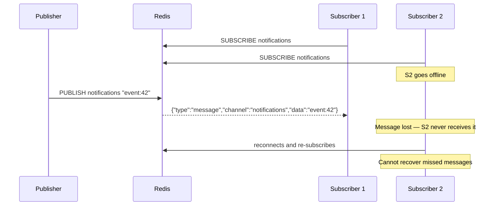
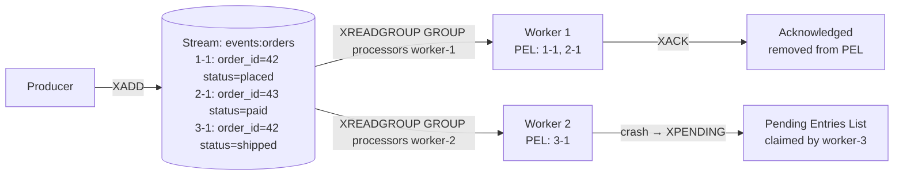

# Redis Pub/Sub and Streams

> [!abstract] TL;DR
> Redis provides two messaging primitives: **Pub/Sub** (fire-and-forget broadcast with no persistence) and **Streams** (durable, ordered log with consumer groups and at-least-once delivery). Use Pub/Sub for real-time fanout where message loss is acceptable; use Streams when you need acknowledgement, replay, or offline-consumer support.

---

## Pub/Sub — Fire and Forget

### Architecture



### Commands

```bash
# Subscriber side
SUBSCRIBE notifications                   # subscribe to exact channel
SUBSCRIBE notifications orders payments   # subscribe to multiple channels
UNSUBSCRIBE notifications                 # unsubscribe from specific channel
UNSUBSCRIBE                               # unsubscribe from all channels

# Pattern subscribe (glob patterns)
PSUBSCRIBE "notifications:*"              # subscribe to all notifications:{...} channels
PSUBSCRIBE "order:*" "payment:*"         # multiple glob patterns
PUNSUBSCRIBE "notifications:*"           # unsubscribe from pattern

# Publisher side (can be any client — not special)
PUBLISH notifications "order_placed:42"  # → number of clients that received it
PUBLISH "notifications:orders" "order_placed:42"

# Inspect
PUBSUB CHANNELS                          # list all active channels with subscribers
PUBSUB CHANNELS "notifications:*"        # filtered list
PUBSUB NUMSUB notifications orders       # subscriber count per channel
PUBSUB NUMPAT                            # count of active pattern subscriptions
```

### Key Properties

| Property | Behavior |
|----------|----------|
| Persistence | None — messages exist only during transmission |
| Delivery | At-most-once (fire-and-forget) |
| Consumer groups | Not supported — all subscribers receive all messages |
| Offline consumers | Missed messages are gone forever |
| Message order | Preserved per channel within a single connection |
| Back pressure | None — PUBLISH always returns immediately |
| Cluster support | Pre-Redis 7: all nodes receive all messages. Redis 7+: sharded pub/sub (channel routes to specific slot) |

### When to use Pub/Sub

- Real-time notifications where missing a message is acceptable (e.g., live dashboard refresh)
- Cache invalidation signals to other app nodes
- WebSocket fanout where the connection handles missed-message recovery
- Inter-process coordination signals (e.g., "reload config") on a single machine

---

## Redis Streams — Durable Messaging

Streams are a persistent, append-only log data structure. Each entry is a dict of fields with an auto-generated or explicit ID. Consumer groups allow multiple independent consumers to process entries with acknowledgement.

### Stream Architecture



### Producer Commands

```bash
# XADD — append entry to stream
XADD events:orders * order_id 42 status placed amount 99.99
# * = auto-generate ID (timestamp-sequence, e.g. "1722211200000-0")
# Returns: "<timestamp>-<sequence>" entry ID

# Explicit ID (must be monotonically increasing)
XADD events:orders 1722211200000-0 order_id 42 status placed

# Capped stream — keep only the last N entries (approximate, efficient)
XADD events:orders MAXLEN ~ 10000 * order_id 43 status paid
# ~ (tilde) = approximate trim (faster; may keep slightly more than 10000)
# = (strict) = exact trim (slower)

# MAXLEN with explicit threshold (Redis 7+)
XADD events:orders MAXLEN ~ 10000 MINID ~ "1721000000000-0" * order_id 44 status shipped
```

### Consumer (Simple, No Groups)

```bash
# Read new entries (non-blocking)
XREAD COUNT 10 STREAMS events:orders 0    # from beginning
XREAD COUNT 10 STREAMS events:orders $    # only new (from now)
XREAD COUNT 10 STREAMS events:orders "1722211200000-0"  # from specific ID

# Read multiple streams
XREAD COUNT 10 STREAMS events:orders events:payments 0 0

# Blocking read (wait up to 5000ms for new entries)
XREAD COUNT 10 BLOCK 5000 STREAMS events:orders $
XREAD COUNT 10 BLOCK 0    STREAMS events:orders $   # block forever
```

### Stream Inspection

```bash
XLEN events:orders                         # O(1) → entry count
XRANGE events:orders - +                  # O(N) → all entries (- = min, + = max)
XRANGE events:orders - + COUNT 10         # first 10 entries
XRANGE events:orders "1722200000000-0" "1722300000000-0"   # ID range
XREVRANGE events:orders + - COUNT 5       # last 5 entries
XINFO STREAM events:orders                # metadata: length, first/last entry, groups
XINFO GROUPS events:orders               # consumer group info
XINFO CONSUMERS events:orders processors # consumer details within group
```

---

## Consumer Groups

Consumer groups allow multiple workers to share stream processing. Each entry goes to exactly one consumer within a group. A **Pending Entries List (PEL)** tracks delivered-but-not-yet-acknowledged messages.

### Setup and Management

```bash
# Create consumer group ($ = only process new messages; 0 = process from beginning)
XGROUP CREATE events:orders processors $          # new messages only
XGROUP CREATE events:orders processors 0          # replay from start
XGROUP CREATE events:orders processors 0 MKSTREAM # create stream if it doesn't exist

# Delete group
XGROUP DESTROY events:orders processors

# Set group cursor (jump to a different position)
XGROUP SETID events:orders processors "1722211200000-0"

# Delete consumer from group
XGROUP DELCONSUMER events:orders processors worker-1
```

### Consumer Processing Loop

```bash
# XREADGROUP — read unacknowledged entries ("> means new, never delivered)
XREADGROUP GROUP processors worker-1 COUNT 10 STREAMS events:orders >
# Returns: [[stream_name, [[entry_id, {fields}], ...]]]

# Blocking variant
XREADGROUP GROUP processors worker-1 COUNT 10 BLOCK 2000 STREAMS events:orders >

# Acknowledge — remove from PEL (processing confirmed)
XACK events:orders processors "1722211200000-0"
XACK events:orders processors "1722211200000-0" "1722211200001-0"  # multiple

# Re-read your own pending (unacknowledged) messages
XREADGROUP GROUP processors worker-1 COUNT 10 STREAMS events:orders 0
# 0 instead of > = replay own PEL (for crash recovery)
```

### Handling Failed Messages (PEL Reclaim)

```bash
# See pending messages across all consumers
XPENDING events:orders processors - + 10
# Returns: count, min-id, max-id, consumer-name per entry

# Detailed pending info
XPENDING events:orders processors - + 10 worker-1  # filter by consumer

# Claim stuck messages (idle > 60000ms) from any consumer
XCLAIM events:orders processors worker-2 60000 "1722211200000-0"
# Returns: claimed entry — worker-2 now owns it

# Auto-claim (Redis 7+) — claim up to 10 entries idle > 60s
XAUTOCLAIM events:orders processors worker-3 60000 0-0 COUNT 10
```

### Dead Letter Pattern

After too many delivery attempts, move failed messages to a dead-letter stream:

```bash
# Check delivery count in XPENDING details
XPENDING events:orders processors - + 1 worker-1
# count field shows how many times this entry was delivered

# If deliveries > threshold, move to dead letter
XADD events:orders:dead * original_id "1722211200000-0" order_id 42 reason "max_retries"
XACK events:orders processors "1722211200000-0"   # remove from PEL
```

---

## Streams vs Pub/Sub vs Kafka

| Feature | Redis Pub/Sub | Redis Streams | Kafka |
|---------|---------------|---------------|-------|
| Persistence | None | In-memory + AOF | Durable disk log |
| Delivery guarantee | At-most-once | At-least-once (with ACK) | At-least-once / Exactly-once |
| Consumer groups | No | Yes | Yes |
| Offline consumers | Messages lost | Messages replayed from PEL/ID | Configurable offset replay |
| Message replay | No | Yes (from stream ID) | Yes (configurable retention) |
| Ordering | Per-channel | Per-stream, global | Per-partition |
| Throughput | Very high | High (100K+ msg/s) | Very high (millions msg/s) |
| Max message retention | None | Configurable MAXLEN / MINID | Configurable by time/size |
| Operational complexity | Minimal | Minimal | High (ZooKeeper/KRaft, cluster) |
| Multi-DC replication | No | Via Redis Cluster/Geo | Built-in |
| Best for | Ephemeral real-time fanout | Lightweight durable messaging, small teams | High-volume event streaming, multi-DC |

---

## Streams for Event Sourcing

Streams support an append-only event log pattern:

```bash
# Write domain events
XADD account:42:events * type "CREDIT" amount "500.00" by "transfer-123"
XADD account:42:events * type "DEBIT" amount "150.00" by "payment-456"
XADD account:42:events * type "CREDIT" amount "200.00" by "deposit-789"

# Read and replay all events to rebuild state
XRANGE account:42:events - +
# → reconstruct balance = 500 - 150 + 200 = 550

# Read events after a known checkpoint
XRANGE account:42:events "1722211200000-0" +

# Total event count
XLEN account:42:events
```

**Limitations vs true event sourcing:** Redis Streams are RAM-bound (MAXLEN required for long-running streams), lack compaction/snapshotting, and do not support partitioned consumers at Kafka scale. For serious event sourcing: use Kafka or EventStoreDB; use Redis Streams for lightweight local event logs.

---

## Reliable Message Delivery Pattern

The classic reliable queue before Streams was `RPOPLPUSH` (now `LMOVE`):

```bash
# Enqueue work
RPUSH queue:jobs "job1" "job2" "job3"

# Worker: atomically move to processing list (visible to other workers)
LMOVE queue:jobs queue:processing LEFT LEFT
# → "job1" is now in queue:processing

# After successful processing: remove from processing
LREM queue:processing 1 "job1"

# On worker crash: another process scans queue:processing for stuck jobs
LRANGE queue:processing 0 -1    # find stuck jobs
LMOVE queue:processing queue:jobs RIGHT LEFT   # requeue
```

Streams with consumer groups are the modern replacement for this pattern — they handle the PEL automatically.

---

## Common Pitfalls

- **Using Pub/Sub for critical notifications** — If the subscriber is down, messages are gone. Use Streams with consumer groups for any notification that must be delivered.
- **Not trimming streams** — Streams grow indefinitely without `MAXLEN`. Set `MAXLEN ~ 100000` on `XADD` or run periodic `XTRIM`.
- **Not acknowledging messages** — Unacknowledged messages accumulate in the PEL. If a worker crashes without ACKing, its PEL fills up. Implement `XPENDING` + `XCLAIM` in your recovery loop.
- **Sharded Pub/Sub in Cluster** — Pre-Redis 7, `PUBLISH` fans out to all cluster nodes. Redis 7 sharded pub/sub (`SSUBSCRIBE`/`SPUBLISH`) routes to the correct slot — use it in cluster mode to avoid fan-out overhead.
- **Pattern subscriptions performance** — `PSUBSCRIBE` with broad patterns (e.g., `*`) matches against every published message. Many concurrent `PSUBSCRIBE` clients with broad patterns can cause CPU spikes on high-traffic channels.

---

## Review Questions

1. **Delivery guarantees** — A payment service publishes `PUBLISH payments "order:42:paid"`. Another service subscribes with `SUBSCRIBE payments`. The subscriber restarts and misses the message. Explain why this message is lost, and redesign the system using Redis Streams to guarantee at-least-once delivery.
2. **Consumer group semantics** — Two workers share the consumer group `processors` on stream `events:orders`. Worker 1 calls `XREADGROUP GROUP processors worker-1 COUNT 10 STREAMS events:orders >` and gets entries 1-1, 1-2, 1-3. Worker 2 calls the same command. Which entries does Worker 2 receive? What happens if Worker 1 crashes without ACKing?
3. **PEL recovery** — Your stream has consumer `worker-1` with 500 entries in its PEL from 10 minutes ago (worker crashed). Describe the exact sequence of commands to identify, claim, and reprocess these entries using another worker.
4. **Streams vs Pub/Sub** — Your team wants real-time analytics on user activity. They need: (a) immediate display on a dashboard with <100ms latency, and (b) hourly batch processing of all events for a data warehouse. Can you use a single Redis Streams setup to serve both? Describe the consumer group architecture.

---

## Related

- [[Redis_Distributed_Patterns]] — reliable queue with BLPOP/BRPOP, distributed coordination
- [[Redis_Data_Structures]] — List commands used in classic reliable queues
- [[Redis_with_Python]] — Python `xadd`, `xreadgroup`, `xack` implementations and pub/sub threading
- [[_MOC_Database_Master]] — event streaming and messaging context

---

#Redis #PubSub #Streams #Messaging #EventSourcing
