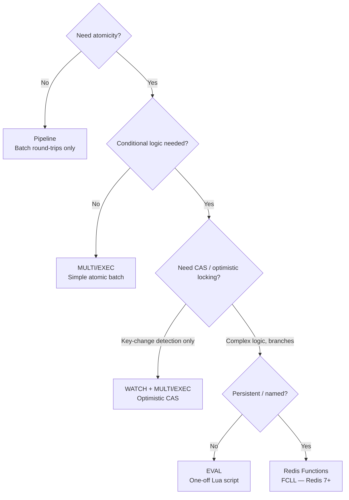

# Redis Transactions and Scripting

> [!abstract] TL;DR
> Redis provides three mechanisms for atomic multi-command execution: `MULTI/EXEC` (optimistic transactions — no rollback), `WATCH` for compare-and-swap optimistic locking, and Lua scripts with `EVAL`/`EVALSHA` (truly atomic — no interleaving). For persistent server-side logic, Redis Functions (`FUNCTION LOAD`/`FCALL`) replace EVAL in Redis 7+. Choose based on whether you need conditional atomicity, full atomicity, or persistent reusable scripts.

---

## MULTI / EXEC — Optimistic Transactions

### How it works

```
MULTI           → marks the start of a transaction block
[commands...]   → queued (not executed yet); each returns "QUEUED"
EXEC            → executes all queued commands atomically
DISCARD         → cancel the queued transaction
```

```bash
# Simple transaction: debit/credit atomically
MULTI
  DECRBY credits:user:1 100
  INCRBY credits:user:2 100
EXEC
# Returns: [new_value_user1, new_value_user2]

# Cancel a transaction
MULTI
  SET key1 "value1"
  SET key2 "value2"
DISCARD          # nothing was executed
```

### Important: No rollback on execution errors

```bash
MULTI
  SET valid:key "ok"
  NOTACOMMAND    # syntax error at queue time → the whole transaction is rejected
  SET valid:key2 "ok"
EXEC
# → error: "EXECABORT Transaction discarded because of previous errors."

MULTI
  SET valid:key "ok"
  LPUSH valid:key "newval"   # type error at execution time (valid:key is a String)
  SET valid:key2 "ok"
EXEC
# → [OK, WrongType error, OK]
# valid:key2 IS set — Redis does NOT rollback on runtime errors!
```

> [!warning] Critical Distinction
> Syntax errors during queueing abort the entire transaction (`EXECABORT`). Runtime errors during `EXEC` (e.g., wrong type) **do not** abort — other commands in the transaction still execute. This is NOT like SQL transactions. Design accordingly.

---

## WATCH — Optimistic Locking (Compare-and-Set)

`WATCH` monitors one or more keys. If any watched key is modified by another client between `WATCH` and `EXEC`, the transaction is aborted (`EXEC` returns `nil`).

### Pattern

```bash
WATCH balance:user:1
# Read current value AFTER watch
GET balance:user:1        # → "500"

MULTI
  DECRBY balance:user:1 100
  INCRBY balance:user:2 100
EXEC
# → [400, ...] if no other client modified balance:user:1
# → nil         if balance:user:1 was modified by another client

# Retry loop required in application code
```

### CAS (Compare-and-Swap) Pattern

```bash
# Atomic "transfer if sufficient balance" — cannot be expressed with MULTI alone
WATCH balance:user:1
balance = GET balance:user:1

if balance >= 100:
    MULTI
      DECRBY balance:user:1 100
      INCRBY balance:user:2 100
    result = EXEC   # → nil if balance:user:1 changed; retry
else:
    UNWATCH
    return "insufficient_balance"
```

### WATCH limitations

- `UNWATCH` (no args) cancels all watches without starting a transaction
- `EXEC` and `DISCARD` both automatically UNWATCH all keys
- WATCH is per-connection — each client has its own watched keys
- In Redis Cluster, WATCH only works within a single slot (all watched keys must be on the same node)

---

## Lua Scripting with EVAL

Lua scripts are **atomically executed** — no other command can interleave during script execution. This is stronger than `MULTI/EXEC` because it also prevents `WATCH` races and allows conditional logic.

### EVAL syntax

```bash
EVAL <script> <numkeys> [key [key ...]] [arg [arg ...]]
```

- `KEYS[1]`, `KEYS[2]`, ... — Redis key names (for cluster slot routing)
- `ARGV[1]`, `ARGV[2]`, ... — other arguments

```bash
# Simple example: atomic get-and-increment
EVAL "
    local val = redis.call('GET', KEYS[1])
    val = (val or 0) + 1
    redis.call('SET', KEYS[1], val)
    return val
" 1 mykey

# Conditional set (SET only if value is less than current)
EVAL "
    local current = tonumber(redis.call('GET', KEYS[1])) or 0
    local new_val = tonumber(ARGV[1])
    if new_val < current then
        redis.call('SET', KEYS[1], new_val)
        return 1
    end
    return 0
" 1 my:counter 50

# Multiple keys — must pass all as KEYS (for cluster routing)
EVAL "
    local src = redis.call('GET', KEYS[1])
    local dst = redis.call('GET', KEYS[2])
    if tonumber(src) >= tonumber(ARGV[1]) then
        redis.call('DECRBY', KEYS[1], ARGV[1])
        redis.call('INCRBY', KEYS[2], ARGV[1])
        return 1
    end
    return 0
" 2 balance:user:1 balance:user:2 100
```

### Atomic Rate Limiter in Lua

```bash
EVAL "
    local key      = KEYS[1]
    local limit    = tonumber(ARGV[1])
    local window   = tonumber(ARGV[2])
    local current  = tonumber(redis.call('INCR', key))
    if current == 1 then
        redis.call('EXPIRE', key, window)
    end
    if current > limit then
        return 0    -- rejected
    end
    return 1        -- allowed
" 1 ratelimit:user:42 100 60
```

### Atomic Counter with Reset

```bash
EVAL "
    local key     = KEYS[1]
    local current = tonumber(redis.call('GET', key) or 0)
    local reset   = tonumber(ARGV[1])
    if current >= reset then
        redis.call('SET', key, 0)
        return 0
    end
    return tonumber(redis.call('INCR', key))
" 1 counter:daily:reports 1000
```

---

## EVALSHA — Cached Scripts

Sending the full Lua script on every `EVAL` call wastes bandwidth. `EVALSHA` executes a script by its SHA1 hash (pre-loaded with `SCRIPT LOAD`):

```bash
# Load script once — returns SHA1 hash
SCRIPT LOAD "return redis.call('SET', KEYS[1], ARGV[1])"
# → "b8059ff43d7d9e7e9c1d3b8f61f5e3f2a4c8e9b1"

# Execute by hash (no script body sent over network)
EVALSHA b8059ff43d7d9e7e9c1d3b8f61f5e3f2a4c8e9b1 1 mykey "value"

# Check if script is cached on server
SCRIPT EXISTS b8059ff43d7d9e7e9c1d3b8f61f5e3f2a4c8e9b1
# → [1] (1 = cached, 0 = not cached)

# Flush all cached scripts (careful — breaks clients using EVALSHA)
SCRIPT FLUSH
SCRIPT FLUSH ASYNC   # Redis 6+ — non-blocking flush
```

> [!note] EVALSHA in production
> Script cache is per-server. After a failover to a replica, the new master may not have the cached script. Either: (1) fall back to EVAL on `NOSCRIPT` error, or (2) use Redis Functions (persistent).

---

## Redis Functions — Persistent Lua (Redis 7+)

Redis Functions replace the ephemeral EVAL/EVALSHA pattern with persistent, named functions stored in the server's keyspace. They survive restarts (persisted to RDB/AOF) and are replicated to replicas.

```bash
# Load a library of functions
FUNCTION LOAD "#!lua name=mylib\n
    local function rate_limit(keys, args)
        local key   = keys[1]
        local limit = tonumber(args[1])
        local window = tonumber(args[2])
        local current = tonumber(redis.call('INCR', key))
        if current == 1 then
            redis.call('EXPIRE', key, window)
        end
        return current <= limit and 1 or 0
    end
    redis.register_function('rate_limit', rate_limit)
"

# Call the function
FCALL rate_limit 1 ratelimit:user:42 100 60

# Replace existing library
FUNCTION LOAD REPLACE "#!lua name=mylib\n ..."

# List all functions
FUNCTION LIST
FUNCTION LIST LIBRARYNAME mylib    # filter by library name

# Delete a library
FUNCTION DELETE mylib

# Dump and restore (for backups / migrations)
FUNCTION DUMP
FUNCTION RESTORE <dump>

# Stats
FUNCTION STATS    # currently executing function info
```

### Redis Functions vs EVAL/EVALSHA

| | EVAL/EVALSHA | Redis Functions |
|--|-------------|----------------|
| Persistence | Ephemeral (cleared on restart) | Persistent (in RDB/AOF) |
| Replication | Not replicated | Replicated to replicas |
| Naming | By SHA1 hash | Named functions in named libraries |
| Discovery | SCRIPT LIST | FUNCTION LIST |
| Library organization | Single scripts | Libraries with multiple functions |
| Error handling | NOSCRIPT error on failover | Available after failover |
| Availability | Redis 2.6+ | Redis 7.0+ |

---

## When to Use What



| Mechanism | Atomicity | Conditional logic | Persistence | Cluster-safe |
|-----------|-----------|------------------|-------------|--------------|
| Pipeline | No | No | N/A | Yes (same node) |
| MULTI/EXEC | Yes (no rollback) | No | N/A | Yes (single slot) |
| WATCH+MULTI | Conditional | No (but aborts on conflict) | N/A | Yes (single slot) |
| EVAL (Lua) | Yes (true atomicity) | Yes (full Lua) | No (ephemeral) | Yes (if keys on same slot) |
| Redis Functions | Yes (true atomicity) | Yes (full Lua) | Yes | Yes (if keys on same slot) |

---

## Lua Script Best Practices

```lua
-- Good: declare locals for performance
local key = KEYS[1]
local ttl = tonumber(ARGV[1])

-- Good: error handling with pcall for non-critical paths
local ok, err = pcall(redis.call, 'GET', key)
if not ok then
    return redis.error_reply("key access failed: " .. err)
end

-- Bad: making HTTP calls or using Lua I/O (not available in Redis Lua)
-- Bad: using os.time() — use ARGV for time (deterministic replay)
-- Good: pass current time as ARGV for reproducibility
local now = tonumber(ARGV[2])

-- Good: return structured replies
return {redis.call('GET', KEYS[1]), redis.call('TTL', KEYS[1])}

-- Good: use redis.pcall() for errors you want to handle (vs redis.call which raises)
local result = redis.pcall('HSET', KEYS[1], ARGV[1], ARGV[2])
if result.err then
    return 0  -- soft failure
end
return 1
```

---

## Common Pitfalls

- **Expecting SQL-style rollback** — `MULTI/EXEC` does NOT rollback on runtime errors. If `DECRBY` errors (wrong type), subsequent `INCRBY` still runs. Use Lua scripts for true atomicity with error handling.
- **Lua script calling KEYS command** — `redis.call('KEYS', '*')` inside a Lua script blocks Redis and defeats the purpose of scripting. Use `SCAN` instead.
- **Cluster slot violation in Lua** — All keys in a Lua script must hash to the same slot. Use hash tags (`{user:42}:session` and `{user:42}:profile`) to co-locate keys.
- **Long-running Lua scripts** — Redis blocks all other commands during Lua execution. Scripts should complete in <5ms. Use `lua-time-limit` (default 5000ms) to set a hard limit — exceeding it causes Redis to respond with `BUSY` error and requires `SCRIPT KILL`.
- **EVALSHA on failover** — After Redis Sentinel promotes a replica to master, the new master's script cache is empty. Application must handle `NOSCRIPT` errors by falling back to `EVAL` or migrating to Functions.
- **WATCH in pipelines** — WATCH must complete before MULTI. Do not include WATCH inside a pipeline — it will not take effect until pipeline execution.

---

## Review Questions

1. **MULTI vs Lua** — A payment operation reads a balance, checks if sufficient, and only then debits. With `MULTI/EXEC` alone (no WATCH), can you implement this conditional atomically? Explain why, and write the equivalent as a Lua script.
2. **WATCH race condition** — Two clients both WATCH the same key, both read it as "100", both start a MULTI/EXEC to decrement. Which one succeeds? Can both fail? Explain the CAS mechanism and why an application retry loop is required.
3. **Lua cluster constraint** — Your Lua script operates on keys `user:42:session` and `cart:42:items`. On a Redis Cluster with 16384 hash slots, are these keys guaranteed to be on the same node? How would you fix the script to guarantee co-location?
4. **Redis Functions motivation** — Your team uses `EVALSHA` for a rate-limiter script. A Redis Sentinel failover occurs. The new master doesn't have the cached script. Describe the failure mode and explain how migrating to Redis Functions solves it.

---

## Related

- [[Redis_Distributed_Patterns]] — distributed lock Lua script, atomic rate limiter
- [[Redis_Data_Structures]] — data types manipulated by transactions and scripts
- [[Redis_Cluster]] — hash slot constraints on multi-key atomicity
- [[Redis_with_Python]] — Python `pipeline()`, `watch()`, `register_script()`, `execute_command('FCALL'...)`
- [[_MOC_Database_Master]] — transaction isolation levels context

---

#Redis #Transactions #Lua #Scripting #Atomicity
