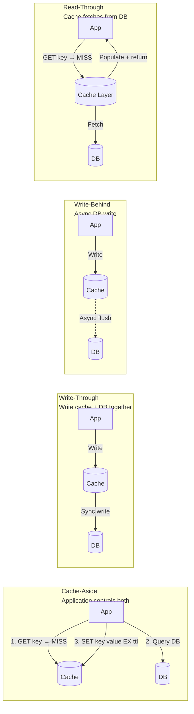

# Redis Caching Patterns

> [!abstract] TL;DR
> There are four caching strategies (cache-aside, write-through, write-behind, read-through) and three cache failure modes (stampede/thundering herd, penetration, avalanche). Each pattern has different consistency, latency, and complexity trade-offs. Getting the failure modes right is what separates a production-grade cache from one that collapses under load.

---

## The Four Caching Strategies



---

## 1. Cache-Aside (Lazy Population)

The most common pattern. The application manages both cache and database explicitly.

### Read path
```
1. Application checks cache: GET key
2. Cache HIT → return value
3. Cache MISS → query database
4. Store in cache: SET key value EX ttl
5. Return value to caller
```

### Write path
```
1. Write to database (system of record)
2. Invalidate (DEL) or update cache key
```

```bash
# Read with fallback
GET product:42:details
# → HIT: return immediately
# → MISS: fetch from DB, then:
SET product:42:details "<json>" EX 300

# Write invalidation (preferred over write-update — avoids stale value race)
DEL product:42:details    # next read will repopulate from DB
```

### Characteristics

| Aspect | Value |
|--------|-------|
| Consistency | Eventual — brief staleness possible after writes |
| Cache population | Lazy (only on miss) — cold start has low hit rate |
| Write amplification | Low — only DB write at mutation time |
| Resilience | Cache failure → app falls back to DB (degrades gracefully) |
| Best for | Read-heavy workloads, tolerable staleness |

---

## 2. Write-Through

Every write updates both cache and database synchronously. Cache is always populated.

```bash
# Pseudocode: application writes to BOTH atomically
SET product:42:details "<json>"    # update cache
UPDATE products SET details=... WHERE id=42  # update DB
```

**Key property:** Cache is always consistent with DB. No cold-start miss problem.

**Trade-off:** Every write pays the latency cost of two writes. Cache fills with data that may never be read (write-heavy workloads waste cache memory).

### Characteristics

| Aspect | Value |
|--------|-------|
| Consistency | Strong — cache always reflects DB writes |
| Cache population | Eager — every write lands in cache |
| Write amplification | High — two writes per mutation |
| Best for | Financial, inventory — workloads needing strong cache consistency |

---

## 3. Write-Behind (Write-Back)

Application writes only to cache; a background process asynchronously flushes to the database.

```bash
# Write only to cache
SET product:42:details "<json>"

# Background worker reads cache and flushes to DB
# (Redis Streams / Pub/Sub can trigger the flush worker)
```

**Key property:** Lowest write latency (only one write in critical path).

**Risk:** If cache fails before flush, data is lost. Requires durable cache (AOF) and idempotent flush logic.

### Characteristics

| Aspect | Value |
|--------|-------|
| Consistency | Eventual — async DB flush |
| Write latency | Lowest (single cache write) |
| Data loss risk | Yes — if cache fails before flush |
| Best for | Write-heavy workloads, bulk ingestion, analytics pipelines |

---

## 4. Read-Through

Cache acts as a proxy — on a miss, the cache layer itself fetches from DB and populates itself. Application only interacts with the cache.

```
Application → Cache → (on miss) → DB
```

**Difference from cache-aside:** The cache layer handles the miss, not the application.  
Redis alone cannot implement this natively (it doesn't know your DB schema). Libraries like `django-cachalot`, Spring Cache `@Cacheable`, or custom interceptors implement this.

---

## Comparison Table

| Pattern | Consistency | Write Latency | Cold Start | Data Loss Risk | Complexity |
|---------|-------------|---------------|------------|----------------|------------|
| Cache-Aside | Eventual | Low | Slow (lazy) | None | Simple |
| Write-Through | Strong | Higher (2 writes) | Fast (eager) | None | Moderate |
| Write-Behind | Eventual | Lowest (1 write) | Fast (eager) | Yes (pre-flush) | High |
| Read-Through | Eventual | Depends on strategy | Slow (lazy) | None | Moderate |

---

## Cache Failure Modes

### 1. Cache Stampede (Thundering Herd)

**Problem:** A popular key expires. Hundreds of concurrent requests all miss simultaneously, all hit the database, all try to repopulate the same cache key.

```
Time 0: popular key "product:42" expires
Time 1ms: 500 requests arrive simultaneously
Time 1ms: all 500 see cache MISS
Time 1ms: all 500 query the database
Time 1ms: database gets 500 queries in 1ms → overload
```

**Solutions:**

#### A. SETNX Lock (Mutex on cache miss)
```bash
# Only one request fetches from DB; others wait or serve stale
GET product:42:details    # → nil (miss)

SET lock:product:42 "1" NX EX 10    # → 1 = acquired, 0 = another client holds it

# Lock holder: fetch from DB, populate cache, release lock
# Others: spin-wait or return stale value
```

See [[Redis_with_Python]] for the full Python implementation with double-check pattern.

#### B. Probabilistic Early Expiry (XFetch)
Instead of waiting for TTL to hit 0, recompute probabilistically as expiry approaches:

```
should_refresh = (TTL < delta * beta * log(random()))
```

- `delta` = expected recompute time (seconds)
- `beta` = tuning parameter (1.0 default)
- Higher `beta` → more aggressive early refresh

This prevents simultaneous expiry by having one of many clients recompute slightly before expiry.

#### C. Stale-While-Revalidate
Serve stale data immediately while refreshing asynchronously:
```bash
# Store value + stale-allowed-until separately
SET product:42:details "<json>" EX 600        # hard expiry
SET product:42:details:stale "1" EX 300        # stale allowed for 300s

# On miss: serve stale, kick off background refresh
```

#### D. Jitter on TTL
Prevent simultaneous mass expiry of many keys (cache avalanche prevention):
```bash
# Instead of fixed 3600s TTL for all product cache entries:
SET product:42:details "<json>" EX 3480    # 3600 - random(0, 240)
SET product:43:details "<json>" EX 3620    # 3600 + random(0, 240)
```

---

### 2. Cache Penetration

**Problem:** Requests for keys that do NOT exist in either cache or database. Cache always misses, DB always misses → unnecessary DB load.

**Example:** Attacker sends requests for random non-existent user IDs (`GET /user/999999999`).

**Solutions:**

#### A. Cache null values
```bash
# If DB returns null, cache null with short TTL
SET user:999999999:profile "NULL" EX 60    # cache the miss

# Application checks for "NULL" sentinel and returns 404
```

#### B. Bloom Filter (RedisBloom)
Pre-filter with a probabilistic membership test. Only query DB if Bloom filter says "maybe exists":
```bash
# At startup/insert: add all known IDs to bloom filter
BF.ADD known:user:ids 42
BF.ADD known:user:ids 43

# At query time: check before hitting cache/DB
BF.EXISTS known:user:ids 999999999    # → 0 (definitely not there) → return 404 immediately
BF.EXISTS known:user:ids 42           # → 1 (probably exists) → proceed to cache/DB
```

See [[Redis_Geospatial_and_Advanced]] for full Bloom filter commands.

---

### 3. Cache Breakdown (Hotspot Key Expiry)

**Problem:** A single extremely hot key (e.g., a trending product) expires. Even one request triggers one DB query, but since the key is hot (1000 RPS), the rebuild takes 50ms during which 50 DB queries happen.

**Distinction from Stampede:** Stampede is mass expiry of many keys; Breakdown is a single hot key.

**Solution:** Use distributed lock (SETNX) specifically on the hot key's rebuild, with a stale-value fallback.

---

### 4. Cache Avalanche

**Problem:** Many cache keys expire at the same time → mass DB queries → DB overload → cascade failure.

**Causes:**
- Fixed TTL for all keys (e.g., all reset to 1 hour on cache deploy)
- Cache server restart (all keys lost)

**Solutions:**
- **TTL jitter**: `EX (base_ttl + random(0, jitter_range))`
- **Staggered cache warm-up**: populate keys in batches with delays
- **Circuit breaker**: if DB query rate spikes, return cached stale data
- **Redis Sentinel/Cluster**: prevent cache-level single points of failure

---

## Cache Warming Strategies

Cold caches (after deploy, failover, or flush) can cause latency spikes until the cache warms up.

```bash
# Strategy 1: Pre-warm critical keys from DB at startup
# Identify top-100 most accessed products from analytics
# MSET all in one pipeline batch

# Strategy 2: Background warm-up worker
# Query DB for popular items, SET with TTL before traffic hits

# Strategy 3: Warm from peer (promote a hot replica's cache)
# Use DEBUG RELOAD or BGSAVE/restore on the new node

# Strategy 4: Accept cold start with circuit breaker
# Short-circuit: if cache miss rate > threshold, return cached stale or simplified response
```

---

## Cache Invalidation Strategies

```bash
# 1. Delete on write (cache-aside, simple)
DEL product:42:details    # invalidate; next read repopulates

# 2. Tag-based invalidation (invalidate all related keys)
SADD tag:product:42 "product:42:details" "product:42:price" "product:42:inventory"
EXPIRE tag:product:42 86400

# Invalidate all keys for product 42
SMEMBERS tag:product:42      # → ["product:42:details", ...]
DEL product:42:details product:42:price product:42:inventory
DEL tag:product:42

# 3. Version prefix (no delete needed — old keys expire naturally)
SET v2:product:42:details "<new_json>" EX 300
# v1:product:42:details still exists but won't be read (code uses v2: prefix)

# 4. Event-driven invalidation (pub/sub to notify cache layers)
PUBLISH cache:invalidate "product:42"
# Cache nodes subscribed to this channel delete their local copies
```

---

## Common Pitfalls

- **Not using TTL jitter** — Setting all keys to the same TTL causes synchronized expiry and cache avalanche. Always add random jitter.
- **Invalidating after write (not before)** — The window between DB write and cache invalidation allows stale reads. If using write-invalidate, consider invalidating BEFORE the DB write (or using write-through).
- **Null value with too-short TTL** — Caching null values for 1 second doesn't protect against DoS. Use 60–300 seconds based on expected key re-creation frequency.
- **Forgetting the double-check after acquiring lock** — In the stampede lock pattern, after acquiring the lock, another client may have already populated the cache. Always re-check before doing the DB query.
- **Write-behind without durable persistence** — Write-behind with `noeviction` and no AOF means data in the "pre-flush" window is lost on crash. Enable AOF with `appendfsync everysec` minimum.
- **Bloom filter false positives** — A Bloom filter's 1% false positive rate means 1% of non-existent IDs pass through to the DB. Size the filter appropriately and account for false positives in your DoS threat model.

---

## Review Questions

1. **Pattern selection** — An e-commerce checkout service reads product prices 10,000 times/second and writes (price updates) 10 times/second. A price update must be reflected within 5 seconds. Which caching pattern do you choose, and what is your TTL strategy?
2. **Stampede anatomy** — Walk through the exact sequence of events (with Redis commands) when a popular cache key expires with 500 concurrent clients. Then implement the SETNX lock solution and explain the "double-check" step inside the lock.
3. **Cache penetration attack** — An attacker sends 100K requests per second for random non-existent user IDs. Your cache-aside pattern misses on every request, hitting the DB. Describe two mitigations and their trade-offs (null caching vs Bloom filter).
4. **Avalanche vs stampede** — What is the difference between cache stampede and cache avalanche? Give a concrete scenario for each and explain why TTL jitter prevents avalanche but not stampede, while SETNX lock prevents stampede but not avalanche.

---

## Related

- [[Redis_Distributed_Patterns]] — distributed lock implementation for stampede prevention
- [[Redis_Keys_and_Expiry]] — TTL mechanics and eviction policies
- [[Redis_Geospatial_and_Advanced]] — Bloom filter (RedisBloom) for cache penetration
- [[Redis_with_Python]] — Python cache-aside with stampede prevention, token bucket rate limiter
- [[_MOC_Database_Master]] — caching layer in the database engineering stack

---

#Redis #Caching #CachePatterns #CacheStampede #Performance
