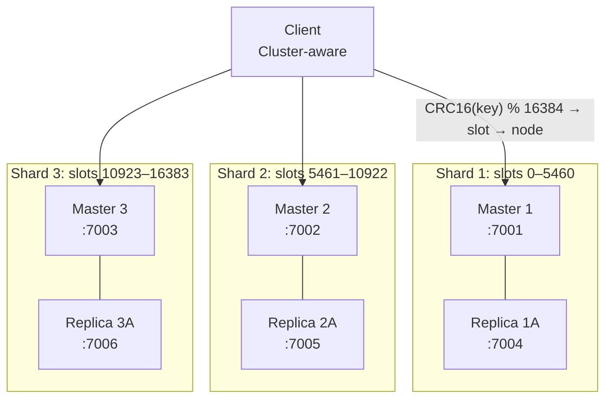

# Redis Cluster

> [!abstract] TL;DR
> Redis Cluster provides automatic sharding across multiple nodes using 16384 hash slots (CRC16 of key mod 16384). Each master node owns a contiguous range of slots; replicas provide HA for each master. Cluster scales horizontally and provides automatic failover — but multi-key operations are restricted to keys hashing to the same slot, solvable with hash tags `{tag}`.

---

## Cluster Architecture



**Minimum cluster size:** 3 masters (for quorum). Production: 3 masters + 3 replicas (1 replica per master).

---

## Hash Slots

### Key routing

```
slot = CRC16(key) % 16384

"user:42"    → CRC16("user:42") % 16384 = 3171  → node owning slots 0–5460
"order:99"   → CRC16("order:99") % 16384 = 8205  → node owning slots 5461–10922
"session:x"  → CRC16("session:x") % 16384 = 11234 → node owning slots 10923–16383
```

```bash
# Check which slot a key maps to
CLUSTER KEYSLOT user:42     # → 3171
CLUSTER KEYSLOT order:99    # → 8205

# List keys in a specific slot
CLUSTER GETKEYSINSLOT 3171 10   # → up to 10 keys in slot 3171

# Number of keys in a slot
CLUSTER COUNTKEYSINSLOT 3171
```

---

## Hash Tags — Co-locating Keys

Multi-key operations (MSET, MGET, SUNION, transactions, Lua scripts) require all keys to be in the **same slot**. Hash tags force a group of keys to hash to the same slot.

```
If the key contains {tag}, only the content inside {} is hashed.

user:42:session → CRC16("user:42:session") → arbitrary slot
{user:42}:session → CRC16("user:42") → deterministic slot
{user:42}:profile → CRC16("user:42") → same slot as above
{user:42}:cart    → CRC16("user:42") → same slot as above
```

```bash
# Without hash tags — may be on different nodes
MGET user:42:session user:42:cart   # → CROSSSLOT error in cluster

# With hash tags — guaranteed same slot
MGET {user:42}:session {user:42}:cart   # → works!

# Lua script with co-located keys
EVAL "
    local session = redis.call('GET', KEYS[1])
    local cart    = redis.call('GET', KEYS[2])
    return {session, cart}
" 2 {user:42}:session {user:42}:cart

# Rate limiting with hash tags
INCR {ratelimit}:user:42          # co-locate all rate limit keys by {ratelimit}
EXPIRE {ratelimit}:user:42 60
```

---

## Cluster Setup

### Starting a cluster (redis-cli)

```bash
# Start 6 Redis instances (3 masters + 3 replicas)
redis-server --port 7001 --cluster-enabled yes --cluster-config-file nodes-7001.conf --cluster-node-timeout 5000 --daemonize yes
redis-server --port 7002 --cluster-enabled yes --cluster-config-file nodes-7002.conf --cluster-node-timeout 5000 --daemonize yes
redis-server --port 7003 --cluster-enabled yes --cluster-config-file nodes-7003.conf --cluster-node-timeout 5000 --daemonize yes
redis-server --port 7004 --cluster-enabled yes --cluster-config-file nodes-7004.conf --cluster-node-timeout 5000 --daemonize yes
redis-server --port 7005 --cluster-enabled yes --cluster-config-file nodes-7005.conf --cluster-node-timeout 5000 --daemonize yes
redis-server --port 7006 --cluster-enabled yes --cluster-config-file nodes-7006.conf --cluster-node-timeout 5000 --daemonize yes

# Create cluster (auto-assign slots, 1 replica per master)
redis-cli --cluster create \
    127.0.0.1:7001 127.0.0.1:7002 127.0.0.1:7003 \
    127.0.0.1:7004 127.0.0.1:7005 127.0.0.1:7006 \
    --cluster-replicas 1

# → Assigns slots automatically, prompts for confirmation
```

### Cluster information commands

```bash
CLUSTER INFO            # cluster status, slots, node count
CLUSTER NODES           # all cluster nodes with their slots and roles
CLUSTER MYID            # current node's ID
CLUSTER SLOTS           # slot range → node mapping (deprecated in favor of CLUSTER SHARDS)
CLUSTER SHARDS          # slot ranges + master/replica info (Redis 7+)
CLUSTER RESET SOFT      # soft reset (rejoin cluster without full wipe)
CLUSTER RESET HARD      # hard reset (wipe cluster state)
```

---

## Resharding (Moving Slots)

When adding or removing nodes, slots must be migrated:

```bash
# Add a new master node
redis-cli --cluster add-node <new-node-ip:port> <existing-node-ip:port>

# Reshard: move 1000 slots from existing to new node
redis-cli --cluster reshard <any-cluster-node-ip:port>
# Interactive: asks how many slots, from which nodes, to which node

# Non-interactive reshard
redis-cli --cluster reshard 127.0.0.1:7001 \
    --cluster-from <source-node-id> \
    --cluster-to <dest-node-id> \
    --cluster-slots 1000 \
    --cluster-yes

# Remove a node (must empty its slots first)
redis-cli --cluster reshard 127.0.0.1:7001 \
    --cluster-from <node-to-remove-id> \
    --cluster-to <any-other-node-id> \
    --cluster-slots <all-slots-of-node> \
    --cluster-yes

redis-cli --cluster del-node 127.0.0.1:7001 <node-id-to-remove>

# Rebalance slots evenly across nodes
redis-cli --cluster rebalance 127.0.0.1:7001 --cluster-use-empty-masters
```

### During resharding: MOVED and ASK redirects

```
MOVED <slot> <ip>:<port>   → key has permanently moved; update routing table
ASK   <slot> <ip>:<port>   → key is being migrated; use ASKING for this request only

Cluster-aware clients handle these redirects automatically.
```

---

## Cluster Failover

```bash
# Automatic: when master unreachable for cluster-node-timeout
# Replica with most complete data is elected (Raft-like vote)

# Manual failover (graceful — waits for replica to catch up)
redis-cli -h <replica-ip> -p <replica-port> CLUSTER FAILOVER

# Force failover (replica promotes even if behind master)
redis-cli -h <replica-ip> -p <replica-port> CLUSTER FAILOVER FORCE

# Takeover (no votes needed — use only in emergency)
redis-cli -h <replica-ip> -p <replica-port> CLUSTER FAILOVER TAKEOVER

# Monitor cluster health
redis-cli --cluster check 127.0.0.1:7001
redis-cli --cluster info 127.0.0.1:7001
```

---

## Cluster vs Standalone vs Sentinel

| Feature | Standalone | Sentinel + Replication | Redis Cluster |
|---------|------------|----------------------|---------------|
| Horizontal scaling | No | No | Yes (sharding) |
| Automatic failover | No | Yes (Sentinel) | Yes (built-in) |
| Max data per node | RAM limit | RAM limit | RAM limit × nodes |
| Multi-key atomicity | Full | Full | Same slot only |
| Cluster-aware client | No | Yes (Sentinel client) | Yes (Cluster client) |
| Ops complexity | Low | Medium | High |
| Min nodes | 1 | 3 Sentinels + 1 master | 3 masters |
| Best for | Dev/testing | HA for single dataset | Large datasets, horizontal scale |

---

## Client Configuration

### redis-py cluster mode

```python
from redis.cluster import RedisCluster, ClusterNode

# Provide any one node — client auto-discovers the rest
rc = RedisCluster(
    host="127.0.0.1",
    port=7001,
    decode_responses=True,
    skip_full_coverage_check=False,  # True if not all slots covered (partial cluster)
)

# Operations work transparently — client routes to correct shard
rc.set("{user:42}:session", "data")
rc.get("{user:42}:session")

# Multi-key ops require hash tags
rc.mset({"{user:42}:session": "s1", "{user:42}:cart": "c1"})

# Pipeline in cluster mode (routes per slot, not single batch)
pipe = rc.pipeline()
pipe.set("{user:42}:session", "data")
pipe.get("{user:42}:session")
pipe.execute()
```

### ioredis (Node.js) cluster mode

```javascript
const Redis = require("ioredis");

const cluster = new Redis.Cluster([
    { host: "127.0.0.1", port: 7001 },
    { host: "127.0.0.1", port: 7002 },
    { host: "127.0.0.1", port: 7003 },
]);

cluster.set("{user:42}:session", "data");
cluster.get("{user:42}:session");
```

---

## Common Pitfalls

- **CROSSSLOT errors** — Multi-key commands across different slots fail with `CROSSSLOT Keys in request don't hash to the same slot`. Fix: use hash tags.
- **Hot slots** — If all keys share the same hash tag (e.g., `{app}:key1`, `{app}:key2`), all traffic goes to ONE slot on ONE master — no sharding benefit. Design hash tags to distribute load.
- **Lua scripts with cross-slot keys** — Lua scripts must access only keys on the same slot. Hash tags are mandatory for Lua in cluster mode.
- **Non-cluster-aware clients** — Clients that don't handle MOVED/ASK redirects will fail in cluster mode. Use cluster-aware clients (redis-py `RedisCluster`, ioredis `Redis.Cluster`, Jedis `JedisCluster`).
- **Resharding under load** — Slot migration causes a brief performance dip as keys migrate. Schedule resharding during off-peak hours.
- **cluster-node-timeout too short** — If `cluster-node-timeout` is too small (< 5s), transient network blips trigger false failovers. 15–30s is safer for production.
- **Cluster with only 3 masters, no replicas** — Any master failure makes 1/3 of slots unavailable (CLUSTERDOWN). Always deploy with at least 1 replica per master.

---

## Review Questions

1. **Hash slot math** — A key `product:42` hashes to slot 11000 which is owned by Master 3. After resharding, slot 11000 is moved to a new Master 4. A client sends `GET product:42` to Master 3. What response does Master 3 return, and what does the client do next?
2. **Cross-slot operation** — You need to atomically transfer credits from `user:1:wallet` to `user:2:wallet` in a cluster. Write the hash tags needed, the KEYS setup for a Lua script, and explain why the untaged keys would fail.
3. **Hot slot problem** — Your team uses `{orders}` as the hash tag for all order-related keys. After deploying to a 6-node cluster, you notice one master node handles 70% of all traffic. Diagnose the problem and propose a redesigned hash tag strategy.
4. **Cluster failover quorum** — Your 3-master cluster loses power to the data center running Masters 2 and 3. Master 1 is still running. Can the cluster serve reads? Can it serve writes? What is the purpose of cluster quorum in this scenario?

---

## Related

- [[Redis_Replication]] — master-replica model and Sentinel (precursor to Cluster)
- [[Redis_Transactions_and_Scripting]] — Lua and MULTI/EXEC constraints in Cluster mode
- [[Redis_Security_and_Config]] — cluster-enabled, cluster-config-file, cluster-node-timeout
- [[Redis_Performance_and_Monitoring]] — monitoring cluster health with CLUSTER INFO
- [[_MOC_Database_Master]] — sharding patterns in distributed database systems

---

#Redis #Cluster #HashSlots #Sharding #HorizontalScaling #Operations
