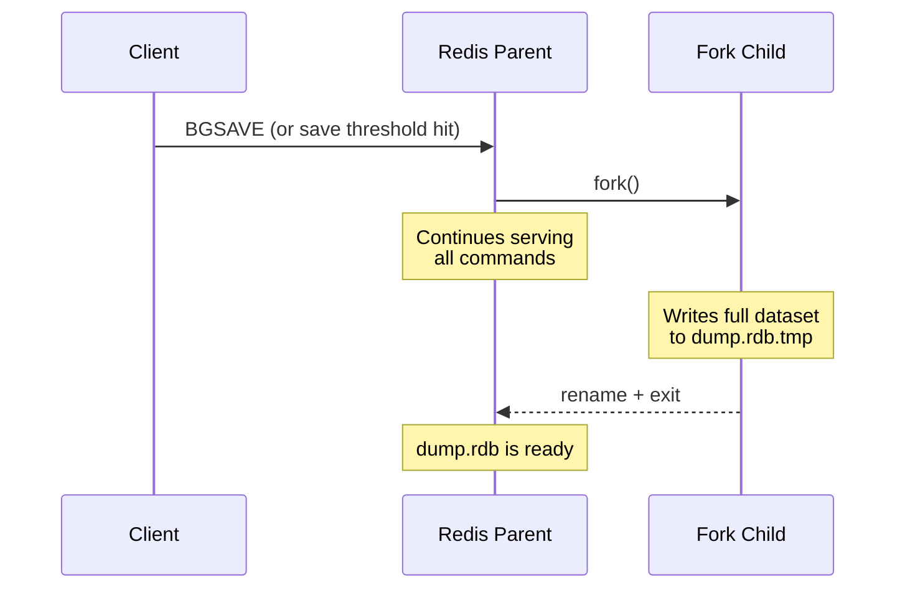

# Redis Persistence

> [!abstract] TL;DR
> Redis offers three persistence mechanisms: RDB (point-in-time snapshots — fast restart, potential data loss), AOF (append-only write log — near-durable, slow restart), and RDB+AOF hybrid (fast restart + high durability, default in Redis 7). No persistence is a valid choice for pure caches. Choosing the right mode is a speed-vs-durability trade-off measured in "how much data can I afford to lose?"

---

## RDB — Point-in-Time Snapshots

### How RDB works

```
1. BGSAVE is triggered (manually or by save config)
2. Redis forks the process
3. Parent process continues serving commands (using OS Copy-on-Write)
4. Child process writes the full dataset to a temp .rdb file
5. Child renames temp file to dump.rdb (atomic on POSIX)
6. Child exits
```



### Configuration

```bash
# redis.conf — automatic save triggers
save 900 1        # save if ≥1 key changed in last 900 seconds
save 300 10       # save if ≥10 keys changed in last 300 seconds
save 60 10000     # save if ≥10000 keys changed in last 60 seconds
# save ""         # disable all automatic saves (pure cache mode)

dbfilename dump.rdb          # RDB file name
dir /var/lib/redis           # directory for RDB (and AOF) files
rdbcompression yes           # LZF compress RDB file (saves disk, costs CPU)
rdbchecksum yes              # CRC64 checksum (costs ~10% CPU on save/load)

# Manual save commands
SAVE        # synchronous — blocks Redis until complete (never in production)
BGSAVE      # background — forks, parent continues; preferred
BGSAVE SCHEDULE   # schedule BGSAVE when no fork is in progress
LASTSAVE    # → Unix timestamp of last successful save
```

### RDB Info

```bash
INFO persistence
# rdb_changes_since_last_save: changes made since last RDB
# rdb_bgsave_in_progress: 1 if BGSAVE is running
# rdb_last_save_time: Unix timestamp of last save
# rdb_last_bgsave_status: ok | err
# rdb_last_bgsave_time_sec: duration of last BGSAVE in seconds
# rdb_current_bgsave_time_sec: duration of in-progress BGSAVE
```

### RDB Characteristics

| Property | Value |
|----------|-------|
| File format | Binary (compact) |
| Startup time | Fast (direct memory load) |
| Potential data loss | Up to last save interval (minutes) |
| Write overhead | Low (periodic fork) |
| Fork overhead | Proportional to dataset size (CoW memory spike possible) |
| Corruption risk | Low (atomic rename) |
| Best for | Backups, disaster recovery, fast restarts |

---

## AOF — Append-Only File

### How AOF works

```
Every write command is appended to appendonly.aof in the Redis protocol format.
On restart, Redis replays all commands in order to rebuild the dataset.
```

```bash
# Each write to Redis also writes to AOF:
SET user:1:name "Alice"    → *3\r\n$3\r\nSET\r\n$13\r\nuser:1:name\r\n$5\r\nAlice\r\n
```

### AOF fsync policies

```bash
# redis.conf
appendonly yes

# fsync policy — controls durability vs performance tradeoff
appendfsync always      # fsync after every write — maximum durability, ~1ms latency hit
appendfsync everysec    # fsync every second — best balance (default, recommended)
appendfsync no          # let OS decide (usually every 30s) — fastest, least safe
```

| Policy | Max data loss | Write latency | Best for |
|--------|--------------|---------------|----------|
| `always` | 0 (single write) | High (~1ms per write) | Financial, medical records |
| `everysec` | ~1 second | Low (default) | Most production workloads |
| `no` | OS flush interval (~30s) | Lowest | Pure cache, throughput-critical |

### AOF Rewrite (Compaction)

Over time, AOF grows large (e.g., `INCR counter` repeated 1M times = 1M log entries, but the final state is just one key). AOF rewrite compacts the file:

```bash
# Manual rewrite (fork-based, non-blocking)
BGREWRITEAOF

# Automatic rewrite configuration
auto-aof-rewrite-percentage 100    # rewrite when AOF is 100% larger than after last rewrite
auto-aof-rewrite-min-size 64mb     # only rewrite if AOF is at least 64MB

# During rewrite:
# 1. Fork child writes a compact representation of current state
# 2. Parent appends new writes to a rewrite buffer AND existing AOF
# 3. Child finishes; parent appends buffer to new AOF; atomic rename
```

```bash
INFO persistence
# aof_enabled: 1
# aof_rewrite_in_progress: 1 if rewrite is running
# aof_rewrite_scheduled: 1 if rewrite will run after current BGSAVE
# aof_last_rewrite_time_sec: duration of last rewrite
# aof_current_size: current AOF file size in bytes
# aof_base_size: AOF size at last rewrite (for auto-rewrite threshold calc)
# aof_last_bgrewrite_status: ok | err
# aof_last_write_status: ok | err
```

---

## RDB + AOF Hybrid (Default Redis 7)

```bash
# redis.conf
appendonly yes
aof-use-rdb-preamble yes    # enabled by default in Redis 7
```

### How hybrid works

```
AOF rewrite writes an RDB-format preamble (fast binary snapshot of current state)
followed by AOF-format delta commands (changes since snapshot started).

On startup:
1. Read RDB preamble → fast bulk load
2. Replay AOF delta commands → apply changes since snapshot

Result: fast startup speed of RDB + near-complete durability of AOF
```

---

## Persistence Trade-offs Table

| Mode | Max Data Loss | Startup Speed | Write Overhead | File Size | Complexity |
|------|--------------|---------------|----------------|-----------|------------|
| No persistence | All data | N/A (empty) | None | None | None |
| RDB only | Last snapshot (minutes) | Fast | Low (periodic) | Compact | Low |
| AOF only (`always`) | 0 | Slow (log replay) | High (per-write fsync) | Large | Medium |
| AOF only (`everysec`) | ~1 second | Slow (log replay) | Low | Large | Medium |
| Hybrid RDB+AOF | ~1 second | Fast (RDB preamble) | Low | Medium | Medium |

---

## Corruption Recovery

```bash
# Check and repair RDB file
redis-check-rdb /var/lib/redis/dump.rdb
# → shows errors if any; will attempt repair

# Check and repair AOF file
redis-check-aof /var/lib/redis/appendonly.aof
# → shows truncation point
redis-check-aof --fix /var/lib/redis/appendonly.aof
# → truncates AOF at last valid command (loses commands after corruption)
```

### Common corruption scenarios

| Scenario | Cause | Recovery |
|----------|-------|---------|
| Truncated AOF | Process killed mid-write | `redis-check-aof --fix` (loses last partial command) |
| Partial RDB | Power loss during `rename()` | Restore from backup (RDB rename is atomic, so unlikely) |
| Mixed AOF | Disk full during rewrite | `redis-check-aof --fix` or restore backup |

---

## SHUTDOWN and Recovery

```bash
# Clean shutdown — saves RDB before exit (if configured)
SHUTDOWN SAVE    # force RDB save even if AOF is primary
SHUTDOWN NOSAVE  # skip save (fast shutdown, data loss)
SHUTDOWN         # default: SAVE if save configured, no save if no persistence

# After crash recovery order:
# 1. If AOF enabled → replay AOF (most complete)
# 2. If only RDB → load dump.rdb
# Both present → AOF takes precedence (Redis 7+)
```

---

## Backup Strategy

```bash
# Automated RDB backup
# 1. Configure save thresholds
# 2. Copy dump.rdb periodically to object storage (S3, GCS)
cp /var/lib/redis/dump.rdb /backup/redis/dump-$(date +%Y%m%d%H%M%S).rdb

# Hot backup without stopping Redis
redis-cli BGSAVE
# Wait for rdb_bgsave_in_progress = 0
redis-cli INFO persistence | grep rdb_bgsave_in_progress
# Then copy dump.rdb

# Restore from RDB backup
# 1. Stop Redis
# 2. Copy backup.rdb to dir as dump.rdb
# 3. Start Redis (loads dump.rdb on startup)

# AOF backup
# Just copy appendonly.aof (AOF is always appendable)
# For point-in-time, copy at BGREWRITEAOF completion
```

---

## Common Pitfalls

- **Large datasets + RDB = huge fork memory spike** — When Redis forks for BGSAVE, OS copy-on-write means write-heavy workloads cause the parent's modified pages to be copied. Peak memory = 2× current Redis memory. Plan instance memory accordingly.
- **`appendfsync always` in high-throughput Redis** — `always` calls `fsync()` after every command. At 10K writes/sec, this saturates disk I/O. Use `everysec` for production unless you need absolute zero data loss.
- **No AOF rewrite scheduled** — Without auto-rewrite, AOF grows indefinitely. Set `auto-aof-rewrite-percentage 100` and `auto-aof-rewrite-min-size 64mb`. Monitor `aof_current_size`.
- **AOF and RDB in different directories** — Both should be in the same `dir`. Mixing locations causes confusion during recovery. Set `dir` once in config.
- **Not testing restoration** — Run a quarterly restore drill: take dump.rdb, spin up a new Redis instance, verify data integrity. Untested backups are not backups.
- **SHUTDOWN NOSAVE in scripts** — Automation that calls `SHUTDOWN NOSAVE` will silently discard all unsaved RDB data. Use `SHUTDOWN SAVE` or let Redis use its configured persistence.

---

## Review Questions

1. **Fork memory spike** — Your Redis instance uses 10GB of RAM with RDB enabled. `BGSAVE` is triggered. Explain the OS copy-on-write mechanism and calculate the worst-case additional memory required on a write-heavy workload during the BGSAVE window.
2. **AOF vs RDB for financial data** — You store pending transactions in Redis (short-lived, waiting for batch processing). A power failure occurs. With `appendfsync everysec`, what is the maximum data loss? Is this acceptable for financial data? What alternative do you propose?
3. **Hybrid persistence internals** — During an AOF rewrite with `aof-use-rdb-preamble yes`, a client sends 500 write commands while the fork child is writing. Explain exactly where those 500 commands end up and how they are incorporated into the new AOF file.
4. **Corruption recovery procedure** — Redis crashes mid-rewrite, leaving a partially written appendonly.aof. You restart Redis and it fails to load. What tool do you run, what does `--fix` do to the file, and what data is potentially lost?

---

## Related

- [[Redis_Overview]] — persistence modes overview and trade-offs
- [[Redis_Replication]] — AOF/RDB interaction with replica sync
- [[Redis_Security_and_Config]] — redis.conf persistence settings
- [[Redis_Performance_and_Monitoring]] — monitoring persistence status via INFO
- [[_MOC_Database_Master]] — durability and write-ahead logging in database systems

---

#Redis #Persistence #RDB #AOF #Durability #Operations
