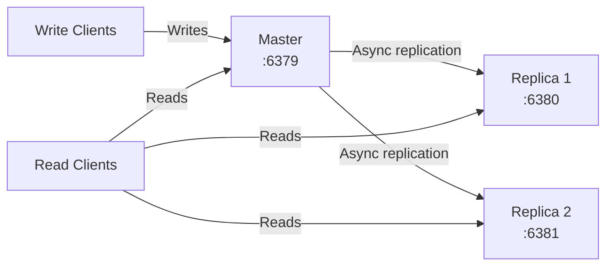
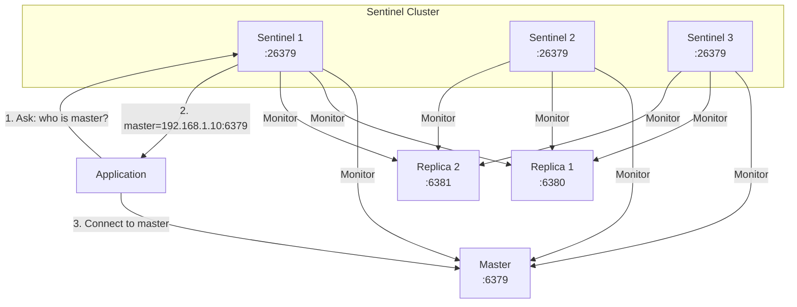

# Redis Replication

> [!abstract] TL;DR
> Redis replication uses a master-replica model where replicas are read-only copies of the master. Sentinel adds automatic failover (promoting a replica to master on failure). For high availability without manual intervention, deploy a minimum of 3 Sentinel nodes monitoring a master + 2 replicas. Replication is asynchronous by default — replicas may lag behind the master.

---

## Master-Replica Replication

### Architecture



**Key properties:**
- Replicas are **read-only** by default (write attempts return error)
- Replication is **asynchronous** — replicas may lag behind master
- Replicas can have their own replicas (chained replication, useful for geo)
- Multiple replicas distribute read load

### Setting up replication

```bash
# Option 1: redis.conf (persistent)
replicaof <master-ip> <master-port>    # e.g., replicaof 192.168.1.10 6379

# Deprecated: slaveof (same functionality, old naming)
# slaveof <master-ip> <master-port>

# Option 2: redis-cli (runtime, not persisted across restart)
REPLICAOF 192.168.1.10 6379

# Stop replication (promote to standalone)
REPLICAOF NO ONE

# With authentication
requirepass <master-password>
masterauth <master-password>   # password replica uses to authenticate to master
```

### Replication info

```bash
INFO replication
# Master output:
# role: master
# connected_slaves: 2
# slave0: ip=192.168.1.11,port=6380,state=online,offset=1234,lag=0
# slave1: ip=192.168.1.12,port=6381,state=online,offset=1234,lag=1
# master_repl_offset: 1234          ← master's latest offset

# Replica output:
# role: slave
# master_host: 192.168.1.10
# master_port: 6379
# master_link_status: up            ← up | down
# master_last_io_seconds_ago: 1     ← seconds since last heartbeat
# master_repl_offset: 1234          ← replica's latest applied offset
# slave_repl_offset: 1234
# master_sync_in_progress: 0        ← 1 if full sync in progress
```

---

## Full Sync vs Partial Sync (PSYNC)

### Full Sync (initial or after gap)

```
1. Replica sends PSYNC <replid> <offset>
2. Master compares replid and offset:
   - If unknown replid OR offset not in backlog → Full Sync
3. Master forks and sends BGSAVE to replica (RDB transfer)
4. Master buffers write commands during transfer
5. Replica loads RDB, then applies buffered commands
6. Incremental replication continues
```

### Partial Sync (reconnect within backlog)

```
1. Replica reconnects after brief disconnect
2. Replica sends PSYNC <replid> <last_applied_offset>
3. Master checks replication backlog:
   - If offset is within backlog → send only missing commands (partial sync)
   - If offset is out of backlog → Full Sync required
```

```bash
# Replication backlog configuration (redis.conf)
repl-backlog-size 1mb     # circular buffer of recent write commands (default 1MB)
# Increase if replicas often disconnect/reconnect (network blips)
# Larger backlog = more partial syncs (avoids expensive full RDB transfer)

repl-backlog-ttl 3600     # seconds to keep backlog after all replicas disconnect (default 3600)
```

### Replica lag monitoring

```bash
INFO replication
# slave0: lag=0    # replica is fully caught up
# slave0: lag=3    # replica is 3 seconds behind master

# Configure max acceptable lag (replicas with higher lag report themselves as unavailable)
min-slaves-to-write 1        # master stops accepting writes if < 1 replica is in sync
min-slaves-max-lag 10        # replica is "in sync" if lag ≤ 10 seconds
```

---

## Redis Sentinel — Automatic Failover

Sentinel provides:
1. **Monitoring** — Sentinel nodes continuously ping master and replicas
2. **Automatic failover** — When master is down, Sentinel promotes a replica
3. **Configuration provider** — Clients ask Sentinel for current master address

### Sentinel Architecture



### Sentinel configuration

```bash
# sentinel.conf
port 26379
sentinel monitor mymaster 192.168.1.10 6379 2   # name, master-ip, port, quorum

# quorum = minimum Sentinels that must agree to declare master ODOWN (objectively down)
# For 3 Sentinels, quorum=2 (majority) is standard

sentinel down-after-milliseconds mymaster 30000  # ms master must be unreachable → SDOWN
sentinel failover-timeout mymaster 180000         # max time for failover (ms)
sentinel parallel-syncs mymaster 1                # replicas syncing simultaneously after failover

# Authentication
sentinel auth-pass mymaster <master-password>
```

### Sentinel failover sequence

```
1. Master fails to respond to PING for down-after-milliseconds → Sentinel marks SDOWN (subjectively down)
2. Quorum number of Sentinels agree → ODOWN (objectively down)
3. Sentinels elect a leader Sentinel (via Raft-like vote)
4. Leader Sentinel selects best replica to promote:
   - Lowest replication lag
   - Highest priority (replica-priority config)
   - Largest replication offset (most up-to-date)
5. Leader sends REPLICAOF NO ONE to chosen replica → promotes it to master
6. Other replicas are reconfigured to replicate from new master
7. Old master (when it recovers) becomes a replica of new master
8. Sentinel notifies clients via pubsub channel __sentinel__:hello
```

### Client interaction with Sentinel

```bash
# Ask Sentinel for current master
SENTINEL get-master-addr-by-name mymaster
# → ["192.168.1.10", "6379"]

# List all replicas
SENTINEL replicas mymaster

# List all Sentinels monitoring this master
SENTINEL sentinels mymaster

# Trigger manual failover (testing)
SENTINEL failover mymaster

# Check health
SENTINEL ckquorum mymaster   # verify quorum is achievable
PING                          # basic liveness check
```

### Sentinel client libraries

In Python (redis-py):
```python
from redis.sentinel import Sentinel

sentinel = Sentinel(
    [("sentinel1-host", 26379), ("sentinel2-host", 26379), ("sentinel3-host", 26379)],
    socket_timeout=0.1,
    decode_responses=True,
)

# Always-fresh master connection
master = sentinel.master_for("mymaster", socket_timeout=0.1)
master.set("key", "value")

# Always-fresh replica connection (for reads)
replica = sentinel.slave_for("mymaster", socket_timeout=0.1)
replica.get("key")
```

---

## Sentinel Deployment Requirements

| Requirement | Minimum | Recommended |
|------------|---------|-------------|
| Sentinel nodes | 3 | 3–5 (always odd) |
| Redis nodes | 1 master + 1 replica | 1 master + 2 replicas |
| Quorum | 2 of 3 | 2 of 3 (or 3 of 5) |
| Sentinel on same host as Redis? | Possible but reduces fault isolation | Separate hosts |
| Sentinel in same AZ as Redis? | Possible | Spread across AZs |

**Why 3 Sentinels?** With 2, any single Sentinel failure loses quorum. With 3, one failure still has 2/3 quorum.

---

## Read Scaling with Replicas

```bash
# Direct read to replica (manual routing in application)
redis.Redis(host="replica1", port=6380).get("key")

# redis-py slave_for (auto-selects a replica)
replica = sentinel.slave_for("mymaster")
replica.get("key")

# Important: replica data may be slightly stale
# For eventual-consistent reads → use replica
# For strongly-consistent reads → use master

# Check replica lag before reading (optional)
INFO replication | grep lag
```

---

## Common Pitfalls

- **Quorum too low** — Setting quorum=1 with 3 Sentinels means a single Sentinel with a bad network view can trigger failover. Use majority quorum (n/2 + 1).
- **Sentinel and Redis on same host** — If the host fails, you lose both the Redis node and its Sentinel. Place Sentinels on separate hosts from Redis.
- **Forgetting `masterauth`** — If master requires a password, replicas need `masterauth` set or they fail to connect after master restart.
- **`min-slaves-to-write` in production** — Without this, a master isolated from all replicas (network partition) continues accepting writes that will be lost when the partition heals and replicas become the new master. Set `min-slaves-to-write 1 min-slaves-max-lag 10`.
- **Replication backlog too small** — Replicas with frequent short disconnects (network blips) trigger full RDB syncs if the backlog is too small. Increase `repl-backlog-size` to cover the max expected disconnect duration × write rate.
- **Failover during RDB transfer** — If master fails while a replica is doing a full sync (RDB transfer), the sync restarts from the new master. Ensure `failover-timeout` accounts for this.

---

## Review Questions

1. **Partial vs full sync** — A replica loses its network connection to the master for 30 seconds during a high-write period. The replication backlog is configured to 1MB but 5MB of writes occurred during the disconnect. What happens when the replica reconnects? How would you prevent the full sync?
2. **Sentinel quorum and split-brain** — Your 3 Sentinels are split across two data centers: DC1 (2 Sentinels + master) and DC2 (1 Sentinel + replica). DC2's network link to DC1 fails. Which Sentinel(s) can declare the master ODOWN? Can a failover occur? Is this the correct behavior?
3. **Replication lag consistency** — Your application reads from replicas for performance. A user updates their email (write to master), then immediately reads their profile (read from replica). The replica is 200ms behind. What does the user see? How do you fix this for the profile-update flow without routing all reads to master?
4. **min-slaves-to-write safety** — Explain the network partition scenario that `min-slaves-to-write 1` prevents. What happens to write clients when the setting takes effect? Is this the right trade-off for a session store?

---

## Related

- [[Redis_Cluster]] — horizontal scaling beyond a single master-replica pair
- [[Redis_Persistence]] — RDB/AOF interaction with full sync
- [[Redis_Security_and_Config]] — masterauth, requirepass, bind settings
- [[Redis_Performance_and_Monitoring]] — replication lag monitoring via INFO
- [[_MOC_Database_Master]] — replication patterns in distributed databases

---

#Redis #Replication #Sentinel #HighAvailability #Failover #Operations
