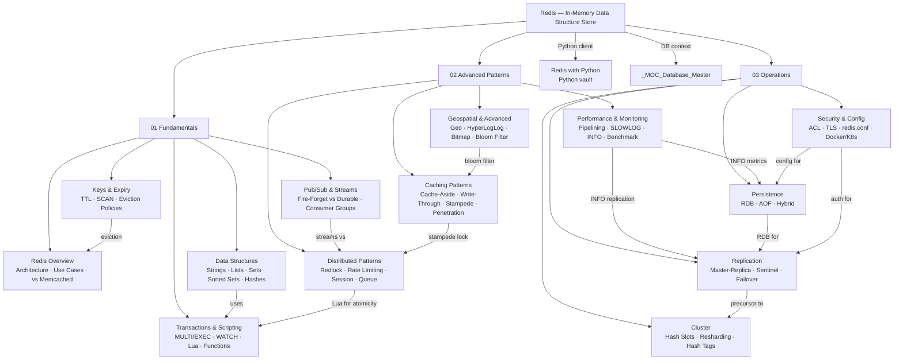

# Redis Knowledge Vault

> **About:** 18 notes across 3 sections covering Redis from first principles through distributed patterns to production operations. Includes the Python-specific note in the Python vault: [[Redis_with_Python]]. Cross-linked to [[_MOC_Database_Master]].

---

## Concept Map



---

## Sections

### 01 Fundamentals

| Note | Topics | Difficulty |
|------|--------|------------|
| [[Redis_Overview]] | In-memory store, vs Memcached, persistence modes, use cases, architecture, Redis 7.x, Valkey | Beginner |
| [[Redis_Data_Structures]] | Strings, Lists, Sets, Sorted Sets, Hashes — all commands with time complexities | Beginner |
| [[Redis_Keys_and_Expiry]] | Naming conventions, TTL mechanics, SCAN vs KEYS, OBJECT ENCODING, eviction policies | Beginner |
| [[Redis_Pub_Sub_and_Streams]] | Pub/Sub, Streams, XADD/XREAD, consumer groups, XACK/XPENDING, vs Kafka table | Intermediate |
| [[Redis_Transactions_and_Scripting]] | MULTI/EXEC, WATCH CAS, Lua EVAL/EVALSHA, Redis Functions, when to use which | Intermediate |

### 02 Advanced Patterns

| Note | Topics | Difficulty |
|------|--------|------------|
| [[Redis_Caching_Patterns]] | Cache-aside, write-through, write-behind, read-through, stampede, penetration, avalanche | Intermediate |
| [[Redis_Distributed_Patterns]] | Redlock, rate limiting (fixed/sliding/token bucket), session store, reliable queues | Advanced |
| [[Redis_Geospatial_and_Advanced]] | GEOSEARCH, HyperLogLog (12KB cardinality), Bitmaps (bit flags), Bloom Filter (RedisBloom) | Advanced |
| [[Redis_Performance_and_Monitoring]] | Pipelining, redis-benchmark, SLOWLOG, INFO, MONITOR, latency tools | Intermediate |

### 03 Operations

| Note | Topics | Difficulty |
|------|--------|------------|
| [[Redis_Persistence]] | RDB snapshots, AOF (fsync policies), AOF rewrite, RDB+AOF hybrid, corruption recovery | Intermediate |
| [[Redis_Replication]] | Master-replica, full/partial sync, replication backlog, Sentinel, automatic failover | Intermediate |
| [[Redis_Cluster]] | 16384 hash slots, CRC16 routing, hash tags, resharding, MOVED/ASK, cluster clients | Advanced |
| [[Redis_Security_and_Config]] | ACL users, requirepass, TLS, protected-mode, dangerous commands, redis.conf, Docker/K8s | Intermediate |

### Cross-vault

| Note | Location | Relationship |
|------|----------|-------------|
| [[Redis_with_Python]] | `Python/Backend/` | Python redis-py client — code demos for all patterns |
| [[_MOC_Database_Master]] | `Database/` | Broader database engineering context |

---

## Learning Paths

### Path A: Backend Developer

*Goal: Use Redis effectively in application code for caching, sessions, and real-time features.*

```
1. Redis_Overview             — understand what Redis is (not just a cache)
2. Redis_Data_Structures      — pick the right type for the job
3. Redis_Keys_and_Expiry      — naming, TTL, SCAN
4. Redis_Caching_Patterns     — cache-aside, stampede, penetration
5. Redis_Distributed_Patterns — rate limiting, session store, queues
6. Redis_with_Python          — Python implementation (see Python vault)
7. Redis_Pub_Sub_and_Streams  — messaging patterns
8. Redis_Transactions_and_Scripting — Lua for atomic operations
```

### Path B: Platform / DevOps Engineer

*Goal: Deploy, operate, and scale Redis in production reliably.*

```
1. Redis_Overview             — architecture, persistence overview
2. Redis_Persistence          — RDB vs AOF vs hybrid, backup strategy
3. Redis_Replication          — master-replica, Sentinel setup
4. Redis_Cluster              — horizontal scaling, hash slots, resharding
5. Redis_Security_and_Config  — ACL, TLS, redis.conf hardening
6. Redis_Performance_and_Monitoring — SLOWLOG, INFO, pipelining
7. Redis_Keys_and_Expiry      — eviction policies and memory management
```

### Path C: Data Patterns Engineer

*Goal: Use Redis's advanced data structures for analytics, geospatial, and probabilistic counting.*

```
1. Redis_Data_Structures      — Sorted Sets for rankings, Hashes for objects
2. Redis_Geospatial_and_Advanced — Geo, HyperLogLog, Bitmaps, Bloom Filters
3. Redis_Pub_Sub_and_Streams  — event sourcing with Streams
4. Redis_Distributed_Patterns — sliding window rate limiter, token bucket
5. Redis_Transactions_and_Scripting — Lua for atomic analytics operations
6. Redis_Performance_and_Monitoring — pipelining for bulk operations
7. Redis_Caching_Patterns     — write-behind for analytics ingestion
```

---

## Key Command Reference Card

```bash
# Strings
SET key value EX 300 NX          # set with TTL if not exists
GET / MGET / INCR / INCRBY

# Lists
RPUSH queue value  ←→  BLPOP queue 10    # FIFO queue
LMOVE src dst LEFT LEFT                   # reliable queue

# Sets
SADD / SMEMBERS / SISMEMBER / SINTER / SUNION / SDIFF

# Sorted Sets
ZADD leaderboard <score> <member>
ZRANGE leaderboard 0 9 REV WITHSCORES    # top 10
ZINCRBY leaderboard 100 "Alice"

# Hashes
HSET user:42 name Alice email alice@x.com
HGET user:42 name  /  HGETALL user:42 / HINCRBY

# Expiry
EXPIRE key 3600  /  TTL key  /  PERSIST key
UNLINK key   (async delete — prefer over DEL for large objects)

# Safe scan
SCAN 0 MATCH "user:*" COUNT 100  (never KEYS * in production)

# Transactions
MULTI → commands → EXEC   (no rollback on runtime errors)
WATCH key → MULTI → EXEC  (abort if key changed)
EVAL "lua script" numkeys key1 key2 arg1 arg2

# Monitoring
SLOWLOG GET 10  /  INFO memory  /  INFO stats  /  INFO replication
redis-benchmark -t set,get -n 100000 -c 50
```

---

#Redis #MOC #Index #Caching #Database
