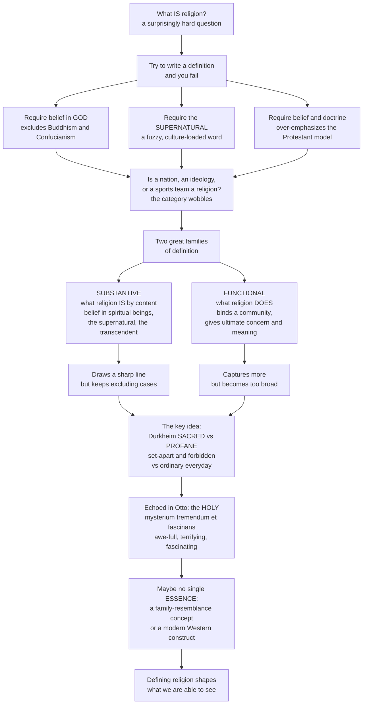

# 🕉️ Defining Religion and the Sacred

> [!abstract] TL;DR
> "Religion" is notoriously hard to define: no definition manages to include everything we would call religion while excluding everything we would not. Scholars sort attempts into two families — **substantive** definitions that say what religion *is* by its content (Tylor's "belief in spiritual beings," the supernatural, the transcendent) and **functional** definitions that say what religion *does* in society and the psyche (Durkheim's binding of a community, Geertz's system of symbols, Tillich's "ultimate concern") — each failing by either over-excluding non-theistic traditions or over-including nationalism and sport. The single most influential idea to emerge is Émile **Durkheim's distinction between the sacred and the profane**, echoed in Rudolf **Otto's numinous** *mysterium tremendum et fascinans*, which places the sacred at the heart of religion. Because many now doubt religion has any single **essence**, treating it as a **family-resemblance** concept or a modern Western **construct**, learning how — and whether — to define religion is the discipline's central, self-critical problem.

---

## Intuition

**Analogy:** Here is a question that has occupied scholars for over a century and still has no settled answer — *what is religion?* We all feel we know it when we see it: churches, gods, prayers, sacred books. But try to write a definition that includes everything we would call religion and excludes everything we would not, and you will fail. Require belief in **God**, and you have just excluded Theravada Buddhism (which has no creator god) and Confucianism. Require the **supernatural**, and you are leaning on a fuzzy, culturally loaded word that means little outside the modern West. Require **belief and doctrine**, and you have quietly imposed a Protestant Christian template onto traditions built around practice, law, purity, or belonging. Meanwhile — is intense devotion to a nation, a political ideology, capitalism, or a football club a "religion"? Suddenly the category itself starts to wobble.

Faced with this, scholars split definitions into two families. **Substantive** definitions say what religion *is* by its content — Edward Tylor's minimal "belief in spiritual beings," or belief in the supernatural, the transcendent, superhuman powers. These draw a sharp, clear line, but the line keeps cutting off cases we intuitively want inside. **Functional** definitions say what religion *does* — its role in the group or the mind. Émile Durkheim's religion binds a community around the **sacred**; Clifford Geertz's is a "system of symbols" that clothes a worldview in an "aura of factuality"; Paul Tillich's is whatever you treat as your "**ultimate concern**." These capture far more — but risk becoming so broad that nationalism and Sunday football sail straight in. The most powerful single idea to fall out of the whole debate is Durkheim's: every religion divides the world into the **sacred** (set apart, forbidden, treated with awe) and the **profane** (ordinary, everyday), and the sacred is the beating heart of the thing — an intuition echoed in Rudolf Otto's "the **holy**," the *mysterium tremendum et fascinans*, the awe-inspiring, terrifying, fascinating mystery. And yet many scholars now suspect religion has no single **essence** at all — that it is a "family resemblance" concept (Wittgenstein), a cluster of overlapping features with nothing common to every case, or even a modern Western **construct** projected onto other cultures. Understanding how, and whether, to define religion is not a dry preliminary. It is the foundational problem of the field, and a lesson in how our categories quietly shape what we are able to see.

---

## How It Works

### Core mechanics

1. **Notice the stakes.** A definition is not innocent. It decides *what gets counted* as religion, *what gets compared* to what, and it silently smuggles in assumptions (about gods, belief, individual interiority) that may not travel across cultures.
2. **Substantive route — define by content.** Specify a *thing* religion must contain: spiritual beings, the supernatural, superhuman agents, the transcendent. Result: crisp boundaries, but chronic **over-exclusion** — Buddhism, Confucianism, Jainism, and much of lived practice fall outside.
3. **Functional route — define by role.** Specify what religion *does*: binds a moral community, manages meaning and death anxiety, supplies an ultimate concern. Result: wide cross-cultural reach, but chronic **over-inclusion** — nationalism, Marxism, consumerism, and sport become "religions" (the *functional-equivalents* problem).
4. **Anchor on the sacred.** Durkheim relocates the essence from *belief* to a *relation*: the split between the **sacred** (set apart and forbidden) and the **profane** (the everyday), maintained by taboo and ritual. Otto phenomenologically describes the raw *experience* of the sacred as the **numinous**; Eliade calls its manifestation a **hierophany**.
5. **Doubt the essence.** Anti-essentialists reply that no property is shared by *all* religions. "Religion" is then a **polythetic**, family-resemblance category — or, more radically, a modern academic and colonial **construct** rather than a natural kind you discover in the world.

### Flow



---

## Key Concepts

### Secondary (the core idea)

- **The problem of definition.** We recognize religion easily but cannot pin it down. Every rule either lets in too much or shuts out too much.
- **Substantive vs functional.** Substantive = *what religion is* (its content, e.g. belief in gods/spirits). Functional = *what religion does* (its job in society or the mind).
- **The sacred vs the profane.** Durkheim's central binary: the **sacred** is set apart, special, surrounded by rules and awe; the **profane** is the ordinary stuff of daily life. Religion lives in the line between them.
- **Why it excludes.** "Belief in God" is a bad universal test because whole traditions — Theravada Buddhism, Confucianism — thrive without a creator god.

### Undergraduate (the theorists and their trade-offs)

- **Etymology.** Latin *religio* is itself contested: Cicero derived it from *relegere* ("to go over again, observe carefully"), while Lactantius and later Augustine favored *religare* ("to bind fast" — religion as what binds us to God or one another). The abstract, general category "**religion**" — a genus with Christianity, Islam, Buddhism as species — is largely a *modern* coinage, hardening only in the Enlightenment.
- **Substantive theorists.** **E. B. Tylor**: the minimal definition, "belief in spiritual beings" (**animism**), as religion's irreducible core. **Melford Spiro**: "an institution consisting of culturally postulated superhuman beings." Variants swap in *the supernatural* or *the transcendent*. *Strength:* clear boundaries, easy to operationalize. *Weakness:* Western/theistic bias; excludes non-theistic traditions; "supernatural" presupposes a natural/supernatural split alien to many cultures.
- **Functional theorists.** **Durkheim**: religion is "a unified system of beliefs and practices relative to **sacred** things ... which unite into one single moral community called a Church all those who adhere to them." **Geertz**: "a system of symbols which acts to establish powerful, pervasive, and long-lasting moods and motivations" by formulating "conceptions of a general order of existence" and clothing them with "an aura of factuality." **Tillich**: religion is one's "**ultimate concern**." **J. M. Yinger**: religion as a system for confronting the ultimate problems of human life. *Strength:* inclusive, cross-cultural, catches practice not just belief. *Weakness:* too broad — nationalism, Marxism, sport, and consumerism can all satisfy it.
- **The sacred, phenomenologically.** **Rudolf Otto** (*The Idea of the Holy*): the sacred is *sui generis* and cannot be reduced to ethics or reason. The raw experience is the **numinous** — the *mysterium tremendum et fascinans*: a mystery that is overwhelming and dreadful (*tremendum*) yet magnetically fascinating (*fascinans*), an encounter with the "wholly other." **Mircea Eliade**: the sacred erupts into ordinary space and time as a **hierophany** (a "showing of the sacred"), and for the religious person the sacred is the *really real*, the fixed point around which a meaningful cosmos is organized.

### Graduate (the critique of the category)

- **Anti-essentialism and family resemblance.** Following **Wittgenstein**, scholars (Martin Southwold, Benson Saler) argue religion has no single defining property; it is a **polythetic**/prototype category — a bundle of features (superhuman beings, ritual, myth, moral code, sacred objects, community) where members share *some* but no feature is shared by *all*. Definition becomes a matter of resemblance to prototypes, not necessary-and-sufficient conditions.
- **Religion as a scholar's artifact.** **Jonathan Z. Smith**: "there is no data for religion. Religion is solely the creation of the scholar's study ... it has no existence apart from the academy." The category is an analytic tool, not a thing found in the world.
- **The genealogical / postcolonial critique.** **Talal Asad** (*Genealogies of Religion*): there can be *no universal definition of religion*, because the very concept is the historical product of specific Christian and Enlightenment developments — the privatization of belief, the split of religion from politics — and exporting it distorts other cultures. **Tomoko Masuzawa** (*The Invention of World Religions*): the tidy "**world religions**" scheme is a nineteenth-century European construction that universalizes a Christian template while preserving Europe's centrality.
- **Sacred/profane in practice, and its limits.** The distinction organizes religious life into sacred *times*, *spaces*, *objects*, *persons*, and *actions*, policed by **taboo**. **Mary Douglas** (*Purity and Danger*) reframes purity/pollution as a symbolic ordering system — dirt as "matter out of place." But the boundary is *porous and shifting*: the "**lived religion**" of ordinary practitioners rarely respects the neat lines of scholarly definition.
- **The sui generis vs reductionism debate.** Is the sacred an irreducible reality (Otto, Eliade) that phenomenology must describe on its own terms, or is it *reducible* to the social (Durkheim — "society worshipping itself") or the psychological? Where you stand shapes whether religion can be *explained* at all.

---

## Python Demo

```python
# Defining Religion and the Sacred — two dramatizations of the definitional problem:
#   (a) DEFINITION COVERAGE: four rival definitions each draw a different
#       inclusion/exclusion boundary over the same set of cases -> no rule fits.
#   (b) FAMILY RESEMBLANCE: cluster the cases by shared features -> overlapping
#       similarity, with NO single feature common to all -> no shared "essence".
import numpy as np
import matplotlib.pyplot as plt

# --- Cases and their feature attributes (a deliberate teaching caricature) ---
features = ["Belief in God", "Supernatural", "Ritual", "Community",
            "Ultimate Concern", "Moral Code", "Sacred/Profane"]
cases = ["Christianity", "Islam", "Buddhism", "Confucianism", "Animism",
         "Marxism", "Nationalism", "Sports Fandom", "Secular Humanism"]

# rows = cases, cols = features (1 = present, 0 = absent)
M = np.array([
    [1, 1, 1, 1, 1, 1, 1],   # Christianity
    [1, 1, 1, 1, 1, 1, 1],   # Islam
    [0, 1, 1, 1, 1, 1, 1],   # Buddhism  -> no creator god
    [0, 0, 1, 1, 1, 1, 1],   # Confucianism -> this-worldly, ritual-centred
    [0, 1, 1, 1, 1, 1, 1],   # Animism   -> spirits, no single god
    [0, 0, 1, 1, 1, 1, 0],   # Marxism
    [0, 0, 1, 1, 1, 1, 1],   # Nationalism -> civil religion
    [0, 0, 1, 1, 0, 0, 0],   # Sports fandom
    [0, 0, 0, 0, 1, 1, 0],   # Secular humanism
])
consensus = np.array([1, 1, 1, 1, 1, 0, 0, 0, 0], dtype=bool)  # widely called "a religion"

# --- Four rival definitions, each a rule over the feature columns ---
definitions = [
    ("Substantive: belief in God",              lambda r: r[0] == 1),
    ("Substantive: the supernatural",           lambda r: r[1] == 1),
    ("Functional: ultimate concern (Tillich)",  lambda r: r[4] == 1),
    ("Functional: community + sacred (Durkheim)", lambda r: r[3] == 1 and r[6] == 1),
]
coverage = np.array([[1 if rule(M[j]) else 0 for j in range(len(cases))]
                     for _, rule in definitions])

# --- Family resemblance: Jaccard similarity between cases over their features ---
n = len(cases)
S = np.zeros((n, n))
for i in range(n):
    for j in range(n):
        a, b = M[i].astype(bool), M[j].astype(bool)
        union = np.sum(a | b)
        S[i, j] = np.sum(a & b) / union if union else 0.0

# Is ANY single feature shared by ALL cases?  -> the family-resemblance test
universal = [features[k] for k in np.where(M.sum(axis=0) == n)[0]]
print("Feature shared by ALL cases:", universal or "NONE  ->  no single essence")

# --- Plot ---
fig, (ax1, ax2) = plt.subplots(1, 2, figsize=(16, 6))

# (a) definition coverage: each row a definition, each column a case
ax1.imshow(coverage, cmap="RdYlGn", aspect="auto", vmin=0, vmax=1)
ax1.set_xticks(range(len(cases)))
ax1.set_xticklabels([c + ("  *" if consensus[k] else "  ?") for k, c in enumerate(cases)],
                    rotation=45, ha="right", fontsize=8)
ax1.set_yticks(range(len(definitions)))
ax1.set_yticklabels([d[0] for d in definitions], fontsize=8)
ax1.set_title("(a) No definition fits: each rule includes / excludes different cases\n"
              "*  widely called a religion    ?  contested", fontsize=10)
for i in range(coverage.shape[0]):
    for j in range(coverage.shape[1]):
        ax1.text(j, i, "in" if coverage[i, j] else "out",
                 ha="center", va="center", fontsize=7)

# (b) family resemblance: overlapping clusters, no shared essence
im2 = ax2.imshow(S, cmap="viridis", aspect="auto", vmin=0, vmax=1)
ax2.set_xticks(range(n)); ax2.set_xticklabels(cases, rotation=45, ha="right", fontsize=8)
ax2.set_yticks(range(n)); ax2.set_yticklabels(cases, fontsize=8)
ax2.set_title("(b) Family resemblance: overlapping feature-overlap,\nno single essence common to all",
              fontsize=10)
for i in range(n):
    for j in range(n):
        ax2.text(j, i, f"{S[i, j]:.2f}", ha="center", va="center",
                 fontsize=6, color="white" if S[i, j] < 0.6 else "black")
fig.colorbar(im2, ax=ax2, fraction=0.046, pad=0.04, label="Jaccard feature overlap")

plt.tight_layout()
plt.savefig("defining_religion_and_the_sacred.png", dpi=120, bbox_inches="tight")
plt.show()
```

**What it shows.** Panel (a): the *substantive "belief in God"* rule admits only Christianity and Islam — it **over-excludes** Buddhism, Confucianism, and Animism, obvious religions. The *supernatural* rule still misses Confucianism. The *functional* rules swing the other way: "ultimate concern" **over-includes** Marxism, nationalism, and secular humanism, and Durkheim's "community + sacred" pulls in nationalism as a *civil religion*. Panel (b): the accepted religions form a high-overlap block that *shades continuously* into the contested cases, and the printed test confirms **no single feature is shared by every case** — the signature of a family-resemblance category rather than a shared essence.

---

## Real-World Applications

> **Example — courts defining "religion":** The problem is not academic when a state must decide who gets tax exemption, a "sacred site" protection, or conscientious-objector status. U.S. courts, unable to rely on "belief in God" (which would exclude Buddhists), drifted toward a functional test — in *United States v. Seeger* (1965) asking whether a belief occupies "a place in the life of its possessor parallel to that filled by the orthodox belief in God." That is Tillich's *ultimate concern* smuggled into law, and it shows both the appeal and the danger of functional definitions: it is inclusive, but it makes the boundary of "religion" a live legal battleground (Scientology, Transcendental Meditation, secular humanism).

- **Comparative curricula.** The default "world religions" survey — five or six great traditions taught as parallel belief systems — encodes exactly the Christian-shaped, belief-centric template that Masuzawa and Asad criticize; reforming it is a direct application of the definitional debate.
- **Census and survey design.** How you word the "religion" question determines whether the fast-growing "**nones**," folk practitioners, and non-theists are counted as religious at all.
- **Analyzing quasi-religions.** The functional lens is a research tool: scholars use "sacred/profane," collective effervescence, and ritual to study nationalism, sport fandom, brand cults, and market ideology as *functional equivalents* of religion.
- **Heritage and law.** Protecting Indigenous **sacred sites** forces courts to recognize a sacred/profane geography that a purely doctrinal definition would never see.

---

## Common Pitfalls

- **Protestant / belief-centric bias.** Assuming religion is fundamentally about *private belief and doctrine* — a template drawn from post-Reformation Christianity — blinds you to traditions organized around practice, law, purity, or belonging (much of Judaism, Islam, Hinduism, Confucianism, Indigenous religion). Fix: foreground practice and community, not just creed.
- **Treating "supernatural" as self-evident.** The natural/supernatural split is itself a modern Western construct; many cultures have no such line. Using "supernatural" as a universal test imports the very assumption in question.
- **Runaway functionalism.** If religion is "whatever gives ultimate meaning and binds a group," then football, nationalism, and capitalism are religions — which either trivializes the term or requires an *ad hoc* patch to exclude them.
- **Reifying the category.** Talking about "religion" as a natural kind you *discover* — rather than a scholarly abstraction *constructed* in a particular history — hides the concept's contingency (J. Z. Smith, Asad).
- **The sui generis trap vs the reductionist trap.** Declaring the sacred *utterly irreducible* (Otto/Eliade) can block any social or psychological explanation; but *explaining it entirely away* as "nothing but" society or neurons discards the phenomenon it set out to study. Hold the tension rather than collapsing it.
- **Assuming a sharp sacred/profane line.** In lived religion the boundary is porous, negotiated, and constantly shifting; treating it as a fixed wall misreads how people actually practice.

---

## Related Concepts

- [[Religion_Sacred_and_Secular]] — the sociological development of Durkheim's sacred/profane, collective effervescence, and the secularization debate.
- [[Religion_Magic_and_Ritual]] — how the sacred is *enacted*; Eliade's hierophany, taboo, and the mechanics of ritual that maintain the sacred/profane line.
- [[Classical_Sociological_Theory]] — Durkheim's *Elementary Forms of Religious Life* in its wider theoretical context alongside Marx and Weber.
- [[Culture_Symbols_and_Meaning]] — Geertz's semiotic anthropology, the source of the "system of symbols" functional definition of religion.
- [[What_Is_Myth]] — sacred narrative and Eliade's distinction between sacred and profane *time*, a close parallel to the definitional problem.
- [[Faith_and_Reason]] — the theological/philosophical angle that treats religion primarily as *belief* accepted on revelation, a stance this note problematizes.
- [[Buddhist_Philosophy]] — the paradigmatic non-theistic tradition whose existence breaks every "belief in God" substantive definition.

*Sibling notes in this section (forthcoming): Religious_Studies_and_Comparative_Religion_Overview frames the whole field; Theories_of_the_Origin_of_Religion asks where religion came from; The_Comparative_Study_of_Religion asks how to compare traditions once defined; Phenomenology_of_Religion develops Otto's and Eliade's approach to the sacred; and Ritual_and_Religious_Practice examines the sacred in action.*

---

## Review Questions

**Secondary.** In one or two sentences each, explain the difference between a *substantive* and a *functional* definition of religion, and give one real tradition that a "belief in God" definition wrongly leaves out.

**Undergraduate.** Durkheim locates the essence of religion not in belief but in the distinction between the *sacred* and the *profane*. Explain what each term means, why he thought the sacred is fundamentally *social*, and how Rudolf Otto's account of the *numinous* both resembles and departs from Durkheim's.

**Graduate.** Talal Asad argues that "there cannot be a universal definition of religion." Reconstruct his reasoning, connect it to Wittgensteinian *family resemblance* and J. Z. Smith's claim that religion is "the creation of the scholar's study," and assess what follows for the practice of *comparative* religion: if "religion" is a modern Western construct, on what basis can we compare traditions at all?

---

## Sources

- [Stanford Encyclopedia of Philosophy — "The Concept of Religion" (Kevin Schilbrack)](https://plato.stanford.edu/entries/concept-religion/)
- [Émile Durkheim, *The Elementary Forms of Religious Life* (1912)](https://en.wikipedia.org/wiki/The_Elementary_Forms_of_the_Religious_Life)
- [Rudolf Otto, *The Idea of the Holy* (1917)](https://en.wikipedia.org/wiki/The_Idea_of_the_Holy)
- [Clifford Geertz, "Religion as a Cultural System," in *The Interpretation of Cultures* (1973)](https://en.wikipedia.org/wiki/The_Interpretation_of_Cultures)
- [Talal Asad, *Genealogies of Religion* (1993)](https://en.wikipedia.org/wiki/Talal_Asad)

---

#religious-studies #defining-religion #the-sacred #durkheim #sacred-and-profane
