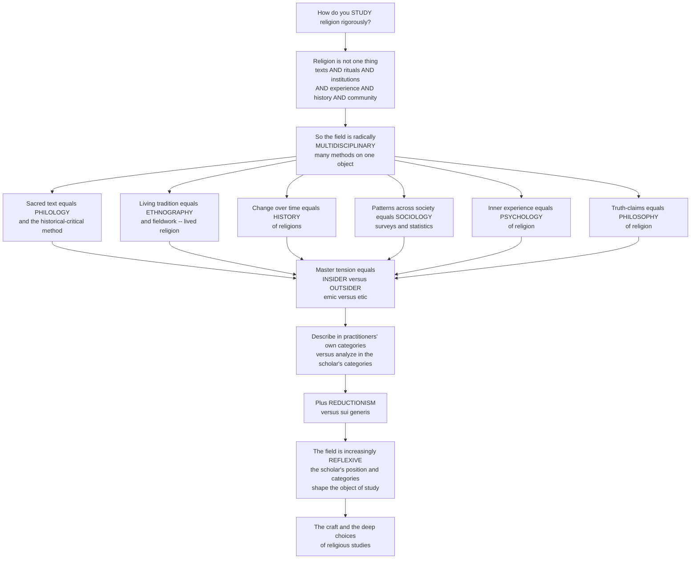

# 🧰 Methods in the Study of Religion

> [!abstract] TL;DR
> Religion is not one thing you can examine with one tool — it is simultaneously **texts, rituals, institutions, experiences, art, history, and communities** — so religious studies is radically **multidisciplinary**, borrowing methods from across the humanities and social sciences, each illuminating a different facet. To read a sacred text you use **philology and the historical-critical method** (treating scripture as a human historical document); to grasp a living tradition you use **ethnography and fieldwork** (religion as it is actually *lived*); to trace change you use **history**; to map belief and belonging you use **sociology**; to probe inner life you use **psychology**; to test concepts and truth-claims you use **philosophy**. Cutting across all of them is the field's master tension — the **insider/outsider** problem (**emic vs. etic**): should you describe religion in the practitioners' *own* categories (risking becoming an apologist) or analyze it in the scholar's explanatory categories (risking distortion)? A related fault-line is **reductionism** (religion is "really" power, sex, economics, or brain chemistry) versus treating religion as **sui generis** (irreducible). And the field is increasingly **reflexive** — aware that the scholar's own position, categories, and even the word "religion" itself shape what can be known. The methods *are* the craft of the discipline.

---

## Intuition

**Analogy:** Imagine you are handed a great cathedral and told, *"Study this."* What is the right tool? A **structural engineer** measures the stone and the load paths. An **art historian** reads the stained glass and the iconography. A **liturgist** watches what people *do* inside during Mass. A **social historian** digs up the guild records and the money that built it. A **pilgrim** kneels and tells you what it *feels like* to be there. Each one is looking at the *same* cathedral, yet each returns with a completely different — and completely true — account. Hand the building to only one specialist and you get a confident, expert, and badly incomplete picture. The cathedral is only ever fully understood by *many* trained eyes at once.

Studying religion is exactly like this. A tradition is at once a library of **texts**, a choreography of **rituals**, a set of **institutions**, a landscape of inner **experiences**, a body of **art**, a **history** of change, and a living **community** — and no single method reaches all of that. So the discipline is deliberately a *toolkit*, not a *tool*: philology for the manuscripts, ethnography for the lived practice, history for the change, sociology for the patterns, psychology for the inner life, philosophy for the truth-claims. And every method forces one deep choice before you even begin — do you describe the cathedral the way the *worshippers* describe it (from *inside*, in their own sacred vocabulary), or the way the *engineer* describes it (from *outside*, in categories the worshippers might reject)? That single question — **insider vs. outsider**, **emic vs. etic** — is the fault-line running through the whole craft.

---

## How It Works

The field's logic runs from the *nature of its object* to the *choice of methods* to the *deep methodological tensions* those methods force. Because religion is many things at once, the study of it is many methods at once; and because those methods look from radically different vantage points, they collide on the insider/outsider question, on reductionism, and finally on the reflexive recognition that the scholar is never a neutral observer.



**The craft, step by step:**

1. **Identify which facet of religion you are after.** A doctrine, a rite, a demographic trend, a mystical state, and a manuscript variant are different objects and demand different methods. Choosing the method *is* half the analysis.
2. **Read texts historically.** *Philology and textual criticism* reconstruct what a document actually said (manuscripts, editions, dating, authorship, canon); the *historical-critical method* then reads scripture as a human historical document, using source, form, and redaction criticism — the approach that revolutionized biblical studies and has analogues across traditions.
3. **Observe the living tradition.** *Ethnography* and *participant-observation* study religion as it is actually practiced — **lived religion** — which routinely diverges from what the official texts prescribe.
4. **Map patterns and probe experience.** *History* traces origins, diffusion, syncretism, and change; *sociology* uses surveys and statistics on belief, belonging, and institutions; *psychology* investigates religious experience and development.
5. **Interpret and evaluate.** *Hermeneutics* supplies theories of interpretation; the *phenomenology of religion* offers empathetic description; the *philosophy of religion* analyzes concepts and tests truth-claims.
6. **Choose your vantage point — and own it.** Every description is either **emic** (in the practitioners' own frame) or **etic** (in the analyst's external frame), and the reflexive scholar stays aware of how their own position, power, and categories — including the category *religion* itself — shape the result. Triangulating across methods and vantage points is the discipline's answer to the fact that no single view is complete or innocent.

---

## Key Concepts

### 🟢 Secondary — the toolkit and the two stances

- **Religion has many sides, so its study has many methods.** Texts, rituals, buildings, art, feelings, history, and communities each need a different tool. That is why religious studies borrows from history, anthropology, sociology, psychology, and philosophy rather than owning one method of its own.
- **Primary vs. secondary sources.** A *primary* source is the thing itself — a scripture, a prayer, an interview, a temple. A *secondary* source is a scholar writing *about* it. Good study starts from primary sources and reads secondary ones critically.
- **Insider vs. outsider.** You can study a religion as a **member** who lives it, or as an **observer** who stands back from it. Each sees something the other misses: the member knows what it *means*; the observer can compare it to others and ask questions the member would not.
- **Describe before you judge.** The first job is an accurate, fair description of what people believe and do — not deciding whether they are right. Whether a faith is *true* is a different question, deliberately set aside (methodological agnosticism), so that comparison is even possible.

### 🟡 Undergraduate — the methods and the emic/etic axis

- **Textual and historical methods.** *Philology* and *textual criticism* recover the wording, dating, and authorship of sacred texts and reconstruct the **canon**. The **historical-critical method** — *source*, *form*, and *redaction* criticism ("higher criticism") — reads scripture as a layered human document; its nineteenth-century revolution in biblical studies (the Documentary Hypothesis for the Torah, the Synoptic Problem for the Gospels) has parallels in Qur'anic, Vedic, and Buddhist textual scholarship. See the sibling note *Sacred_Texts_and_Scripture*.
- **Hermeneutics.** The theory of *interpretation* itself — how meaning is recovered across the gap of language, time, and worldview (the "hermeneutic circle" of part and whole).
- **The history of religions** (*Religionsgeschichte*). Tracing origins, development, diffusion, syncretism, and change over time — the diachronic backbone beneath every synchronic snapshot.
- **Social-scientific methods.** *Ethnography* and fieldwork (participant-observation) study religion as **lived practice** — Robert Orsi's and Kim Knott's "lived religion" — as opposed to textual or official religion. The *sociology of religion* uses surveys and statistics on belief, belonging, and behavior plus institutional analysis. The *psychology of religion* (William James, Freud, Jung, and modern empirical work) studies experience and development, and the *cognitive science and evolutionary study of religion* asks why human minds generate religious concepts at all.
- **Humanistic and philosophical methods.** The *phenomenology of religion* (empathetic description with the *epoché*, or bracketing of the truth-question — see the sibling *Phenomenology_of_Religion*), the *philosophy of religion* (analyzing arguments and truth-claims), *comparative religion* (see the sibling *The_Comparative_Study_of_Religion*), and the study of religious **art, material culture, and the senses** — the recent "material turn."
- **Emic vs. etic (Kenneth Pike).** Borrowed from linguistics (from *phon-emic* vs. *phon-etic*): an **emic** account describes religion in the practitioners' *own* categories and stated meanings, from *within* their frame; an **etic** account uses the analyst's *external*, comparative, explanatory categories. Good scholarship moves deliberately between them and never confuses one for the other.

### 🔴 Graduate — the insider/outsider problem, reductionism, and reflexivity

- **The insider/outsider problem as master tension.** The *confessional/theological* insider risks becoming an **apologist** and losing critical distance ("going native"); the *secular/critical* outsider risks **imposition and distortion**, forcing a tradition into categories its adherents would reject. *Can an outsider truly understand? Does an insider lack critical distance?* Strategies include the **empathetic outsider**, the **reflexive** or **polymethodic** scholar, and dialogical approaches (Russell McCutcheon's edited volume frames the whole problem).
- **Reductionism vs. *sui generis*.** Is religion best *explained away* in non-religious terms — social (Durkheim), psychological (Freud), economic (Marx), or cognitive/evolutionary — or is it an **irreducible** reality (Eliade's *sui generis* sacred, defended via phenomenology)? McCutcheon and the *critical religion* school argue that the *sui generis* framing smuggles a covert theology into a secular discipline.
- **Methodological agnosticism / naturalism.** *Bracketing* the supernatural (making no claim either way) versus *methodological naturalism* (presuming natural causes for explanatory purposes). This underlies the deeper *erklären* vs. *verstehen* split — causal **explanation** (the sciences) versus interpretive **understanding** (the humanities).
- **The critical turn and reflexivity.** The contemporary stance holds that the scholar's own social position, assumptions, categories — even the very category **"religion"** (a modern, Western, partly colonial construct; Talal Asad, Tomoko Masuzawa) — shape the object of study. Feminist, postcolonial, and critical-theory critiques treat the study of religion as itself a cultural and political practice. See the sibling *Defining_Religion_and_the_Sacred* on how contested the base category is.
- **Ethics and positionality.** Respect, fair representation, and responsibilities to the communities studied; the politics of *who speaks for whom*; informed consent in fieldwork; and the ongoing methodological self-examination that keeps the discipline honest.

---

## Python Demo

```python
# Methods in the study of religion, in two pictures:
#   (a) the EMIC vs ETIC / insider-outsider TRADE-OFF
#       -> methods live on a "fidelity to insider meaning" vs
#          "cross-cultural comparability" plane; you cannot maximize both.
#   (b) MULTIDISCIPLINARY COVERAGE
#       -> no single method covers every facet of religion, so the
#          UNION of methods (triangulation) is what achieves full coverage.
# Numbers are teaching heuristics, not measurements.

import numpy as np
import matplotlib.pyplot as plt

# ----------------------------------------------------------------------
# (a) EMIC-ETIC TRADE-OFF
#   x = cross-cultural COMPARABILITY (0..10)  -- how well the method
#       travels across traditions and supports comparison
#   y = FIDELITY to the insider's own MEANING (0..10)
#   High-emic methods sit top-left; high-etic methods sit bottom-right.
# ----------------------------------------------------------------------
methods = {
    "Ethnography\n(participant-obs.)": (3.0, 9.0, "emic"),
    "Phenomenology":                    (4.0, 8.2, "emic"),
    "Philology / text-crit.":           (4.5, 7.0, "emic"),
    "History of religions":             (5.5, 6.0, "mixed"),
    "Philosophy of religion":           (6.5, 4.2, "etic"),
    "Sociology (surveys)":              (8.7, 3.2, "etic"),
    "Cognitive/evolutionary":           (9.2, 2.0, "etic"),
}
palette = {"emic": "#2a9d8f", "mixed": "#8d99ae", "etic": "#e76f51"}

# ----------------------------------------------------------------------
# (b) COVERAGE MATRIX: methods (rows) x facets of religion (cols), 0..1
# ----------------------------------------------------------------------
facets = ["Text", "Ritual", "Institution", "Experience",
          "History", "Community", "Truth-claim"]
row_methods = ["Philology", "Ethnography", "History",
               "Sociology", "Psychology", "Philosophy"]
coverage = np.array([
    [0.95, 0.15, 0.10, 0.05, 0.55, 0.10, 0.20],  # Philology
    [0.20, 0.95, 0.55, 0.70, 0.25, 0.90, 0.10],  # Ethnography
    [0.55, 0.40, 0.60, 0.20, 0.95, 0.35, 0.15],  # History
    [0.10, 0.35, 0.95, 0.30, 0.30, 0.90, 0.10],  # Sociology
    [0.05, 0.30, 0.10, 0.95, 0.15, 0.20, 0.25],  # Psychology
    [0.30, 0.10, 0.15, 0.35, 0.20, 0.10, 0.95],  # Philosophy
])
union = coverage.max(axis=0)          # best facet-coverage if you TRIANGULATE
per_method = coverage.mean(axis=1)    # how much of "religion" one method sees

# ----------------------------------------------------------------------
# Plot
# ----------------------------------------------------------------------
fig = plt.figure(figsize=(14, 6.2))

# (a) trade-off scatter with the emic<->etic frontier
ax1 = fig.add_subplot(1, 2, 1)
for name, (x, y, kind) in methods.items():
    ax1.scatter(x, y, s=140, color=palette[kind], edgecolor="black", zorder=3)
    ax1.annotate(name, (x, y), textcoords="offset points", xytext=(8, 6),
                 fontsize=8)
# an illustrative trade-off frontier: comparability up => fidelity down
xf = np.linspace(1.5, 9.8, 100)
ax1.plot(xf, 11.5 - xf, "--", color="gray", lw=1.5,
         label="trade-off frontier")
ax1.annotate("EMIC pole\ninsider meaning", (2.2, 9.6), fontsize=9,
             color=palette["emic"], fontweight="bold")
ax1.annotate("ETIC pole\nexternal analysis", (7.4, 1.4), fontsize=9,
             color=palette["etic"], fontweight="bold")
ax1.set_xlabel("Cross-cultural COMPARABILITY  ->")
ax1.set_ylabel("FIDELITY to insider meaning  ->")
ax1.set_title("(a) The emic-etic trade-off:\nno method maximizes both")
ax1.set_xlim(0, 11); ax1.set_ylim(0, 11)
ax1.grid(alpha=0.25); ax1.legend(loc="upper right", fontsize=8)

# (b) coverage heatmap; annotate the UNION row underneath
ax2 = fig.add_subplot(1, 2, 2)
im = ax2.imshow(coverage, cmap="YlGnBu", vmin=0, vmax=1, aspect="auto")
ax2.set_xticks(range(len(facets))); ax2.set_xticklabels(facets, rotation=40,
                                                        ha="right", fontsize=8)
ax2.set_yticks(range(len(row_methods))); ax2.set_yticklabels(row_methods,
                                                             fontsize=9)
for i in range(coverage.shape[0]):
    for j in range(coverage.shape[1]):
        ax2.text(j, i, f"{coverage[i, j]:.2f}", ha="center", va="center",
                 fontsize=7,
                 color="white" if coverage[i, j] > 0.55 else "black")
ax2.set_title("(b) No single method covers all facets\n"
              "=> multidisciplinarity / triangulation")
fig.colorbar(im, ax=ax2, fraction=0.046, pad=0.04, label="facet coverage")

plt.tight_layout()
plt.savefig("methods_study_of_religion.png", dpi=130, bbox_inches="tight")
plt.show()

# ----------------------------------------------------------------------
# Console: quantify the argument for multidisciplinarity
# ----------------------------------------------------------------------
print("Coverage of 'religion' by a SINGLE method (mean over facets):")
for m, c in sorted(zip(row_methods, per_method), key=lambda t: -t[1]):
    print(f"  {m:12s}  {c:.2f}")
print(f"\nBest single method covers on average : {per_method.max():.2f}")
print(f"UNION of all methods (triangulation) : {union.mean():.2f}")
print(f"Facets left weak (<0.5) by the union : "
      f"{[f for f, u in zip(facets, union) if u < 0.5] or 'none'}")
```

**What the figure teaches.** Panel (a) is the insider/outsider problem drawn as a plane: methods that hug the **emic** pole (ethnography, phenomenology) buy high fidelity to what a practice *means* but travel poorly across traditions, while methods at the **etic** pole (surveys, cognitive science) buy high cross-cultural comparability at the cost of insider meaning — and the dashed frontier says you cannot have both at once, which is *why* the choice of vantage point is unavoidable rather than a mere preference. Panel (b) makes the case for multidisciplinarity quantitative: read across any single row and you see that *no* method scores high on every facet of religion — philology owns "Text" but is blind to "Experience," ethnography owns "Ritual" and "Community" but not "Truth-claim," philosophy owns "Truth-claim" but little else. Only the **union** across methods (the console's triangulation figure) covers the whole object — the discipline's toolkit is not eclecticism for its own sake but a structural necessity forced by the many-sidedness of religion.

---

## Real-World Applications

- **Biblical and Qur'anic scholarship.** The *historical-critical method* — the Documentary Hypothesis, the Synoptic Problem, redaction criticism — is standard in university theology and religious-studies departments and drives editions like the Nestle-Aland Greek New Testament; the discovery and dating of the **Dead Sea Scrolls** was a philology-and-textual-criticism problem par excellence.
- **Ethnography of lived religion.** Clifford Geertz's "thick description" of the Balinese cockfight and Robert Orsi's fieldwork on Italian-American devotion show how *practiced* religion diverges from official doctrine — the method behind museum curation, chaplaincy training, and cross-cultural clinical care.
- **Survey sociology of religion.** Pew Research Center and the World Values Survey quantify belief, belonging, secularization, and the "spiritual but not religious" — etic, comparative data that journalists, diplomats, and policymakers rely on to read religious nationalism and demographic change.
- **Law and public policy.** Courts must decide *what counts as a religion* for tax, prison-chaplaincy, and free-exercise cases; expert testimony from religious-studies scholars applies the discipline's hardest definitional and emic/etic questions directly.
- **Ethics of representation and repatriation.** Fieldwork consent, the return of sacred objects and ancestral remains, and debates over who may speak for a tradition are live applications of the field's *reflexive* and *positionality* commitments.

---

## Common Pitfalls

- **Using one method for everything.** Treating a tradition as *only* its texts (or *only* its statistics) reproduces the cathedral-by-one-specialist error. The many-sidedness of religion demands triangulation; a single lens guarantees a confident, incomplete picture.
- **Collapsing emic into etic (or the reverse).** Mistaking a believer's self-description for the whole analysis flattens critical distance; steamrolling it with outside theory distorts the meaning. The craft is to hold both deliberately, never to confuse them.
- **The Protestant / belief-first bias.** Assuming every religion is essentially a *set of beliefs one accepts* imports a post-Reformation, text-centric template that misreads traditions built primarily on practice, kinship, place, or materiality — precisely what the ethnographic and material-culture turns exist to correct.
- **Crypto-theology and the *sui generis* trap.** Treating "the sacred" as a self-evident, irreducible reality that only religion can access smuggles a theological premise into a secular field — McCutcheon's charge against Eliade.
- **Naive reductionism.** Declaring religion is "really" just power, sex, or economics can be as distorting as the opposite error, if it explains *away* the phenomenon instead of explaining it and ignores what adherents actually experience.
- **Forgetting reflexivity.** Pretending the scholar is a neutral instrument — that the category "religion," the choice of method, and one's own social position leave no fingerprints on the object — is the naivety the whole critical turn was built to cure.

---

## Related Concepts

- [[Ethnographic_Methods_and_Fieldwork]] — the anthropological core of the social-scientific toolkit: participant-observation, thick description, and the reflexive turn that this note applies to the study of *lived* religion.
- [[Religion_Magic_and_Ritual]] — the **anthropology of religion** (Durkheim, Malinowski, Evans-Pritchard, Turner) whose fieldwork methods religious studies borrows to study ritual as practiced.
- [[Sociological_Research_Methods]] — the surveys, sampling, statistics, and qualitative designs behind the **sociology of religion**; the etic, comparability-maximizing end of this note's trade-off plane.
- [[Religion_Sacred_and_Secular]] — the **sociology of religion** as a subfield (Durkheim's sacred/profane, Weber's *verstehen*, secularization), a prime worked example of etic method applied to religion.
- [[Hermeneutics_and_Interpretation]] — the theory of **interpretation** itself (the hermeneutic circle), the humanistic backbone of textual and phenomenological method.
- [[Faith_and_Reason]] — the **philosophy of religion** angle: the tension between reasoned argument and revealed faith that this field brackets (methodological agnosticism) but philosophy confronts directly.
- [[Interpretive_and_Postmodern_Anthropology]] — the "writing culture" critique, positionality, and **reflexivity** that reshaped both anthropology and the study of religion, underwriting this note's critical turn.

---

## Review Questions

**🟢 Secondary.** Religion is "texts *and* rituals *and* institutions *and* experiences *and* communities." Using this fact, explain in your own words why religious studies uses *many* methods instead of one.

**🟡 Undergraduate.** Define **emic** and **etic** (recall the linguistic origin of the terms). Give one method that sits near the emic pole and one near the etic pole, and state what each gains and what each sacrifices on the fidelity-vs-comparability trade-off.

**🔴 Graduate.** The insider risks becoming an *apologist*; the outsider risks *distortion and imposition*; and the reflexive turn insists the scholar's own categories — even "religion" itself — shape the object. Is a genuinely neutral, non-reductive, non-confessional study of religion possible, or is every method already a commitment? Take a position and defend it with reference to the reductionism-vs-*sui generis* debate.

---

## Sources

- Russell T. McCutcheon (ed.), *The Insider/Outsider Problem in the Study of Religion: A Reader* (1999).
- Willi Braun and Russell T. McCutcheon (eds.), *Guide to the Study of Religion* (2000).
- Robert A. Orsi, *Between Heaven and Earth: The Religious Worlds People Make* (2005); Kim Knott, "Insider/Outsider Perspectives" in *The Routledge Companion to the Study of Religion* (2010).
- Gavin Flood, *Beyond Phenomenology: Rethinking the Study of Religion* (1999).
- Kenneth L. Pike, *Language in Relation to a Unified Theory of the Structure of Human Behavior* (1954) — origin of the emic/etic distinction.

---

#religious-studies #methods #insider-outsider #emic-etic #reflexivity
