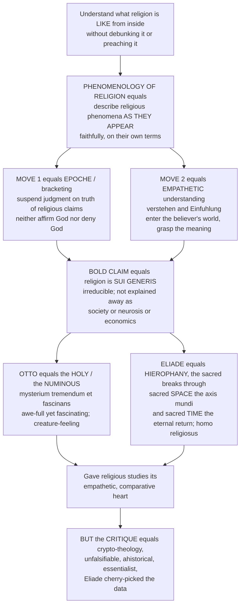

# 🕯️ Phenomenology of Religion

> [!abstract] TL;DR
> The **phenomenology of religion** is the method of *describing* religious phenomena as they appear to, and are experienced by, religious people — faithfully, sympathetically, and on their own terms — while doing neither of the two obvious things a scholar might do: it neither **debunks** religion (reducing it to psychology, society, or economics) nor **preaches** it (assuming the faith is true). It borrows two moves from philosophical phenomenology: **epoché** (bracketing — suspending judgment about whether religious claims are true so you can describe the experience without distortion) and **empathetic understanding** (*Einfühlung* / *verstehen* — imaginatively entering the believer's world to grasp the *meaning* the sacred has *for them*). On this basis it advances a bold, controversial claim: religion is **sui generis** — a unique, irreducible reality that must be understood in its own terms and cannot be "explained away." Rudolf Otto captured its heart with the **numinous** experience of the holy as a *mysterium tremendum et fascinans* — a mystery at once overwhelming and awe-full (it makes you tremble) yet magnetically fascinating (it draws you in), before which one feels a mere "creature." Mircea Eliade described how the sacred "breaks through" ordinary life as **hierophany**, and how *homo religiosus* inhabits a meaning-saturated cosmos of sacred **space** (the *axis mundi*, the center of the world) and sacred **time** (the "eternal return" to mythic origins through ritual) utterly unlike the modern profane world. The approach gave religious studies its empathetic, comparative heart — but drew heavy fire as **crypto-theology** (it assumes the sacred is real), as **unfalsifiable**, **ahistorical**, and **essentialist**. To understand it is to understand both a powerful way of grasping religion from within and the field's enduring battle over whether religion is best understood on its own terms or explained by outside forces.

---

## Intuition

**Analogy:** Suppose you want to understand what a language *feels like* from the inside — what it is like to think, joke, and dream in it — not by writing a grammar that reduces it to rules, and not by insisting it is the one true language, but by learning to inhabit it until its world opens to you. You would have to do two odd things. First, you would have to *stop asking* whether the language's untranslatable words point to anything "really real" — you would suspend that question and simply describe how the words work for their speakers. Second, you would have to *feel your way in*, imaginatively becoming a speaker, until you could sense the weight and warmth that a word like *saudade* or *hygge* carries for the people who live in it.

That is exactly the ambition of the **phenomenology of religion**. It wants to understand what religion is *like* from the inside — what it feels like to stand in awe before the holy, to sense the sacred break through into an ordinary afternoon — without either debunking it (Freud's neurosis, Marx's opium, Durkheim's disguised society) or preaching it (assuming God is real). It **brackets** the truth-question through *epoché*: it neither affirms God nor denies God, so that the experience can be described undistorted. And it *enters the believer's world* through empathetic **verstehen**, grasping the meaning the sacred has *for them*. On this footing it makes its most daring and most contested wager — that religion is **sui generis**, an irreducible kind of thing that can only be understood in religious terms, never fully "explained away" as being *really* about something else. Whether that wager is a profound methodological insight or a piece of theology smuggled into secular scholarship is the argument this whole vault is built around.

---

## How It Works

The phenomenology of religion is defined by a **stance** (describe, do not judge; enter, do not reduce), two **methodological moves** (epoché and empathetic understanding), a **core thesis** (the sacred is *sui generis*), and two great **exemplars** (Otto on the numinous, Eliade on the sacred cosmos) — followed by the sustained **critique** that would eventually break its dominance. The diagram traces that logic from the founding ambition to the critical backlash.



**The core mechanics of the approach:**

1. **Adopt the phenomenological stance.** Following Edmund Husserl's rallying cry *"to the things themselves"* (*zu den Sachen selbst*) — describe the phenomenon exactly as it presents itself to consciousness, without importing prior theories about what it "must really" be. Applied to religion: describe the sacred as it *shows up* for the believer, not as the psychologist or economist would re-describe it.
2. **Perform the *epoché* (bracketing).** Suspend — put in brackets — the natural-attitude question "Is this true? Is God real?" This is **methodological agnosticism**: not atheism, not faith, but a disciplined refusal to let the truth-question distort the description. It is the same move religious studies uses to separate itself from theology.
3. **Understand empathetically (*verstehen* / *Einfühlung*).** Actively enter the believer's experience through imaginative participation, grasping the *intentional meaning* of religious acts — what the pilgrim intends, what the ritual accomplishes *for the participant*. Religion is understood from the *first-person* inside, not only the third-person outside.
4. **Intuit the essential structures (*eidetic* vision).** Across thousands of instances, look for the recurring *eidos* — the essential form — of religious phenomena: the pattern of the sacred, of sacrifice, of the center, of initiation. This yields cross-cultural **types** and **patterns** (van der Leeuw's "types," Eliade's "patterns").
5. **Hold the *sui generis* thesis.** Treat the sacred as a distinct, irreducible category of reality and experience — an *autonomous* object of study that must be grasped in religious terms and cannot be dissolved into social, psychological, or economic causes without losing precisely what makes it religious.

---

## Key Concepts

### 🟢 Secondary — the basic idea

- **Describe from the inside, do not debunk and do not preach.** The phenomenologist's job is faithful, sympathetic *description* of what the sacred is like for believers — not to prove them wrong (debunking) and not to prove them right (preaching).
- **Bracketing (*epoché*).** You set the question "Is it true?" aside — you *bracket* it — the way you might read a novel without stopping every page to ask "did this really happen?" You suspend disbelief *and* belief, so you can see the experience clearly.
- **Empathy (*verstehen*).** You try to feel your way into the believer's world, to understand what the sacred *means to them*, rather than judging it from outside.
- **The numinous (Rudolf Otto).** The distinctive *feeling* at the core of religion: standing before something **wholly other** that is at once terrifying and majestic (*tremendum* — it makes you tremble) yet fascinating and blissful (*fascinans* — it draws you in). Think of the awe of a vast thunderstorm or a great cathedral, but aimed at the holy.
- **The sacred and the profane (Mircea Eliade).** Religious people live in a world with special, charged places (a shrine, a temple, "the center of the world") and special, charged times (a festival, a holy day) that stand out sharply from ordinary, flat, everyday "profane" life.

### 🟡 Undergraduate — the method and its two giants

- **Roots in Husserl's phenomenology.** Philosophical phenomenology (Husserl, early 20th c.) is the disciplined *description of consciousness and its objects* — of phenomena exactly as they are *given*, prior to theory. Its slogan, *"to the things themselves,"* and its technique of the *epoché* (suspending the "natural attitude" that the world simply exists independently) were transplanted onto religion by a generation of scholars who wanted to describe the sacred without either theology or reductionism.
- **The two methodological pillars.** (1) **Epoché / bracketing** — methodological agnosticism about religious truth-claims, so description precedes evaluation; the same move by which the field brackets "Is it true?" (compare the sibling **Defining_Religion_and_the_Sacred** and **The_Comparative_Study_of_Religion**). (2) **Empathy / *Einfühlung* / *verstehen*** — imaginative participation in the believer's intentional world, grasping the *meaning* of the act.
- **Eidetic vision and the search for types.** Beyond individual cases, the phenomenologist intuits **essential structures** and builds cross-cultural **typologies** of the sacred — the aim that made phenomenology the engine of comparison (compare **The_Comparative_Study_of_Religion**).
- **The *sui generis* thesis (the heart of the program).** Religion is an **irreducible**, autonomous domain. Against Durkheim (religion *is* society worshipping itself), Freud (religion *is* neurosis / wish-fulfilment), and Marx (religion *is* the "opium" of alienated economic life), the phenomenologist insists the sacred is a *distinct reality* that cannot be reduced to those factors without explaining it *away*. This "reductionism vs. *sui generis*" dispute is the through-line of the sibling note **Theories_of_the_Origin_of_Religion**.
- **Rudolf Otto — *The Idea of the Holy* (1917).** Otto argued that "the holy" contains a **non-rational core** — the **numinous** (from Latin *numen*, divine power) — that no ethical or rational category can capture. Its structure is the **mysterium tremendum et fascinans**:
  - **Mysterium** — the *wholly other* (*das ganz Andere*): the sacred is qualitatively unlike anything in ordinary experience, beyond concepts.
  - **Tremendum** — *awe-fulness*, *majesty* (*majestas*), *overpoweringness*, and an *energy* or urgency that inspires **dread and trembling**.
  - **Fascinans** — the sacred is simultaneously **fascinating, entrancing, attracting, and blessing** — you are drawn toward the very thing that overwhelms you.
  - **Creature-feeling** (*Kreaturgefühl*) — the sense of one's own nothingness and dependence before the holy. For Otto the numinous is *sui generis* and *a priori* — a category of the mind given with, not derived from, experience.
- **Mircea Eliade — the most influential phenomenologist.** In *The Sacred and the Profane* (1957) and *Patterns in Comparative Religion* (1949), Eliade developed:
  - **Hierophany** — the "showing-forth" or **breaking-through** of the sacred into the profane world (a stone, a tree, an incarnation can *become* a hierophany while remaining an ordinary thing).
  - **Sacred vs. profane** as two fundamental **modes of being** in the world.
  - **Sacred space** — space is *non-homogeneous* for religious people: there is a fixed **center of the world**, the **axis mundi** (world-pillar, world-tree, cosmic mountain) around which the cosmos is oriented; the temple/threshold marks the break between worlds, and building the sacred space repeats the **cosmogony** (the ordering of chaos into cosmos).
  - **Sacred time** — time too is non-homogeneous and *reversible*: through ritual and festival, religious people **recover** and re-actualize the primordial mythic time of origins — the **"eternal return"** (the title of his 1949 *The Myth of the Eternal Return*).
  - **Homo religiosus** — "religious humanity," which inhabits a sacralized, meaningful cosmos, contrasted with modern **desacralized**, profane existence.

### 🔴 Graduate — the wider school, the critique, and the legacy

- **The broader phenomenological school.** **Gerardus van der Leeuw**'s *Religion in Essence and Manifestation* (1933) gave the most systematic phenomenology — cataloguing "types" of sacred power, subject, object, and action, and naming the empathetic reconstruction of meaning as the method. **W. Brede Kristensen** (the "Dutch school") insisted the believer is always right *for the phenomenologist* — the scholar's task is to grasp the faith as the faithful understand it. **Joachim Wach** developed the sociology and typology of religious experience. **Ninian Smart** later reframed the approach as **"structured empathy"** and his *seven dimensions*, softening the metaphysical *sui generis* claim while keeping the empathetic, descriptive core (see **Religious_Studies_and_Comparative_Religion_Overview**).
- **The crypto-theology critique.** The most damaging charge, pressed by **Russell McCutcheon** (*Manufacturing Religion*, 1997) and **Timothy Fitzgerald** (*The Ideology of Religious Studies*, 2000): to treat "the sacred" as a *real, irreducible* object that only religion can access is not neutral description but a **disguised theological claim**. Eliade's *sui generis* thesis, they argue, smuggles a covert confessionalism into a supposedly secular discipline and functions to protect religion from social-scientific explanation.
- **Unfalsifiability and lack of rigor.** By its own design phenomenology brackets the truth-question and appeals to intuited "essences," so its central claims (the reality of the sacred, the universal *axis mundi*, *homo religiosus*) are not testable and cannot be **falsified** — a fatal weakness on a Popperian standard of science (compare **Popper_and_Falsification**). Critics see *eidetic intuition* as unconstrained assertion dressed as method.
- **Essentialism and ahistoricism.** Treating "the sacred" as a **timeless essence** ignores that religion is historically, culturally, and politically situated. The phenomenologists' grand cross-cultural patterns flatten difference, strip practices from the contexts and **power relations** that give them meaning, and ignore *change over time* — the very things history, anthropology, and critical theory foreground.
- **Eliade's selective data and his politics.** Scholars (Jonathan Z. Smith, Ivan Strenski, Bryan Rennie, Steven Wasserstrom) document that Eliade **cherry-picked** decontextualized examples to fit his patterns, misused ethnographic sources, and that his early ties to the Romanian far-right *Iron Guard* shadow his romantic anti-modernism and nostalgia for archaic *homo religiosus*.
- **The reductionist rejoinder.** The rivals the phenomenologists resisted have returned in force: the **cognitive science of religion** (Boyer, Barrett, Whitehouse) explains religious concepts as by-products of ordinary cognition (agency-detection, minimally counterintuitive concepts), and the sociology/economics of religion continue to explain religion by social and material causes — precisely the reductions phenomenology declared impossible (see **Theories_of_the_Origin_of_Religion**).
- **The legacy and the enduring tension.** As a *metaphysical program*, phenomenology of religion has largely declined; almost no one now defends a strong *sui generis* thesis. But its *methodological* legacy is permanent: the field's commitment to **empathy**, to *verstehen*, to taking the insider's experience seriously and describing it before explaining it, is phenomenology's lasting gift. The unresolved question — describe religion sympathetically **on its own terms**, or explain it by **outside forces**? — is the central axis of this vault.

---

## Python Demo

```python
# Phenomenology of religion in two pictures:
#   (a) THE NUMINOUS as a 2D affective space (Rudolf Otto):
#       plot sacred vs. ordinary experiences on axes of
#       TREMENDUM (awe / dread / overwhelm) vs FASCINANS (attraction / fascination).
#       Otto's claim: the NUMINOUS is paradoxically HIGH on BOTH at once
#       -- a mysterium tremendum ET fascinans -- unlike pure fear or pure desire.
#   (b) ELIADE's SACRED vs PROFANE COSMOS:
#       homo religiosus lives in NON-homogeneous space & time.
#       Left  : sacred SPACE -- an intensity landscape with a central axis mundi
#               peak (the center of the world) + satellite hierophanies,
#               against the flat profane plane.
#       Right : sacred TIME -- profane time is flat/homogeneous; ritual festivals
#               re-actualize primordial time (the "eternal return") as periodic peaks.
# Figures are conceptual teaching heuristics, not empirical measurements.

import numpy as np
import matplotlib
matplotlib.use("Agg")
import matplotlib.pyplot as plt

rng = np.random.default_rng(7)

# ======================================================================
# (a) THE NUMINOUS: tremendum vs fascinans affective space
# ======================================================================
def cluster(center, spread, n):
    """n points scattered (Gaussian) around a center, clipped to [0, 10]."""
    pts = rng.normal(center, spread, size=(n, 2))
    return np.clip(pts, 0, 10)

# Four families of experience in (tremendum, fascinans) space:
numinous = cluster((8.2, 8.2), 0.75, 40)   # HIGH both  -> the holy / the sacred
pure_fear = cluster((8.4, 1.6), 0.70, 30)   # high tremendum, low fascinans
pure_desire = cluster((1.6, 8.4), 0.70, 30) # low tremendum, high fascinans
mundane = cluster((1.8, 1.8), 0.80, 30)     # low both -> profane / everyday

# ======================================================================
# (b-left) SACRED SPACE: non-homogeneous intensity landscape (Eliade)
# ======================================================================
grid = np.linspace(-5, 5, 240)
X, Y = np.meshgrid(grid, grid)

def gaussian_peak(cx, cy, amp, width):
    return amp * np.exp(-((X - cx) ** 2 + (Y - cy) ** 2) / (2 * width ** 2))

profane_floor = 0.06                       # flat, homogeneous profane space
sacred = np.full_like(X, profane_floor)
sacred += gaussian_peak(0.0, 0.0, 1.00, 0.75)   # AXIS MUNDI: the center of the world
sacred += gaussian_peak(-3.0, 2.2, 0.45, 0.55)  # a satellite hierophany
sacred += gaussian_peak(2.6, -2.6, 0.40, 0.50)  # another sacred site
sacred += gaussian_peak(3.0, 3.0, 0.30, 0.45)   # a lesser shrine

# ======================================================================
# (b-right) SACRED TIME: flat profane time vs periodic festival peaks
# ======================================================================
t = np.linspace(0, 12, 1200)               # twelve "months" of the year
profane_time = np.full_like(t, 0.10)       # homogeneous, linear, ordinary time
festival_dates = [1.5, 4.0, 6.5, 9.0, 11.5]
sacred_time = profane_time.copy()
for d in festival_dates:                   # each festival re-actualizes origins
    sacred_time += np.exp(-((t - d) ** 2) / (2 * 0.18 ** 2))
primordial = 1.10                          # intensity of recovered mythic time

# ======================================================================
# Plot
# ======================================================================
fig = plt.figure(figsize=(15, 5.6))

# ---- (a) the numinous affective space --------------------------------
ax1 = fig.add_subplot(1, 3, 1)
ax1.scatter(*mundane.T, s=22, c="#9ca3af", alpha=0.7, label="Profane / everyday")
ax1.scatter(*pure_fear.T, s=22, c="#2563eb", alpha=0.7, label="Pure fear / dread")
ax1.scatter(*pure_desire.T, s=22, c="#16a34a", alpha=0.7, label="Pure desire / delight")
ax1.scatter(*numinous.T, s=30, c="#dc2626", alpha=0.85, label="NUMINOUS (the holy)")
# highlight the "high both" quadrant where the holy lives
ax1.axhline(5, color="k", lw=0.6, alpha=0.3)
ax1.axvline(5, color="k", lw=0.6, alpha=0.3)
ax1.fill_between([5, 10], 5, 10, color="#dc2626", alpha=0.06)
ax1.text(7.5, 9.3, "mysterium\ntremendum ET fascinans",
         ha="center", fontsize=8, color="#dc2626", fontweight="bold")
ax1.set_xlabel("TREMENDUM  (awe / dread / overwhelm)")
ax1.set_ylabel("FASCINANS  (attraction / fascination)")
ax1.set_title("(a) Otto's numinous:\nawe-full AND fascinating at once", fontsize=10)
ax1.set_xlim(0, 10); ax1.set_ylim(0, 10)
ax1.legend(fontsize=7, loc="lower left")

# ---- (b-left) sacred space landscape ---------------------------------
ax2 = fig.add_subplot(1, 3, 2)
im = ax2.imshow(sacred, extent=[-5, 5, -5, 5], origin="lower",
                cmap="magma", aspect="auto")
ax2.contour(X, Y, sacred, levels=8, colors="white", linewidths=0.4, alpha=0.5)
ax2.plot(0, 0, marker="*", color="cyan", markersize=16, markeredgecolor="k")
ax2.text(0, 0.5, "axis mundi\n(center of the world)",
         ha="center", fontsize=7.5, color="cyan", fontweight="bold")
ax2.set_title("(b) Eliade's sacred SPACE:\nnon-homogeneous, centered by hierophany",
              fontsize=10)
ax2.set_xlabel("space"); ax2.set_ylabel("space")
fig.colorbar(im, ax=ax2, fraction=0.046, pad=0.04, label="sacred intensity")

# ---- (b-right) sacred time -------------------------------------------
ax3 = fig.add_subplot(1, 3, 3)
ax3.plot(t, profane_time, color="#6b7280", lw=2, label="Profane time (homogeneous)")
ax3.plot(t, sacred_time, color="#b45309", lw=2, label="Sacred time (eternal return)")
ax3.axhline(primordial, color="#b45309", ls=":", lw=1.2, alpha=0.7)
ax3.text(0.1, primordial + 0.03, "primordial mythic time recovered", fontsize=7.5,
         color="#b45309")
for d in festival_dates:
    ax3.axvline(d, color="#b45309", lw=0.5, ls="--", alpha=0.35)
ax3.set_title("(c) Eliade's sacred TIME:\nritual re-actualizes the origin", fontsize=10)
ax3.set_xlabel("ordinary calendar time")
ax3.set_ylabel("intensity / meaning")
ax3.set_ylim(0, 1.35)
ax3.legend(fontsize=7.5, loc="upper right")

plt.tight_layout()
plt.savefig("phenomenology_of_religion.png", dpi=120, bbox_inches="tight")
plt.show()

# ---- Console summary --------------------------------------------------
def mean_pt(a): return a.mean(axis=0)
print("=" * 64)
print("Otto's numinous in (tremendum, fascinans) space -- cluster means")
print("=" * 64)
for name, arr in [("Profane/everyday", mundane), ("Pure fear", pure_fear),
                  ("Pure desire", pure_desire), ("NUMINOUS (holy)", numinous)]:
    tr, fa = mean_pt(arr)
    both_high = (tr > 5) and (fa > 5)
    print(f"  {name:20s}  tremendum={tr:4.1f}  fascinans={fa:4.1f}"
          f"   high-BOTH? {both_high}")
print()
print("Only the NUMINOUS sits in the high-tremendum AND high-fascinans quadrant:")
print("that paradoxical co-presence -- overwhelming yet magnetic -- is the")
print("distinctive signature Otto called the mysterium tremendum et fascinans.")
```

**What the figure teaches.** Panel (a) makes Otto's central insight visible: ordinary emotions live in the corners of the affective space — pure fear is high on *tremendum* but low on *fascinans* (you flee it), pure delight is the reverse (you approach it), and the mundane is low on both. The **numinous** is the one experience that sits in the *high-both* quadrant: it is simultaneously terrifying and irresistible, the thing you tremble before *and* cannot look away from. That paradoxical co-presence — not just strong feeling, but *tremendum* fused with *fascinans* — is what Otto claims no ordinary emotion category can reproduce and why he calls the holy *sui generis*. Panels (b) and (c) render Eliade's cosmos: for *homo religiosus*, space is **not** a flat uniform grid but a landscape with a fixed **center** (the *axis mundi*, the cyan star) around which the world is oriented, punctuated by lesser hierophanies — while for the modern profane person the same map would be featurelessly flat. Likewise time is not homogeneous: the festival calendar produces periodic **peaks** where ritual re-actualizes the primordial "time of origins" (the eternal return), reaching an intensity the flat gray line of ordinary "profane" time never touches. The phenomenologist's whole method is to describe *that* landscape as it is lived — not to insist the peaks are illusions, and not to insist the god on the summit is real.

---

## Real-World Applications

- **The intellectual DNA of religious studies.** Phenomenology is *why* the modern academic study of religion is empathetic and comparative rather than either apologetic or debunking. Whenever a textbook says the scholar must "bracket the truth-question" and "understand the tradition as the believer does," it is speaking pure phenomenology — the stance formalized in **Religious_Studies_and_Comparative_Religion_Overview**.
- **Fieldwork and ethnography of religion.** The empathetic *verstehen* imperative shapes how anthropologists and ethnographers approach ritual: describe what the rite *means to participants* before theorizing it. The tension between this insider-first stance and reductive social explanation is exactly the drama of the anthropology of religion (see **Religion_Magic_and_Ritual**, where Eliade's hierophany and *axis mundi* appear alongside Durkheim's competing reduction).
- **Interfaith dialogue and religious literacy.** The demand to grasp another faith "from the inside," on its own terms, before evaluating it, is the working principle of interfaith understanding, chaplaincy training, and comparative-religion pedagogy.
- **Naming religious experience.** Otto's vocabulary — the *numinous*, *mysterium tremendum et fascinans*, *creature-feeling* — became the standard language for describing awe, the sublime, and mystical states, feeding directly into the study of **Religious_Experience_and_Mysticism** and the psychology of peak/awe experiences.
- **Reading sacred architecture, pilgrimage, and festival.** Eliade's sacred space (the *axis mundi*, the threshold, the oriented cosmos) and sacred time (festival as return to origins) remain a widely used interpretive lens for temples, cathedrals, pilgrimage routes, and liturgical calendars — how built space and ritual time *stage* a break from the profane.
- **A cautionary case in method.** In graduate methods courses, the *rise and fall* of phenomenology is the canonical case study for the **reductionism-vs-*sui generis*** debate and for how a "neutral" method can carry hidden metaphysical commitments — the heart of the critique in **Theories_of_the_Origin_of_Religion** and **The_Comparative_Study_of_Religion**.

---

## Common Pitfalls

- **Confusing *epoché* (bracketing) with atheism or with belief.** Bracketing is *methodological agnosticism* — a disciplined suspension of the truth-question, not a verdict on it. Students routinely mistake it for a covert claim that religion is false (or that it is true). It is neither: it is a refusal to let either verdict distort the description.
- **Mistaking "sympathetic description" for endorsement.** Describing the numinous faithfully, or entering the believer's world empathetically, does *not* commit the scholar to the belief. Empathy is a tool of understanding, not agreement — losing this distinction is what makes phenomenology *look* like preaching.
- **Swallowing the *sui generis* thesis uncritically.** Treating "the sacred" as a self-evidently real, irreducible object is precisely the move McCutcheon and Fitzgerald flag as **crypto-theology**. The claim that religion *cannot* be explained by social or cognitive causes is a strong, contestable thesis — not a neutral starting point. Hold it as a *hypothesis under fire*, not a given.
- **Reading Eliade's patterns as established facts.** The universal *axis mundi*, the everywhere-the-same eternal return, *homo religiosus* — these are grand generalizations built partly on **decontextualized and selectively chosen** examples. Cite them as Eliade's influential *interpretations*, not as demonstrated cross-cultural laws.
- **Essentializing and de-historicizing "the sacred."** Phenomenology's besetting sin is treating the sacred as a timeless essence floating free of history, politics, and power. Any use of it should be re-anchored in specific times, places, and social relations — the corrective that history, anthropology, and critical theory supply.
- **Forgetting the unfalsifiability problem.** Because it brackets truth and appeals to intuited essences, phenomenology cannot easily be tested or refuted (compare **Popper_and_Falsification**). That does not make it worthless — description is a legitimate aim — but it does mean it should not be dressed up as an *explanatory science* of religion.
- **Treating the whole program as either wholly right or wholly dead.** The metaphysical *sui generis* claim has largely collapsed; the methodological legacy of empathy and *verstehen* is alive and load-bearing. Conflating the two — dismissing the empathetic method because the metaphysics failed, or reviving the metaphysics because the method is useful — is the subtle error.

---

## Related Concepts

- [[Religious_Studies_and_Comparative_Religion_Overview]] — the vault hub; phenomenology supplied the field's signature bracketing of the truth-question and its empathetic *verstehen*, and is the source of the *sui generis*-vs-reductionism debate that runs through the whole overview.
- [[Religion_Magic_and_Ritual]] — the **anthropology of religion**, where Eliade's *hierophany*, *axis mundi*, and *sui generis* sacred appear *side by side* with Durkheim's reduction of religion to society — the concrete arena of the reductionism-vs-irreducibility clash this note frames.
- [[The_Comparative_Method]] — comparison as practiced in comparative mythology; phenomenology was the *engine* of cross-cultural comparison (Eliade's "patterns"), and it inherits the same **decontextualization and essentialism** risks the comparative method must manage.
- [[What_Is_Myth]] — myth as sacred story is central to Eliade's sacred *time*: ritual recovers the primordial mythic origin (the **eternal return**), so the phenomenology of the sacred and the theory of myth interlock directly.
- [[Analytic_and_Continental_Philosophy]] — situates **Husserl's phenomenology** in the Continental tradition; the *epoché*, "to the things themselves," and description of consciousness are the philosophical parent that the phenomenology *of religion* transplanted onto the sacred.
- [[Intentionality_and_Mental_Content]] — intentionality (consciousness is always *of* or *about* something) is the phenomenological concept behind grasping the **meaning** and object of religious acts — what the believer's experience is *directed at*.
- [[Popper_and_Falsification]] — the epistemological basis of the charge that phenomenology of religion is **unfalsifiable**: bracketed truth-claims and intuited "essences" cannot be tested or refuted, a central line in the critique.
- [[Marx_and_Critical_Theory]] — one of the three great **reductions** the *sui generis* thesis resists: religion as the "opium of the people," a reflex of alienated economic and material life to be explained by outside social forces.

---

## Review Questions

**🟢 Secondary.** In your own words, explain what it means to "bracket" the truth-question (*epoché*) when studying a religion, and why this lets a scholar describe a believer's experience without either debunking it or preaching it.

**🟡 Undergraduate.** Rudolf Otto says the numinous is a *mysterium tremendum et fascinans*. Using the two axes from the demo (tremendum and fascinans), explain why the holy is *not* the same as either pure fear or pure attraction — and what is distinctive about an experience that is high on *both* at once. Then connect this to Otto's claim that the numinous is *sui generis*.

**🔴 Graduate.** McCutcheon and Fitzgerald charge that the phenomenology of religion is **crypto-theology**: by treating "the sacred" as a real, irreducible object, Eliade smuggles a confessional premise into a secular discipline. Reconstruct this critique alongside the charges of unfalsifiability, ahistoricism, and essentialism. Then defend a position: is the *sui generis* thesis a defensible methodological safeguard against reductionism, or a disguised theology that should be abandoned in favor of social and cognitive explanation? What, if anything, of the phenomenological *method* survives even if its *metaphysics* does not?

---

## Sources

- Rudolf Otto, *The Idea of the Holy* (*Das Heilige*, 1917; Eng. trans. J. W. Harvey, 1923) — the classic statement of the numinous and the *mysterium tremendum et fascinans*.
- Mircea Eliade, *The Sacred and the Profane: The Nature of Religion* (1957; Eng. 1959) and *Patterns in Comparative Religion* (1949; Eng. 1958) — hierophany, sacred space/time, *homo religiosus*, the eternal return.
- Gerardus van der Leeuw, *Religion in Essence and Manifestation* (*Phänomenologie der Religion*, 1933; Eng. 1938) — the most systematic phenomenology of religion.
- Russell T. McCutcheon, *Manufacturing Religion: The Discourse on Sui Generis Religion and the Politics of Nostalgia* (1997) — the definitive crypto-theology critique.
- Ninian Smart, *The Phenomenon of Religion* (1973) and *Dimensions of the Sacred* (1996) — "structured empathy" and the later, chastened phenomenological legacy.

---

#religious-studies #phenomenology-of-religion #the-numinous #eliade #the-sacred
