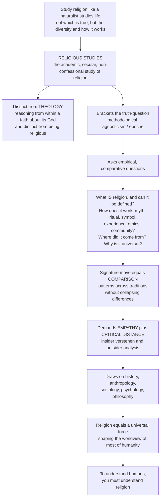

# 🕮 Religious Studies and Comparative Religion Overview

> [!abstract] TL;DR
> Religious studies (also called comparative religion, the history of religions, or *Religionswissenschaft*) is the **academic, secular, non-confessional** study of religion as a universal human phenomenon — sharply distinct from **theology**, which reasons from *within* a faith about its God. The scholar *brackets* the question "is it true?" (methodological agnosticism) and instead asks empirical, comparative questions: What *is* religion, and can we even define it? How do religions work through myth, ritual, symbol, experience, ethics, and community? Where did religion come from, and why is it found in virtually every human society? The field's signature move is **comparison** — setting traditions side by side to reveal shared patterns like the sacred/profane distinction without collapsing their real differences — and it demands both **empathy** for the insider's view (*verstehen*) and the **critical distance** of history, anthropology, sociology, psychology, and philosophy. This note is the hub for a six-section vault on how to think clearly, comparatively, and humanely about one of the deepest dimensions of human experience.

---

## Intuition

**Analogy:** Imagine studying religion the way a naturalist studies life. When Darwin walked the Galápagos, he was not trying to decide which finch was the *correct* finch or which tortoise was *true*. He wanted to understand the astonishing diversity of living forms — how each one works, where it came from, how species resemble and differ from one another, and what pressures shaped them. He observed with care, compared across islands, and looked for patterns beneath the variety without pretending the variety wasn't real.

That is exactly the stance of **religious studies**. The scholar does not ask "Is Christianity right? Is Buddhism right?" — that is the work of a believer, or of a theologian reasoning inside a tradition. Instead the scholar asks: *What is this thing called religion? How does it function in human lives? Where did it come from? Why does nearly every human society have it? How are these thousands of traditions alike, and how are they genuinely different?* The question of any faith's truth is deliberately set aside — **bracketed** — not because it is unimportant, but because answering it is a different project. What remains is a rich empirical, historical, and comparative science of one of the most powerful forces in human life: a force that has built civilizations and toppled them, inspired the greatest art and the worst atrocities, and shapes the worldview of most people alive today. To understand human beings, you must understand religion — and to understand religion *as a phenomenon*, you must first learn to look like a naturalist, not a judge.

---

## How It Works

The field is defined by a distinctive **stance** and a distinctive **method**. The stance is non-confessional and empathetic-but-critical; the method is comparison across an interlocking set of disciplines. The diagram traces the logic from the naturalist's posture to the field's central claim about the human condition.



**The core mechanics of the field:**

1. **Bracket the truth-question (methodological agnosticism / *epoché*).** The scholar neither affirms nor denies that any faith's claims are true. This is the single move that separates religious studies from both theology and apologetics, and it is what makes cross-tradition comparison possible in the first place.
2. **Understand from the inside, analyze from the outside.** Following Max Weber, the field prizes *verstehen* — interpretive understanding of what a tradition means *to its adherents* — while still submitting that understanding to critical, historical, and social analysis. This is the **emic/etic** (insider/outsider) problem, and managing it well is the field's central craft.
3. **Compare.** Set traditions side by side to reveal recurring structures — the sacred and the profane, ritual, myth, sacrifice, pilgrimage, notions of ultimate reality — while refusing to flatten their real differences. Comparison is where patterns become visible.
4. **Be multidisciplinary.** No single lens suffices. History reconstructs origins and change; anthropology observes lived practice; sociology maps religion's role in society; psychology probes religious experience; philosophy analyzes concepts and truth-claims; the cognitive science of religion asks why the human mind is prone to belief at all.
5. **Map the phenomenon in dimensions.** Ninian Smart's **seven dimensions** — ritual, doctrinal, mythic, experiential, ethical, social, and material — give a common grid on which any tradition can be profiled and compared without privileging (as older, Protestant-inflected scholarship did) belief and doctrine over practice and materiality.

---

## Key Concepts

### 🟢 Secondary — the shape of the field

- **Religious studies vs. theology.** Religious studies studies religion *from the outside* as a human phenomenon; theology reasons *from inside* a faith. A religious-studies scholar can be a believer, an atheist, or anything else — the stance, not the personal faith, defines the discipline.
- **Non-confessional and comparative.** The field does not promote or defend any religion. It compares many, looking for what they share and how they differ.
- **The elements of religion.** Nearly every tradition has **myth** (sacred stories), **ritual** (repeated sacred action), a **sacred/profane** distinction, **ethics**, **experience**, and a **community**. Spotting these lets you make sense of an unfamiliar tradition quickly.
- **Why it matters.** Religion appears in virtually every society across history. It shapes art, morality, politics, war, and the meaning people find in life — so understanding it is basic to understanding humanity.

### 🟡 Undergraduate — the methods and the questions

- **The birth of the field.** Nineteenth-century philologist **Max Müller** helped found the *science of religion* (*Religionswissenschaft*), coining the field's motto by analogy with linguistics: *"He who knows one, knows none"* — you cannot understand your own religion until you can set it beside others.
- **Methodological agnosticism / *epoché*.** Borrowed from phenomenology, this is the disciplined suspension of the truth-question. The scholar asks how a belief *functions and means*, not whether it is *correct*.
- **Emic vs. etic (insider vs. outsider).** *Emic* descriptions use the tradition's own categories; *etic* descriptions use the analyst's external, comparative categories. Good scholarship moves deliberately between the two rather than confusing them.
- **The comparative method and its history.** From Müller through the **history-of-religions school** (Mircea Eliade) to the **phenomenology of religion** (searching for the essence and structures of the sacred), comparison has been the field's engine. Compare *The_Comparative_Method* as it is used next door in comparative mythology.
- **Ninian Smart's seven dimensions.** Ritual, doctrinal, mythic, experiential, ethical, social, material. A tradition is a *profile* across these dimensions — Quaker worship is high on experiential/ethical and low on ritual/material; a sacrificial temple cult is the reverse.
- **The core subfields.** Defining religion; theories of its origin and function; the comparative study of traditions; the major world religions; the machinery of ritual/myth/the sacred; religious thought and theology; and religion in society. This vault's siblings develop each: see the prose-only companions *Defining_Religion_and_the_Sacred*, *Theories_of_the_Origin_of_Religion*, *The_Comparative_Study_of_Religion*, *Phenomenology_of_Religion*, and *Methods_in_the_Study_of_Religion*.

### 🔴 Graduate — the critiques and the frontier

- **The "world religions paradigm" critique.** Scholars such as **Tomoko Masuzawa** (*The Invention of World Religions*) argue that the tidy list of "great world religions" is a nineteenth-century European construction that projected a Christian, belief-centered template onto radically different traditions and quietly ranked them.
- **"Religion" as a category is itself contingent.** **Talal Asad** (*Genealogies of Religion*), building on Wittgenstein and Foucault, argues there is no trans-historical essence of "religion" — the very concept is a modern, Western, and partly colonial artifact. The privatized, belief-first notion of religion is a product of the Reformation and Enlightenment, not a neutral universal. See *The_Protestant_Reformation* for the historical rupture Asad points to.
- **The critique of comparison.** Comparison risks **decontextualization** (ripping a practice from the web that gives it meaning) and **essentialism** (assuming an unchanging core beneath surface variety). J. Z. Smith's rejoinder: comparison is never innocent discovery but always the scholar's *construction* — "*there is no data for religion... religion is solely the creation of the scholar's study.*"
- **Reductionism vs. the *sui generis* claim.** Is religion *sui generis* (a unique, irreducible reality, as Eliade held) or fully explicable by social, psychological, or evolutionary causes (Durkheim, Freud, and the cognitive science of religion)? **Russell McCutcheon** and the critical-religion school reject the *sui generis* framing as a covert theology smuggled into a secular discipline.
- **The cognitive science of religion.** A newer frontier asking why human minds so readily generate religious concepts — hyperactive agency detection, minimally counterintuitive concepts, costly-signaling accounts of ritual — reframing "where did religion come from?" as a question about evolved cognition.

---

## Python Demo

```python
# Religious Studies overview in two pictures:
#   (a) the GLOBAL LANDSCAPE + a religious-DIVERSITY index by region
#       -> religion is both near-universal AND enormously diverse
#   (b) a COMPARATIVE-DIMENSIONS radar over Ninian Smart's seven dimensions
#       -> comparison reveals shared dimensions but distinctive emphases
# Figures are illustrative teaching heuristics, not precise survey data.

import numpy as np
import matplotlib.pyplot as plt

# ----------------------------------------------------------------------
# (a1) Global distribution of major traditions (approx. share of world pop.)
# ----------------------------------------------------------------------
traditions = ["Christianity", "Islam", "Unaffiliated", "Hinduism",
              "Buddhism", "Folk/Indigenous", "Other", "Judaism"]
shares = np.array([31.0, 25.0, 16.0, 15.0, 7.0, 5.6, 0.8, 0.2])
shares = 100.0 * shares / shares.sum()          # normalize to a clean 100%

# ----------------------------------------------------------------------
# (a2) A simple religious-diversity index by region.
#   Simpson diversity D = 1 - sum(p_i^2): higher = more religiously mixed.
# ----------------------------------------------------------------------
regions = ["Sub-Saharan\nAfrica", "MENA", "Europe", "N. America",
           "Latin America", "South Asia", "East Asia", "SE Asia"]
# rows = regions, cols = traditions (rough composition, each row sums ~1)
comp = np.array([
    [0.57, 0.31, 0.03, 0.00, 0.02, 0.00, 0.02, 0.05],  # Sub-Saharan Africa
    [0.04, 0.93, 0.02, 0.00, 0.00, 0.00, 0.00, 0.01],  # MENA
    [0.71, 0.06, 0.18, 0.02, 0.00, 0.00, 0.02, 0.01],  # Europe
    [0.65, 0.02, 0.23, 0.02, 0.03, 0.02, 0.02, 0.01],  # N. America
    [0.90, 0.00, 0.08, 0.00, 0.00, 0.00, 0.01, 0.01],  # Latin America
    [0.03, 0.31, 0.02, 0.58, 0.02, 0.03, 0.00, 0.01],  # South Asia
    [0.08, 0.02, 0.52, 0.00, 0.18, 0.00, 0.18, 0.02],  # East Asia
    [0.10, 0.40, 0.02, 0.02, 0.35, 0.00, 0.08, 0.03],  # SE Asia
])
comp = comp / comp.sum(axis=1, keepdims=True)   # normalize each region
simpson = 1.0 - np.sum(comp**2, axis=1)         # diversity per region

# ----------------------------------------------------------------------
# (b) Ninian Smart's SEVEN DIMENSIONS -- comparative profiles (0..10)
# ----------------------------------------------------------------------
dims = ["Ritual", "Doctrinal", "Mythic", "Experiential",
        "Ethical", "Social", "Material"]
profiles = {
    "Roman Catholicism": [9, 9, 7, 6, 7, 9, 9],
    "Quaker Protestantism": [2, 4, 3, 9, 9, 6, 1],
    "Theravada Buddhism":  [6, 8, 6, 9, 8, 6, 5],
    "Vedic Sacrificial Cult": [10, 5, 9, 4, 5, 6, 9],
}

# ----------------------------------------------------------------------
# Plot
# ----------------------------------------------------------------------
fig = plt.figure(figsize=(14, 10))

# (a1) global landscape -- horizontal bar
ax1 = fig.add_subplot(2, 2, 1)
order = np.argsort(shares)
ax1.barh(np.array(traditions)[order], shares[order], color="#4c72b0")
ax1.set_xlabel("Share of world population (%)")
ax1.set_title("(a1) Global religious landscape: near-universal, highly diverse")
for y, v in zip(range(len(order)), shares[order]):
    ax1.text(v + 0.4, y, f"{v:.1f}", va="center", fontsize=8)

# (a2) diversity index by region
ax2 = fig.add_subplot(2, 2, 2)
col = plt.cm.viridis(simpson / simpson.max())
ax2.bar(regions, simpson, color=col)
ax2.set_ylabel("Simpson diversity  D = 1 - sum(p^2)")
ax2.set_title("(a2) Religious diversity varies sharply by region")
ax2.set_ylim(0, 0.75)
ax2.tick_params(axis="x", labelrotation=45, labelsize=8)

# (b) comparative-dimensions radar
ax3 = fig.add_subplot(2, 1, 2, projection="polar")
N = len(dims)
angles = np.linspace(0, 2 * np.pi, N, endpoint=False)
angles = np.concatenate([angles, angles[:1]])   # close the loop
for name, vals in profiles.items():
    v = np.array(vals + vals[:1], dtype=float)
    ax3.plot(angles, v, linewidth=2, label=name)
    ax3.fill(angles, v, alpha=0.08)
ax3.set_xticks(angles[:-1])
ax3.set_xticklabels(dims)
ax3.set_ylim(0, 10)
ax3.set_title("(b) Comparison over Ninian Smart's seven dimensions:\n"
              "shared axes, distinctive emphases", pad=20)
ax3.legend(loc="upper right", bbox_to_anchor=(1.25, 1.10), fontsize=8)

plt.tight_layout()
plt.savefig("religious_studies_overview.png", dpi=130, bbox_inches="tight")
plt.show()

# Console summary: which region is most / least religiously diverse?
for r, d in sorted(zip([x.replace(chr(10), ' ') for x in regions], simpson),
                   key=lambda t: -t[1]):
    print(f"{r:22s}  diversity = {d:.3f}")
```

**What the figure teaches.** Panel (a1) shows religion's near-universality and its lopsided diversity — no single tradition holds even a third of humanity, and the "unaffiliated" are themselves a huge bloc (many of whom still hold religious or spiritual beliefs). Panel (a2) shows that *diversity itself is unevenly distributed*: some regions are near-monoreligious, others are richly plural, which is exactly the kind of variation the sociology of religion tries to explain. Panel (b) is the comparative method made visual: four traditions share the same seven dimensional axes, yet each traces a completely different *shape* — a Quaker meeting and a Vedic fire-sacrifice are both "religion," but their centers of gravity are almost opposite. Comparison reveals the common grid without erasing the difference.

---

## Real-World Applications

- **Understanding the contemporary world.** Secularization debates, the rise of the "spiritual but not religious," religious nationalism, and religiously framed conflict are unreadable without the field's tools. Journalists, diplomats, and analysts who treat religion as either irrelevant or monolithic misread events badly.
- **Public policy and law.** Courts and legislatures must decide *what counts as a religion* for tax, education, and free-exercise purposes — a direct application of the field's hardest question, the definition of religion.
- **Medicine and healthcare.** Chaplaincy, bioethics, end-of-life care, and cross-cultural clinical practice depend on empathetic, non-confessional literacy in patients' traditions.
- **Education and interfaith work.** Comparative religious literacy is increasingly taught precisely to counter the *"he who knows one, knows none"* parochialism — and to defuse the ignorance that fuels intolerance.
- **Foundational lens for the humanities.** Because religion saturates art, law, ethics, politics, and history, the field is a bridge discipline: it feeds and is fed by the anthropology, sociology, philosophy, and history of religion, and by comparative mythology.

---

## Common Pitfalls

- **Confusing religious studies with theology (or with being religious).** The most common error. Studying a tradition academically neither requires nor forbids belief; the discipline is defined by its *non-confessional stance*, not by the scholar's faith or lack of it.
- **Crypto-theology and the *sui generis* trap.** Treating "the sacred" as a self-evident, irreducible reality that only religion can access smuggles a theological premise into a secular field — the critique McCutcheon levels at Eliade.
- **The Protestant/belief-first bias.** Assuming every religion is essentially a *set of beliefs* one *accepts* imports a specifically post-Reformation model and distorts traditions that are primarily practice, kinship, or place. Smart's seven dimensions exist partly to correct this.
- **Naive comparison.** Listing surface "similarities" while ignoring context produces false equivalences (all "sacrifice" is not the same sacrifice) or essentialist universals. Good comparison is disciplined, contextual, and self-aware about what the scholar is constructing.
- **Reifying "religion" and "world religions."** Forgetting that both the category *religion* and the canonical list of *world religions* are modern, partly colonial constructs (Asad, Masuzawa) — and then projecting them onto societies that never carved up the world that way.
- **Collapsing emic and etic.** Either mistaking a believer's self-description for the whole analysis, or steamrolling it with outside theory. The craft is to hold both.

---

## Related Concepts

- [[Religion_Magic_and_Ritual]] — the **anthropology of religion**: Durkheim, Malinowski, van Gennep, Turner, and Evans-Pritchard on how ritual, magic, and belief actually function in lived societies. This vault's ritual/myth section builds directly on it.
- [[Religion_Sacred_and_Secular]] — the **sociology of religion**: Durkheim's sacred/profane and solidarity, Weber's Protestant ethic, Marx's "opium," and the secularization debate. The natural companion for this vault's "religion and society" section.
- [[The_Comparative_Method]] — how comparison is practiced next door in **comparative mythology**; the same signature move, the same decontextualization/essentialism risks, applied to sacred narrative.
- [[What_Is_Myth]] — the concept of **myth** as sacred story, one of Smart's seven dimensions and a core element this field analyzes rather than debunks.
- [[Faith_and_Reason]] — the **philosophy of religion** angle: the perennial tension between reasoned argument and revealed faith that religious studies brackets but philosophy confronts head-on.
- [[The_Branches_of_Philosophy]] — situates philosophy of religion among philosophy's subfields, clarifying how the philosophical study of religious truth-claims differs from the non-confessional study of religion.
- [[The_Protestant_Reformation]] — the historical rupture that (per Asad and Masuzawa) helped manufacture the modern, privatized, belief-first *category* of "religion" this field must handle with care.

---

## Review Questions

**🟢 Secondary.** In one or two sentences, explain the difference between *religious studies* and *theology*, and why a religious-studies scholar does not need to be religious.

**🟡 Undergraduate.** Max Müller wrote that *"he who knows one, knows none."* Using Ninian Smart's seven dimensions, explain what comparison lets you see about your own (or any one) tradition that studying it in isolation would hide.

**🔴 Graduate.** Talal Asad and Tomoko Masuzawa argue that "religion" and "the world religions" are modern, partly colonial constructs rather than neutral universals. If they are right, is the *comparative study of religion* still coherent — and what would J. Z. Smith say about whether the scholar *discovers* or *constructs* the objects being compared? Defend a position.

---

## Sources

- Ninian Smart, *The World's Religions* (2nd ed., 1998) and *Dimensions of the Sacred: An Anatomy of the World's Beliefs* (1996).
- F. Max Müller, *Introduction to the Science of Religion* (1873).
- Eric J. Sharpe, *Comparative Religion: A History* (2nd ed., 1986).
- Malory Nye, *Religion: The Basics* (2nd ed., 2008); Russell T. McCutcheon, *Studying Religion: An Introduction* (2007).
- Talal Asad, *Genealogies of Religion* (1993); Tomoko Masuzawa, *The Invention of World Religions* (2005).

---

#religious-studies #comparative-religion #study-of-religion #religion-and-society #dimensions-of-religion
