# ⚖️ The Comparative Study of Religion

> [!abstract] TL;DR
> The **comparative method** is the signature move of religious studies: set traditions side by side to discover what in human religiosity is **universal**, what is **variable**, and what is **unique**. As Max **Müller** put it, *"he who knows one, knows none"* — studying a single religion in isolation blinds you to what is distinctive about it. Comparison lets scholars build **typologies** and see deep structures: the **sacred/profane** distinction found nearly everywhere, recurring types like **monotheism / polytheism / non-theism**, Weber's **prophetic vs mystical** religion, "religions of the book" vs oral traditions, ethical vs ritual emphasis. Great comparativists mapped these patterns — Müller founded the field, **Eliade** catalogued cross-cultural "patterns" of the sacred, **Smart** organized every religion into seven shared **dimensions**. But comparison is also **perilous**: it can wrench items from context, impose one tradition's (often Christian) categories on others, exaggerate similarity or difference, and manufacture a false universal "essence." The sharpest critique holds that the very idea of tidy, bounded **"world religions"** is a modern, Western, often colonial construction that distorts traditions which never saw themselves that way. So the field now compares **self-critically** — comparing to illuminate while staying alert to context, power, and its own categories.

---

## Intuition

**Analogy.** Put five things side by side: a Christian church, a Hindu temple, a Buddhist stupa, an Islamic mosque, and an indigenous ritual in a forest clearing. On the surface they could hardly look more different — different buildings, gods (or no gods), languages, gestures, clothes. But look closer and *startling patterns* leap out. Nearly all of them mark off a **sacred space** from ordinary ground. Nearly all have **rituals for birth and death**, a **myth of how the world began**, some notion of a **moral order**, recurring **festivals**, acts of **sacrifice or offering**, ideas about **purity and pollution**, and a **path to salvation or liberation**. You did not learn this by staring at one of them for a lifetime. You learned it by *placing them next to each other* — and the differences are what made the shared shapes visible.

That side-by-side move is the **comparative method**, the defining approach and the historical origin of religious studies (which was literally first called "comparative religion"). Comparison is a lens for a specific question: across the bewildering diversity of human traditions, what is genuinely **universal**, what merely **varies**, and what is truly **unique** to a single tradition? You cannot answer that from inside one religion, which is exactly what Müller meant by *"he who knows one, knows none."* But the very power of comparison is also its peril: line things up too eagerly and you start seeing patterns that aren't there, flattening irreducible difference into a false sameness. This note is about both halves of that bargain — the tool and its central methodological dilemma.

---

## How It Works

The comparative method runs a disciplined loop: gather traditions, describe each on its own terms, place them side by side on some common grid, read off the **patterns and the differences**, sort the results into **typologies**, and then — crucially — *check yourself*, because the grid you chose and the categories you brought will silently shape what you "find." The diagram traces that arc from the five buildings to the field's mature, self-critical practice.

```mermaid
graph TD
    SIDE["Set a church, a Hindu temple, a Buddhist stupa,<br/>an Islamic mosque, and an indigenous ritual side by side"]
    DIFF["On the surface they look utterly DIFFERENT"]
    PATT["But startling PATTERNS emerge<br/>sacred space, birth and death rites, origin myth, moral order,<br/>festivals, sacrifice, purity, salvation or liberation"]
    METHOD["The COMPARATIVE METHOD equals the signature approach of religious studies"]
    MULLER["He who knows one, knows none<br/>Max Muller"]
    TYPES["Comparison builds TYPOLOGIES and reveals deep structures<br/>sacred versus profane, monotheism versus polytheism versus non-theism,<br/>prophetic versus mystical religion"]
    MAP["The great mappers<br/>Muller founds the field, Eliade catalogues patterns of the sacred,<br/>Smart organizes every religion into seven DIMENSIONS"]
    DANGER["BUT comparison is DANGEROUS<br/>it can wrench items from context, impose Christian categories,<br/>exaggerate similarity or difference, and build a false essence"]
    CRIT["Sharpest critique<br/>the tidy list of WORLD RELIGIONS is a modern, Western,<br/>often colonial construction"]
    SELF["So the field compares SELF-CRITICALLY<br/>compare to illuminate while staying alert to context and power"]

    SIDE --> DIFF --> PATT --> METHOD --> MULLER --> TYPES --> MAP --> DANGER --> CRIT --> SELF
```



**The mechanics, step by step:**

1. **Refuse to study in isolation.** A single tradition, studied alone, supplies no contrast class — you cannot tell what is peculiar to it and what is human religiosity in general. Comparison is the only way to get an outside view.
2. **Describe each tradition carefully, ideally on its own terms** (the *emic* view) before importing outside categories (the *etic* view). Sloppy comparison skips this step and pays for it later.
3. **Lay traditions on a shared grid** — a set of features, dimensions, or motifs (theism, ritual, scripture, mysticism, afterlife, and so on). The grid makes comparison possible but also encodes assumptions.
4. **Read off patterns and differences.** Where the grid lights up the same way across traditions, you have a candidate *universal* or recurring *type*; where it diverges, you have *variation* and the *unique*.
5. **Sort into typologies.** Cluster the results into families and kinds — Abrahamic vs Dharmic, prophetic vs mystical, scriptural vs oral, salvation vs liberation.
6. **Audit the method.** Ask what your grid privileged, whose categories you used, and whether the "essence" you found is in the data or in your framing. This self-critical step is what separates modern comparison from its nineteenth-century ancestors.

---

## Key Concepts

### 🟢 Secondary — comparison as the core move

- **Comparison is the signature of the field.** Religious studies was born as *comparative religion*: the deliberate practice of setting traditions side by side. It is what turns a pile of separate faiths into a subject you can actually think about.
- **Why compare?** To sort human religion into three buckets: what is **universal** (found nearly everywhere, like a sacred/profane line or rites of passage), what is **variable** (differs from place to place), and what is **unique** (peculiar to one tradition). You cannot see any of these from inside a single religion.
- **Müller's motto.** The field's founder, **Max Müller**, coined its slogan by analogy with the study of language: *"He who knows one, knows none."* You do not really understand your own religion until you can set it beside others.
- **Recurring forms.** Once you compare, the same building blocks keep reappearing: **myth** (origin stories), **ritual**, **sacrifice/offering**, **pilgrimage**, **initiation**, sacred spaces and a "center of the world," notions of **purity**, festivals, a **moral order**, and some version of the **golden rule**. Spotting these lets you make quick sense of an unfamiliar tradition.

### 🟡 Undergraduate — the history and the typologies

**The founders and schools.** Comparative religion has a lineage:

- **Max Müller** (1823–1900) launched the *science of religion* (*Religionswissenschaft*) and edited the monumental **Sacred Books of the East**, making non-Western scriptures available for comparison for the first time.
- The **History of Religions school** (*Religionsgeschichte*) pushed comparison into rigorous historical and philological study of traditions in their own settings.
- **James Frazer's** *The Golden Bough* (1890) was the encyclopedic high-water mark: cross-cultural motifs of **magic**, **sacrifice**, and the **dying-and-rising god**, massed from every corner of the globe — brilliant, influential, and later judged empirically loose (see the neighboring comparative-mythology note on this).
- **Mircea Eliade's** *Patterns in Comparative Religion* catalogued recurring **hierophanies** (manifestations of the sacred) and symbols: **sky and sun gods**, the **axis mundi** / sacred center, **sacred trees**, **water**, and the **moon** — the seedbed of the phenomenology of religion, a prose-only sibling in this vault (*Phenomenology_of_Religion*).
- **Georges Dumézil** reconstructed the **trifunctional** ideology (sovereignty / force / fecundity) shared across Indo-European peoples.
- **Joseph Campbell** popularized the comparative **hero's journey** (the monomyth) across the world's myths.

The arc runs from **evolutionist** comparison (nineteenth-century "primitive-to-advanced" ranking) through **phenomenological** comparison (searching for the structures of the sacred) to today's **critical**, self-aware comparison.

**What comparison reveals — typologies and patterns.** Comparison's payoff is *structure*:

- **The sacred vs the profane.** Durkheim's near-universal division of the world into set-apart "sacred" and ordinary "profane" — arguably comparison's single most robust finding (developed in this vault's anthropology-of-religion companion, [[Religion_Magic_and_Ritual]]).
- **Classification by theism.** **Monotheism**, **polytheism**, **henotheism** (one god worshipped without denying others), **pantheism** (all is divine), **panentheism** (the divine is in and beyond all), and **non-theism / transtheism** (traditions like much of Buddhism where liberation does not hinge on a creator god).
- **Weber's types.** **Prophetic vs mystical** religion, and **this-worldly vs other-worldly** orientations to salvation.
- **Other axes.** **Ethical vs ritual** emphasis; **"religions of the book"** (scriptural) vs **oral / indigenous** traditions; **founded** (a historical founder) vs **ethnic** (a whole people's inherited way of life); and types of **soteriology** — **salvation** (rescue by/into a relationship with the divine) vs **liberation** (release from the cycle of rebirth).
- **Ninian Smart's seven dimensions.** The most useful modern comparative grid: **ritual**, **narrative/mythic**, **doctrinal/philosophical**, **experiential/emotional**, **ethical/legal**, **social/institutional**, and **material**. A tradition is a *profile* across these — a Quaker meeting is high on experiential/ethical and low on ritual/material; a sacrificial temple cult is the reverse (see the vault's overview note, *Religious_Studies_and_Comparative_Religion_Overview*, for the full framework).

### 🔴 Graduate — the perils and the world-religions critique

**The methodological dangers.** Comparison's power is exactly its risk:

- **Decontextualization.** Ripping an item (a "sacrifice," a "prayer") from the web of meaning that constitutes it, so the comparison lines up husks, not living things.
- **Essentialism.** Assuming a shared, unchanging "essence" beneath surface variety — treating "religion" or "the sacred" as one thing that traditions merely instantiate differently.
- **Category imposition.** Projecting one tradition's categories onto others — almost always **Christian / Protestant / Western** ones. Privileging **belief**, **scripture**, a **founder**, and a single **God** turns traditions organized around practice, kinship, place, or lineage into apparent *deficiencies* (the Python demo below makes this bias visible).
- **Exaggerating similarity (perennialism)** — the assumption that all religions are "really" saying the same thing — **or exaggerating difference**, making each tradition an incommensurable island.
- **The "magpie" method.** Superficial resemblance-hunting: collecting shiny parallels while ignoring context, scale, and disanalogy.

**Jonathan Z. Smith's rethinking.** Smith is the field's most rigorous critic of lazy comparison (see *Imagining Religion* and *Drudgery Divine*). His demolition of the "dying-and-rising god" cliché showed how many alleged parallels dissolve under source-critical scrutiny. His constructive rule: **"comparison is a disciplined exaggeration in the service of knowledge"** — never innocent discovery but always the scholar's deliberate, theorized *construction*, chosen to answer a specific question and defensible only if it is controlled, contextual, and explicit about its terms.

**The "world religions paradigm" critique (crucial).** The sharpest move deconstructs the very framework. **Tomoko Masuzawa** (*The Invention of World Religions*), building on **Talal Asad** and **Russell McCutcheon**, argues that the tidy list of discrete, parallel **"world religions"** — Hinduism, Buddhism, Islam, Christianity, and so on, imagined as bounded "isms" each with its beliefs, founder, and scriptures — is a **modern, European, often colonial construction** projected onto traditions that never conceived of themselves that way. "Hinduism," for instance, is largely a colonial-era umbrella term imposed on a vast, internally diverse landscape of practice. The paradigm is not a neutral inventory but a *category with a politics*: it ranks, standardizes, and quietly Christianizes what counts as a religion. The response is to **historicize** the category and **pluralize** the picture rather than take the "world religions" grid as given.

**Doing comparison responsibly.** The contemporary practice is comparison as a **heuristic**, not a grand universal scheme: it is **self-critical** (aware of the comparativist's standpoint, categories, and power), **attentive to context and difference**, and **question-driven** (serving a specific, controlled inquiry rather than hunting for one Essence of Religion). Comparison remains indispensable for understanding humanity's religious life — but it is now practiced as a disciplined art of finding *genuine* patterns without flattening irreducible diversity.

---

## Python Demo

```python
# The comparative study of religion, in three pictures:
#   (a) a CROSS-TRADITION FEATURE MATRIX  -> score traditions on religious features
#   (b) HIERARCHICAL CLUSTERING (hand-rolled dendrogram) of that matrix
#         -> comparison reveals FAMILIES: an Abrahamic cluster and a Dharmic/East-Asian one
#   (c) the COMPARISON PITFALL -> a Christian-derived, biased feature set makes
#         non-Abrahamic traditions look "deficient" versus a neutral feature set
# All scores are illustrative teaching heuristics, not survey measurements.

import numpy as np
import matplotlib.pyplot as plt

# ----------------------------------------------------------------------
# (a) The comparative feature matrix: 7 traditions x 8 religious features
# ----------------------------------------------------------------------
traditions = ["Christianity", "Islam", "Judaism",
              "Hinduism", "Buddhism", "Daoism", "Indigenous"]
features = ["monotheism", "text-centrality", "ritual", "mysticism",
            "ethical-emphasis", "afterlife/salvation", "founder",
            "congregational"]

# rows = traditions, cols = features, each scored in 0..1
X = np.array([
    [1.0, 0.9, 0.7, 0.5, 0.8, 0.9, 1.0, 0.9],  # Christianity
    [1.0, 1.0, 0.8, 0.5, 0.8, 0.9, 1.0, 0.9],  # Islam
    [1.0, 1.0, 0.8, 0.5, 0.9, 0.5, 0.6, 0.8],  # Judaism
    [0.3, 0.6, 0.9, 0.8, 0.6, 0.8, 0.2, 0.4],  # Hinduism
    [0.1, 0.6, 0.6, 0.9, 0.8, 0.7, 0.9, 0.4],  # Buddhism
    [0.1, 0.5, 0.6, 0.9, 0.5, 0.4, 0.4, 0.3],  # Daoism
    [0.2, 0.1, 0.9, 0.6, 0.5, 0.6, 0.1, 0.7],  # Indigenous
])

# ----------------------------------------------------------------------
# (b) Hand-rolled agglomerative clustering (average linkage, Euclidean)
# ----------------------------------------------------------------------
def pairwise(M):
    d = M[:, None, :] - M[None, :, :]
    return np.sqrt((d ** 2).sum(-1))

class Node:
    def __init__(self, height, left=None, right=None, leaf=None):
        self.height, self.left, self.right, self.leaf = height, left, right, leaf
        self.x = self.y = None

def cluster(M):
    n = M.shape[0]
    D = pairwise(M)
    nodes   = [Node(0.0, leaf=i) for i in range(n)]
    members = [[i] for i in range(n)]
    active  = list(range(n))
    while len(active) > 1:
        best = None
        for i in range(len(active)):
            for j in range(i + 1, len(active)):
                A, B = active[i], active[j]
                d = D[np.ix_(members[A], members[B])].mean()   # average linkage
                if best is None or d < best[0]:
                    best = (d, A, B)
        d, A, B = best
        nodes.append(Node(d, left=nodes[A], right=nodes[B]))
        members.append(members[A] + members[B])
        active.remove(A); active.remove(B); active.append(len(nodes) - 1)
    return nodes[active[0]]

leaf_order = []
def layout(node, counter=[0]):
    if node.leaf is not None:
        node.x, node.y = counter[0], 0.0
        counter[0] += 1
        leaf_order.append(node.leaf)
        return node.x
    lx = layout(node.left, counter)
    rx = layout(node.right, counter)
    node.x, node.y = 0.5 * (lx + rx), node.height
    return node.x

def draw(node, ax):
    if node.leaf is not None:
        return node.x
    lx = draw(node.left, ax)
    rx = draw(node.right, ax)
    ax.plot([lx, lx], [node.left.y,  node.height], color="#333")
    ax.plot([rx, rx], [node.right.y, node.height], color="#333")
    ax.plot([lx, rx], [node.height,  node.height], color="#333")
    return node.x

root = cluster(X)
layout(root)

# ----------------------------------------------------------------------
# (c) The comparison pitfall: biased vs neutral feature set
# ----------------------------------------------------------------------
biased_idx = [0, 1, 6, 7]                        # monotheism, text, founder, congregational
biased_score  = X[:, biased_idx].mean(axis=1)    # a Christian-derived lens
neutral_score = X.mean(axis=1)                   # all 8 features weighted equally

# ----------------------------------------------------------------------
# Plot
# ----------------------------------------------------------------------
fig = plt.figure(figsize=(14, 11))

# (a) feature heatmap
ax1 = plt.subplot2grid((2, 2), (0, 0))
im = ax1.imshow(X, aspect="auto", cmap="viridis", vmin=0, vmax=1)
ax1.set_xticks(range(len(features)))
ax1.set_xticklabels(features, rotation=45, ha="right", fontsize=8)
ax1.set_yticks(range(len(traditions)))
ax1.set_yticklabels(traditions, fontsize=9)
ax1.set_title("(a) Comparative feature matrix")
fig.colorbar(im, ax=ax1, fraction=0.046, pad=0.04, label="feature strength")

# (b) dendrogram
ax2 = plt.subplot2grid((2, 2), (0, 1))
draw(root, ax2)
ax2.set_xticks(range(len(leaf_order)))
ax2.set_xticklabels([traditions[i] for i in leaf_order],
                    rotation=45, ha="right", fontsize=8)
ax2.set_ylabel("merge distance")
ax2.set_title("(b) Clustering reveals families:\nAbrahamic vs Dharmic / East-Asian")
ax2.spines[["top", "right"]].set_visible(False)

# (c) comparison pitfall
ax3 = plt.subplot2grid((2, 2), (1, 0), colspan=2)
xpos = np.arange(len(traditions))
w = 0.38
ax3.bar(xpos - w/2, biased_score,  w, color="#c44e52",
        label="biased lens (monotheism, scripture, founder, congregation)")
ax3.bar(xpos + w/2, neutral_score, w, color="#4c72b0",
        label="neutral lens (all 8 features equally)")
ax3.set_xticks(xpos)
ax3.set_xticklabels(traditions)
ax3.set_ylabel("mean 'religiosity' score")
ax3.set_ylim(0, 1)
ax3.set_title("(c) The comparison pitfall: a Christian-derived feature set "
              "makes non-Abrahamic traditions look 'deficient'")
ax3.legend(loc="upper right", fontsize=8)

plt.tight_layout()
plt.savefig("comparative_study_of_religion.png", dpi=130, bbox_inches="tight")
plt.show()

# Console: how much does the biased lens penalize each tradition?
print("tradition       biased  neutral   gap(neutral - biased)")
for t, b, n in zip(traditions, biased_score, neutral_score):
    print(f"{t:13s}  {b:5.2f}   {n:5.2f}     {n - b:+.2f}")
```

**What the figure teaches.** Panel (a) is comparison made concrete: the same eight-feature grid applied to seven traditions, so that patterns become visible as bands of color. Panel (b) shows what comparison is *for* — cluster the traditions by their feature profiles and they fall into **families**: a tight **Abrahamic** cluster (Christianity, Islam, Judaism, all high on monotheism, scripture, and founder) and a looser **Dharmic / East-Asian** cluster (Hinduism, Buddhism, Daoism, high on mysticism, low on monotheism), with indigenous tradition hanging off to the side. Nobody told the algorithm about "Abrahamic religions"; the structure *emerged* from comparison. Panel (c) is the peril: swap the neutral eight-feature grid for a **Christian-derived** one (monotheism, scripture, founder, congregational worship) and the very same traditions get re-ranked — Abrahamic scores inflate while Daoism and indigenous tradition are made to look **"deficient,"** even though they are simply organized around *different* things (practice, place, mysticism) that the biased lens does not measure. That single swap is the world-religions-paradigm critique in miniature: *the categories you bring decide what you find.*

---

## Real-World Applications

- **Building religious literacy and interfaith understanding.** Comparative frameworks (especially Smart's dimensions) let educators, chaplains, diplomats, and clinicians read an unfamiliar tradition quickly and fairly, countering the *"he who knows one, knows none"* parochialism that fuels intolerance.
- **The cognitive and evolutionary science of religion.** Cross-cultural comparison supplies the raw data for asking *why* certain forms — agency detection, afterlife beliefs, ritual, moralizing gods — recur across independent societies; large cross-cultural databases now test these patterns statistically.
- **Law and public policy.** Courts and legislatures must decide *what counts as a religion* for tax, education, and free-exercise purposes — an unavoidable act of comparison, and one that can smuggle in a belief-first, Protestant template if done carelessly.
- **Postcolonial and decolonial scholarship.** The world-religions critique reshapes how museums, curricula, and censuses classify traditions, pushing away from tidy "isms" toward historicized, self-aware categories.
- **Comparative mythology and the humanities.** The same side-by-side method drives the study of myth, ritual, and symbol across cultures — the direct bridge to this vault's neighbor, comparative mythology.

---

## Common Pitfalls

- **Parallelomania / the magpie method.** Collecting surface resemblances ("they all have a flood story!") while ignoring context, scale, and difference. Rigorous comparison weighs the **disanalogies** as hard as the analogies.
- **Category imposition (the Christian/Protestant default).** Privileging *belief*, *scripture*, *God*, and a *founder* as the essence of religion, so that practice-centered, oral, or non-theistic traditions register as "incomplete." The demo's biased lens is exactly this error.
- **Essentialism.** Assuming a single, timeless "essence of religion" or "the sacred" beneath the variety — which then makes the comparison feel like discovery rather than construction. Compare Smith: *there is no neutral data for religion; the scholar constructs the comparison.*
- **Perennialism vs incommensurability.** Two opposite failures: flattening all traditions into one universal message, or exaggerating difference until nothing can be compared at all. The craft lives between them.
- **Reifying "world religions."** Treating the modern list of bounded "isms" as a natural inventory of the world rather than a nineteenth-century, partly colonial construction (Masuzawa, Asad).
- **Decontextualized items.** Comparing "sacrifice" or "prayer" as if the words name the same thing everywhere, when their meaning is constituted by local webs of practice they have been ripped out of.

---

## Related Concepts

- [[The_Comparative_Method]] — the **comparative-mythology** cousin of this note: Müller, Frazer, Dumézil, and Lévi-Strauss applying the same side-by-side move to sacred *narrative*, with the same decontextualization/essentialism risks. This is the religion-side view; that note is the myth-side view.
- [[The_Heros_Journey]] — Joseph Campbell's cross-cultural **monomyth**, a famous (and famously over-generalized) product of comparison — a case study in both its power and its perils.
- [[What_Is_Myth]] — the concept of **myth** as sacred story, one of Smart's seven dimensions and a recurring form comparison keeps surfacing.
- [[Functions_of_Myth]] — the **functionalist** alternative (Malinowski, Durkheim) to purely comparative programs; explains *why* recurring forms recur.
- [[Religion_Magic_and_Ritual]] — the **anthropology of religion**: Durkheim's sacred/profane, van Gennep and Turner on ritual, and the fieldwork that grounds comparison in lived practice.
- [[Faith_and_Reason]] — the **philosophy of religion** angle: the truth-question that comparative study deliberately brackets but philosophy confronts directly.
- [[The_Protestant_Reformation]] — the historical rupture that (per Asad and Masuzawa) helped manufacture the modern, privatized, belief-first *category* of "religion" the comparativist must handle with care.

*Prose-only siblings in this vault:* this note extends the *Religious_Studies_and_Comparative_Religion_Overview* hub and pairs with *Defining_Religion_and_the_Sacred* (the category problem), *Phenomenology_of_Religion* (Eliade's search for the structures of the sacred), *Methods_in_the_Study_of_Religion* (the emic/etic and reductionism debates), and *Myth_and_Sacred_Narrative* (the mythic dimension comparison analyzes).

---

## Review Questions

**🟢 Secondary.** Max Müller wrote that *"he who knows one, knows none."* In your own words, explain why setting a church, a temple, a stupa, and a mosque side by side can teach you something about your own (or any one) tradition that studying it alone cannot.

**🟡 Undergraduate.** Choose two of the field's typologies (for example: monotheism vs polytheism vs non-theism; prophetic vs mystical; scriptural vs oral; salvation vs liberation) and use them to compare two specific traditions. What does each typology reveal, and where does it start to distort the traditions it sorts?

**🔴 Graduate.** Masuzawa and Asad argue that "religion" and "the world religions" are modern, partly colonial constructs rather than neutral universals, and J. Z. Smith insists that "comparison is a disciplined exaggeration in the service of knowledge." If they are right, is the comparative study of religion still coherent — does the scholar *discover* patterns or *construct* them? Using the biased-vs-neutral feature set from the demo, defend a position on how comparison can be practiced responsibly.

---

## Sources

- F. Max Müller, *Introduction to the Science of Religion* (1873) — the founding statement of comparative religion and its "he who knows one, knows none" rationale.
- Mircea Eliade, *Patterns in Comparative Religion* (1958) — the classic catalogue of cross-cultural hierophanies and symbols of the sacred.
- Jonathan Z. Smith, *Imagining Religion* (1982) and *Drudgery Divine* (1990) — the rigorous critique and reconstruction of comparison as disciplined construction.
- Tomoko Masuzawa, *The Invention of World Religions* (2005) — the decisive deconstruction of the "world religions" category as a modern European formation.
- Eric J. Sharpe, *Comparative Religion: A History* (2nd ed., 1986) — the standard history of the comparative enterprise and its schools.

---

#religious-studies #comparative-religion #comparative-method #world-religions-paradigm #typology
